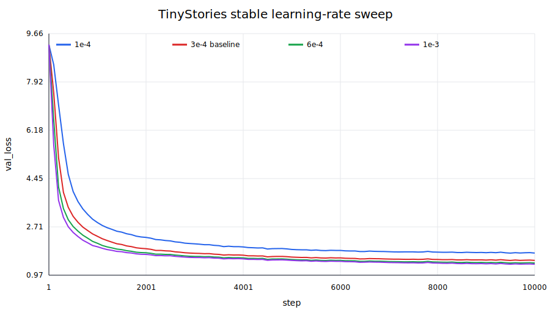
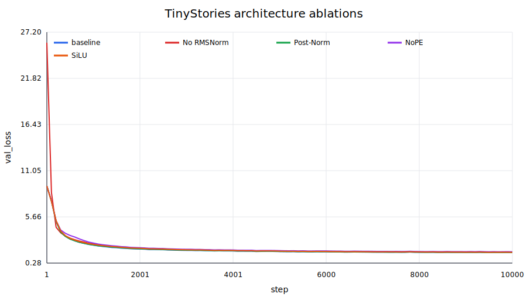
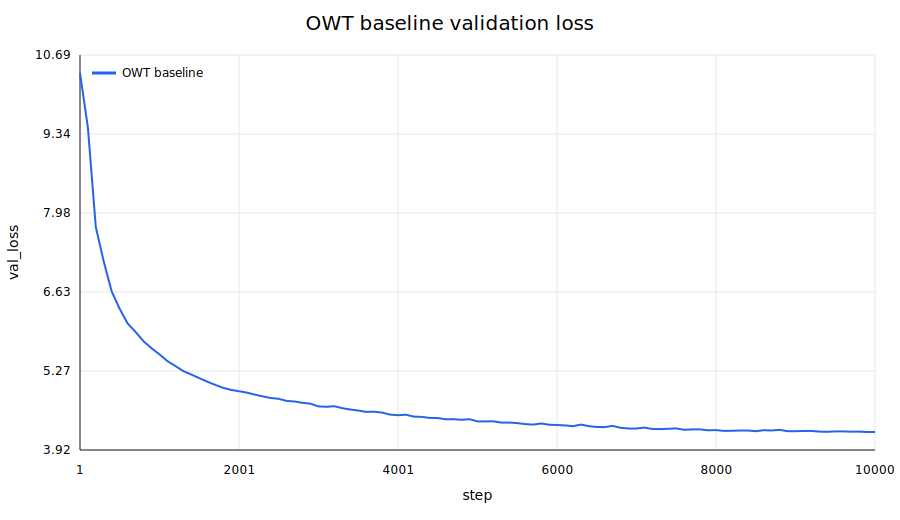

# A1 公开提交：吴睿曦

> 本文件和同目录代码公开可见。这里只记录公开、脱敏且实际完成的内容；数据、模型权重、
> 完整终端输出和本地运行路径不进入提交。

## 基本信息

- 作业题面版本：26.0.4
- 完成范围：21 个 adapter 对应实现、训练/编码/生成入口、Unicode 与资源核算书面题、
  TinyStories 10K 训练、learning-rate/batch 扫描、四个架构消融、OWT 10K 训练与两组文本生成
- 未完成项：无
- 上游 starter commit：`a158843b20107949f1a8d7df1b05cd33b9166712`
- 本地工作仓库：`../assignment1-basics`

## 书面题

### Unicode 1

1. `chr(0)` 返回 Unicode NUL 字符（U+0000）。
2. 它的 `repr` 是可见的转义形式 `'\x00'`，直接打印则写出不可见的控制字符。
3. Python 字符串会保留 NUL，拼接和长度计算也正常；但把该字符串交给以 NUL 结尾的 C 接口时，后续内容可能被误认为已经结束。

### Unicode 2

1. UTF-8 与 ASCII 兼容，英文等常见网页文本通常比 UTF-16/UTF-32 更紧凑，不涉及字节序/BOM 歧义，且是互联网文本的事实标准。
2. 错误函数逐 byte 解码，但一个非 ASCII UTF-8 码点通常跨 2–4 bytes；例如 `"牛".encode("utf-8")` 的首 byte 单独解码就会抛出 `UnicodeDecodeError`，必须拼接完整 byte 序列后整体解码。
3. `b"\xc0\x80"` 不能按 UTF-8 解码，因为它是对 U+0000 的非法 overlong encoding。

### Transformer 参数量与前向 FLOPs

令词表大小为 $V$、序列长度为 $T$、层数为 $L$、模型维度为 $d$、FFN 维度为
$d_{ff}$。本实现无 bias，输入 embedding 与输出 head 不共享参数，因此

$$
P=2Vd+L(4d^2+3dd_{ff}+2d)+d.
$$

GPT-2 XL 形状（$V=50257,T=1024,L=48,d=1600,d_{ff}=4288$）共有
1,640,452,800 个参数；float32 权重占 6.562 GB（约 6.11 GiB）。

一次单序列 forward 的主要矩阵乘 FLOPs 为：

- Q/K/V 与 attention output projections：$8LTd^2$；
- attention score 与 value aggregation：$4LT^2d$；
- SwiGLU 三个线性层：$6LTdd_{ff}$；
- LM head：$2TdV$。

总计

$$
F_{fwd}=L(8Td^2+4T^2d+6Tdd_{ff})+2TdV.
$$

XL 在 $T=1024$ 时约为 $3.517\times10^{12}$ FLOPs，SwiGLU 是最大项，其次为 QKV/O
projections；随着模型加宽加深，FFN 和 projections 的占比上升，LM head 的占比下降。

| 规模 | $d_{ff}$ | 参数量 | FP32 权重（GB） | 总 FLOPs | QKV/O | Attention | SwiGLU | LM head |
| --- | ---: | ---: | ---: | ---: | ---: | ---: | ---: | ---: |
| Small（12×768） | 2048 | 162,148,608 | 0.649 | $2.916\times10^{11}$ | 19.88% | 13.25% | 39.76% | 27.10% |
| Medium（24×1024） | 2752 | 406,539,264 | 1.626 | $8.302\times10^{11}$ | 24.83% | 12.42% | 50.05% | 12.70% |
| Large（36×1280） | 3392 | 833,591,040 | 3.334 | $1.769\times10^{12}$ | 27.32% | 10.93% | 54.30% | 7.45% |
| XL（48×1600） | 4288 | 1,640,452,800 | 6.562 | $3.517\times10^{12}$ | 28.62% | 9.16% | 57.53% | 4.68% |

将 XL context length 增至 16,384 后，forward 约为 $1.336\times10^{14}$ FLOPs，是 1K
context 的 37.98 倍；二次增长的 attention 占比从 9.16% 升至 61.73%，成为主要成本。

### AdamW 显存、FLOPs 与训练时间

记参数量为 $P$。float32 参数、梯度和两个 moment 分别占 $4P$、$4P$、$8P$ bytes。
按照题面列出的中间张量计数，activation 元素数近似为

$$
A=B\left[L\left(T(8d+4d_{ff})+2hT^2\right)+Td+2TV\right].
$$

在 $d_{ff}=8d/3$ 时，峰值显存近似为

$$
M=16P+4B\left[L\left(\frac{56}{3}Td+2hT^2\right)+Td+2TV\right]\ \text{bytes}.
$$

代入 GPT-2 XL 得 $M\approx26.247+16.357B$ GB；按十进制 80 GB 计算，理论最大 batch
size 为 3。该核算未计 CUDA context、allocator fragmentation 和临时 kernel workspace，实际可用
batch size 只会更小。

逐参数 AdamW update 约需要 14 FLOPs（decay、两个 moments、开方/除法与参数更新），故每步
约 $14P$ FLOPs；与模型 forward/backward 相比是小项。XL 单序列 forward 约
$3.517\times10^{12}$ FLOPs，若 backward 是 forward 的 2 倍，则 400K steps、batch 1024
需要约 $4.321\times10^{21}$ FLOPs；H100 在 50% MFU 下有效吞吐为 247.5 TFLOP/s，耗时约
4,850 小时。

## 实现说明

- `model.py`：from-scratch Linear、Embedding、RMSNorm、SwiGLU、RoPE、causal MHA、Transformer block/LM，并支持 NoNorm、Post‑Norm、NoPE 和 SiLU FFN 消融开关。
- `training.py`：数值稳定的 cross-entropy、随机 mmap batch、全局梯度裁剪、AdamW、cosine schedule 与 checkpoint。
- `tokenizer.py`：byte-level BPE 训练、确定性 tie-break、special token 边界、GPT-2 预分词、encode/decode 与流式 encode。
- `scripts/`：tokenizer 训练、多进程等价编码、BF16/FP32 混合精度模型训练、checkpoint
  恢复、非有限 loss 真实早停、validation/JSONL logging、实验编排、SVG 曲线，以及带 seed
  的 temperature/top-p 生成入口。
- `tests/adapters.py`：21 个稳定接口只负责实例化实现、载入测试权重并转发参数。

官方测试结果为 `47 passed, 1 xpassed`；XPASS 是题面主动标记的普通 `Tokenizer.encode`
1 MB 内存限制测试在本次运行中实际通过，不属于失败。另完成一次 CPU 端到端 smoke
test，真实走通 tokenizer 训练、编码、3 个优化 step、validation、checkpoint 和生成；该 smoke
结果不作为正式 TinyStories 指标。

## Tokenizer 实验

两个 tokenizer 都在完整公开训练集上从 bytes 开始训练。RSS 是单进程峰值，不是机器容量；
吞吐与 compression 在 validation 中固定 seed 抽取 1,000 documents 测得。

| 训练语料 | vocab / merges | 训练时间 | 峰值 RSS | 最长 token |
| --- | ---: | ---: | ---: | ---: |
| TinyStories | 10,000 / 9,743 | 939.8 s | 10,928 MiB | 15 bytes（` accomplishment`） |
| OWT | 32,000 / 31,743 | 6,015.0 s | 101,535 MiB | 64 bytes（重复 mojibake 片段） |

| Tokenizer → 测试域 | bytes | tokens | bytes/token | throughput |
| --- | ---: | ---: | ---: | ---: |
| Tiny 10K → Tiny | 816,600 | 198,441 | 4.115 | 607,467 B/s |
| Tiny 10K → OWT | 5,210,502 | 1,676,876 | 3.107 | 530,849 B/s |
| OWT 32K → Tiny | 816,600 | 203,969 | 4.004 | 236,395 B/s |
| OWT 32K → OWT | 5,210,502 | 1,209,489 | 4.308 | 196,696 B/s |

两个 tokenizer 都在本域获得更好的压缩；32K OWT tokenizer 在 OWT 上比 Tiny tokenizer 少
约 27.9% tokens。纯 Python encoder 需要检查更多 merge ranks，因此 32K tokenizer 较慢。
TinyStories train/valid 编码分别得到 540,796,778 / 5,461,210 tokens。16-worker 编码与
单进程 validation 的 5,461,210 个 token 逐项完全一致；OWT 也对前 10,000 行做了等价检查。
OWT train/valid 编码分别得到 2,727,120,452 / 66,401,098 tokens。

## TinyStories 训练与 learning-rate sweep

固定 22,696,448 参数、batch 128、context 256、10K steps（327,680,000 tokens），模型参数与
AdamW states 保持 FP32，CUDA 矩阵计算用 BF16 autocast。3e-4 是预先写入配置的 baseline；
其最终 val loss 为 1.5048。只改变 learning rate 后，1e-3 达到 1.3689，超过题面 1.45 目标。

| max / min LR | 最终 val loss | 总时间 | 平均 tokens/s | 结论 |
| --- | ---: | ---: | ---: | --- |
| 1e-4 / 1e-5 | 1.7697 | 873.8 s | 374,994 | 欠拟合 |
| 3e-4 / 3e-5 | 1.5048 | 873.6 s | 375,105 | 配置 baseline |
| 6e-4 / 6e-5 | 1.4107 | 873.4 s | 375,185 | 达标 |
| 1e-3 / 1e-4 | **1.3689** | 871.2 s | 376,121 | 最佳 |
| 1e-1 / 1e-2 | 2.0360 | 874.0 s | 374,940 | warmup 后 loss 上升，发散 run |



包含 1e-1 发散曲线的完整纵轴图见
[`assets/lr_sweep_with_divergence.svg`](assets/lr_sweep_with_divergence.svg)。高 LR 在 warmup
末段把 val loss 推到约 5，随后随 cosine 衰减回落，但最终仍显著差于所有稳定 run。

## Batch size

先用相同模型、context 和精度做容量 probe：batch 768 成功，896 与 1024 OOM；原始错误中的
设备容量信息已删除。再在真实 TinyStories tokens 上对 1/64/128/768 各跑 100 steps。

| batch | processed tokens | 总时间 | 平均 tokens/s | 最终 val loss |
| ---: | ---: | ---: | ---: | ---: |
| 1 | 25,600 | 2.44 s | 10,475 | 5.0207 |
| 64 | 1,638,400 | 5.46 s | 300,018 | 4.1296 |
| 128 | 3,276,800 | 9.61 s | 340,917 | 4.0376 |
| 768 | 19,660,800 | 49.61 s | 396,346 | 3.9206 |

这些短跑固定 steps 而非 tokens，所以 loss 不能用于 batch 间的收敛优劣判断；它们回答的是
容量与吞吐问题。batch 从 1 增至 768 后硬件利用率明显提高，但最大档距 OOM 边界较近，正式
训练保守使用 128。

## 架构消融

消融保持 baseline 的 3e-4 LR、batch、tokens、seed 与其余架构不变。SiLU 使用
`d_ff=2016`，与 SwiGLU baseline 都是 22,696,448 参数。

| 变体 | 参数量 | 最终 val loss | 总时间 | 平均 tokens/s |
| --- | ---: | ---: | ---: | ---: |
| Pre-Norm + RoPE + SwiGLU | 22,696,448 | **1.5048** | 873.6 s | 375,105 |
| 删除 RMSNorm | 22,691,840 | 1.5410 | 788.4 s | 415,610 |
| Post-Norm | 22,696,448 | 1.5147 | 909.5 s* | 360,278* |
| NoPE | 22,696,448 | 1.5972 | 834.0 s | 392,899 |
| 等参数 SiLU | 22,696,448 | 1.5371 | 859.4 s | 381,301 |



所有消融的最终 loss 都更差，NoPE 退化最大，说明即使是短故事和 256 context，位置信息仍然
重要。删除 norm、RoPE 或一个 FFN projection 会更快，但质量下降。Post-Norm 前约 3K steps
曾与 OWT 编码重叠，发现 CPU 争用后立即暂停；因此带 `*` 的总时长偏高约 36 秒，不拿它判断
架构速度，loss 对比仍有效。

## OWT 与文本生成

OWT 使用同样的 4-layer/512/1344/16-head 架构、batch 128、context 256 和 10K
steps，但词表为 32K，因此参数量增至 45,224,448。本次共处理 327,680,000 tokens，
最终 validation loss 为 4.2247，总训练时间 1,141.4 s，平均吞吐为 287,089 tokens/s。



OWT 的 per-token loss 高于 TinyStories，但两者的 tokenizer、词表和数据域都不同，不能把数值直接
解释为同一尺度上的模型质量差。OWT 文本更多样，32K LM head 也让计算量和参数量更大，
与实测吞吐低于 TinyStories baseline 一致。

生成统一使用 temperature 0.8、top-p 0.9 和 seed 42。TinyStories 在 195 个 new tokens 后遇到
`<|endoftext|>`：

```text
Once upon a time, there was a big, ugly bird. The bird lived in a tree near a house. The house was very old and had a lot of dust. One day, the bird saw a little boy. The boy was sad because he lost his toy.
The ugly bird wanted to help the boy. So, it flew down to the boy and said, "Why are you sad?" The boy looked at the bird and said, "I lost my toy. I can't find it anywhere."
The bird wanted to help the boy. So, it flew away and came back with the toy. The boy was very happy. He said, "Thank you, bird!" The bird smiled and flew away.
The next day, the boy came back to the ugly bird. The bird had found a new toy for the boy. The boy was very happy and thanked the bird. They played together all day, and the bird never lost her toy again.
<|endoftext|>
```

样本有完整的儿童故事结构、对话和结尾，但后半段重复“找到玩具”，最后又把玩具的所有者
从男孩混成了鸟。这体现了小模型在局部语法上已较流畅，但长程实体指代仍不稳定。

OWT 生成了要求的 256 个 new tokens，未遇到 EOT；完整文本见
[`logs/generation/owt.json`](logs/generation/owt.json)。它从“The future of artificial intelligence”很快偏移到
美国政治、朝鲜与 TPP，句子局部像新闻文本，却不断重复 TPP 并组合出缺乏事实和逻辑
支撑的关系。语料域决定了表面文体，而训练 tokens/模型容量限制了主题保持和事实性；
temperature 与 top-p 又在多样性和稳定性之间做取舍。该样本不应被当作事实陈述。

## 复现说明

- 环境与依赖：Python 3.13；按 starter 的 `uv.lock` 执行 `uv sync --frozen`
- 数据准备：使用题面指定的公开 TinyStories 与 Stanford OWT sample；数据和 token arrays 不提交
- Tokenizer：`uv run python scripts/train_tokenizer.py INPUT OUTPUT --vocab-size 10000`
- 编码：`uv run python scripts/encode.py INPUT OUTPUT.npy --vocab VOCAB --merges MERGES --workers 16`
- 训练：`uv run python scripts/train.py CONFIG --device cuda`；CUDA 训练使用 BF16 autocast，参数与 AdamW states 保持 FP32
- LR 扫描：在训练命令后追加 `--set max_lr=0.001 --set min_lr=0.0001`；其他档位只替换
  这两个 JSON 数值，其余配置不变
- 生成：`uv run python scripts/generate.py CONFIG CHECKPOINT --vocab VOCAB --merges MERGES --max-new-tokens 256 --temperature 0.8 --top-p 0.9 --seed 42 --output OUTPUT.json`
- 同步：`python3 scripts/sync_a1_submission.py --name '吴睿曦'`
- 配置文件：`submission/configs/tinystories_baseline.json`、`submission/configs/owt_baseline.json`

## 实验日志

- 日志目录：`logs/`
- 训练入口逐点记录 `step`、`wall_clock_sec`、`train_loss`、`val_loss`、`lr`，并输出 `summary.json`
- 已收录 tokenizer、TinyStories baseline/LR/batch/消融、OWT baseline 和生成记录；不提交临时 smoke 数据

## 飞书补充文档

- 链接：https://fudan-nlp.feishu.cn/wiki/RNS3w8bAdiHZmVkn8fncJOOOnzd?from=from_copylink
