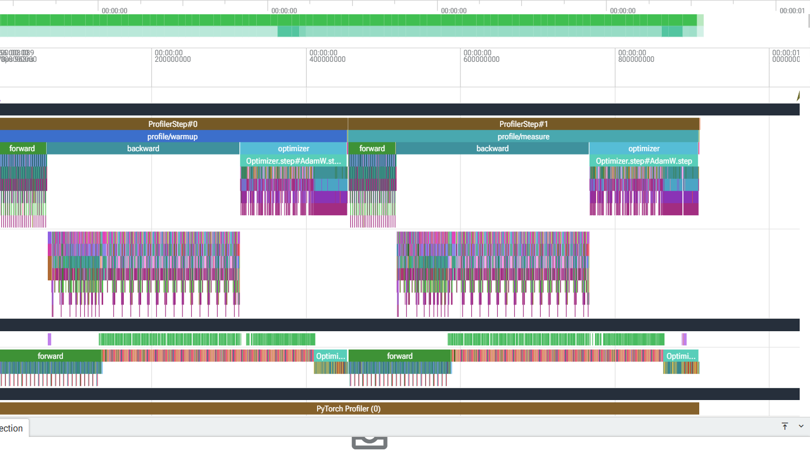
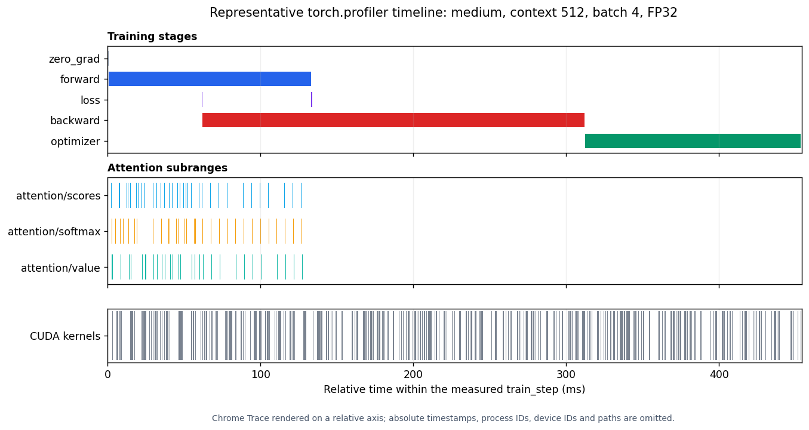
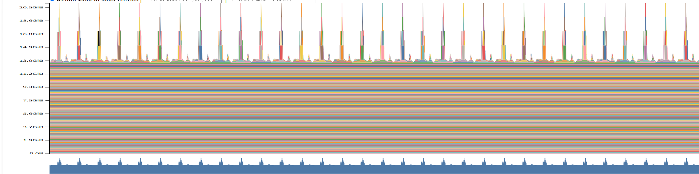
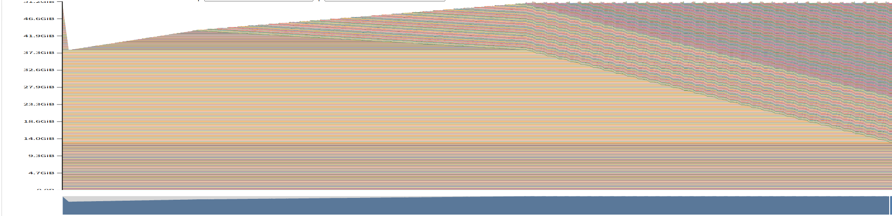
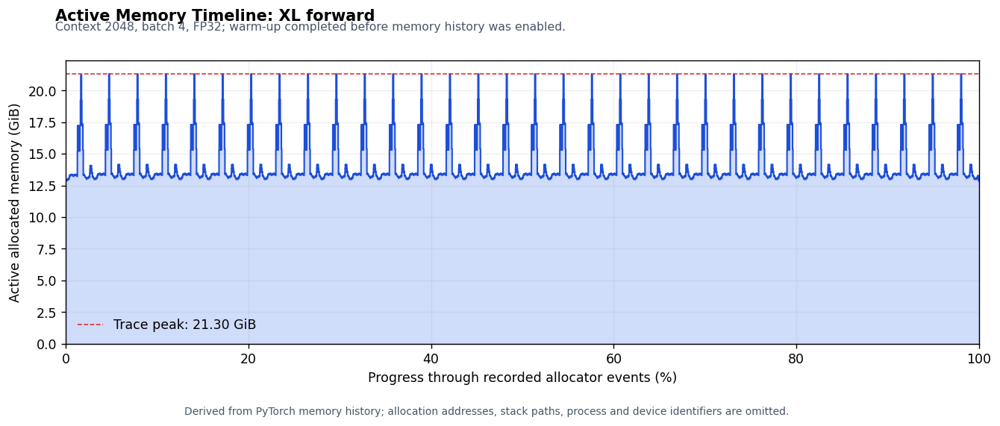
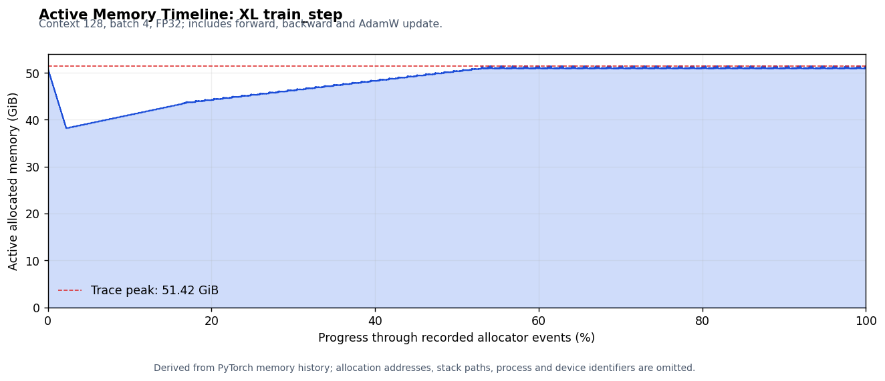

# A2-P Profiling 实验报告

> 姓名：曹庆棚。完整 Chrome Trace、memory snapshot 和运行日志仅在本地留存；本报告提交
> 脱敏后的代码、轻量结果和关键截图。

## 基本信息

- 作业题面版本：`26.1.4-rc.3`
- 完成范围：End-to-End Benchmark、六个 Compute Profile、Mixed Precision、Memory
  Profiling 和 OOM fallback 均已完成。
- 上游 starter commit：`ca8bc81a59b70516f7ebb2da4808daade877c736`

## 环境、工具与资源使用

| 项目 | 公开、脱敏的信息 |
| --- | --- |
| GPU | 2 × NVIDIA A800-SXM4-80GB；单次实验进程固定使用其中一张卡 |
| Driver / CUDA | Driver 580.159.03；PyTorch CUDA runtime 13.0 |
| PyTorch | 2.11.0+cu130，Python 3.13.14 |
| Compute profiler | PyTorch `torch.profiler`（随 PyTorch 2.11.0+cu130），CPU/CUDA activities，Chrome Trace 用 Perfetto 读取 |
| 数值设置 | FP32 基线关闭 TF32；BF16 使用 CUDA autocast；seed 42 |
| 并行策略 | 套件级双卡并行、卡内单进程串行；FP32 高风险 memory 配置独占执行 |

两张卡用于并行执行不同实验套件，每张卡内部始终只有一个正式实验进程；显存风险较高的 FP32
memory 配置独占执行。资源调度记录保存在飞书补充文档中。

## 1. End-to-End Benchmark

### 1.1 方法与命令

统一配置为 small、batch 4、context 512、FP32。模型初始化、optimizer 构造和随机 token/
target 生成均在计时外；每个 measurement step 前后调用 `torch.cuda.synchronize()`。正式计时
显式关闭 attention `record_function` instrumentation，避免标记开销进入端到端时间。计时器为
`timeit.default_timer()`，保存 10 条 raw timing、均值、样本标准差和 CV。

```bash
uv run python profiling/run_suite.py \
  --suite task1 --results-root results --execute
```

三种 mode 的边界为：

- `forward`：`no_grad` forward；
- `forward_backward`：zero grad、forward、cross entropy、backward；
- `train_step`：再加自定义 AdamW `step()`。

### 1.2 结果

完整 40 条 raw timing 位于 [`results/benchmark.csv`](results/benchmark.csv)。每个 run 的完整
命令、实际配置、输出路径和脱敏环境位于
[`results/benchmark/run_metadata.json`](results/benchmark/run_metadata.json)。

| run | mode | warm-up | raw timings（ms） | mean ± sample std（ms） | CV |
| --- | --- | ---: | --- | ---: | ---: |
| B1 | forward | 5 | 43.015, 42.999, 42.899, 42.912, 43.146, 42.808, 42.987, 43.007, 43.035, 42.968 | 42.978 ± 0.091 | 0.211% |
| B2 | forward_backward | 5 | 133.779, 133.874, 133.677, 133.741, 134.909, 133.614, 133.655, 134.083, 134.038, 133.779 | 133.915 ± 0.382 | 0.285% |
| B3 | train_step | 5 | 145.557, 145.468, 145.337, 145.186, 145.337, 145.354, 145.342, 145.278, 145.351, 145.331 | 145.354 ± 0.100 | 0.069% |
| B4 | train_step | 0 | 445.657, 145.670, 145.184, 144.992, 145.145, 145.085, 145.003, 144.906, 145.054, 145.188 | 175.188 ± 95.033 | 54.246% |

### 1.3 分析

B2 相比 B1 增加约 90.94 ms，主要来自 loss 和 backward；B3 比 B2 再增加约 11.44 ms，
对应稳态 optimizer 开销。B4 的首步达到 445.657 ms，而其余九步约 144.91–145.67 ms；
其中位数 145.115 ms 与 B3 的 145.339 ms 非常接近。因此无 warm-up 的均值和方差主要被首次
CUDA 路径、allocator 以及 Adam `m/v` 状态惰性初始化污染，不能代表稳态吞吐。

## 2. Compute Profiling

### 2.1 六个 `train_step` trace

六个配置统一使用 batch 4、FP32、完整 `train_step` 和共 5 个 warm-up：前 4 步位于 profiler
之外，最后 1 步作为 trace 内可见的 `profile/warmup` 边界。`visible_warmup` schedule 在同一个
本地 trace 中记录该边界 warm-up 和唯一正式 measurement；公开汇总只统计
`profile/measure` 窗口。

```bash
uv run python profiling/run_suite.py \
  --suite task2 --schedule-policy visible_warmup \
  --results-root results --execute
```

| run | model | context | measurement CPU range（ms） | forward CUDA Event（ms） | backward CUDA Event（ms） | optimizer CUDA Event（ms） |
| --- | --- | ---: | ---: | ---: | ---: | ---: |
| P1 | small | 256 | 243.863 | 54.222 | 78.645 | 55.687 |
| P2 | small | 512 | 172.412 | 44.277 | 90.791 | 36.399 |
| P3 | small | 1024 | 325.529 | 98.604 | 211.473 | 13.994 |
| P4 | medium | 256 | 291.342 | 66.748 | 151.678 | 72.055 |
| P5 | medium | 512 | 454.013 | 132.641 | 274.157 | 46.053 |
| P6 | medium | 1024 | 964.616 | 293.534 | 621.559 | 47.827 |

Profiler CPU range、CUDA Event elapsed 和 Task 1 的 wall-clock 属于不同测量口径，不能直接
相加。阶段 Event 只在整步结束时同步，既能覆盖 autograd worker 发出的 backward kernel，也
不会在阶段之间额外插入同步。

P1 的 forward 和 optimizer 时间高于 P2，说明 profiler 内的短区间会受到 host dispatch、stream
idle、GPU 频率状态和 CUPTI 开销影响。因此 P1/P2 不适合用于判断复杂度；context 增长趋势主要
参考 P5→P6、attention 关联时间和整步 kernel 汇总。

### 2.2 标记、op/kernel 与代表性分析

每个 trace 包含：

```text
profile/warmup, profile/measure, zero_grad, forward, loss, backward, optimizer,
attention/scores, attention/softmax, attention/value
```

轻量结果位于：

- [`results/profile/trace_summary.csv`](results/profile/trace_summary.csv)
- [`results/profile/run_metadata.json`](results/profile/run_metadata.json)

P5（medium/context 512）中，forward/backward/optimizer 的 CUDA Event elapsed 分别为
132.641/274.157/46.053 ms，backward 是主要阶段。24 层 attention 的关联 CUDA 时间为：scores
7.575 ms、softmax 9.202 ms、value 7.446 ms。在整步 raw kernel 汇总中，耗时最高的是
`ampere_sgemm_128x64_nn`，144 calls、累计 68.916 ms；其后几个高耗时项也主要是 SGEMM，说明
投影、FFN 和梯度矩阵乘仍是主要 GPU 工作。context 增长时，P5 到 P6 的 forward 从 132.641
增至 293.534 ms，backward 从 274.157 增至 621.559 ms；显式 attention score/softmax 的二次
增长会逐渐增大占比。



上图是同一 P5 Chrome Trace 的 Perfetto 原生 UI 证据，可见 `profile/warmup`、
`profile/measure`、forward、backward、optimizer、autograd worker 与 CUDA activity。



上图由同一份 P5 Trace 自动解析和渲染，用于更清晰地比较训练阶段和 attention 子范围；原生
轨道信息以上一张 Perfetto 截图为准。

### 2.3 工具限制

Chrome Trace 由 `torch.profiler` 的 CPU/CUDA activities 生成，并用 Perfetto 阅读。该方案不提供
Nsight Systems 的系统级 CUDA API→kernel 关联。缺少可靠 parent/correlation 的 raw kernel 只在
`profile/measure` 整步范围内汇总，不做阶段归因；阶段时间使用 CUDA Events，attention 时间使用
profiler 的 operator/user-range 关联。

## 3. Mixed Precision

### 3.1 固定四段累加

固定 PDF 四段代码的实际输出为：

| accumulator | increment | conversion | output | absolute error vs 10 |
| --- | --- | --- | ---: | ---: |
| FP32 | FP32 | 无 | 10.0001335 | 0.0001335 |
| FP16 | FP16 | 无 | 9.9531250 | 0.0468750 |
| FP32 | FP16 | 隐式 | 10.0021362 | 0.0021362 |
| FP32 | FP16 | 显式转 FP32 | 10.0021362 | 0.0021362 |

FP16 accumulator 的主要误差来自每一步低精度舍入并持续累积。第三、第四种写法虽然使用 FP32
累加器，但 `0.01` 已先量化为 FP16；转回 FP32 不能恢复丢失的信息，所以两者输出相同。这说明
需要区分输入量化误差和累加器误差。

### 3.2 ToyModel dtype

CUDA BF16 autocast 的观测结果：

| 组件 | dtype |
| --- | --- |
| 参数 | FP32 |
| `fc1` 输出 | BF16 |
| LayerNorm 输出 | FP32 |
| logits | BF16 |
| loss | FP32 |
| gradient | FP32 |

LayerNorm 的均值、方差和归约对精度敏感，因此 autocast 保留 FP32；BF16 与 FP32 有相同指数
范围，溢出风险小于 FP16，但尾数仍更短，归约继续保留高精度有利于数值稳定。

### 3.3 语言模型 FP32/BF16 对照

完整数据位于 [`results/mixed_precision.json`](results/mixed_precision.json)。两种 dtype 使用
相同 small/bs4/ctx512、seed、warm-up 和 steps。

| mode | FP32 mean（ms） | BF16 mean（ms） | speedup | FP32 peak allocated（MiB） | BF16 peak allocated（MiB） |
| --- | ---: | ---: | ---: | ---: | ---: |
| forward | 42.877 | 16.124 | 2.66× | 728.7 | 908.5 |
| forward_backward | 133.594 | 82.688 | 1.62× | 4157.6 | 3319.2 |
| train_step | 144.900 | 106.785 | 1.36× | 5154.3 | 4309.9 |

所有记录到的 logits 和 loss 均为有限值。forward+backward 不更新参数，10 步 loss 分别保持在
9.27282/9.27287。train step 的 FP32 轨迹由 6.87830 降至 3.07491，BF16 由 6.89034 降至
2.71273；两条短轨迹均整体下降但存在 step 间波动。逐步 loss 已保存在公开 JSON 中，因此这里只
把它作为有限性和短程数值趋势证据，不把最终 loss 差异解释为收敛优劣。与 Task 1 一样，这六组
绝对时间均关闭 attention instrumentation。

BF16 的 GEMM 更能利用 Tensor Core，因此三种 mode 都更快；但 optimizer 仍更新 FP32 参数和
FP32 Adam state，所以完整 train_step 的加速小于纯 forward。forward-only 的 BF16 峰值反而
更高，原因是 autocast 需要缓存低精度权重副本；进入训练后，低精度 activation 带来的节省超过
缓存开销。

## 4. Memory Profiling

### 4.1 方法

warm-up 完成后才开启 `torch.cuda.memory._record_memory_history`，每个配置单独进程并保存独立
snapshot。完整 snapshot 只在本地使用，公开目录仅保留峰值、fallback metadata 和裁剪时间线。

```bash
uv run python profiling/run_suite.py \
  --suite memory --results-root results --execute
```

### 4.2 峰值与 fallback

完整表位于 [`results/memory/peaks.csv`](results/memory/peaks.csv)，详细失败链位于
[`results/memory/run_metadata.json`](results/memory/run_metadata.json)。

| run | actual config | mode/dtype | status | failure stage | peak active（MiB） | peak allocated（MiB） | peak reserved（MiB） | largest tensor（MiB） |
| --- | --- | --- | --- | --- | ---: | ---: | ---: | ---: |
| M1 | XL/ctx128/b4 | forward/FP32 | success | — | 13217.8 | 13217.8 | 13246 | 20 |
| M2 | XL/ctx128/b4 | train_step/FP32 | success | — | 52649.1 | 52649.1 | 58670 | 100 |
| M3 | XL/ctx2048/b4 | forward/FP32 | success | — | 21810.5 | 21810.5 | 24028 | 2048 |
| M4-VERIFY | XL/ctx2048/b4 | train_step/FP32 | OOM | forward | 78292.1 | 78292.1 | 79412 | — |
| MF4 | XL/ctx2048/b1 | train_step/FP32 | OOM | forward | 79376.5 | 79376.5 | 80414 | — |
| MF5 | XL/ctx1024/b1 | train_step/FP32 | success | — | 57714.4 | 57714.4 | 58628 | 128 |
| M-BF16-F | XL/ctx128/b4 | forward/BF16 | success | — | 19604.1 | 19604.1 | 19848 | 50 |
| M-BF16-T | XL/ctx128/b4 | train_step/BF16 | success | — | 52639.2 | 52639.2 | 59688 | 100 |

`M4-VERIFY` 是在改进失败阶段标记后保留的原配置复核 run：batch 4 在 warm-up 的 forward
阶段 OOM；按题面降到 batch 1 后仍在 forward 阶段 OOM；第二层 fallback XL/context 1024/
batch 1 成功，因此没有继续尝试 Large/context 2048。所有 fallback metadata 都保留了原始请求
XL/context 2048/batch 4、父 run 和 attempt 编号。

BF16 forward 的峰值高于 FP32，因为 autocast 缓存低精度权重；完整 train_step 的 allocated
峰值几乎相同，说明约 3.4B 参数的 FP32 参数、梯度和 Adam `m/v` 状态主导容量。BF16 并不等于
把这些持久状态都转成 BF16。

### 4.3 Allocation、residual 与生命周期

XL 的 residual stream 理论大小为 `batch × context × d_model × 4 bytes`：

- bs4/ctx128：5 MiB；M1 最大 20 MiB，是其 4 倍，对应 `d_ff=4×d_model` 的 FFN 中间量；
- bs4/ctx2048：80 MiB；M3 最大 2048 MiB，恰好等于
  `4×32×2048×2048×4 bytes` 的 attention score；
- bs1/ctx1024：10 MiB；MF5 最大 128 MiB，对应
  `1×32×1024×1024×4 bytes` 的 attention score。

这解释了为什么 context 2048 的 forward 能运行，而 train_step 会在保存各层 backward 所需
activation 时逼近 80 GiB。M2 的 Active Memory Timeline 中，forward 保存的 activation 在
backward 期间逐步释放，同时 gradient 和 Adam state 产生；reserved 保持高于 active/allocated，
反映 caching allocator 保留的 segment，不能把 reserved 当作当前活跃 tensor。



M3 原生图显示约 21.30 GiB 峰值以及逐层重复出现的 attention allocation；最大 2048 MiB
allocation 与 attention score 理论大小一致。



M2 原生图中，forward 保存的 activation 先累积；进入 backward 后，saved tensors 按层释放，
同时 gradient 和 optimizer state 产生，峰值约 51.42 GiB。





以上两张辅助图与原生截图来自相同的正式 snapshot。横轴表示 allocator event 的记录进度，而非
墙钟时间，因此只用于观察 active allocated memory 的变化，不用于分析阶段耗时。

M3 最大 allocation 的脱敏 stack 链为 `einops.einsum → annotated_scaled_dot_product_attention
→ multi-head attention forward → TransformerBlock forward`，与 2048 MiB attention score 的
理论计算一致。

为补充单个 TransformerBlock 的 residual/gradient 定量，我在 XL/bs4/ctx128/FP32 上使用
saved-tensor hook，并按底层 storage pointer 排除参数 storage、去除 activation alias。结果为
39 条非参数保存记录、23 个独立 activation storage；逻辑视图合计 219.37 MiB，而去重后的独立
storage 为 166.25 MiB，差值来自 view/alias，不能解释成额外 allocator 占用。最大的 5 个独立
storage 均为 20 MiB、各占 12.03%，对应 `[4,128,10240]` 的 SwiGLU/FFN 中间量及其 autograd
视图，以及等价展平后的 `[1,512,10240]` 视图。作为对照，residual stream
`[4,128,2560]` 是 5 MiB，attention softmax `[4,32,128,128]` 是 8 MiB。

同一次 backward 生成 400.02 MiB 参数梯度和 5 MiB 输入 residual 梯度，合计 405.02 MiB；
参数梯度大小恰好等于 400.02 MiB 的 FP32 block 参数，且没有参数缺失 gradient。这些 hook
统计与 M2 时间线相互补充：前者量化 saved activation 与新生 gradient，后者证明 backward 中
saved tensors 按层释放的生命周期。完整轻量摘要位于
[`results/memory/run_metadata.json`](results/memory/run_metadata.json)。

## 5. 复现与限制

Task 1–3 的复现顺序为：

```bash
uv sync
uv run python profiling/run_suite.py --suite preflight --execute
uv run python profiling/run_suite.py --suite task1 --execute
uv run python profiling/run_suite.py --suite task2 --schedule-policy visible_warmup --execute
uv run python profiling/run_suite.py --suite mixed --execute
```

Memory 矩阵使用 `--suite memory`。该 suite 在 XL/context 2048 train step OOM 后停止；后续
fallback、BF16 对照和 saved-tensor 诊断使用 `memory_snapshot.py` 独立运行，完整命令保存在
[`results/memory/run_metadata.json`](results/memory/run_metadata.json)。汇总命令为：

```bash
uv run python profiling/summarize.py --section all --strict
```

本地保留六个完整 Chrome Trace、memory snapshot、原始 event JSONL 和运行日志。公开材料不包含
这些大型原始文件。Compute Profile 辅助图使用相对时间轴，memory 辅助图使用 allocator event
进度；二者均不用于推导原始文件未提供的时间关系。

固定 starter 的自定义 AdamW 使用 `state.get(key, torch.zeros_like(grad))` 读取状态；Python 会
先求值默认参数，因此即使稳态已有 `m/v`，step 中仍可能出现短生命周期的 `zeros_like` 临时
allocation。它是本作业固定实现的一部分，本文的 optimizer 时间和显存结果没有替换成 fused
AdamW，也不把该临时开销解释成通用 AdamW 实现的必然成本。

## 飞书补充文档

- 链接：https://fudan-nlp.feishu.cn/wiki/TO3gw7ezgiHb2TkBrI0cpR5Anvh?from=from_copylink
- 权限状态：组织内公开，互联网公开访问已关闭
