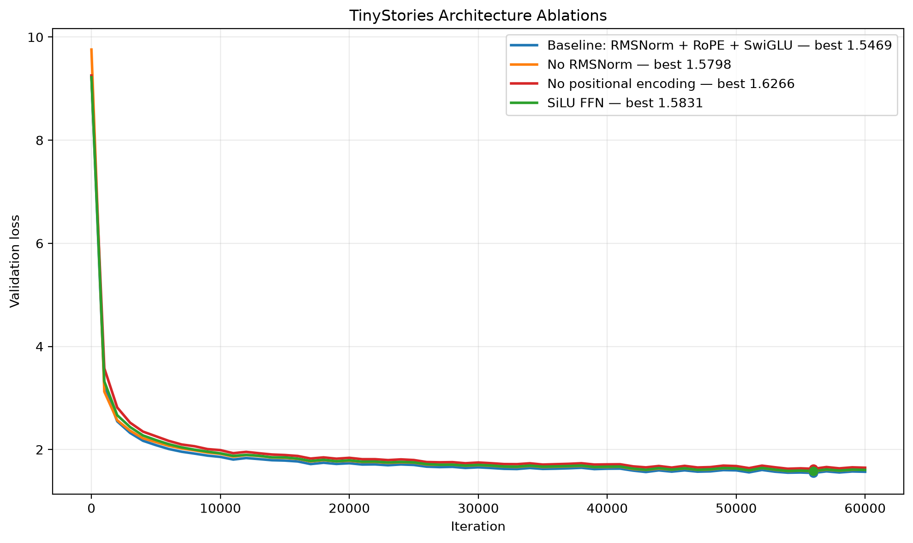
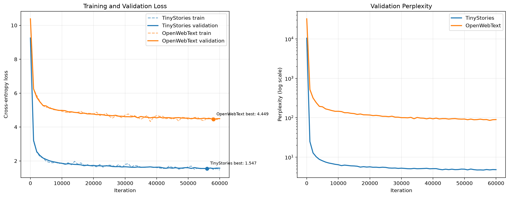

# A1 公开提交：曹正伟

> 本文件和同目录代码公开可见。提交内容仅包含允许公开且已经脱敏的代码、日志、图表和实验分析；不包含数据集、token 数组、模型权重、内部服务器路径、作业编号或访问凭据。

> 评分标准与评测方式见 [`assignments/A1/EVALUATION.md`](../../../assignments/A1/EVALUATION.md)；日志格式见 [`assignments/A1/README.md` 的《实验日志格式》](../../../assignments/A1/README.md#实验日志格式)。

## 基本信息

- 作业题面版本：26.0.4
- 学生姓名：曹正伟
- GitHub ID：OpenCeadar
- 完成范围：BPE、Tokenizer、Transformer、AdamW、训练循环、checkpoint、文本生成、TinyStories 主训练、三项架构消融、OpenWebText tokenizer 与语言模型训练
- 未完成项：Post-Norm 消融、完整语言模型 learning-rate sweep、完整 batch-size sweep
- 上游 starter commit：`a158843b20107949f1a8d7df1b05cd33b9166712`
- 本地工作仓库：`../assignment1-basics`

## Markdown 报告

### 1. 实现概览

本作业从零实现了以下语言模型流水线：

```text
Unicode text
→ byte-level BPE tokenizer
→ token IDs
→ decoder-only Transformer
→ cross-entropy
→ AdamW optimization
→ checkpoint and validation
→ temperature/top-p generation
```

核心实现位于 `submission/cs336_basics/`。训练、数据编码、tokenizer 训练和文本生成入口位于 `submission/scripts/`。

最终公共测试结果：

```text
47 passed, 1 xfailed
```

其中 `xfailed` 是测试套件预期的 tokenizer 内存对照测试，并非实现失败。

### 2. Unicode 书面题

#### 2.1 `unicode1`

`chr(0)` 返回 Unicode code point `U+0000`，也就是 NUL 字符。它是长度为 1 的真实字符，不是空字符串。

`repr(chr(0))` 会显示为：

```text
'\x00'
```

直接打印时通常看起来为空，因为 NUL 是不可见控制字符。Python 字符串可以正常包含 NUL，不会像传统 C 字符串一样在 NUL 位置截断。

#### 2.2 `unicode2`

UTF-8 是 1 至 4 bytes 的变长编码。ASCII 字符通常只需 1 byte，因此对于英文和网页语料通常比 UTF-16、UTF-32 更紧凑。

不能把 UTF-8 字符串逐 byte 独立解码。例如：

```python
"é".encode("utf-8") == b"\xc3\xa9"
```

单独解码 `b"\xc3"` 或 `b"\xa9"` 都会失败，因为它们只是一个多 byte 字符的一部分。

`b"\xc0\x80"` 不是合法 UTF-8。它是 `U+0000` 的 overlong encoding；合法最短形式是 `b"\x00"`。

### 3. Transformer 与训练核算

对于 GPT-2 XL-shaped 配置：

```text
V = 50,257
T = 1,024
L = 48
D = 1,600
H = 25
F = 4,288
```

本实现不共享 input embedding 和 LM head，且 Linear 不使用 bias。

参数量为：

```text
P = 2VD + L(4D² + 3DF + 2D) + D
  = 1,640,452,800 parameters
```

FP32 参数内存约为：

```text
6.56 GB
6.11 GiB
```

长度 1,024、batch size 1 的 forward FLOPs：

```text
F_forward
= L(8TD² + 4T²D + 6TDF) + 2TDV
≈ 3.517 × 10¹² FLOPs
```

主要 FLOPs 来源：

| 组件 | 占比 |
|---|---:|
| SwiGLU FFN | 57.53% |
| Attention QKV/output projections | 28.62% |
| 二次 attention matmul | 9.16% |
| LM head | 4.68% |

当 context length 增加到 16,384 时，forward FLOPs 增加到约：

```text
1.336 × 10¹⁴ FLOPs
```

此时两个二次 attention matmul 合计约占 61.73%，成为主要瓶颈。

AdamW 为每个参数保存 parameter、gradient、first moment 和 second moment。仅这些项目约需要：

```text
16P bytes
```

在题目给定的 GPT-2 XL-shaped、FP32 和 80 GB 显存假设下，估算单卡最大物理 batch size 为 3。

AdamW optimizer step 约为：

```text
14P FLOPs
≈ 22.90 GFLOPs
```

在题目给定的 400,000 steps、effective batch size 1,024、H100 50% MFU 假设下，估算训练时间约为 201.5 天。此处的 effective batch size 需要通过多卡或 gradient accumulation 获得。

书面题中的学习率示例实验显示：

- LR 10：稳定下降
- LR 100：在给定特殊二次目标上快速收敛
- LR 1000：明显发散

这部分是书面题示例，不等同于完整语言模型 learning-rate sweep。

### 4. BPE 与 Tokenizer

初始 BPE vocabulary 包含所有 256 个单 byte token 和指定的 special tokens。

训练使用 GPT-2 风格正则进行 pre-tokenization，并遵守：

- 不跨 pre-token 统计或合并 pair
- special token 是硬边界
- special token 不参加普通 pair 统计
- pair 频率相同时选择字典序更大的 byte pair
- merge 顺序被保存并在编码阶段按 rank 使用

编码流程：

```text
Unicode string
→ special-token separation
→ pre-tokenization
→ UTF-8 bytes
→ BPE merges
→ token IDs
```

解码时先拼接全部 token bytes，再整体执行 UTF-8 decode，避免一个 Unicode 字符跨多个 token 时发生错误。

大型语料编码支持：

- `encode_iterable`
- special-token 安全分块
- 多进程 worker
- bounded pre-token cache
- worker 临时 token 文件
- 按原始顺序合并 `.npy`
- 成功后清理临时文件

### 5. TinyStories Tokenizer

| 指标 | 结果 |
|---|---:|
| Vocabulary size | 10,000 |
| Special token | `<|endoftext|>` |
| Tokenizer 训练耗时 | 435.68 秒 |
| Train token 数 | 541,229,347 |
| Validation token 数 | 5,465,883 |
| Token dtype | `uint16` |

最长 token 的 byte、UTF-8 表示与长度记录在：

```text
logs/tokenizer_tinystories.json
```

### 6. OpenWebText Tokenizer

| 指标 | 结果 |
|---|---:|
| Vocabulary size | 32,000 |
| Merge count | 31,743 |
| Workers | 16 |
| Tokenizer 训练耗时 | 13,430.19 秒 |
| 约合时间 | 3 小时 43 分 50 秒 |
| Peak RSS | 约 6.4 GiB |
| 最长 token 长度 | 64 bytes |

OWT 中包含网页格式、重复横线和异常编码片段，因此最长 token 可能表现为网页噪声或 mojibake，而不一定是自然语言单词。

编码结果：

| 数据 | Token 数 | Bytes/token | dtype |
|---|---:|---:|---|
| Train | 2,727,120,445 | 4.3711 | `uint16` |
| Validation | 66,401,098 | 4.3674 | `uint16` |

OWT train token 文件检查结果：

```text
shape = (2727120445,)
dtype = uint16
min token ID = 0
max token ID = 31999
```

所有 token ID 都位于 32,000 词表范围内。

### 7. Tokenization 性能优化

原始单进程双遍实现处理 OWT validation：

```text
804.80 秒
```

优化后的 16-worker 实现：

```text
19.97 秒
```

加速倍数：

```text
40.31×
```

优化前后的 `.npy` 文件通过逐字节比较，SHA-256 也完全一致，因此加速没有改变 token 内容或顺序。

完整 OWT train 编码耗时约 14 分 19 秒。

### 8. Transformer 模型

模型采用 decoder-only Transformer：

```text
Token Embedding
→ Pre-Norm Transformer Blocks
→ Final RMSNorm
→ Linear LM Head
→ Logits
```

每个 block：

```text
x = x + Attention(RMSNorm(x))
x = x + FFN(RMSNorm(x))
```

基线模型使用：

- RMSNorm
- RoPE
- causal multi-head self-attention
- SwiGLU
- bias-free Linear
- final RMSNorm

RoPE 只应用于 Q 和 K，不应用于 V。

### 9. 训练配置

TinyStories 与 OWT 使用相同核心结构和训练 iteration：

| 参数 | 值 |
|---|---:|
| Context length | 256 |
| `d_model` | 256 |
| Layers | 4 |
| Heads | 8 |
| `d_ff` | 1,024 |
| Batch size | 32 |
| Steps | 60,000 |
| Tokens per step | 8,192 |
| Total tokens seen | 491,520,000 |
| Max LR | `3e-4` |
| Min LR | `3e-5` |
| Warmup | 1,000 |
| Cosine cycle | 60,000 |
| Beta1 / Beta2 | 0.9 / 0.95 |
| Weight decay | 0.1 |
| Gradient clipping | 1.0 |
| Seed | 42 |

该实际配置小于实验室 README 中展示的标准大模型配置，本报告只陈述实际运行结果。

### 10. TinyStories 主训练

| 指标 | 结果 |
|---|---:|
| 最佳 iteration | 56,000 |
| 最佳 validation loss | 1.5469 |
| 最佳 perplexity | 4.6968 |
| 总训练时间 | 约 54 分钟 |
| Training tokens seen | 491,520,000 |

训练 loss 和验证 loss 接近，没有明显过拟合；后半段逐渐进入收益递减区域。

### 11. 架构消融

| 实验 | 最佳 validation loss | Perplexity |
|---|---:|---:|
| Baseline | 1.5469 | 4.6968 |
| No RMSNorm | 1.5798 | 4.8541 |
| No positional encoding | 1.6266 | 5.0866 |
| SiLU FFN | 1.5831 | 4.8702 |

相对基线：

- No RMSNorm 的 validation loss 上升约 2.13%
- No positional encoding 上升约 5.15%
- SiLU FFN 上升约 2.34%

在已完成的消融中，移除位置编码影响最大；RMSNorm、RoPE 与 SwiGLU 的基线组合表现最好。

Post-Norm 消融未执行，因此不报告推测结果。



### 12. OpenWebText 训练

| 指标 | 结果 |
|---|---:|
| 最佳 iteration | 58,000 |
| 最佳 validation loss | 4.4490 |
| 最佳 perplexity | 85.5451 |
| 最终 iteration | 60,000 |
| 总训练时间 | 约 1 小时 21 分钟 |
| Training tokens seen | 491,520,000 |

OWT 32,000 词表随机模型的初始 loss 约为：

```text
ln(32000) ≈ 10.37
```

实际训练从约 10.38 降到 4.449，说明模型成功学习了 OWT 的语言分布。

按 OWT validation 的 bytes/token 换算：

```text
bits/byte
= 4.449 / 4.367 / ln(2)
≈ 1.47
```

TinyStories 与 OWT 使用不同数据集和 tokenizer，因此不能直接通过 `1.5469` 与 `4.4490` 判断模型能力高低。



### 13. 文本生成

生成使用：

```text
temperature = 0.8
top_p = 0.9
best checkpoint
```

TinyStories 模型能够生成简单人物、事件、对话和儿童故事式结构。主要问题是人物、物体和高频句式重复，长文本中偶尔出现因果关系不一致。

OWT 对提示：

```text
Once upon a time
```

会生成博客、评论或公司声明风格，而不是稳定的儿童故事。局部英文语法和段落结构较自然，但存在抽象短语重复、指代不明和主题漂移。

对提示：

```text
In a recent study, researchers found that
```

模型会生成 `study`、`patients`、`risk`、`treatment` 和百分比等研究报告式表达，说明它学习了医学文章的表面文体。

但生成的百分比可能互相矛盾，也会出现重复或错误短语。因此生成内容不能被视为真实医学信息。

生成质量主要受以下因素影响：

- 模型容量
- 训练 token 数量
- 数据集复杂度
- context length
- checkpoint validation loss
- temperature
- top-p
- prompt 类型

### 14. 实验结论

1. Byte-level BPE 能完整覆盖 Unicode 文本，并通过 merge 缩短序列。
2. Special token 必须作为硬边界，不能参与普通 BPE merge。
3. 多进程与 cache 优化将 OWT validation tokenization 加速约 40.31 倍，结果逐字节一致。
4. RMSNorm、RoPE 与 SwiGLU 的基线组合在已完成实验中最好。
5. 移除位置编码带来的性能下降最大。
6. TinyStories 更容易学习连贯的故事结构。
7. OWT 文体更广、噪声更多，需要更大模型和更多训练预算。
8. 不同 tokenizer 或数据集的 per-token loss 不能直接比较。
9. 语言模型能学习文本形式和局部统计规律，但不能保证生成事实正确。

## 复现说明

- 环境与依赖：Linux、Python 3.13、uv、PyTorch、NumPy、regex；依赖由兄弟工作仓库的 `uv.lock` 固定
- 数据准备：使用公开 TinyStories 与 OpenWebText 文本；分别训练 10,000 和 32,000 词表的 byte-level BPE tokenizer；使用 `<|endoftext|>` 作为文档边界；token IDs 保存为 `uint16` NumPy arrays
- 配置文件：无

Tokenizer 训练：

```bash
python submission/scripts/train_tokenizer.py \
  data/train.txt \
  artifacts/tokenizer \
  --vocab-size 10000
```

数据编码：

```bash
python submission/scripts/tokenize_dataset.py \
  data/train.txt \
  artifacts/train_tokens \
  --vocab artifacts/tokenizer/vocab.json \
  --merges artifacts/tokenizer/merges.json \
  --special-token '<|endoftext|>' \
  --dtype uint16 \
  --workers 16
```

查看训练参数：

```bash
python submission/scripts/train.py --help
```

查看生成参数：

```bash
python submission/scripts/generate.py --help
```

官方测试：

```bash
cd ../assignment1-basics
uv sync --frozen
uv run pytest
```

同步命令：

```bash
python3 scripts/sync_a1_submission.py --name '曹正伟'
```

## 代码与脚本

- 真实实现：`submission/cs336_basics/`
- 测试 adapter：`submission/tests/adapters.py`
- 训练、数据编码与生成入口：`submission/scripts/`
- 实现说明：核心算法与模型逻辑位于 `cs336_basics`；`submission/scripts` 中的文件只提供命令行入口，不复制核心算法；adapter 只负责将公共测试参数转交给真实实现

真实实现先在兄弟目录 `../assignment1-basics` 中完成并通过官方测试，再使用同步命令复制到本目录。没有复制公共 tests、fixtures、原始数据、token 数组、模型权重、虚拟环境或依赖锁。

## 实验日志

- 日志目录：`logs/`
- 汇总文件：`logs/summary.json`
- TinyStories 主训练：`logs/train_tinystories.jsonl`
- OWT 主训练：`logs/train_owt.jsonl`
- No RMSNorm：`logs/ablation_no_rmsnorm.jsonl`
- No positional encoding：`logs/ablation_nope.jsonl`
- SiLU FFN：`logs/ablation_silu.jsonl`
- TinyStories tokenizer：`logs/tokenizer_tinystories.json`
- OWT tokenizer：`logs/tokenizer_owt.json`

JSONL 日志包含等价的：

```text
iteration
elapsed_seconds
train_loss
validation_loss
validation_perplexity
learning_rate
tokens_seen
```

它们分别对应规范中的 step、wall-clock time、train loss、validation loss 和 learning rate。

## 飞书补充文档

- 链接：https://fudan-nlp.feishu.cn/wiki/PiXdw9oriiY5YMk4cKrchpmSn8A?from=from_copylink

该文档设置为组织内可阅读，没有开启互联网公开访问。公开代码、脱敏日志、图表和主要实验结论均保存在本提交目录中。