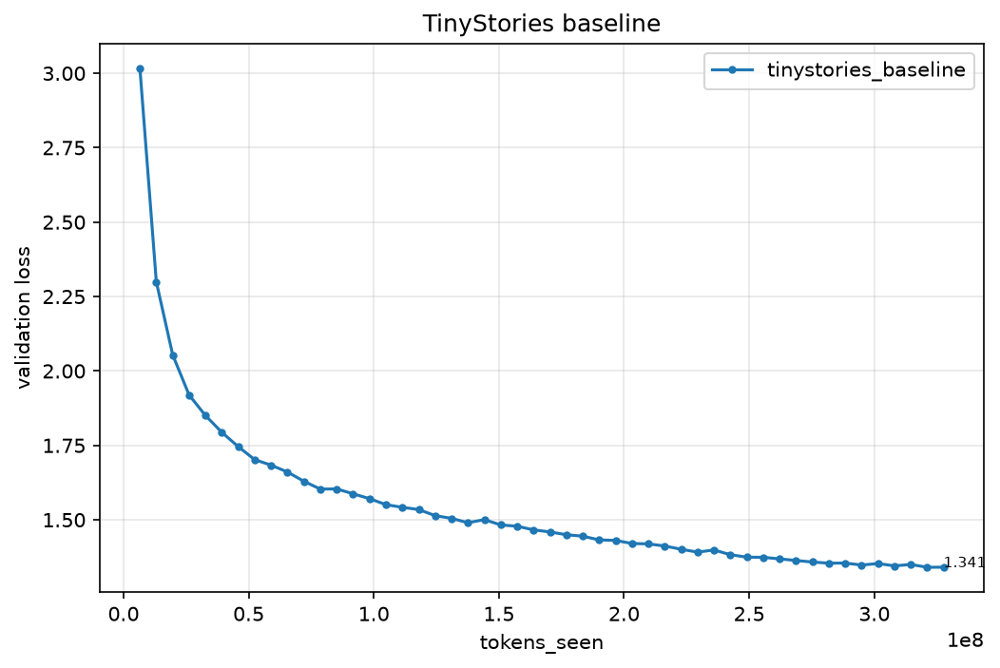
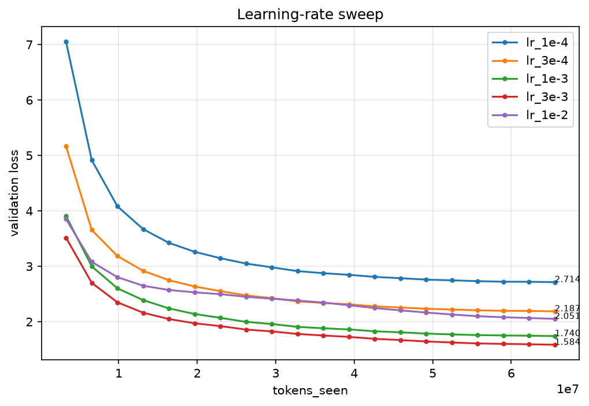
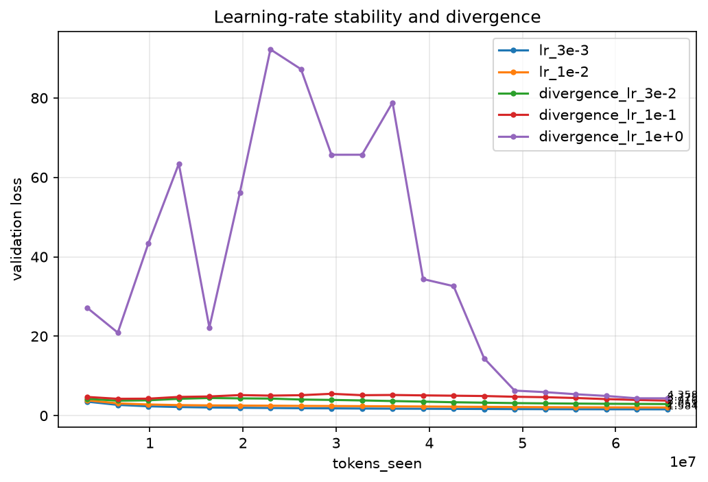
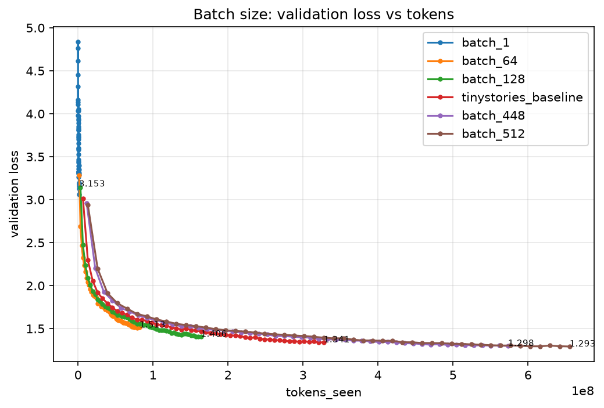
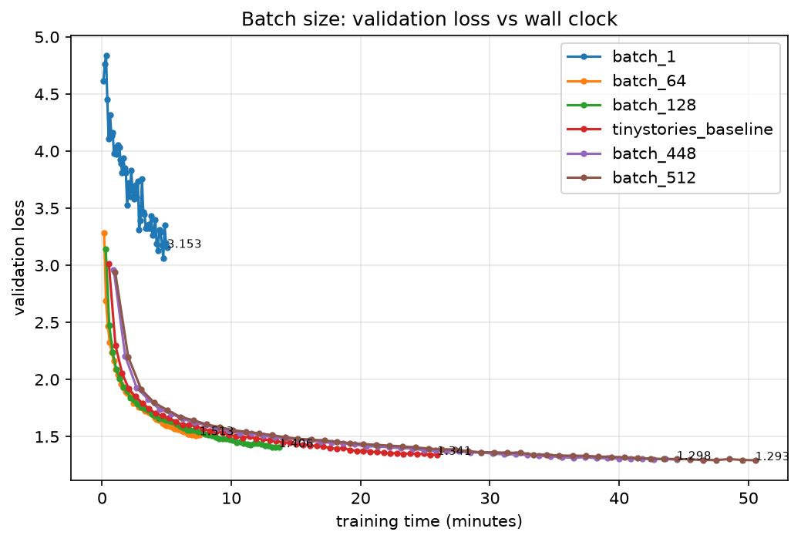
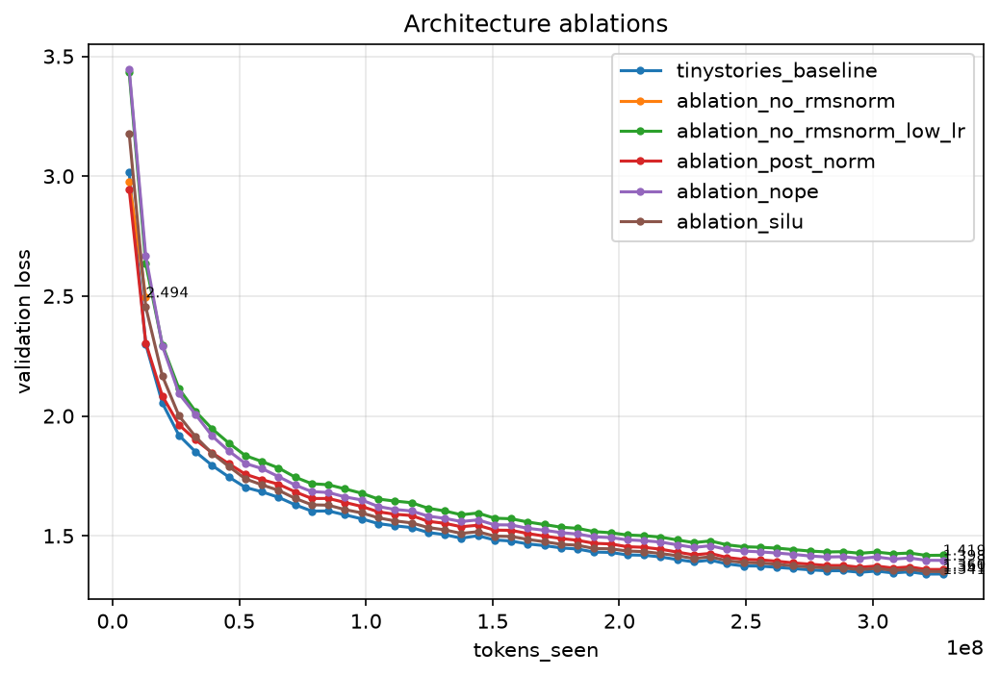
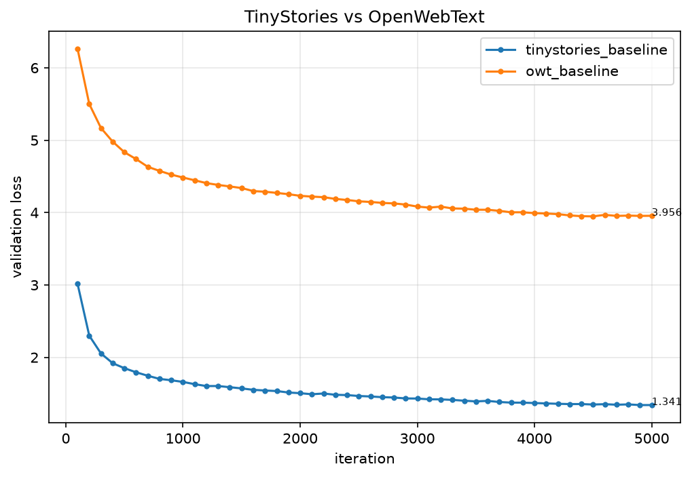

# A1 公开提交：朱凡

> 本文件和同目录代码公开可见；报告和日志仅包含公开数据上的脱敏结果。
> 评分方式见 [`assignments/A1/EVALUATION.md`](../../../../assignments/A1/EVALUATION.md)，日志要求见 [`assignments/A1/README.md`](../../../../assignments/A1/README.md#实验日志格式)。

- 作业题面版本：26.0.4
- 完成范围：Tokenizer、Transformer、训练基础设施、TinyStories/OWT 训练、超参数实验、四个消融和文本生成
- 未完成项：无（Stanford leaderboard 不属于本集训要求）
- 上游 starter commit：`a158843b20107949f1a8d7df1b05cd33b9166712`
- 提交分支：`a1/Bamboovan`

本文报告汇总作业中的书面题、BPE tokenizer 实验、TinyStories 与 OpenWebText 语言模型训练、超参数实验、架构消融和文本生成结果。训练实验使用单张 80GB NVIDIA GPU；所有正式 run 使用 bf16、固定随机种子 1337，公开的逐点指标和实际配置归档在 `logs/`。

## 得分点总览

下表按六份阶段 writeup 汇总，README 后文逐项给出实现、测试、书面答案或实验结果。

| 阶段 | 得分点 | 分值记录 | 状态 |
|---|---|---:|---|
| BPE | `unicode1` | 1 | 已回答 |
| BPE | `unicode2` | 3 | 已回答 |
| BPE | `train_bpe` | 15 | 实现并通过测试 |
| BPE | `train_bpe_tinystories` (a)(b) | 2 | 实验与 profiling 完成 |
| BPE | `train_bpe_expts_owt` | 2 | 实验完成 |
| BPE | `tokenizer` | 15 | 实现并通过测试 |
| BPE | `tokenizer_experiments` (a)(b)(c)(d) | 4 | 全部完成 |
| Transformer | `Linear` | 1 | 实现并通过测试 |
| Transformer | `Embedding` | 1 | 实现并通过测试 |
| Transformer | `RMSNorm` | 1 | 实现并通过测试 |
| Transformer | `SwiGLU` | 2 | 实现并通过测试 |
| Transformer | `RoPE` | 2 | 实现并通过测试 |
| Transformer | `softmax` + scaled dot-product attention | 5 | 实现并通过测试 |
| Transformer | multi-head self-attention | 5 | 实现并通过测试 |
| Transformer | Transformer block、LM 与 FLOPs 核算 | writeup 记录项 | 完成 |
| 优化 | cross-entropy、SGD | 实现项 | 通过测试 |
| 优化 | `learning_rate_tuning` | 1 | 实验完成 |
| 优化 | `adamw` | 2 | 实现并通过测试 |
| 优化 | `adamw_accounting` | 2 | 已回答 |
| 优化 | cosine LR、gradient clipping | 实现项 | 通过测试 |
| 训练循环 | `get_batch`、checkpoint | 实现项 | 通过测试 |
| 训练循环 | 完整训练脚本 | 4 | 完成 |
| 生成 | `decoding` | 3 | 完成 |
| 实验 | `experiment_log` | 3 | 完成 |
| 实验 | `learning_rate` | 3 | 完成，最终 loss 达标 |
| 实验 | `batch_size_experiment` | 1 | 完成 |
| 实验 | `generate` | 1 | 完成 |
| 消融 | 删除 RMSNorm | 1 | 完成 |
| 消融 | Post-Norm | 1 | 完成 |
| 消融 | NoPE | 1 | 完成 |
| 消融 | SiLU | 1 | 完成 |
| OWT | `main_experiment` | 2 | 完成 |

分阶段测试结果：

```text
BPE/tokenizer:                  26 passed, 2 skipped
Transformer model:             13 passed
loss/optimizer/schedule:        5 passed
data/checkpoint:                2 passed
完整相关测试:                   58 passed, 1 skipped, 1 xpassed
```

其中 `xpassed` 是被标记为预期失败的 tokenizer 内存测试实际通过，不是失败。

## 1. 书面题

### 1.1 `unicode1`

#### (a) `chr(0)` 返回什么？

`chr(0)` 返回 Unicode 码点 U+0000，即空字符 NULL，Python 表示为 `"\x00"`。

#### (b) `repr` 与直接打印有什么区别？

`repr(chr(0))` 返回可见的转义表示 `'\x00'`；`print(chr(0))` 会把字符本身写到输出流，因此通常看起来是一片空白。

#### (c) 它出现在文本中会怎样？

Python 字符串可以安全保存 U+0000，长度计算也会把它计为一个字符。不过，向文件名、环境变量或某些 C 接口传入含 NULL 的字符串时，Python 通常会报 `ValueError: embedded null byte`；未做检查的传统 C 字符串代码则可能把它误认为字符串终止符。

### 1.2 `unicode2`

#### (a) 为什么字节级 tokenizer 通常选择 UTF-8，而不是 UTF-16/UTF-32？

UTF-8 与 ASCII 完全兼容，英文和常见网页文本的空间效率高，并且没有 UTF-16/UTF-32 的大小端问题。它还能把任意 Unicode 文本统一表示成字节流，使初始的 256 字节词表覆盖所有输入，不需要 `UNK` token。

#### (b) 为什么逐字节调用 UTF-8 decode 是错误的？

下面的函数把每个字节当成独立 UTF-8 字符，但非 ASCII 字符通常由 2–4 个字节组成：

```python
def decode_utf8_bytes_to_str_wrong(bytestring: bytes):
    return "".join(bytes([b]).decode("utf-8") for b in bytestring)
```

例如中文“你”的编码为 `b'\xe4\xbd\xa0'`。单独解码首字节 `b'\xe4'` 时序列不完整，会抛出 `UnicodeDecodeError`。正确做法是对完整字节序列统一解码。

#### (c) 给出一个不能解码的两字节序列

`b'\xc0\x80'` 是非法 UTF-8。它试图用两字节形式编码 U+0000，属于 overlong encoding；UTF-8 要求每个码点使用最短编码，因此 Python 会拒绝该序列。

### 1.3 AdamW 显存、FLOPs 与训练时间核算

设模型参数量为 `P`，batch size 为 `B`，序列长度为 `T`，层数为 `L`。

#### (a) float32 峰值显存

与 batch size 无关的部分包括参数、梯度以及 AdamW 的一阶矩和二阶矩：

| 组件 | 显存 |
|---|---:|
| 参数 | `4P` bytes |
| 梯度 | `4P` bytes |
| AdamW 一阶矩 `m` | `4P` bytes |
| AdamW 二阶矩 `v` | `4P` bytes |
| 合计 | `16P` bytes |

按每层保存残差、Q/K/V、attention 权重和 FFN 中间结果估算，每个样本的激活量约为

```text
L T (12 d_model + 2 n_heads T + 3 d_ff)
```

个 float；最后一层输入及 logits 约为

```text
T (d_model + vocab_size)
```

个 float。因此

```text
peak_mem(B) = aB + b

b = 16P
a ≈ 4 [L T (12 d_model + 2 n_heads T + 3 d_ff)
       + T (d_model + vocab_size)] bytes/sample
```

对 GPT-2 XL 形状

```text
P = 1,640,452,800
L = 48, d_model = 1600, n_heads = 25
d_ff = 4288, T = 1024, vocab_size = 50257
```

得到

```text
b = 26,247,244,800 bytes ≈ 24.44 GiB
a = 16,582,600,704 bytes ≈ 15.44 GiB/sample

peak_mem(B) ≈ 15.44 B + 24.44 GiB
```

在 80 GiB 显存下，`B ≤ (80 - 24.44) / 15.44 ≈ 3.6`，所以不使用 activation checkpointing、梯度累积或并行切分时，最大整数 batch size 约为 **3**。

#### (b) AdamW 单步 FLOPs

AdamW 对每个参数执行 weight decay、一阶/二阶矩更新、平方根、除法和参数更新，约需 14–16 FLOPs。取中间值：

```text
AdamW FLOPs/step ≈ 15P
                   ≈ 15 × 1.640B
                   ≈ 24.6 GFLOPs
```

与模型前向和反向相比，这一开销很小。GPT-2 XL 在 batch 1024、序列长度 1024 时，单步模型计算约为 `1.08 × 10^16` FLOPs，AdamW 只占约 `0.00023%`。

#### (c) 单张 H100 的训练时间

GPT-2 XL 的前向计算约为 `3.434 GFLOPs/token`。按反向 FLOPs 为前向两倍，总训练计算为前向的三倍：

```text
每步 tokens = 1024 × 1024 = 1,048,576
每步 FLOPs = 1,048,576 × 3 × 3.434e9
           ≈ 1.080e16 FLOPs
```

H100 理论峰值为 495 TFLOP/s，MFU 取 50%，有效算力为 247.5 TFLOP/s：

```text
每步时间 = 1.080e16 / 2.475e14 ≈ 43.64 s
400,000 步时间 ≈ 17.45M s
                 ≈ 4,847 小时
                 ≈ 202 天
```

因此单卡训练这一配置并不现实，实际需要数据并行、张量并行和梯度累积。

## 2. BPE 与 Tokenizer

### 2.1 `train_bpe`（15 分）

`cs336_basics/bpe.py` 从零实现 byte-level BPE。主要步骤如下：

1. 用 GPT-2 正则完成预分词，并把 `<|endoftext|>` 等特殊 token 作为不可跨越的硬边界。
2. 以 256 个单字节为初始词表，用 `Counter` 汇总相同 pre-token 的频率。
3. 维护 `pair_counts` 和 `pair_to_words` 反向索引；每次只更新受当前 merge 影响的 word。
4. 频率相同时按 pair 对应 bytes 的字典序取较大者，与课程参考 tie-breaking 一致。
5. 使用最大堆和 lazy deletion 选择下一个 pair，把合并选择从反复全表扫描优化为对数复杂度。
6. 特殊 token 在训练后加入词表但不参与 merge 统计；词表和 merge 均以 base64 序列化，保证任意 bytes 可逆保存。

测试结果为 `26 passed, 2 skipped`；小型 `corpus.en` 的 vocab/merges 与参考完全一致，速度测试为 0.91 秒，低于 1.5 秒限制。

### 2.2 `train_bpe_tinystories`（2 分）

#### (a) 训练结果

在本地 Mac Air M4、4 workers 上训练 TinyStories 10K 词表：

| 指标 | 结果 |
|---|---:|
| vocab / merges | 10,000 / 9,743 |
| 墙钟时间 | 43.5 秒 |
| 主进程峰值 RSS | 0.12 GB |
| 单 worker 峰值 RSS | 1.08 GB |
| 主进程 + 4 workers 悲观估算 | 4.45 GB |
| 最长 token | `b' accomplishment'`，15 bytes |

时间和内存都远低于作业的 30 分钟、30GB 限制。`' the'` 在第 6 次 merge 就形成，其他高频 merge 包括 `' and'`、`' was'`；最长 token 是 `accomplishment`、`disappointment`、`responsibility` 等教育性长词，符合 TinyStories 的语料特征。

#### (b) Profiling

优化前 4-worker wall time 为 68.2 秒，worker CPU 合计 269.9 秒。主要瓶颈为：

| 函数 | CPU time | 说明 |
|---|---:|---|
| `regex.Pattern.findall` | 108.4 秒 | GPT-2 正则匹配 |
| `process_segment` | 103.3 秒 | Counter 和 Python 循环 |
| `str.encode` | 39.2 秒 | 537M 次字符串编码 |
| 文件读取与 UTF-8 decode | 约 2 秒 | IO 不是瓶颈 |

进行了三项优化：worker 内先累计 `Counter[str]` 再对唯一字符串编码；模块级预编译正则；主 merge 循环改用最大堆和 lazy deletion。优化后 wall time 为 43.5 秒，主 merge 循环从约 20 秒降至 3.5 秒，剩余瓶颈集中在正则引擎和 Python 预分词循环。cProfile 对数亿次小函数调用有显著测量开销，因此最终结论同时参考真实 wall time。

### 2.3 `train_bpe_expts_owt`（2 分）

在 32-core CPU 环境中训练 OWT 32K tokenizer：

| 指标 | 结果 |
|---|---:|
| vocab / merges | 32,000 / 31,743 |
| 墙钟时间 | 919.4 秒（15.3 分钟） |
| 主进程峰值 RSS | 10.35 GB |
| 单 worker 峰值 RSS | 0.89 GB |
| 主进程 + 32 workers 悲观估算 | 38.70 GB |
| 最长 token | `b'\xc3\x83\xc3\x82' × 16`，64 bytes |

38.70GB 是把每个 worker 的独立最大 RSS 同时相加得到的悲观上界；worker 不会同时达到最大值，且存在共享页。最长 token 解码后近似 `ÃÂ` 重复 16 次，是网页语料中的 mojibake/double-encoding 噪声。BPE 合并该高频模式符合算法定义，但说明真实网页数据比合成儿童故事更脏。

| 维度 | TinyStories 10K | OWT 32K |
|---|---|---|
| 训练数据 | 约 2.2GB 合成儿童故事 | 约 11.9GB 网页抓取文本 |
| vocab / merges | 10,000 / 9,743 | 32,000 / 31,743 |
| 最长 token | 15-byte 正常英文词 | 64-byte mojibake |
| 自家压缩比 | 4.11 | 4.69 |

OWT 数据仅约为 TinyStories 的 5.4 倍、词表为 3.2 倍，但训练时间约为 36 倍；原因是 OWT 的 unique pre-token 更多、pair 字典更大，并包含 URL、代码、多语言和编码噪声。

### 2.4 `tokenizer`（15 分）

`BPETokenizer` 实现以下接口：

```python
class BPETokenizer:
    def __init__(self, vocab, merges, special_tokens=None): ...
    @classmethod
    def from_files(cls, vocab_filepath, merges_filepath, special_tokens=None): ...
    def encode(self, text: str) -> list[int]: ...
    def encode_iterable(self, iterable): ...
    def decode(self, ids) -> str: ...
```

实现预计算 merge rank 和 merged token ID；按 rank 从小到大应用 BPE；特殊 token 按长度降序匹配以正确处理重叠；`encode_iterable` 以 generator 流式输出，不累积全部 ID；decode 拼接 bytes 后使用 `errors="replace"` 处理非法 UTF-8。测试覆盖与 tiktoken GPT-2 的一致性、重叠特殊 token、流式内存约束和往返编码。

### 2.5 `tokenizer_experiments` (a)(b)：Compression ratio

从两个数据集各抽取 10 个文档，compression ratio 定义为：

```text
compression ratio = UTF-8 bytes / token count
```

| 数据 | Tokenizer | bytes/token |
|---|---|---:|
| TinyStories | TinyStories 10K | **4.11** |
| TinyStories | OWT 32K | **4.01** |
| OWT | TinyStories 10K | **3.19** |
| OWT | OWT 32K | **4.69** |

TinyStories tokenizer 从自家语料的 4.11 降到 OWT 的 3.19，下降 22.4%，因为它缺少 URL、代码、多语言字符和网页噪声相关 token。OWT tokenizer 在 TinyStories 上为 4.01，略低于专门训练的 TinyStories tokenizer，说明更大的词表不能自动克服领域偏移。分词器与目标领域匹配时效果最好。

### 2.6 `tokenizer_experiments` (c)：Throughput

使用 32 workers 编码完整 OWT 训练集：

```text
处理数据：11,368 MiB
耗时：1,084.3 s
输出 tokens：2,727,120,452
吞吐量：10.5 MiB/s（约 11.0 MB/s）
Pile 825GB 估算：20.8 小时
```

该吞吐量包含文件读取、特殊 token 边界切分、预分词和 BPE 合并，是端到端测量。

### 2.7 `tokenizer_experiments` (d)：编码数据集

训练集和验证集均编码为 `uint16`；它可以表示 0–65,535，足以容纳最大 32K 词表，同时只占 `uint32` 一半空间。并行切分点与 `<|endoftext|>` 对齐，避免跨文档边界合并。

| 文件 | token 数 | 文件大小 |
|---|---:|---:|
| `data/ts_train.bin` | 541,229,347 | 约 1.1GB |
| `data/ts_valid.bin` | 5,465,883 | 约 11MB |
| `data/owt_train.bin` | 2,727,120,452 | 约 5.1GB |
| `data/owt_valid.bin` | 66,401,098 | 约 127MB |

## 3. Transformer 语言模型架构

### 3.1 基础模块与测试

`cs336_basics/model.py` 从零实现全部 Transformer 组件，`tests/test_model.py` 结果为 `13 passed`。

| 得分点 | 关键实现 |
|---|---|
| `Linear`（1 分） | 无 bias，权重 `(out, in)`，截断正态初始化，`einsum("...i,oi->...o")` |
| `Embedding`（1 分） | 参数矩阵直接按 token ID 索引；检查整数 dtype，不使用 `nn.Embedding` |
| `RMSNorm`（1 分） | `rsqrt(mean(x²)+eps)`；半精度输入先升至 float32 再归一化 |
| `SwiGLU`（2 分） | `W2(SiLU(W1x) ⊙ W3x)`；默认 `d_ff≈8d/3` 并取 64 的倍数 |
| `RoPE`（2 分） | 预计算 cos/sin buffer，对相邻维度成对旋转，只作用于 Q/K |
| softmax + attention（5 分） | 稳定 softmax；支持 bool mask 和任意 batch/head 维的 scaled dot-product attention |
| multi-head self-attention（5 分） | Q/K/V/O 投影、head reshape、RoPE、因果下三角 mask、输出合并 |
| Transformer block/LM | pre-norm 残差块、最终 RMSNorm、token embedding、LM head 和上下文校验 |

核心公式：

```text
RMSNorm(x) = x / sqrt(mean(x²) + eps) ⊙ g
SwiGLU(x) = W2(SiLU(W1x) ⊙ W3x)
Attention(Q,K,V) = softmax(QKᵀ / sqrt(d_k))V

z = x + Attention(RMSNorm(x))
y = z + FFN(RMSNorm(z))
```

为第 7 节消融额外支持 `norm_mode="post"/"none"`、`use_rope=false` 和无门控 `SiLUFeedForward`，默认公开行为保持 pre-norm + RoPE + SwiGLU。

### 3.2 Transformer 参数量与前向 FLOPs

矩阵乘法 `A(m×n)B(n×p)` 计为 `2mnp` FLOPs；忽略 embedding lookup 和相对较小的 element-wise 操作。对 GPT-2 XL 形状 `vocab=50,257`、`T=1024`、`L=48`、`d_model=1600`、`heads=25`、`d_ff=4288`：

| 参数组件 | 参数量 |
|---|---:|
| Token embedding | 80,411,200 |
| 每层 Q/K/V/O | 10,240,000 |
| 每层 SwiGLU W1/W2/W3 | 20,582,400 |
| 48 层合计 | 1,479,628,800 |
| 最终 RMSNorm | 1,600 |
| LM head | 80,411,200 |
| **总计** | **1,640,452,800（约 1.64B）** |

float32 参数本体约 6.56GB；若加上梯度和 AdamW 两个矩状态，不含激活时约 26.24GB。

| 前向矩阵乘法（per token） | 公式 | FLOPs |
|---|---|---:|
| Q projection | `2 d_model²` | 5,120,000 |
| K projection | `2 d_model²` | 5,120,000 |
| V projection | `2 d_model²` | 5,120,000 |
| QKᵀ | `2 T d_model` | 3,276,800 |
| Attention weights × V | `2 T d_model` | 3,276,800 |
| O projection | `2 d_model²` | 5,120,000 |
| **每层 attention** | — | **27,033,600** |
| SwiGLU W1 | `2 d_model d_ff` | 13,721,600 |
| SwiGLU W3 | `2 d_model d_ff` | 13,721,600 |
| SwiGLU W2 | `2 d_ff d_model` | 13,721,600 |
| **每层 FFN** | — | **41,164,800** |
| **每层总计** | — | **68,198,400** |
| 48 层 | `48 × per-layer` | 3,273,523,200 |
| LM head | `2 d_model vocab` | 160,822,400 |
| **总前向 FLOPs/token** | — | **3,434,345,600（3.43 GFLOPs）** |

FFN 占总前向约 57.5%，attention 约 37.8%，LM head 约 4.7%，因此在 1024 上下文下 FFN 是最大计算项。

### 3.3 GPT-2 规模比较与长上下文

| 模型 | L / d_model / heads | 参数量 | 前向 FLOPs/token | Attention 占比 | FFN 占比 |
|---|---|---:|---:|---:|---:|
| small | 12 / 768 / 12 | 191M | 0.34G | 35.5% | 62.3% |
| medium | 24 / 1024 / 16 | 506M | 1.01G | 37.5% | 60.0% |
| large | 36 / 1280 / 20 | 1.07B | 2.20G | 37.8% | 59.0% |
| XL | 48 / 1600 / 25 | 1.64B | 3.43G | 37.8% | 57.5% |

把 XL context length 从 1,024 增至 16,384 时，Q/K/V/O 和 FFN 的 per-token FLOPs 不变，但 QKᵀ 与 attention×V 的 per-token 项增大 16 倍。总前向计算从 3.43G 增至 8.15G FLOPs/token；attention 占比升至约 75.4%，FFN 降至约 24.3%。这说明长上下文下 `O(T²d)` attention 会取代 FFN 成为主要瓶颈。

## 4. 损失函数、优化器与训练基础设施

### 4.1 Cross-entropy 与 SGD

Cross-entropy 使用显式 log-sum-exp：先减去最大 logit，再计算归一化项和目标 token logit，支持 `(..., vocab)` 输入并对所有 token 取平均；实现不调用 `F.cross_entropy` 或 `log_softmax`。困惑度为 `exp(mean_cross_entropy)`。

示例 SGD 继承 `torch.optim.Optimizer`，按以下规则更新，并把 step 存入每个参数的 optimizer state：

```text
theta_(t+1) = theta_t - alpha / sqrt(t+1) * gradient
```

### 4.2 `learning_rate_tuning`（1 分）

在 handout 的 10-step MSE/SGD 示例中测试 `1e1`、`1e2`、`1e3`：

| LR | 第 1 步 loss | 第 10 步 loss | 结论 |
|---:|---:|---:|---|
| `1e1` | 1.7764 | `1.11e8` | 发散 |
| `1e2` | 1.7764 | `1.66e30` | 更快发散 |
| `1e3` | 1.7764 | `inf` | 第 8 步起溢出 |

三者即使除以 `sqrt(t+1)` 后仍远大于该问题的稳定步长；大更新使参数、MSE 梯度和下一次更新形成正反馈，最终发生浮点溢出。

### 4.3 AdamW（2 分）

实现为解耦 weight decay：先执行 `parameter *= (1 - lr*weight_decay)`，再更新一阶矩和二阶矩，使用 bias-corrected LR 完成 `addcdiv` 更新。状态包括 `step`、`exp_avg`、`exp_avg_sq`；稀疏梯度显式拒绝。与 `torch.optim.AdamW` 连续运行 1000 步后在 `atol=1e-4` 下对齐。

AdamW 显存、FLOPs 和 H100 训练时间的完整核算见第 1.3 节。

### 4.4 Cosine learning-rate schedule

```text
t < T_w:       lr = (t/T_w) lr_max
T_w≤t≤T_c:     lr = lr_min + 0.5[1+cos(pi(t-T_w)/(T_c-T_w))](lr_max-lr_min)
t > T_c:       lr = lr_min
```

实现覆盖 warmup、cosine decay 和衰减后恒定三段，并处理 `T_c=T_w` 的无 cosine 边界。训练循环把 `T_c` 设为 `max_iters-1`，使最后一步准确达到最小 LR。

### 4.5 Gradient clipping

对全部参数梯度合并计算 global L2 norm；若超过 `M`，原地乘以 `M/(norm+1e-6)`，否则不放大。范数使用 float32 累加以避免半精度溢出，并跳过 `grad is None` 的冻结参数。测试结果与 `torch.nn.utils.clip_grad_norm_` 对齐。

### 4.6 `get_batch`

从一维 token 数组随机采样 `(batch_size, context_length)` 输入，target 是输入右移一个 token。实现检查合法起始范围，显式复制 memmap 切片后转为 int64 tensor 并移动到指定设备。训练集通过 `np.memmap(..., dtype=uint16, mode="r")` 按需分页，OWT 的 5GB token 文件不需要整体读入内存。

### 4.7 Checkpoint

checkpoint 保存模型 `state_dict`、优化器 `state_dict` 和停止 iteration；加载时恢复三者并返回 iteration，支持 `map_location`。PyTorch 2.6+ 加载含 optimizer Python state 的 checkpoint 时显式使用 `weights_only=False`。测试确认模型权重、AdamW 的 m/v/step、param groups 和 iteration 完整恢复。

### 4.8 训练循环（4 分）

`TrainingConfig` 可配置数据、模型、优化器、评估、checkpoint、设备、混合精度、恢复、W&B 和四种消融开关。完整循环包括：

1. 固定 PyTorch/NumPy seed，创建输出目录并写 resolved `config.json`。
2. 通过 memmap 打开训练和验证 token 文件，检查 token 范围。
3. 构造 TransformerLM 和 AdamW，可从 checkpoint 恢复。
4. 每步计算 cosine LR、采样 batch、autocast 前向、cross-entropy、backward、global gradient clipping 和 optimizer step。
5. 定期写 train/validation loss、LR、tokens、训练时间和墙钟时间到 append-only `metrics.jsonl`，并可同步 W&B。
6. 定期保存带零填充编号的 checkpoint 和 `checkpoint_latest.pt`；异常退出也关闭 W&B。

`tests/test_data.py tests/test_serialization.py` 为 `2 passed`；完整相关测试为 `58 passed, 1 skipped, 1 xpassed`。

## 5. Decoding（3 分）

`cs336_basics/decoding.py` 实现 temperature、top-p、自回归循环、EOT 早停和可复现随机采样。

### 5.1 Temperature 与 top-p

`temperature=0` 直接 argmax，避免除零；正温度使用 `softmax(logits/temperature)`。Top-p 对概率降序排序，保留累计概率跨过 `p` 的最小前缀，再在集合内重归一化。实现使用 `cumulative - current_probability < p`，确保包含第一个使累计概率越过阈值的 token。

### 5.2 自回归生成

`generate_ids` 使用 `@torch.inference_mode()`，每次只把最近 `context_length` 个 token 输入模型，取 `[0,-1]` 的 logits 采样并追加；遇到 EOT 或达到最大长度停止。函数进入 `model.eval()` 后会在 `finally` 中恢复原训练模式，支持显式 `torch.Generator` 保证相同 seed 得到相同序列。

端到端 `generate` 先调用 tokenizer encode，再生成 token IDs，最后 decode 包含 prompt 的完整序列。命令行脚本从 config、checkpoint、vocab 和 merges 重建任意 baseline/消融模型。

## 6. TinyStories 训练

### 6.1 Baseline 配置

| 参数 | 值 |
|---|---:|
| vocab / context length | 10,000 / 256 |
| `d_model` / `d_ff` | 512 / 1344 |
| layers / heads | 4 / 16 |
| FFN | SwiGLU |
| normalization | pre-norm RMSNorm |
| position | RoPE，theta 10,000 |
| batch size / steps | 256 / 5000 |
| 处理 tokens | 327.68M |
| max / min LR | `3e-3` / `3e-4` |
| warmup | 200 steps |
| AdamW betas / weight decay | `(0.9, 0.95)` / 0.1 |
| gradient clipping | global norm 1.0 |

所有正式训练使用 bf16；`torch.compile` 在当前 GPU/CUDA 环境的完整 bf16 训练形状上曾产生 NaN，因此关闭。

### 6.2 Loss 曲线与最终结果



| 指标 | 结果 |
|---|---:|
| steps | 5000 |
| 最终训练 loss | 1.32942 |
| 最终 validation loss | **1.34097** |
| 最佳 validation loss | **1.34068**（step 4900） |
| 训练时间 | 25 分 54.9 秒 |

课程目标为 validation per-token loss 不超过 1.45。本次最终结果比目标低 0.109，已经达标。

## 7. 学习率与 batch size

### 7.1 学习率 sweep（3 分）

在相同模型、batch 256、1000 steps 和 65.536M-token 预算下，只改变最大学习率：

| LR | 最终 validation loss | 结论 |
|---:|---:|---|
| `1e-4` | 2.71405 | 明显欠拟合 |
| `3e-4` | 2.18693 | 学习仍偏慢 |
| `1e-3` | 1.74026 | 稳定且较好 |
| **`3e-3`** | **1.58381** | **sweep 最优** |
| `1e-2` | 2.05120 | 越过最优区间 |



因此后续 baseline 和主要消融采用 `3e-3`。额外的发散边界实验显示，`3e-2`、`1e-1` 的最终 validation loss 分别退化到 2.9165 和 3.7748；`LR=1.0` 在训练早期剧烈震荡到约 20–90，属于实际优化崩溃，尽管梯度裁剪和后期 LR 衰减使最终 loss 回落且没有产生 NaN。



### 7.2 Batch-size experiment（1 分）

模型、数据、seed、学习率、优化器、context length 和 5000 steps 均保持不变，唯一主动改变的变量是 batch size。由于固定的是 steps 而非 token budget，更大的 batch 也会处理更多 tokens。

| Batch | 状态 | 处理 tokens | 最终 validation loss | 训练时间 |
|---:|---|---:|---:|---:|
| 1 | 完成 | 1.28M | 3.15317 | 5.0 分钟 |
| 64 | 完成 | 81.92M | 1.51301 | 7.5 分钟 |
| 128 | 完成 | 163.84M | 1.40645 | 13.7 分钟 |
| 256 | 完成 | 327.68M | 1.34097 | 25.9 分钟 |
| 448 | 完成 | 573.44M | 1.29839 | 44.5 分钟 |
| **512** | **完成** | **655.36M** | **1.29265** | **50.5 分钟** |
| 768 | CUDA OOM | 0.20M | — | 第 1 步失败 |





在固定 5000 步下，batch 越大，validation loss 基本单调改善，但收益递减。batch 768 在 backward 时需要额外申请 14.65 GiB，而当时只剩约 8.60 GiB 可用显存，因此 batch 512 是已验证的显存上限。该结果不能直接证明大 batch 的每-token 样本效率更高；严格比较样本效率应读取相同 tokens seen 位置的曲线。

## 8. 架构消融

除了表中指定组件，所有消融均继承 TinyStories baseline。无 RMSNorm 的低 LR run 使用 `1e-3`，其余使用 `3e-3`。

| 模型 | 改动 | 状态 | 最终 validation loss | 相对 baseline |
|---|---|---|---:|---:|
| Baseline | pre-norm + RoPE + SwiGLU | 完成 | **1.34097** | — |
| SiLU | SwiGLU → SiLU，`d_ff=2048` | 完成 | 1.35118 | +0.01021 |
| Post-Norm | pre-norm → post-norm | 完成 | 1.35987 | +0.01890 |
| NoPE | 删除 RoPE | 完成 | 1.39780 | +0.05683 |
| No RMSNorm，LR `1e-3` | 删除全部 RMSNorm | 完成 | 1.41926 | +0.07829 |
| No RMSNorm，LR `3e-3` | 删除全部 RMSNorm | 第 222 步发散 | step 200 为 2.49442 | 不可比 |



### 8.1 删除 RMSNorm（1 分）

直接删除 RMSNorm 并保持 `LR=3e-3` 时，训练 loss 在第 222 步前膨胀到 `1.45 × 10^20`，随后检测到非有限梯度并停止。把 LR 降至 `1e-3` 后可以完成训练，但最终 loss 仍比 baseline 高 0.0783。这说明 RMSNorm 不仅改善精度，也显著扩大了稳定学习率范围。

### 8.2 Post-Norm（1 分）

Post-Norm 可以稳定训练，但最终 loss 比 Pre-Norm 高 0.0189。Pre-Norm 的残差主路径更直接，深层梯度传播和优化通常更稳定；即使当前模型只有 4 层，也能观察到这一差异。

### 8.3 NoPE（1 分）

删除 RoPE 后 loss 增加 0.0568。因果 mask 提供了一部分隐式顺序信息，所以 NoPE 没有完全失效；但显式相对位置编码仍显著改善 token 顺序和局部依赖建模。

### 8.4 SiLU（1 分）

参数量近似匹配的 SiLU FFN 只比 SwiGLU 差 0.0102，是四个稳定消融中影响最小的一项。结果表明门控结构带来可测量但不巨大的收益。

## 9. OpenWebText 训练（2 分）

OWT run 使用与 TinyStories 相同的层数、宽度、context length、batch size、5000 steps 和学习率，只替换训练/验证数据及 32K OWT tokenizer。

| 指标 | TinyStories | OpenWebText |
|---|---:|---:|
| vocab size | 10,000 | 32,000 |
| 处理 tokens | 327.68M | 327.68M |
| 最终训练 loss | 1.32942 | 3.97522 |
| 最终 validation loss | **1.34097** | **3.95611** |
| 最佳 validation loss | 1.34068 | 3.94765（step 4500） |
| 训练时间 | 25 分 54.9 秒 | 34 分 51.8 秒 |



OWT loss 更高符合预期：网页文本覆盖新闻、评论、技术、政治、URL、代码和多语言内容，主题与文体远比儿童故事复杂；32K 词表扩大了预测空间；相同的小模型和 256-token context 难以同时建模更多实体、事实与长距离关系；相同 327.68M-token 预算对高度多样的 OWT 覆盖不足。由于两个数据集使用不同 tokenizer，绝对 loss 不能视为完全等价的逐字符难度，但学习曲线和生成样本仍清楚表明 OWT 更难。

OWT checkpoint 的 117 个张量均通过 finiteness 检查，没有 NaN 或 Inf。

## 10. 文本生成样本与简评

两次生成均使用 `temperature=0.8`、`top_p=0.9`、seed 1337 和最多 256 个新 token。

### 10.1 TinyStories `generate`（1 分）

Prompt：`Once upon a time`

```text
Once upon a time, there was a little boy named Tim. Tim loved to play in the kitchen. One day, Tim saw a big, expensive cake on the table. He wanted to eat it, but he knew it was not for him. Tim was sad.
Tim's mom saw him looking at the cake. She said, "Tim, you can't eat the cake, but I will help you." Tim's mom smiled and said, "Thank you, Tim. You are a good boy."
Tim's mom washed the cake and it was as good as new. Tim was happy and shared the cake with his friends. They all ate the cake and had a great time. The cake was a success, and they all had a great day.
<|endoftext|>
```

模型实际生成 152 个新 token 后产生 EOT，满足“至少 256 token，或提前生成 EOT”的要求。文本有明确的人物、冲突和结尾，语法整体流畅；缺点是“清洗蛋糕”不符合常识，部分对话的说话者关系也略混乱。影响质量的主要因素包括：约 17M 核心参数的小模型容量有限；`temperature=0.8`、`top_p=0.9` 在连贯性与随机性之间取舍；TinyStories 高度模板化，使模型容易形成完整故事，也容易重复角色和结尾句式。

### 10.2 OpenWebText

Prompt：`The`

```text
The MP said it was a "unbiased" situation.

She said the "greatest thing" of all the other journalists was the kind of "no one needs to understand".

"I believe it's true that people could do the same thing again," she said.

"I can't imagine it happening because I have a lot of respect for the people who have really been there," she said.

"I don't think it's a bad thing. We have a lot of respect for people who have to work hard to fix things like that. I don't think there's any economic pressure on the people in these countries."

When she spoke to reporters on Monday night about the media coverage that is believed to be "very, very positive" in British newspapers, she said.

"The truth is, the media is so encouraging and in every way the media has it," she said.

"You do not want to talk to anybody."

Ms Sasse said she was not surprised at the time, and she did not share her views on her comments.

"I think they have a lot to say. I think that's what I think about it. I think people are the real opinion
```

模型学到了新闻报道、人物称谓和引语等局部文体，句法大体成立；但人物指代不稳定，段落缺乏统一事件主线，`she said` 和 `I think` 重复明显，也有语法正确但语义空泛的句子。输出达到 256-token 上限但没有生成 EOT，因此最后一句被截断。

两者的差异说明：简单、同质的 TinyStories 允许小模型在有限计算下学习完整叙事模板，而 OWT 的数据复杂度、词表规模和长程依赖需求远超同一模型与训练预算的容量。

## 11. `experiment_log`（3 分）与复现

实验基础设施保证成功、OOM 和数值发散尝试都可追溯，而不是只保留最终最优 run。公开日志逐点保存 step、tokens seen、train/validation loss、learning rate 和 wall-clock time；内部调度标识、主机名和路径均未进入提交。

权威实验记录位于：

- `logs/runs/RUN_NAME/config.json`：实际运行的公开配置；
- `logs/runs/RUN_NAME/metrics.jsonl`：脱敏后的逐步训练与验证指标；
- `logs/runs/RUN_NAME/summary.json`：最终、最佳结果和公开状态；
- `logs/summary.json`：全部 run 的汇总索引；
- `assets/`：本文引用的全部学习曲线。

W&B 使用 offline mode，公开 JSONL 是本报告的权威数据源。数据集、虚拟环境和大型 checkpoint 不进入公开提交。

所有课程实验均固定 seed，并保存 resolved config；曲线由聚合后的 validation 记录生成。TinyStories 和 OWT checkpoint 均完成可加载性与 finiteness 检查。

本次归档包含以下训练尝试：

```text
5 个 TinyStories LR sweep
3 个高学习率稳定性/发散边界 run
1 个 TinyStories baseline
batch 1、64、128、448、512，以及 batch 768 OOM
无 RMSNorm（原 LR 失败 + 低 LR 成功）、Post-Norm、NoPE、SiLU
1 个 OpenWebText baseline
TinyStories 与 OWT 各 1 个生成任务
```

边界失败同样保留：`batch_768` 在第 1 步 CUDA OOM；`ablation_no_rmsnorm` 在第 222 步出现 non-finite gradient。保留失败记录是 `experiment_log` 的一部分，而不是未完成的清理项。

## 12. 复现说明

依赖由上游 `uv.lock` 固定。在兄弟开发仓库中运行：

```bash
uv sync --frozen
uv run pytest
```

主要公开入口：

```bash
# 训练 BPE tokenizer
uv run python scripts/train_bpe_tinystories.py
uv run python scripts/train_bpe_owt.py

# 编码数据
uv run python scripts/encode_datasets.py ts --workers 32
uv run python scripts/encode_datasets.py owt --workers 32

# 训练与生成
uv run python scripts/train_lm.py --config configs/tinystories_full.json
uv run python scripts/generate.py --help
```

真实实现位于 `submission/cs336_basics/`，测试适配器为 `submission/tests/adapters.py`，训练、编码、实验聚合和生成入口位于 `submission/scripts/`，轻量配置位于 `submission/configs/`。

## 飞书补充文档

- 链接：https://fudan-nlp.feishu.cn/wiki/Q1FBw7avuiKB9gks6M1cv5SJnZf?from=from_copylink

该文档应设置为组织内公开且关闭互联网公开访问，只保存公开报告之外确有审核必要的最小差量材料。
