# A1: Basics - 从零实现语言模型

## 摘要

本次作业从 byte-level BPE tokenizer 开始，实现了 decoder-only Transformer LM、cross-entropy、AdamW、学习率调度、梯度裁剪、checkpoint、训练循环和自回归生成。公开测试结果为：

```text
46 passed, 2 skipped
```

主要实验结果：

| 项目 | 结果 |
|---|---:|
| TinyStories 最佳 validation loss | 1.3784 |
| TinyStories 最佳 perplexity | 3.9686 |
| OWT full-tokenizer validation loss | 4.2415 |
| OWT full-tokenizer perplexity | 69.52 |
| TinyStories tokenizer compression | 4.119 bytes/token |
| OWT full tokenizer compression | 4.371 bytes/token |

实验预算约定：本报告把实验分成两类。学习率、batch size 和架构消融使用短预算 run 做公平对比，主要在 2k steps 下比较；最终模型使用 10k steps 训练并作为主要结果报告。10k 结果不和 2k sweep 直接混作同一预算比较，而是用于展示把最佳候选延长训练后的最终性能。

说明：最终 OWT 实验使用完整 OpenWebText train 文本训练 32k tokenizer，并使用该 tokenizer 编码完整 OWT train/valid 文本后训练 10k steps。作为对照，我也保留了早期 20MB-tokenizer、2GB-train-subset 的 OWT run。所有实验日志见 `logs/`，曲线图见 `assets/`。

## 飞书补充文档

- 链接：https://fudan-nlp.feishu.cn/wiki/EwzWwa40fi1vJ2kpjXXc5FofnIe?from=from_copylink

## 实验日志与复现信息

日志采用 JSONL 和 `summary.json`：

- `logs/train_tinystories.jsonl`: TinyStories 最佳训练曲线。
- `logs/train_owt.jsonl`: full-tokenizer OWT 训练曲线。
- `logs/train_owt_20m_subset.jsonl`: 早期 20MB tokenizer / 2GB train subset OWT 对照 run。
- `logs/owt_full/`: full OWT tokenizer、tokenization、perplexity 和生成样本。
- `logs/lr_sweep/`: 学习率扫描。
- `logs/batch_size/`: batch size 实验。
- `logs/ablation_*.jsonl`: 四个架构消融。
- `logs/summary.json`: 汇总指标、关键配置、tokenizer metrics。

训练日志逐点记录 `step`、`wall_clock_sec`、`train_loss` 和 `lr`，并在验证点记录 `val_loss`；汇总指标、关键配置和 tokenizer metrics 见 `logs/summary.json`。

## 1. Unicode 书面题

### `unicode1`

`chr(0)` 返回 Unicode 空字符 U+0000，也叫 NUL。它的 `repr` 是转义形式 `'\x00'`，而直接打印时会写出真实控制字符；因为 NUL 没有可见字形，终端里通常看不到任何东西。

NUL 在 Python 字符串中仍然是一个真实字符，会计入长度，也可以编码为 UTF-8 byte `0x00`。但是很多继承自 C 的工具会把 NUL 当成字符串结束符或特殊控制字符，因此含有 NUL 的文本在外部系统中可能被截断或显示异常。

### `unicode2`

我更倾向于在 UTF-8 bytes 上训练 tokenizer，而不是 UTF-16 或 UTF-32，原因是：

1. UTF-8 是网页和文本文件最常见的实际编码；
2. UTF-8 与 ASCII 兼容，英文文本非常紧凑；
3. UTF-8 可以表示所有 Unicode 字符；
4. UTF-16/UTF-32 对常见英文会引入大量零字节，基础 byte 序列更冗余。

一个错误解码例子是 `b'\xe2\x82'`。这是一个不完整的 UTF-8 多字节序列；如果错误函数逐 byte 解码或忽略 continuation byte 结构，就会得到错误的替换字符或部分输出。

一个无法解码为合法 Unicode 字符的两字节序列是 `b'\xc0\xaf'`。它是 `/` 的 overlong encoding，UTF-8 规范禁止 overlong encoding，因为每个字符应使用唯一的最短编码。

## 2. Tokenizer 实验

### TinyStories BPE

配置：byte-level BPE，vocab size 10,000，special token `<|endoftext|>`。

| 指标 | 数值 |
|---|---:|
| 训练时间 | 607.45 秒 |
| Peak RSS | 11091.93 MiB |
| Peak RSS increase | 11068.42 MiB |
| 最长 token | `" accomplishment"` |
| 最长 token 长度 | 15 bytes |

最长 token 是一个带前导空格的常见英文词，符合 TinyStories 中简单叙事文本的分布。profiling 和实际运行观察显示，主要瓶颈来自 pre-tokenization 和 BPE merge bookkeeping；如果每轮 merge 都重新扫描 pair counts，会非常慢。

### OpenWebText BPE

配置：byte-level BPE，vocab size 32,000，special token `<|endoftext|>`。最终版本使用完整 OWT train 文本训练 tokenizer。为了让 full OWT tokenizer 在合理时间内完成，我把 BPE merge 的最高频 pair 选择从每轮全量扫描改为 lazy heap，并用公共测试和小规模验证确认了 tie-break 与 merge 行为。

| 指标 | 数值 |
|---|---:|
| 训练时间 | 3477.59 秒 |
| Peak RSS | 101534.87 MiB |
| Peak RSS increase | 101521.44 MiB |
| 最长 token | repeated mojibake bytes, hex `c383c382...` |
| 最长 token 长度 | 64 bytes |

这次 full OWT tokenizer 训练峰值内存约 99 GiB，因此完整复现需要高内存机器；普通本地机器更适合先用 OWT 子集 smoke run 验证流程。

这个最长 token 合理。OpenWebText 是网页文本，包含编码噪声、重复标点、分隔线、Markdown 风格格式和其他网页残留；这类重复 byte pattern 自然会被 BPE 合并成较长 token。

TinyStories tokenizer 更偏向普通儿童故事词汇，例如完整单词和带空格词片段；OWT tokenizer 学到更多网页噪声、分隔符、专名和格式化片段，因此词表覆盖面更杂。

### Compression Ratio 与 Throughput

| 数据 | raw bytes | tokens | bytes/token |
|---|---:|---:|---:|
| TinyStories train | 2,227,753,162 | 540,796,778 | 4.119 |
| TinyStories valid | 22,502,601 | 5,461,210 | 4.120 |
| OWT train | 11,920,511,059 | 2,727,120,452 | 4.371 |
| OWT valid | 289,998,753 | 66,401,098 | 4.367 |

用 TinyStories tokenizer 编码 OWT 会降低压缩率，因为 TinyStories 词表更适合简单故事，而 OWT 包含 URL、网页格式、专名、代码样片和更宽的词汇分布，会更频繁退回到短 byte/subword token。

一次验证中，10MB 文本 tokenization 大约用了 15 秒，即约 0.67 MB/s。按这个 Python 实现估算，tokenize 825GB Pile 需要约 1,237,500 秒，也就是约 344 小时（14.3 天）。这说明大规模 tokenization 需要更强实现或并行化。

`uint16` 适合保存 token IDs，因为本作业词表大小最多是 32,000，小于 `uint16` 上限 65,535。实际观察到的 OWT token ID 范围也在 `[10, 31999]` 内。

## 3. Transformer 与 AdamW 资源核算

### GPT-2 XL 参数量与前向 FLOPs

使用作业中的 GPT-2 XL 形状：

- `vocab_size = 50257`
- `context_length = 1024`
- `num_layers = 48`
- `d_model = 1600`
- `num_heads = 25`
- `d_ff = 4288`

参数量为 1,640,452,800。使用 float32 时，仅加载参数需要 6.56 GB，约 6.11 GiB。

一次 forward pass 的矩阵乘 FLOPs：

| 组件 | FLOPs |
|---|---:|
| Q/K/V/O projections | 1.007e12 |
| Attention score `QK^T` 与 weighted value sum | 3.221e11 |
| SwiGLU FFN | 2.023e12 |
| LM head | 1.647e11 |
| 总计 | 3.517e12 |

FFN 是最大开销，占约 57.5%；attention projections 占约 28.6%；在 context length 1024 时，二次 attention score/value 项还不是最大。

不同 GPT-2 尺寸的 FLOPs 占比：

| Model | Attention projections | Attention scores/values | FFN | LM head |
|---|---:|---:|---:|---:|
| Small | 19.9% | 13.3% | 39.8% | 27.1% |
| Medium | 24.8% | 12.4% | 50.1% | 12.7% |
| Large | 27.3% | 10.9% | 54.3% | 7.4% |
| XL | 28.6% | 9.2% | 57.5% | 4.7% |

模型宽度和层数增大时，FFN 和 projection 的占比增加，因为它们强烈依赖 `d_model^2` 和 `d_model * d_ff`；LM head 的相对占比下降。若把 GPT-2 XL 的 context length 从 1024 增加到 16,384，总 forward FLOPs 从 3.52e12 增至 1.336e14，约 38 倍；attention score/value 项变为主导，占约 61.7%，因为它随 context length 二次增长。

### AdamW 显存与计算

设 `P` 为参数量。作业结构下：

```text
P = 2 * vocab_size * d_model
  + num_layers * (4 * d_model^2 + 3 * d_model * d_ff + 2 * d_model)
  + d_model
```

float32 下：

- 参数：`4P` bytes；
- 梯度：`4P` bytes；
- AdamW 一阶、二阶矩：`8P` bytes；
- activation：按题目列出的 RMSNorm、MHA、SwiGLU、final RMSNorm、output embedding 和 cross-entropy 中间量估算。

总内存近似为：

```text
16P + activation_bytes
```

对 GPT-2 XL，`P = 1,640,452,800`，非 activation 部分约 24.44 GiB。activation 项约为：

```text
15.25 GiB * batch_size
```

所以 80 GiB 内存下：

```text
memory ~= 15.25 GiB * batch_size + 24.44 GiB
```

最大 batch size 约为 3。

AdamW 单步本身是按参数逐元素做 weight decay、moment 更新、平方、平方根、除法和参数更新，复杂度是 `O(P)`，大约每个参数十几个 scalar FLOPs，远小于 Transformer forward/backward 的矩阵乘成本。

H100 float32/TF32 峰值按 495 TFLOP/s，50% MFU 时有效吞吐约 247.5 TFLOP/s。GPT-2 XL 一次序列 forward 约 3.517e12 FLOPs，backward 按 2 倍 forward，batch size 1024，400K steps，总训练时间约 4,850 小时。

## 4. TinyStories 训练

模型配置：

| 参数 | 值 |
|---|---:|
| vocab size | 10,000 |
| context length | 256 |
| `d_model` | 512 |
| `d_ff` | 1,344 |
| layers | 4 |
| heads | 16 |
| batch size | 128 |
| steps | 10,000 |

这里报告的是最终 10k-step 模型，不用于和 2k-step sweep 直接比较。最佳 run 使用 `lr=1e-3`、`min_lr=1e-4`、1000 warmup steps。

| Run | lr | Final train loss | Final val loss | Perplexity |
|---|---:|---:|---:|---:|
| baseline | 3e-4 | 1.5309 | 1.5099 | 4.5262 |
| tuned | 1e-3 | 1.3901 | 1.3784 | 3.9686 |

TinyStories 目标 validation loss 不高于 1.45；最终 tuned run 达到 1.3784，满足要求。

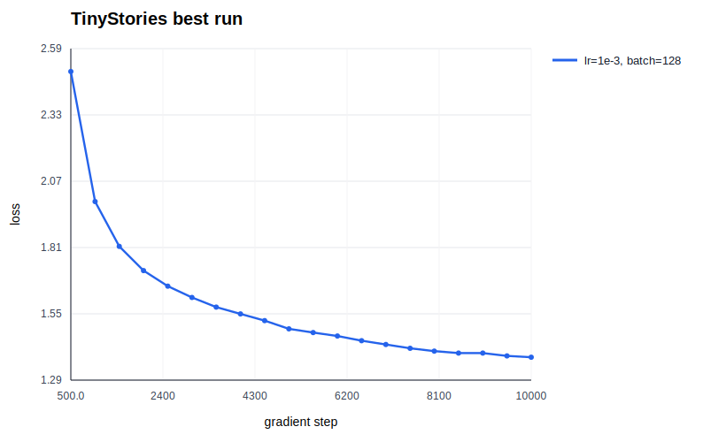

## 5. 学习率扫描

学习率扫描先使用短预算 run 判断数量级和早期训练趋势。除特别标注外，本表为短预算结果；`baseline step 2k` 是同一个 10k baseline run 在第 2k step 的验证结果，用来提供相同步数下的参考点。

| Run | 学习率 | Step | Final train loss | Final val loss | 现象 |
|---|---:|---:|---:|---:|---|
| `lr_1e-4_2k` | 1e-4 | 2k | 2.4722 | 2.4558 | 稳定但慢 |
| baseline step 2k | 3e-4 | 2k | 1.9231 | 1.9130 | 可用基线 |
| tuned step 2k | 1e-3 | 2k | 1.7303 | 1.7194 | 早期最好 |
| `lr_3e-3_1k` | 3e-3 | 1k | 1.9221 | 1.9004 | 比 1e-3 差 |
| `lr_1e-2_500` | 1e-2 | 500 | 2.1355 | 2.1148 | 明显不稳定/较差 |
| `lr_3e-2_300` | 3e-2 | 300 | 2.5451 | 2.5070 | 过高 |
| `lr_1e-1_100` | 1e-1 | 100 | 5.6087 | 5.5848 | step 20 loss 冲到 14.9 |

下面两张图只比较能够形成同预算对照的 2k candidates；其中 `3e-4` 和 `1e-3` 都取自对应 10k run 截止到 step 2000 的数据。

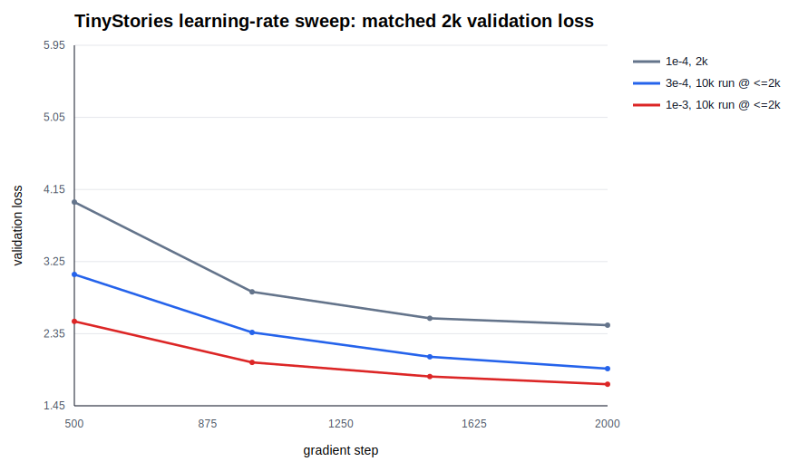

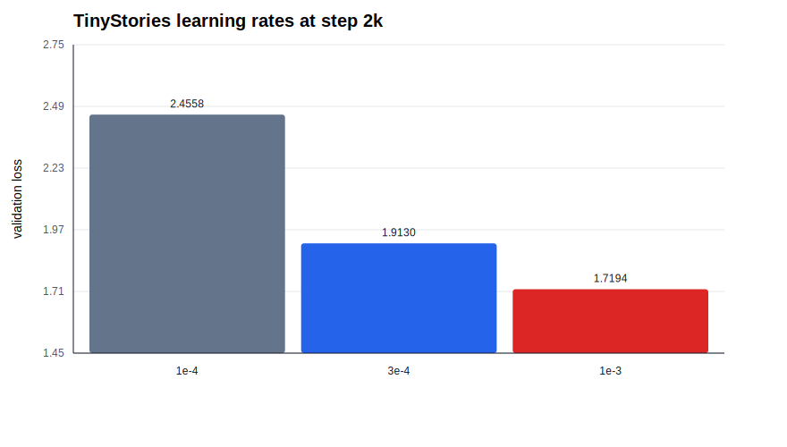

根据短预算扫描，我把表现最好的 `1e-3` 延长到 10k steps，并保留 `3e-4` baseline 作为最终对照：

| Run | 学习率 | Steps | Final train loss | Final val loss | Perplexity |
|---|---:|---:|---:|---:|---:|
| baseline | 3e-4 | 10k | 1.5309 | 1.5099 | 4.5262 |
| tuned | 1e-3 | 10k | 1.3901 | 1.3784 | 3.9686 |

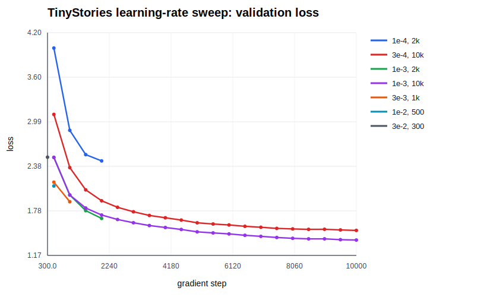

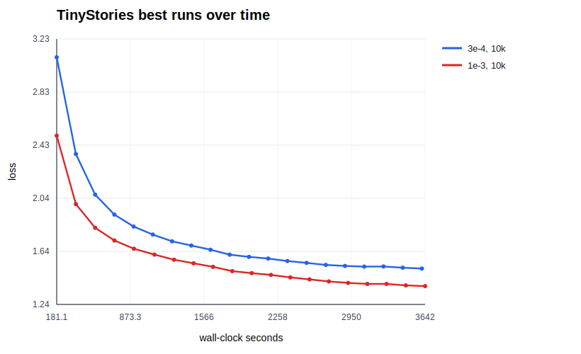

搜索策略是先用短 run 扫数量级，再把早期表现最好的 `1e-3` 扩展到 10k steps。这个安排避免把不同训练预算下的 loss 当作同一类比较，同时保留了调参过程和最终模型表现。结果符合 edge-of-stability 直觉：学习率需要足够大才能快速下降，但过大时会先 overshoot，表现为 loss 大幅升高或训练质量变差。

## 6. Batch Size 实验

batch size 实验是短预算对比，重点是同一训练预算下的稳定性和收敛速度，而不是最终模型质量。

| Run | Batch size | Learning rate | Final val loss | 结论 |
|---|---:|---:|---:|---|
| `batch_1_500` | 1 | 3e-4 | 4.3691 | 梯度噪声很大，效果差 |
| `batch_64_2k` | 64 | 3e-4 | 2.0674 | 稳定，速度较快 |
| baseline step 2k | 128 | 3e-4 | 1.9130 | 同步数下更好 |

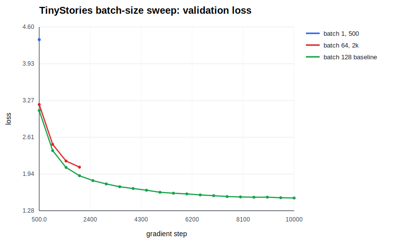

batch size 1 的 loss 很差；64 和 128 都能训练，其中 128 在相同步数下表现更好，也更符合 GPU 利用率需求。更大的 batch size 可能还需要重新调学习率。

## 7. 架构消融

消融均使用 TinyStories 2k-step 小实验，与 pre-norm + RoPE + SwiGLU baseline 的 step 2k 结果比较。

| 实验 | Final val loss | 结论 |
|---|---:|---|
| baseline step 2k | 1.9130 | 参考 |
| 删除 RMSNorm | 2.0560 | 稳定但更差 |
| Post-Norm | 2.0062 | 比 Pre-Norm 差 |
| NoPE | 2.1427 | 去掉位置编码明显变差 |
| SiLU FFN | 2.0742 | 不如 SwiGLU |

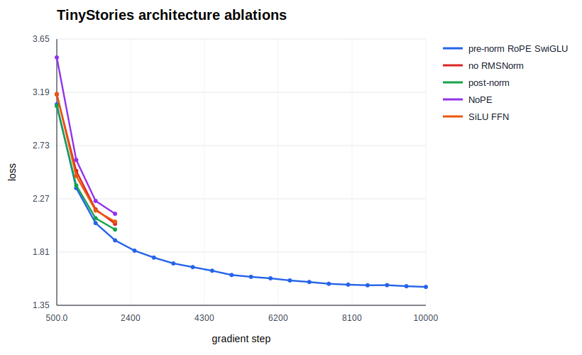

为了避免 10k baseline 的最终点影响消融判断，下面另外给出 matched 2k 版本：baseline 曲线取自 `3e-4` 10k run 的前 2000 steps，四个消融 run 也都在 step 2000 比较。

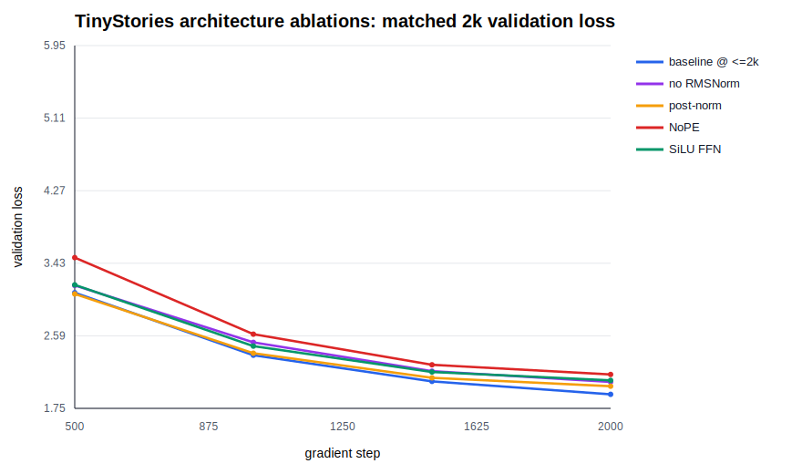

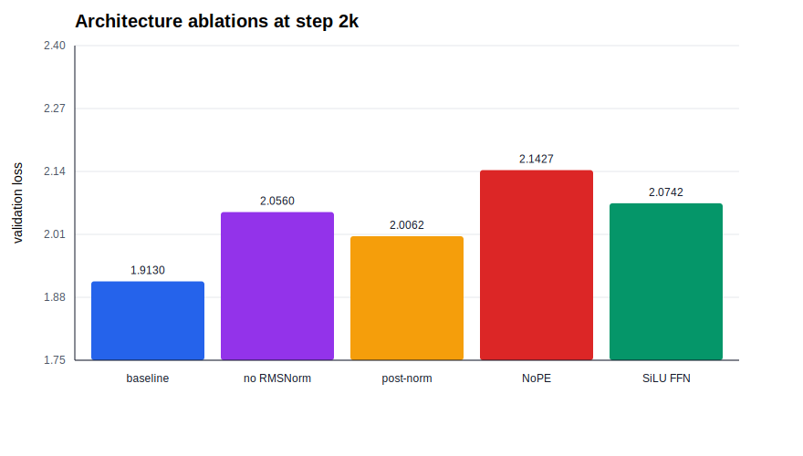

RMSNorm、RoPE 和 SwiGLU 都带来可见收益。Post-Norm 在这个小模型上没有发散，但不如 Pre-Norm；NoPE 最差，说明仅靠 causal mask 暗含的位置结构不足以替代显式 RoPE。

## 8. OpenWebText 实验

OWT tokenizer 由完整 OWT train 文本训练得到，vocab size 32,000。随后使用该 tokenizer 对完整 OWT train 和 valid 编码：

| 数据 | tokens | bytes/token |
|---|---:|---:|
| OWT train | 2,727,120,452 | 4.371 |
| OWT valid | 66,401,098 | 4.367 |

OWT LM 是最终 10k-step run，使用与 TinyStories 相同模型形状和训练步数；它用于和 TinyStories 最终 run 对比数据集难度，而不是和 2k 调参实验比较：

| Run | Final train loss | Final val loss | Perplexity |
|---|---:|---:|---:|
| OWT full tokenizer/full train | 4.2021 | 4.2415 | 69.52 |
| OWT 20MB tokenizer/2GB train subset | 4.2001 | 4.2133 | 67.58 |

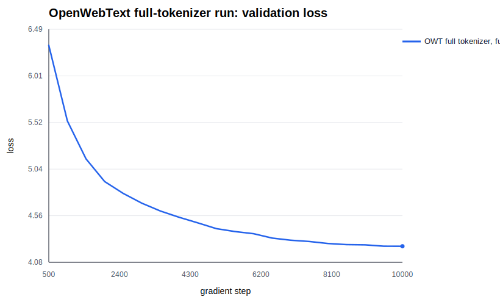

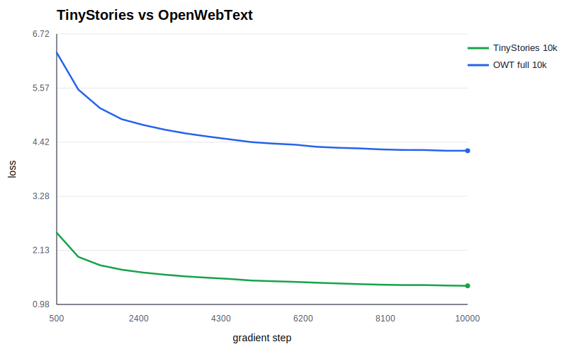

OWT loss 远高于 TinyStories。这是预期结果：OWT 覆盖网页、新闻、论坛、专名和格式噪声，分布更宽、更杂；同样的小模型和训练预算无法像建模儿童故事那样容易地建模 OWT。full-tokenizer run 比早期 20MB-tokenizer subset run 的 validation loss 略高，说明在 10k-step 小预算下，使用更完整的数据流水线不一定立刻降低 loss；它更严格地代表了完整 OWT 分布。

## 9. 文本生成

### TinyStories 生成

Prompt:

```text
Once upon a time
```

设置：temperature 0.8，top-p 0.9，最多生成 256 tokens。

```text
Once upon a time, there was a big, friendly dog named Max. Max loved to play with his friends in the park. One day, Max found a small box. It was a mystery. Max wanted to open the box, but it was very hard.
Max asked his friend, a little bird named Sam, for help. Sam was very smart. Max and Sam tried to open the box together. They pushed and pushed, but the box did not open. They were sad.
Then, a strong wind blew the box away. Max and Sam tried to catch it, but they could not. The wind blew the box away. Max and Sam were sad. They could not open the box. The mystery was not fun anymore. The mystery was not fun anymore.
<|endoftext|>
```

这个样本语法通顺，有儿童故事的角色和简单情节，但结尾重复了一句，说明模型仍有重复和弱规划问题。影响生成质量的因素包括 validation loss、训练 token 数、temperature/top-p 等采样设置。

### OWT 生成

Prompt:

```text
The meaning of life is
```

```text
The meaning of life is not a “endless choice”, so do not affect the distance between any human being and the world of a human and its effects on human life, because one of the most important things of all mankind and life are borne by one’s own sins.

When the world is finally able to see us, we are living in a perpetual, highly educated world with our own ideas and cultures, with no supernatural experience and a sense of harmony.

So what is not, is the time to be the first or the first place? What do we need to learn to learn from?

The first time you start by focusing on an artifact is the age of life, family, and life of life. What you can achieve is that you are the most intelligent and innocent person in life, and your life, and then you will be given the experience of your child.
```

OWT 样本有网页段落感和局部语法，但语义比较散，长程一致性较弱。这与 OWT 的高 validation loss 一致。

## 10. 总结

本次实现完成了从 tokenizer 到 Transformer LM 训练和生成的完整流水线。实验上，TinyStories tuned 10k run 达到 validation loss 1.3784，超过目标要求；学习率、batch size 与四个架构消融使用短预算 run 做公平比较，并都有日志和曲线；OWT 实验完成了 full tokenizer、full tokenization、10k 训练和生成。主要限制是模型和训练预算仍然较小，10k steps 不足以充分拟合完整 OWT 分布；若继续改进，优先方向是并行化 tokenization、扩大 OWT 训练步数，并针对 OWT 重新调学习率与 batch size。
