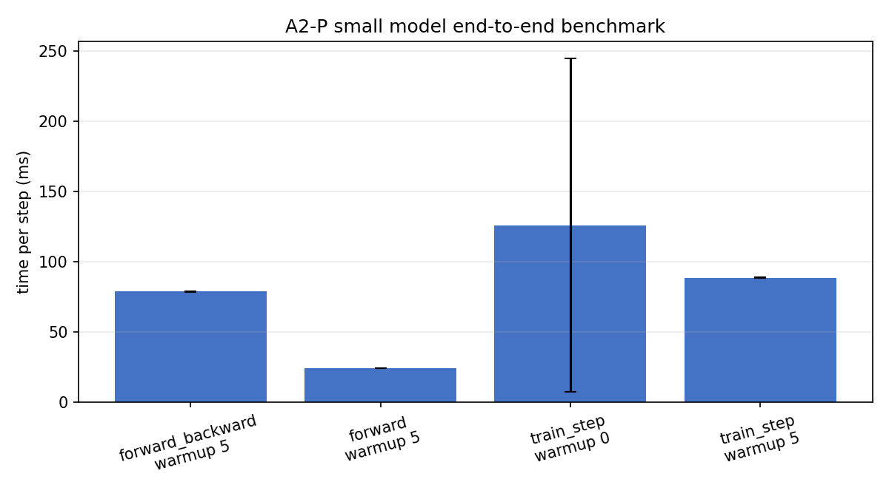
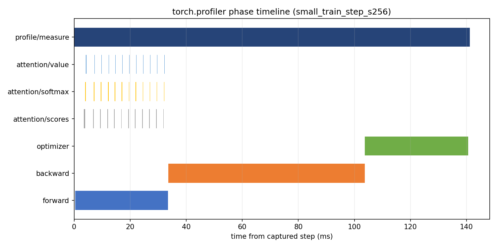
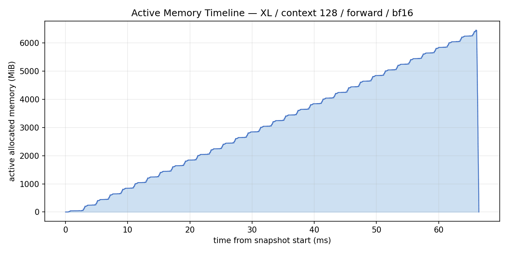
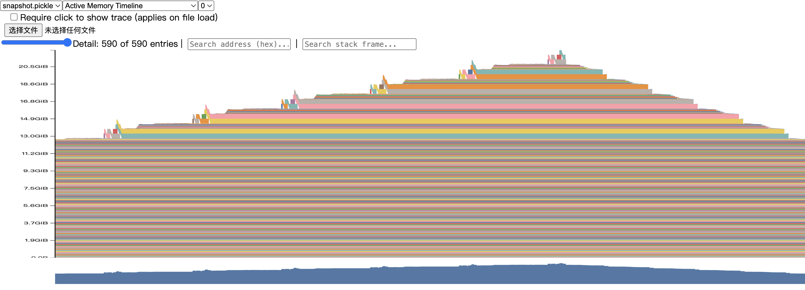
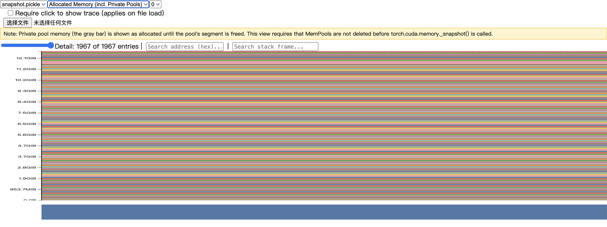

# A2-P 公开提交：李哲涵

> 题面版本：`26.1.4-rc.3`。本报告只覆盖 Profiling 子作业，不包含 A2-K、
> activation checkpointing、Triton kernel、DDP、optimizer sharding 或 FSDP。

## 完成范围与限制

- 已完成：端到端 Benchmark、四种累加实验、ToyModel BF16 autocast、FP32/BF16
  benchmark、6 个 `torch.profiler` `train_step` trace，以及 XL forward memory history。
- 已如实记录：RTX 4090 的 24 GiB 显存无法完成 XL 的 `train_step`；原始
  `XL/context 2048`、`XL/context 1024` 和 `Large/context 2048` 的训练尝试均保留为
  OOM 结果，没有把 fallback 改名为原配置。
- 计算性能分析使用 `torch.profiler`，不是 Nsight Systems。因此结果包含 CPU/CUDA
  活动、算子/内核调用和阶段区间，但不声称提供 Nsight 专属的系统级 CUDA API 关联。
- 原始 Chrome trace、显存快照和服务器日志留在执行工作区，没有放入公开附件。

上游 starter 固定为
[`ca8bc81a59b70516f7ebb2da4808daade877c736`](https://github.com/stanford-cs336/assignment2-systems/tree/ca8bc81a59b70516f7ebb2da4808daade877c736)。

## 环境与工具

| 项目 | 公开信息 |
| --- | --- |
| GPU | NVIDIA GeForce RTX 4090，24 GiB |
| Driver / CUDA | 560.28.03 / CUDA 12.6 |
| PyTorch | 2.7.1+cu126 |
| Python | 3.13.14 |
| 计算性能分析工具 | `torch.profiler`，CPU + CUDA 活动 |
| 批大小 | 端到端与 mixed precision 为 4；compute/memory 为 1 |
| TF32 | 正式比较中关闭 CUDA matmul 和 cuDNN TF32 |

## 1. 端到端基准测试

### 计时方法与命令

统一基线是 small、batch 4、context 512、FP32。每次运行先创建模型和随机
tokens/targets，再执行 warm-up；数据生成和初始化不计入计时。每个 measurement step
在 `time.perf_counter()` 前后调用 `torch.cuda.synchronize()`，结果同时保存 raw
timings、均值、样本标准差和 CV。

复现入口：

```bash
python -m profiling.benchmark \
  --model-size small --batch-size 4 --context-length 512 \
  --mode forward --warmup 5 --steps 10 --dtype fp32 \
  --device cuda --output results/benchmark.json
```

`mode=forward` 只运行 forward 并使用 `no_grad`；`mode=forward_backward` 在每一步清理
梯度后运行 forward、loss 和 backward；`mode=train_step` 在计时边界内运行
zero-grad、forward、loss、backward 和 optimizer step。

### 结果

`results/benchmark.csv` 保存了每个配置的完整 raw timings。下表为同一批正式结果的摘要，
时间单位是 ms。

| mode | warm-up | mean | sample std | CV | raw timing 范围 |
| --- | ---: | ---: | ---: | ---: | --- |
| forward | 5 | 24.211 | 0.062 | 0.00257 | 24.147–24.330 |
| forward_backward | 5 | 78.947 | 0.267 | 0.00338 | 78.591–79.517 |
| train_step | 5 | 88.671 | 0.189 | 0.00214 | 88.494–89.001 |
| train_step | 0 | 126.116 | 118.655 | 0.94084 | 88.236–463.813 |



warm-up 0 的第一个 step 为 463.813 ms，之后的 step 回到约 88–90 ms；这说明首次
CUDA kernel、allocator 和 lazy initialization 会显著污染没有 warm-up 的统计。5 个
warm-up 后的 CV 已降到约 0.21%。

## 2. 计算性能分析

### 六个 trace

六个配置全部使用 batch 1、FP32、5 个外部 warm-up 和一个稳定的 captured
`train_step` measurement step。每个 trace 都包含 `profile/warmup`、`profile/measure`、
`forward`、`backward`、`optimizer`，并对 attention 的 scores、softmax、value 阶段加了
范围标记。

| model | context | mode | status | trace |
| --- | ---: | --- | --- | --- |
| small | 256 | train_step | success | `small_train_step_s256.json` |
| small | 512 | train_step | success | `small_train_step_s512.json` |
| small | 1024 | train_step | success | `small_train_step_s1024.json` |
| medium | 256 | train_step | success | `medium_train_step_s256.json` |
| medium | 512 | train_step | success | `medium_train_step_s512.json` |
| medium | 1024 | train_step | success | `medium_train_step_s1024.json` |

轻量 operator/kernel/range 汇总在 `results/profile/trace_summary.csv`，运行配置和
公开环境在 `results/profile/run_metadata.json`。

### 代表性归因

以 small/context 256 为例，range 汇总的累计 CPU 时间为：

| 阶段 | Calls | 累计 CPU 时间 |
| --- | ---: | ---: |
| forward | 2 | 65.271 ms |
| backward | 2 | 69.989 ms |
| optimizer | 1 | 36.933 ms |
| attention/scores | 24 | 4.201 ms |
| attention/softmax | 24 | 3.416 ms |
| attention/value | 24 | 1.659 ms |

`torch.profiler` 的 operator 表还显示，medium/context 1024 的主要 CUDA 工作包括
`aten::bmm`；该配置的 `aten::bmm` 累计 CUDA 时间为 71.650 ms。attention 子阶段随
context 增长，medium/context 1024 的 scores、softmax、value 分别为 14.511 ms、
15.074 ms 和 6.516 ms。softmax 的 FLOPs 相对矩阵乘法较少，但它仍受大规模 score
张量读写、mask 和 reduction 的影响，不能只按 FLOPs 比例估算时间。



图中是 `torch.profiler` trace 中的阶段区间裁剪图；它只展示公开的阶段名称和时间轴，
不包含终端、主机名、内部路径或完整 trace。

### 工具边界

`torch.profiler` 同时启用了 CPU 与 CUDA activities，并导出 Chrome trace；提交目录只
保留轻量汇总。它能够显示 PyTorch operator、CUDA kernel、Calls 和阶段区间，但没有
Nsight Systems 的完整 CUDA API 到 kernel 的系统级关联，因此报告只使用它实际提供的
证据。

## 3. 混合精度

### 四种累加实验

固定 1000 次、每次加 0.01 的实际输出如下：

| accumulator | input | output |
| --- | --- | ---: |
| FP32 | FP32 | 10.0001335 |
| FP16 | FP16 | 9.9531250 |
| FP32 | FP16 | 10.0021362 |
| FP32 | FP16 后显式 cast 到 FP32 | 10.0021362 |

FP16 accumulator 在每次累加时都把结果舍入回较粗的 FP16 网格，因此误差逐步累积。
把 accumulator 保持为 FP32 可以避免重复的低精度累加，但不能消除 FP16 input 在最初
量化时已经产生的误差；后两行几乎相同正是这个区别。

### ToyModel BF16 autocast

ToyModel 为 `Linear(32,10) -> LayerNorm(10) -> Linear(10,7)`，在 CUDA 上使用
BF16 autocast。实际 dtype 为：

| component | FP32 | BF16 autocast |
| --- | --- | --- |
| parameters | float32 | float32 |
| fc1 output | float32 | bfloat16 |
| LayerNorm output | float32 | float32 |
| logits | float32 | bfloat16 |
| loss | float32 | float32 |
| gradients | float32 | float32 |

ToyModel 的 FP32/BF16 autocast 完整 forward-backward 时间分别为 0.703 ms 和
1.075 ms；该模型太小，BF16 kernel launch 和 cast 开销超过 Tensor Core 收益。峰值
allocated memory 为 16.259 MiB 和 16.261 MiB，几乎没有差异。两个初始 logits 的
最大绝对差为 0.009813，平均绝对差为 0.003243。

### 语言模型 FP32/BF16

在相同 small、batch 4、context 512、warm-up 5、measurement 10 的
forward-backward 配置下：

| dtype | mean | sample std | CV | peak allocated |
| --- | ---: | ---: | ---: | ---: |
| FP32 | 78.935 ms | 0.287 ms | 0.00364 | 4157.552 MiB |
| BF16 autocast | 66.864 ms | 3.801 ms | 0.05685 | 3238.826 MiB |

这个规模的语言模型 BF16 约快 1.18 倍，并降低了 peak allocated；相比 ToyModel，较大
矩阵乘法更能利用 Tensor Core。LayerNorm、loss、reduction 和 gradient 仍保持
FP32，以保留动态范围和累加精度。完整 raw timing、dtype 记录和显存字段在
`results/mixed_precision.json`。

## 4. 显存分析

### 配置与峰值

memory history 在每个正式配置的 forward warm-up 之后开启；训练配置的 warm-up
策略明确记录为 `warmup_mode=forward`，这样即使训练 step OOM 也能保存 snapshot。
`results/memory/peaks.csv` 区分 allocated、reserved、active 和 snapshot 最大 allocation。

| model | mode | dtype | context | status | peak allocated | peak reserved | largest allocation | failed stage |
| --- | --- | --- | ---: | --- | ---: | ---: | ---: | --- |
| XL | forward | FP32 | 128 | success | 13154.051 MiB | 13168 MiB | 100 MiB | — |
| XL | forward | FP32 | 2048 | success | 15305.682 MiB | 15858 MiB | 512 MiB | — |
| XL | forward | BF16 | 128 | success | 19587.445 MiB | 19798 MiB | 100 MiB | — |
| XL | forward | BF16 | 2048 | success | 21021.682 MiB | 22032 MiB | 512 MiB | — |
| XL | train_step | FP32 | 128 | OOM | 23476.921 MiB | 23626 MiB | 100 MiB | backward |
| XL | train_step | FP32 | 2048 | OOM | 22938.018 MiB | 23540 MiB | 512 MiB | forward |
| XL | train_step | BF16 | 128 | OOM | 23428.456 MiB | 23626 MiB | 100 MiB | backward |
| XL | train_step | BF16 | 2048 | OOM | 23253.424 MiB | 23318 MiB | 512 MiB | forward |

原始 `XL/train_step` OOM 后，按题面顺序尝试了 `XL/context 1024` 和
`Large/context 2048`；FP32 与 BF16 的 fallback train_step 仍然 OOM。OOM 是 24 GiB
设备限制的真实结果，不把这些行标为 success。

### 时间线、分配与残差

下图由 PyTorch memory history snapshot 的 allocator timeline 生成，采用 active
allocated memory 口径；图中没有桌面、终端或服务器身份信息。





下面的补充 viewer 截图展示了 XL/context 128 的分配视图
（`Allocated Memory (incl. Private Pools)`）。它与上面的 Active Memory Timeline 图分开
列出，以免把报告中的统计口径误标为 Active Memory Timeline。



对于 batch 1、FP32 residual stream，单个
`[batch, context, d_model]` tensor 的理论大小为
`1 × context × 2560 × 4 bytes`：context 128 是 1.25 MiB，context 2048 是
20.00 MiB。snapshot 中 context 2048 的最大 512 MiB allocation 与
`num_heads × context × context × 4 bytes` 的 score tensor 尺寸一致；实际显存峰值
还包括参数、autograd saved residual、gradient、allocator reserve 和 CUDA workspace。
训练 OOM 发生在 backward 或 forward 阶段，说明在 24 GiB 限制下 saved tensors、
gradient 和临时 attention allocation 叠加后没有足够余量。

## 5. 复现与限制

代码同步：

```bash
python3 scripts/sync_a2p_submission.py --name '李哲涵'
```

本提交的公开附件只有 `results/`、`assets/` 和 `submission/profiling/**/*.py`。
大型 trace、snapshot、服务器日志和完整 profiler HTML 都保留在本地/服务器执行目录，
没有提交到 GitHub。正式结果使用独立子进程运行，某个 OOM 不会阻断后续配置。

本目录按当前 A2-P 公开题面整理；创建 PR 时只提交本人的作业目录，并按课程规则核对
分支名、commit 和 PR 范围。

## 飞书补充文档

- 链接：https://fudan-nlp.feishu.cn/wiki/MbdIwhFT6i1XTkkezW8cDBzPn3d
- 公开报告已包含可公开的轻量结果；补充文档仅用于组织内保存不能上传 GitHub 的原始
  trace、snapshot 和 OOM 日志说明，不开启互联网公开访问。

## 自检

- [x] 三种 benchmark mode、CUDA 同步、raw timing、样本标准差、CV。
- [x] warm-up 5 与 warm-up 0 对照。
- [x] 两个模型规模、三个 context、六个 `train_step` profiler trace。
- [x] CPU/CUDA activities、阶段标记、operator/kernel/range 汇总。
- [x] 四种累加实验和 CUDA BF16 autocast dtype 记录。
- [x] XL context 128/2048 forward 与 train_step，OOM 和 fallback 均如实保留。
- [x] 所有图片使用相对路径并被本报告引用。
- [x] 未提交 `.nsys-rep`、完整 Chrome trace、snapshot、权重、数据或依赖环境。
- [x] 公开材料不含内部主机名、IP、账号、绝对路径、UUID、凭据或 token。
