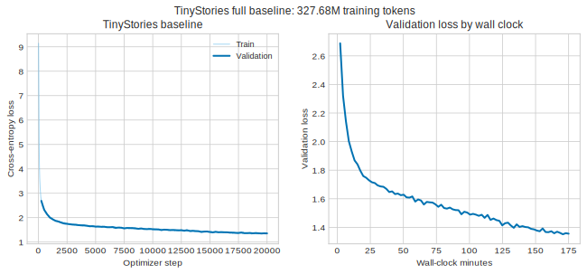
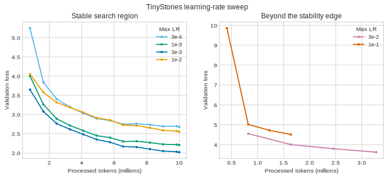
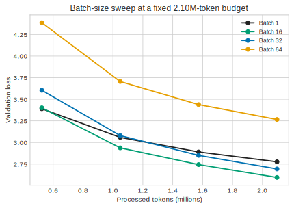
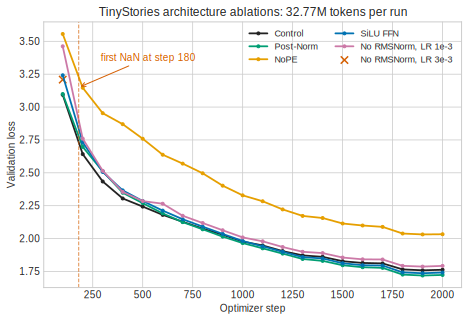
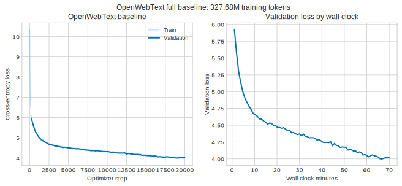

# A1 公开提交：王惟易

## 基本信息

- 作业题面版本：实验室版 26.0.4，上游 starter commit `a158843b20107949f1a8d7df1b05cd33b9166712`
- 环境：Python 3.13.11，PyTorch 2.11.0；正确性测试在 CPU 上完成，正式 TinyStories 与 OpenWebText 训练分别使用 NVIDIA RTX 4060 Ti 16GB 和 NVIDIA 4090
- 已完成：21 个 adapter 对应实现、训练与生成入口、TinyStories 10K 与 OpenWebText 32K tokenizer、双语料编码与跨域 compression 对比、两个完整 baseline、learning-rate sweep、batch-size sweep、四类架构消融和两组文本生成
- 当前测试：`47 passed, 1 xfailed`；唯一 xfail 是题目预期的 `Tokenizer.encode` 1 MiB 附加内存测试
- 实验状态：全部必做实验完成；公开提交包含 18 份训练日志、18 份配置和 5 张可复现 loss curve

本报告只陈述已经完成并有记录支持的结果；尚未运行的实验不会用推测数据补齐。

## 飞书补充文档

- [王惟易 - A1 补充文档](https://fudan-nlp.feishu.cn/wiki/JquUw0Aawig5cekFX4qcTGDgn66)（组织内公开，未开启互联网公开访问）

补充文档只保存组织内计算资源与运行过程记录；公开代码、脱敏实验结果和分析以本 README 为准。

## 1. Unicode 书面题

### 1.1 `unicode1`

`chr(0)` 返回 Unicode 码点 U+0000，即 NUL 字符。它的 `repr` 显示为转义形式 `'\x00'`，而 `print` 会把真实 NUL 写入输出流，终端通常不显示可见字形。NUL 夹在普通 Python 字符串中时仍真实存在并计入长度，只是在常见终端渲染中看起来像“消失”；某些依赖 C 风格零结尾字符串的外部系统还可能把它解释为终止符。

### 1.2 `unicode2`

UTF-8 对 ASCII 和常见英文文本只使用一个 byte，并且没有 UTF-16/UTF-32 常见的固定宽度浪费与字节序问题；同时它仍能编码全部 Unicode 码点，因此更适合作为以英文互联网文本为主的 byte-level tokenizer 输入。

错误的逐 byte 解码函数把每个 byte 单独送入 UTF-8 decoder，但一个非 ASCII 字符通常需要多个 byte 联合解释。例如 `"你好".encode("utf-8") == b'\xe4\xbd\xa0\xe5\xa5\xbd'`，其中任何首 byte 或 continuation byte 都不是独立合法的 UTF-8 字符，所以逐 byte 解码会抛出 `UnicodeDecodeError`。

一个非法的两 byte 序列是 `b'\xe5\x95'`：首 byte `11100101` 声明这是一个三 byte UTF-8 序列，但后面只有一个 continuation byte，缺少第三个 byte，因此无法解码为 Unicode 字符。

## 2. 实现概览

### 2.1 Byte-level BPE 与 Tokenizer

实现从 256 个单 byte token 和 special tokens 开始，在 GPT-2 风格 pre-token 内统计相邻 pair，并把 `<|endoftext|>` 作为不可跨越的硬边界。训练器保留朴素实现作为学习记录，生产实现使用 `pair -> pre-token IDs` 倒排索引增量更新局部计数，并用支持惰性删除的 heap 选择全局最佳 pair。

Tokenizer 编码时按训练得到的 merge rank 重放规则，而不是重新按局部频率决定合并；解码时先拼接所有 token bytes，再统一使用 UTF-8 `errors="replace"` 解码，避免把跨 token 的合法多 byte 字符误判为非法。special tokens 采用转义后的最长优先匹配，`encode_iterable` 惰性地产生 token IDs。

### 2.2 Transformer LM

实现包含 Linear、Embedding、RMSNorm、SiLU/SwiGLU、RoPE、数值稳定 softmax、scaled dot-product attention、因果 multi-head self-attention、pre-norm Transformer block 和完整 decoder-only LM。RoPE 只旋转 Q/K；RMSNorm 在平方前转到 float32；模型返回 logits，让 cross-entropy 用 log-sum-exp 直接稳定计算。

### 2.3 训练与生成

实现包含 cross-entropy、AdamW、warmup + cosine learning-rate schedule、global gradient clipping、mmap 随机 batch、checkpoint 保存/恢复、JSONL logging、validation、temperature/top-p sampling 和自回归生成。Checkpoint 保存 model state、optimizer state 与 iteration；恢复训练后 step 与累计 wall-clock 保持连续。

单批次过拟合把 loss 从 `3.98915` 降到 `0.001961`，用于验证数据右移、forward、backward、optimizer 与 loss 的端到端链路。

## 3. Transformer 资源核算

矩阵乘法 `(m, n) @ (n, p)` 可以看作执行 `m × p` 个长度为 `n` 的点积。若一次乘法和一次加法各记一个 FLOP，总成本为 `2mnp` FLOPs。

### 3.1 GPT-2 XL 参数与模型内存

对 `V=50,257`、`T=1,024`、`L=48`、`d=1,600`、`d_ff=4,288` 的作业架构：

| 部分 | 参数量 |
|---|---:|
| token embedding | `Vd = 80,411,200` |
| 单个 Transformer block | `4d² + 3dd_ff + 2d = 30,825,600` |
| 48 blocks | `1,479,628,800` |
| final RMSNorm | `1,600` |
| LM head | `dV = 80,411,200` |
| 合计 | **1,640,452,800** |

float32 参数本身占 `6,561,811,200` bytes，即约 `6.56 GB` 或 `6.11 GiB`。若再计入同精度 gradient 与 AdamW 的一阶、二阶状态，而暂不计 activation，四份同规模张量约占 `26.25 GB` 或 `24.44 GiB`。

### 3.2 Forward FLOPs

每层主要矩阵乘法为：Q/K/V/output projections 共 `8Td²`；`QK^T` 与 attention-weighted V 共 `4T²d`；SwiGLU 的三个投影共 `6Tdd_ff`。LM head 在所有 block 之后只计算一次，成本 `2TdV`。忽略 norm、SiLU 和逐元素乘法等低阶项。

| 模型 | 总 forward FLOPs | Attention projections | Attention mixing | SwiGLU | LM head |
|---|---:|---:|---:|---:|---:|
| GPT-2 small | 291.65 GFLOPs | 19.88% | 13.25% | 39.76% | 27.10% |
| GPT-2 medium | 830.17 GFLOPs | 24.83% | 12.42% | 50.05% | 12.70% |
| GPT-2 large | 1.77 TFLOPs | 27.32% | 10.93% | 54.30% | 7.45% |
| GPT-2 XL | **3.52 TFLOPs** | 28.62% | 9.16% | 57.53% | 4.68% |

固定 context length 与 vocabulary size、增大模型宽度和层数时，projections 与 SwiGLU 主要按 `Ld²` 增长，因此占比上升；attention mixing 主要按 `LT²d` 增长，LM head 按 `TdV` 增长，因而占比下降。`num_heads` 不出现在主要 FLOPs 结果中，因为每个 head 的维度是 `d/num_heads`，与 head 数量相乘后仍为 `d`。

把 GPT-2 XL 的 context length 从 1,024 增到 16,384 后，总量从 `3.52 TFLOPs` 增至 `133.58 TFLOPs`，约 37.98 倍。Attention mixing 因 `T²` 缩放而从 9.16% 上升到 61.73%，成为主导项。

### 3.3 AdamW 内存与计算核算

记 batch size 为 `B`、context length 为 `T`、层数为 `L`、模型宽度为 `d`、head 数为 `h`、vocabulary size 为 `V`，并按题面假设 `d_ff=(8/3)d`。不使用 weight tying 时，总参数量为：

```text
P = 2Vd + L(12d² + 2d) + d
```

float32 parameters 和 gradients 各占 `4P` bytes；AdamW 的一阶矩 `m` 与二阶原始矩 `v` 共占 `8P` bytes，因此非 activation 部分为 `16P` bytes。按题面列出的 operation outputs 计数，单个 block 保存 `(56/3)BTd + 2BhT²` 个 activation scalars；再加 final RMSNorm、LM-head logits 和 cross-entropy 的 logits-sized temporary，得到：

```text
A = B[Td((56/3)L + 1) + 2LhT² + 2TV]
peak memory = 16P + 4A bytes
```

代入题面 GPT-2 XL 的 `V=50,257`、`T=1,024`、`L=48`、`d=1,600`、`h=25`，并保持 `d_ff=(8/3)d` 的核算假设：

```text
P = 1,635,537,600
peak memory = 16,356,614,144 B + 26,168,601,600 bytes
```

在十进制 80 GB 显存限制下，`floor((80e9 - 26,168,601,600) / 16,356,614,144) = 3`，所以最大 batch size 为 3。这里的 `P` 与第 3.1 节使用实际、向 64 对齐的 `d_ff=4,288` 所得参数量略有不同；两种口径的最大 batch size 相同。

逐元素计算 AdamW 时，weight decay、第一矩更新、第二矩更新和 moment-adjusted 参数更新分别需要 2、3、4、5 FLOPs/parameter，因此 optimizer step 为 `14P + O(1)` FLOPs；bias correction 的标量运算包含在 `O(1)` 中。

GPT-2 XL 单个 1,024-token sequence 的 forward 为 `3.5167698944e12` FLOPs。backward 按 forward 的两倍计算，则 batch 1,024 的单步训练量为 `3 × 1,024 × 3.5167698944e12 + 14P = 1.08035400131232e16` FLOPs；400K steps 共 `4.32141600524928e21` FLOPs。H100 在 50% MFU 下提供 `0.5 × 495e12 = 2.475e14` FLOP/s，因此单卡训练约需 17,460,267 秒，即 **4,850 小时或 202 天**。

## 4. Tokenizer 实验

### 4.1 完整 TinyStories BPE

| vocab size | elapsed | peak RSS | longest learned token |
|---:|---:|---:|---|
| 10,000 | 355.968 s | 10,850.37 MiB | `b' accomplishment'`，15 bytes |

完整训练约 5.93 分钟、peak RSS 约 10.60 GiB，低于 30 分钟和 30 GB 限制。最长 token 是带前导空格的常见英文词，符合 GPT-2 风格 pre-tokenization 的预期。5M sample 的优化过程与 profile 详见 `logs/01_tokenization.md`。

### 4.2 完整 OpenWebText BPE

| vocab size | elapsed | peak RSS | longest learned token |
|---:|---:|---:|---|
| 32,000 | 4,905.077 s | 9,979.38 MiB | `b'\xc3\x83\xc3\x82'` 重复 16 次，64 bytes |

完整训练耗时约 1 小时 21 分 45 秒，peak RSS 约 9.75 GiB，低于题目的 12 小时和 100 GB 限制。最长 learned token 解码后是 `ÃÂ` 的重复，属于网页文本中常见的 mojibake（字符编码错乱），反映 OpenWebText 比 TinyStories 更噪杂。TinyStories 的最长 token 则是带前导空格的完整叙事词；两者差异符合各自语料分布。

### 4.3 数据编码与压缩

TinyStories 的完整编码结果为：

| split | tokens | elapsed | throughput | compression ratio | uint16 size |
|---|---:|---:|---:|---:|---:|
| validation | 5,461,210 | 12.785 s | 1.679 MiB/s | 4.12044 bytes/token | 10.416 MiB |
| training | 540,796,778 | 1,204.044 s | 1.765 MiB/s | 4.11939 bytes/token | 1,031.488 MiB |

10K 词表完全落在 `uint16` 的 `0..65,535` 范围内，因此用 `uint16` 保存 token IDs 是安全的，并比 `int32` 节省一半空间。按训练集单进程吞吐粗略外推，编码 825 GB 的 Pile 约需 124 小时；实际值会受语料结构、I/O 和并行度影响。

OpenWebText 的完整编码结果为：

| split | tokens | elapsed | workers | throughput | compression ratio | uint16 size |
|---|---:|---:|---:|---:|---:|---:|
| validation | 66,401,098 | 566.855 s | 1 | 0.488 MiB/s | 4.36738 bytes/token | 126.650 MiB |
| training | 2,727,120,452 | 1,536 s | 16 | 7.401 MiB/s | 4.37110 bytes/token | 5,201.569 MiB |

训练集先按换行边界切成 16 个有序分片，各分片独立编码后按原顺序拼接。正式运行前，在完整 validation split 上把这种并行输出与串行输出比较，二者大小和 SHA-256 完全一致。训练吞吐约为单进程 validation 吞吐的 15.2 倍；两行吞吐使用不同并行度，不能解释为 train split 本身更容易编码。

为了隔离语料与 tokenizer 的影响，从两个语料各取约 5 MiB，并用两个 tokenizer 分别编码：

| corpus | TinyStories 10K | OpenWebText 32K |
|---|---:|---:|
| TinyStories | **4.11857 bytes/token** | 4.00383 bytes/token |
| OpenWebText | 3.22096 bytes/token | **4.42749 bytes/token** |

TinyStories tokenizer 在本域样本上略优约 2.9%，而 OpenWebText tokenizer 在本域样本上把 token 数从 1,627,708 降到 1,184,144，减少约 27.3%。更大的词表本身不保证跨域压缩更好；merge 规则学习到的语料分布同样关键。四组原始计数与吞吐记录在 `logs/experiments/tokenizer_comparison.json`。

## 5. TinyStories 训练实验

### 5.1 GPU probe

| batch size | seconds/step | tokens/s | peak allocated | 结果 |
|---:|---:|---:|---:|---|
| 1 | 0.01163 | 22,016 | 0.418 GiB | 成功 |
| 16 | 0.12284 | 33,343 | 2.432 GiB | 成功，最高吞吐 |
| 32 | 0.25433 | 32,210 | 4.567 GiB | 成功 |
| 64 | 0.51103 | 32,061 | 8.860 GiB | 成功 |
| 96 | — | — | — | 仅在 expandable segments 下可运行，且更慢 |
| 128 | — | — | — | OOM |

吞吐在 batch 16 后已经平台化，说明继续增大 batch 主要增加显存占用。batch 128 的 OOM 也是题目要求“试到显存上限”的有效结果。

### 5.2 Learning-rate sweep

| max LR | steps | processed tokens | wall clock | final val loss | 结论 |
|---:|---:|---:|---:|---:|---|
| `3e-4` | 610 | 9,994,240 | 331.327 s | 2.678493 | 收敛慢 |
| `1e-3` | 610 | 9,994,240 | 331.858 s | 2.207574 | 改善 |
| `3e-3` | 610 | 9,994,240 | 331.810 s | **2.020021** | 此预算最好 |
| `1e-2` | 610 | 9,994,240 | 331.802 s | 2.552282 | 开始恶化 |
| `3e-2` | 200 | 3,276,800 | 108.409 s | 3.624071 | 明显较差，提前停止 |
| `1e-1` | 100 | 1,638,400 | 57.238 s | 4.512198 | warmup 中爆炸后部分恢复，提前停止 |

结果从 `3e-4` 到 `3e-3` 持续改善，随后变差，支持最佳学习率靠近稳定边缘的经验。`1e-1` 在 warmup 中的 train loss 从 step 10 的约 7.718 上升到 step 25 的约 11.410，随后因为学习率衰减而部分恢复；因此将它描述为强烈不稳定、在当前预算内不收敛，而不声称它最终产生了 NaN。

### 5.3 Batch-size sweep

所有成功 run 固定 `2,097,152` processed tokens，避免大 batch 因固定 step 而看到更多数据。

| batch | steps | max LR | wall clock | final val loss |
|---:|---:|---:|---:|---:|
| 1 | 8,192 | `3.75e-4` | 94.989 s | 2.776371 |
| 16 | 512 | `1.5e-3` | 66.963 s | **2.595449** |
| 32 | 256 | `2.12132e-3` | 69.688 s | 2.693691 |
| 64 | 128 | `3e-3` | 71.995 s | 3.265839 |
| 128 | — | — | — | OOM |

batch 16 在这组短预算中同时取得最低 wall clock 和 validation loss。batch 1 的小矩阵利用率较差；batch 32/64 的吞吐没有提高，而固定 token 数又使 optimizer update 次数减少。这个结果依赖当前 token 预算和学习率缩放，不能推广为普遍最优 batch。

### 5.4 完整 baseline

| 项目 | 值 |
|---|---:|
| vocab / context | 10,000 / 256 |
| `d_model` / `d_ff` | 512 / 1,344 |
| layers / heads | 4 / 16 |
| batch size / max LR | 64 / `3e-3` |
| steps / processed tokens | 20,000 / 327,680,000 |
| wall clock | 10,501.408 s（约 2 h 55 min） |
| final train loss | 1.352580 |
| final validation loss | **1.355541** |

最终 validation loss 低于题目要求的 1.45。短 sweep 的作用是快速排除超参数，而完整 327.68M-token 训练才给出最终质量结论。

### 5.5 文本生成

配置：seed 42，temperature 0.8，top-p 0.9；模型在达到 256 个新 token 前生成 `<|endoftext|>`，因此按题目规则提前停止。

```text
Once upon a time, there was a little girl named Lily. She loved to play outside in the sun. One day, Lily went to the park to play. She saw a new friend, a small cat. The cat was very shy.

Lily wanted to introduce the cat to her mom. She said, "Mom, come see the cat!" Her mom smiled and said, "Yes, Lily. The cat is shy, but it is nice."

Lily and the cat played in the park all day. They had lots of fun. The cat was very good at hiding, and Lily was very happy. They became best friends and played together every day.

<|endoftext|>
```

输出已经具有完整句法、人物一致性和简单故事结构，但情节模板化，描述重复，因果发展较弱。主要影响因素包括 TinyStories 语料本身的简单风格、模型容量和训练 token 预算，以及 temperature/top-p 对随机性与候选集合的控制。

## 6. TinyStories 架构消融

六个 run 统一使用 batch 64、context length 256 和 2,000 steps，即每个 run 处理 32,768,000 tokens。除低学习率 No-RMSNorm 外，max LR 均为 `3e-3`。为保证因果比较，表中结论只相对于同一套件的 control；这六个 run 使用 AdamW `betas=(0.9, 0.999)`、weight decay `0.01`，而第 5 节的历史实验使用 `betas=(0.9, 0.95)`、weight decay `0.1`，因此不能把两个套件之间的 loss 差异归因于模型结构。

| 配置 | 结构或 LR 变化 | final val loss | best val loss | 结论 |
|---|---|---:|---:|---|
| control | Pre-Norm + RoPE + SwiGLU，LR `3e-3` | 1.762212 | 1.758050 | 匹配控制 |
| No-RMSNorm | 删除全部 RMSNorm，LR `3e-3` | NaN | 3.208766 | step 180 首次出现非有限 train loss |
| No-RMSNorm，低 LR | 删除全部 RMSNorm，LR `1e-3` | 1.791714 | 1.786389 | 降低 LR 后稳定，但略差于 control |
| Post-Norm | block 改为 Post-Norm | **1.722657** | **1.718559** | 此预算下最好 |
| NoPE | 不使用 RoPE | 2.032531 | 2.031106 | 明显差于 control |
| SiLU | 参数量近似匹配的 `d_ff=2048` SiLU FFN | 1.741140 | 1.735889 | 略优于 control 的 final loss，但略差于 Post-Norm |

No-RMSNorm 的两个 run 说明 normalization 和 learning rate 共同决定稳定性：移除 RMSNorm 不意味着模型必然无法训练，但它显著缩小了稳定学习率范围。NoPE 的下降说明即使 TinyStories 的 context 只有 256，位置关系仍然重要。Post-Norm 在这个短预算内优于 Pre-Norm，但这只是当前深度、学习率和 token 预算下的经验结果，不能推广为深层模型中 Post-Norm 普遍更好。SiLU 使用更宽的隐藏层来近似匹配 SwiGLU 参数量，因此比较的是 FFN 形式，而不是简单减少参数。









## 7. OpenWebText 训练实验

OpenWebText 使用与 TinyStories 相同的 context length、模型宽度、层数、头数、FFN 宽度、batch size、learning rate 和 training iterations；唯一必然变化是 tokenizer 词表从 10K 增至 32K。

| 项目 | 值 |
|---|---:|
| vocab / context | 32,000 / 256 |
| `d_model` / `d_ff` | 512 / 1,344 |
| layers / heads | 4 / 16 |
| batch size / max LR | 64 / `3e-3` |
| steps / processed tokens | 20,000 / 327,680,000 |
| wall clock | 4,205.326 s（约 1 h 10 min） |
| final train loss | 4.029969 |
| final validation loss | **4.015182** |
| best validation loss | **3.996987**，step 19,000 |

训练从初始 loss `10.36` 稳定下降，在末段接近 4.0。不同语料和 tokenizer 的 per-token loss 不能直接比较；用 OpenWebText validation 的 `4.36738 bytes/token` 归一化后，最终结果约为 `0.919 nats/byte` 或 `1.326 bits/byte`，高于 TinyStories 的约 `0.329 nats/byte` 或 `0.475 bits/byte`。这与 OpenWebText 题材更广、语言分布更复杂且网页噪声更多一致。两次训练使用不同 GPU，因此 wall-clock 差异不能归因于语料或模型结构。

生成配置为 seed 42、temperature 0.8、top-p 0.9，prompt 为 `The`，并生成完整的 256 个新 token。节选如下：

```text
The officials said that the president, “as a practical matter, is taking responsibility for the executive actions of a national security group and the executive branch of the Federal Reserve.”

The president is also referring to his policy of “one million American workers.”

“The president is not referring to what is on the line,” he said. “We have no regard for it.”

Republicans, including the President and Vice President Joe Biden, have made public statements on the foreign policy and campaign policy issues, which have become clear that Congress has not set up a government to take responsibility for it.
```

局部句法和新闻文体较流畅，但全文不断重复 `the president`，人物、机构和政策关系互相矛盾，篇章层面的语义一致性明显弱于 TinyStories。主要因素是 OpenWebText 的异质和噪声分布、当前模型容量与 327.68M-token 预算不足以覆盖这种分布，以及 temperature/top-p 采样引入的随机性。完整样本保存在 `logs/experiments/generation_owt.txt`。



## 8. 复现与提交结构

工作仓库位于公开提交仓库的兄弟目录 `../assignment1-basics`。依赖由上游 `uv.lock` 固定，不在个人提交中复制数据、checkpoint、模型权重、虚拟环境或 lock file。

```bash
cd ../assignment1-basics
uv sync --frozen
uv run pytest
uv run python -m cs336_basics.bpe_experiment INPUT.txt OUTPUT.json --vocab-size 10000 --special-token '<|endoftext|>'
uv run python scripts/train.py --config CONFIG.json
uv run python scripts/generate.py --config CONFIG.json --checkpoint CHECKPOINT.pt --tokenizer TOKENIZER.json --prompt 'Once upon a time' --max-new-tokens 256 --temperature 0.8 --top-p 0.9
uv run --with matplotlib python scripts/plot_experiment_logs.py --logs-root logs/experiments/raw --output-dir assets
cd ../SummerQuest-2026
python3 scripts/sync_a1_submission.py --name '王惟易'
```

- 真实实现：`submission/cs336_basics/`
- adapter：`submission/tests/adapters.py`
- 训练与生成入口：`submission/scripts/`
- 学习过程记录：`logs/01_tokenization.md`、`logs/02_model_components.md`、`logs/03_training_and_generation.md`、`logs/04_experiments.md`
- 实验机器可读汇总：`logs/experiments/summary.json`
- OpenWebText BPE 原始结果：`logs/experiments/owt_bpe.txt`
- 完整生成样本：`logs/experiments/generation_tinystories.txt`、`logs/experiments/generation_owt.txt`
- 编码与 tokenizer 对比：`logs/experiments/owt_encode_train.json`、`logs/experiments/owt_encode_valid.json`、`logs/experiments/tokenizer_comparison.json`
- 配置文件：18 份可移植 JSON 配置位于 `submission/configs/`
- 原始实验日志：18 份 `metrics.jsonl` 位于 `logs/experiments/raw/`
- Loss curves：五张可复现 SVG 位于 `assets/`
