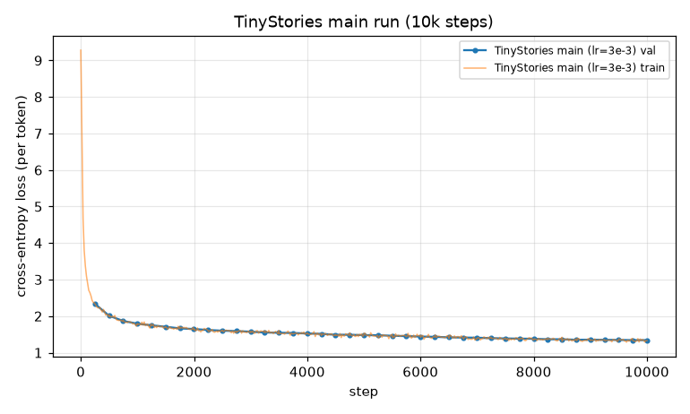
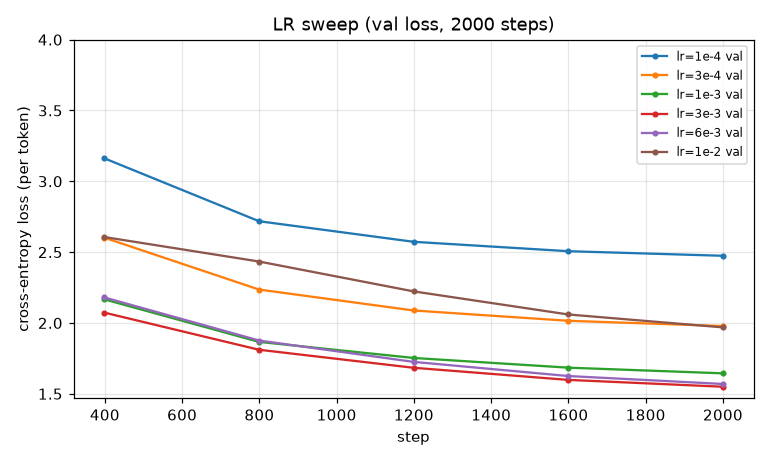
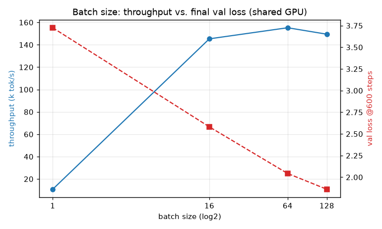
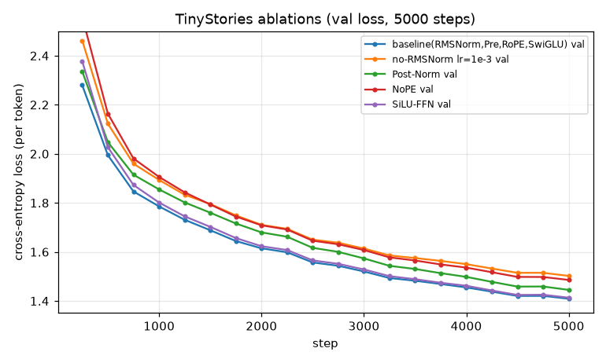
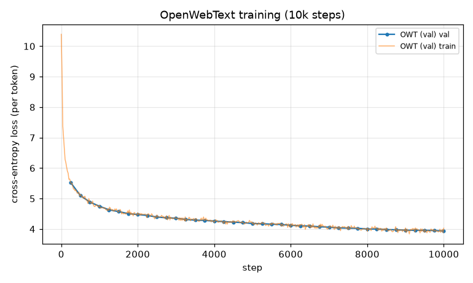
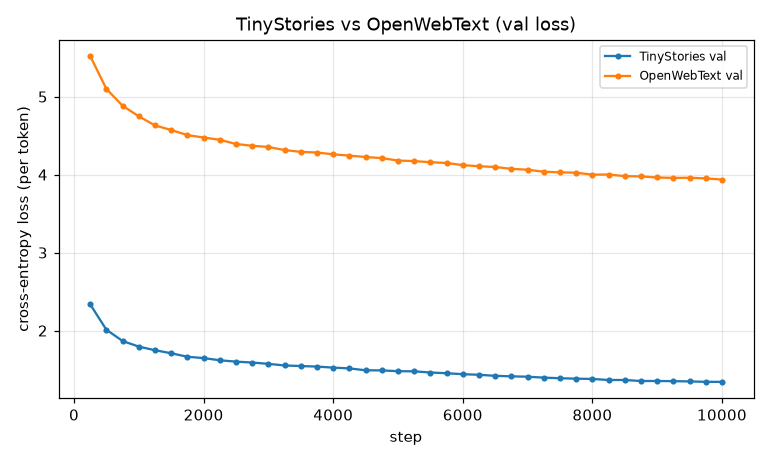

# A1 公开提交：王文煊

> 本文件和同目录代码公开可见。只提交允许公开且已经脱敏的内容；组织内材料放在下方
> 登记的飞书补充文档中，密钥和访问凭据不进入任何提交材料。

> 评分标准与评测方式见 [`assignments/A1/EVALUATION.md`](../../../assignments/A1/EVALUATION.md)；日志格式见 [`assignments/A1/README.md` 的《实验日志格式》](../../../assignments/A1/README.md#实验日志格式)。

## 基本信息

- 作业题面版本：26.0.4
- 完成范围：BPE tokenizer（训练/编码/解码）、Transformer LM 全部模块、cross-entropy / AdamW / cosine schedule / 梯度裁剪、data loader / checkpoint / 训练循环、temperature+top-p 生成器；21 个 adapter 对应测试全部通过；TinyStories 主训练达标（val loss 1.346 ≤ 1.45）、学习率扫（含发散 run）、batch size 扫、四个消融、OpenWebText 训练与文本生成。
- 未完成项：无
- 上游 starter commit：`a158843b20107949f1a8d7df1b05cd33b9166712`
- 本地工作仓库：`../assignment1-basics`（与 `SummerQuest-2026` 同级）
- 计算环境：单机双卡 RTX 4090（与其他任务共享），CUDA 12.4；BPE 预分词用 96 进程 multiprocessing。

---

## 一、书面题

### unicode1（理解 Unicode）

**(a)** `chr(0)` 返回 `'\x00'`，即 Unicode 码点 U+0000 的空字符（NULL）。

**(b)** 它的 `__repr__()` 显示为带转义的 `'\x00'`（可见的转义序列），而 `print()` 出来的“打印表示”是一个不可见的控制字符，屏幕上什么都看不到。

**(c)** 该字符确实存在于字符串里（占 1 个长度、参与拼接），但渲染时不可见：
`"this is a test" + chr(0) + "string"` 的 repr 是 `'this is a test\x00string'`，而 `print` 出来看起来像 `this is a teststring`（中间的 NULL 不显示但仍在字符串中）。

### unicode2（Unicode 编码）

**(a) 为什么优先在 UTF-8 字节上训练 tokenizer？**
UTF-8 的基础词表只有 256 个字节值且是变长编码，对绝大多数文本（尤其 ASCII/英文）产生的字节序列远比 UTF-16/UTF-32 短——后两者把每个码点固定填充为 2 或 4 字节，会产生大量零字节、序列更长也更稀疏。例如 `"hello"` 的 UTF-8 是 5 字节，UTF-16 是 12 字节（含 BOM），UTF-32 是 24 字节。更短更稠密的字节序列让 BPE 更好压缩，256 的词表也天然避免 OOV，且 UTF-8 是自同步的 Web 事实标准。

**(b) 为什么 `decode_utf8_bytes_to_str_wrong` 是错的？**
它把每个字节单独 `decode("utf-8")`，但 UTF-8 里非 ASCII 字符跨 2–4 个字节，续字节（0x80–0xBF）单独解码不是合法字符。示例：`"牛".encode("utf-8") == b'\xe7\x89\x9b'`，对其调用该函数时 `bytes([0xe7]).decode("utf-8")` 直接抛 `UnicodeDecodeError`——任何非 ASCII 字符都会让它出错，正确做法是把所有字节拼起来一次性 `decode`。

**(c) 一个不解码为任何字符的两字节序列：** `b'\xff\xff'`。0xFF 在 UTF-8 中永远不是合法字节（既不是有效前导字节也不是续字节），`b'\xff\xff'.decode("utf-8")` 抛 `UnicodeDecodeError`。（`b'\x80\x80'` 亦可：两个孤立续字节，没有前导字节。）

### AdamW 显存 / FLOPs / 训练时间核算（adamw_accounting）

计算按 float32（每张量 4 字节）。为服务 (d)，先给出本作业架构 GPT-2 XL 前向 FLOPs
（配置 `vocab=50257, context=1024, L=48, d_model=1600, heads=25, d_ff=4288`）。

**参数量与前向 FLOPs（单条长度 T=1024 序列）：**

| 组件 | 表达式 | GPT-2 XL FLOPs | 占比 |
|---|---|---:|---:|
| 注意力 QKVO 投影 | `L·8·T·d²` | 1.007e12 | 28.6% |
| 注意力 QKᵀ + AV | `L·4·T²·d` | 3.221e11 | 9.2% |
| FFN（SwiGLU，3 个矩阵） | `L·6·T·d·d_ff` | 2.023e12 | 57.5% |
| LM head | `2·T·d·vocab` | 1.647e11 | 4.7% |
| **前向合计** | | **3.517e12** | 100% |

参数量 = `vocab·d + L·(4d² + 3·d_ff·d + 2d) + d + vocab·d` = **1.640×10⁹**，
float32 加载需 `4·P` = **6.56 GB**。

**(a) 峰值显存分解（batch=B，序列长 T=context）：**

- 参数：`4·P` 字节
- 梯度：`4·P` 字节
- 优化器状态（AdamW 一阶矩 m + 二阶矩 v）：`2·4·P = 8·P` 字节
- 激活（按题目列举的组件，元素数）：
  每层 `8·B·T·d_model + 2·B·heads·T² + 4·B·T·d_ff`；
  末层 RMSNorm `B·T·d_model`；logits + 交叉熵 `2·B·T·vocab`。
  激活总元素 = `L·(8·B·T·d + 2·B·h·T² + 4·B·T·d_ff) + B·T·d + 2·B·T·vocab`，显存 = `4×` 该值。
- **总计** = `4P + 4P + 8P + 4·(激活元素)` = `16P + 4·(激活元素)`。

**(b) GPT-2 XL 实例化（T=1024）：** 常数项（参数+梯度+优化器）= `16·P` = **26.25 GB**；
每个 batch 元素的激活 = **16.37 GB**。于是
`显存(GB) ≈ 16.37 · batch_size + 26.25`。
80 GB 预算下最大 batch = `(80 − 26.25) / 16.37 ≈ 3.28`，即 **最多 batch_size = 3**。

**(c) 一步 AdamW 的 FLOPs：** AdamW 对每个参数做固定数目的逐元素运算（更新 m≈3、更新 v≈4、两处 bias correction≈2、`√v̂+ε` 与除法及乘 lr≈4、解耦 weight decay≈2），约 **≈14 FLOPs/参数**，因此一步 ≈ `14·P`。对 GPT-2 XL 约 **2.3×10¹⁰ FLOPs**，与一次前向（3.5×10¹² FLOPs）相比可忽略，即 AdamW 更新是 O(P) 的、被矩阵乘完全支配。

**(d) 训练时间：** 反向≈2×前向，故每步训练 FLOPs ≈ `3×前向`。
总 FLOPs = `steps · batch · 3 · F_fwd` = `400000 · 1024 · 3 · 3.517e12` = **4.32×10²¹ FLOPs**。
H100 峰值 495 TFLOP/s、MFU 50% → 有效 247.5 TFLOP/s。
时间 = `4.32e21 / 2.475e14` ≈ **4850 小时 ≈ 202 天**。

> 附（前向 FLOPs 的规模趋势）：模型增大时 FFN 占比升高（GPT-2 small 39.8% → XL 57.5%）、注意力 `T²` 打分/加权项占比下降（13.3% → 9.2%）、LM head 占比明显下降（27.1% → 4.7%）。把 GPT-2 XL 的 context 从 1024 加到 16384，总前向 FLOPs 增到 **38×**，其中 `T²` 注意力项从 9.2% 跃升到 **61.7%** 成为主导——这解释了长上下文为何昂贵。

---

## 二、Tokenizer 实验

### BPE 训练

| 数据集 | 词表 | merges | 训练耗时 | 峰值内存 | 最长 token | 说明 |
|---|---:|---:|---:|---:|---|---|
| TinyStories | 10,000 | 9,743 | 188 s（≈3 min） | < 30 GB | `b' accomplishment'`（15 字节） | 合理：TinyStories 用词简单，最长 token 是一个常见完整英文词（带前导空格）。 |
| OpenWebText | 32,000 | 31,743 | 1315 s（≈22 min） | < 100 GB | 64 字节的重复 mojibake（`b'\xc3\x83\xc3\x82...'` 即 `ÃÂ` 反复） | 也“合理”但方向相反：OWT 是噪声网页文本，最长 token 是一段被双重编码/乱码的重复字节串，说明 32K 词表在噪声语料上会把高频的编码伪影也合并成长 token。 |

- 资源预算：TinyStories ≤ 30 min / 30 GB RAM，OWT ≤ 12 h / 100 GB RAM，均满足。
- **最耗时的部分：预分词（pre-tokenization）**——对 GB 级语料做 GPT-2 正则切分是主要开销，用 `<|endoftext|>` 对齐的文件切块 + 96 进程 multiprocessing 加速；merge 阶段用“增量维护 pair 计数 + 惰性删除最大堆”把选最高频 pair 从每步 O(distinct pairs) 降到 ~O(log H)（这一优化把 OWT 的 merge 阶段从 >40 min 压到几分钟）。
- **TinyStories vs OWT 对比**：OWT 词表更大（32K vs 10K）、覆盖面更广；TinyStories 的 token 几乎都是干净的完整英文词，OWT 则包含大量子词、标点组合乃至乱码长 token，反映两者语料的“干净/受限” vs “嘈杂/开放”的差异。

### compression ratio / throughput（tokenizer_experiments）

各取 10 个文档（用 `<|endoftext|>` 切分），用对应 tokenizer 编码：

| 场景 | compression ratio（bytes/token） |
|---|---:|
| TinyStories 文档 × TinyStories tokenizer | **4.01** |
| OWT 文档 × OWT tokenizer | **4.51** |
| OWT 文档 × TinyStories tokenizer（跨用） | **3.40** |

- **(a)** OWT tokenizer 压缩率（4.51）高于 TinyStories（4.01）：32K 更大词表能把更多子词合并成单 token。
- **(b) 用 TinyStories tokenizer 编码 OWT** 压缩率掉到 3.40——TinyStories 词表只在简单儿童故事上训练、词表小，遇到 OWT 的多样词汇/罕见词/符号时被迫退回更短的子词甚至单字节，token 变多、压缩变差；定性上表现为把 OWT 文本切得更碎。
- **(c) 吞吐 / Pile 估算**：单线程 `encode` 吞吐 ≈ **0.24 MB/s**（≈54k tokens/s）；若单线程处理 Pile 的 825 GB 约需 **≈1014 小时**。实际落盘用并行编码器（按 `<|endoftext|>` 切块 + 多进程），实测 ≈ **8.9 MB/s**（32 进程），对应 Pile 约 26 小时——I/O 与进程数可继续提升。

- **为什么用 uint16 存 token id？** 两个词表都 ≤ 32,000 < 65,536 = 2¹⁶，uint16 恰好覆盖且每个 id 只占 2 字节，比 int32/int64 省 2–4× 磁盘与内存；这是把 train/dev 编码成 NumPy 数组落盘（`np.memmap` 读取）的最紧凑无损选择。
- 编码产物：TinyStories `train` 540.8M tokens、`valid` 5.46M tokens（bytes/token≈4.12）。

---

## 三、TinyStories 训练

**模型/训练配置**（`configs/tinystories_main.json`）：`d_model=512, d_ff=1344, layers=4, heads=16, context=256, RoPE θ=10000, vocab=10000`；`batch=128, steps=10000`（327.68M tokens），AdamW `lr=3e-3`（warmup 200 + cosine 到 3e-4），`weight_decay=0.1, betas=(0.9,0.95), grad_clip=1.0`，bf16 autocast。参数量 **22.7M**。

- **最终 validation loss = 1.346**（best 1.343），**达到 ≤ 1.45 目标**。
- 总训练时间 2309 s（≈38 min，共享 GPU），吞吐 ≈ 142k tokens/s。
- loss 曲线：见 `assets/tinystories_main.png`（train + val，横轴 step）。

### 学习率扫（含发散 run）

搜索策略：以主配置为基线，固定其它超参、只扫 `lr`，每个 2000 步（cosine 在 2000 步收敛到 `0.1·lr`），比较最终 val loss；再单独用无梯度裁剪的高 lr 触发发散，定位“稳定边界”。

| lr | 2000 步最终 val loss | 备注 |
|---|---:|---|
| 1e-4 | 2.475 | 偏小，欠拟合 |
| 3e-4 | 1.981 | |
| 1e-3 | 1.650 | |
| **3e-3** | **1.554** | **最优** |
| 6e-3 | 1.574 | 接近最优、略变差 |
| 1e-2 | 1.971 | 在“稳定边界”上，明显变差 |
| 2e-2 / 5e-2 / 1e-1（关闭裁剪） | 发散 | 见下 |

**发散 run（关闭梯度裁剪，`grad_clip=1e9`，800 步）train loss 轨迹：**

| lr | train loss 轨迹（step:loss） | 判定 |
|---|---|---|
| 6e-3 | 0:9.28 → 500:2.12 → 1999:1.54 | 收敛 |
| 1e-2 | 0:9.28 → 500:2.62 → 1999:1.94 | 勉强收敛、明显变慢 |
| 2e-2 | 0:9.28 → 100:3.75 → **300:3.94（回升）** → 790:3.03 | 不稳定，长期卡在 ~3 |
| 5e-2 | 0:9.28 → 100:4.06 → **399:5.31（持续上升）** → 790:3.54 | **发散**（高 lr 阶段 loss 单调上升） |
| 1e-1 | 0:9.28 → 100:4.52 → **590:5.09（不降反升）** → 790:4.13 | **发散**（始终学不动） |

**分析：** 最优 lr（3e-3）恰好位于发散边界之下。lr 从 6e-3→1e-2 收益已转负；到 2e-2 训练开始震荡、loss 中途回升；5e-2 与 1e-1 在高 lr 阶段 loss **单调上升**（典型发散），只因 cosine 后期把 lr 拉低才部分回落，但始终学不好。之所以没直接 NaN，是因为 AdamW 的逐参数归一化把单步更新幅度限制在 ~lr 量级、外加 bf16——它把“发散”表现为 loss 爆升/不收敛而非溢出。这印证“最佳学习率常在稳定性边缘”：要尽量大以加快收敛，但越过发散点后 loss 反升。开启梯度裁剪能把发散点推向更高 lr（本设置下 1e-2 开裁剪仍能训、关裁剪则更早失稳），提供额外稳定裕度。

### batch size 扫

固定 lr=3e-3、各跑 600 步，考察吞吐（tokens/s）与同步数下的 val loss。GPU 与外部任务共享。

| batch size | 吞吐（k tok/s） | 600 步 val loss |
|---:|---:|---:|
| 1 | 10.8 | 3.726 |
| 16 | 145.3 | 2.581 |
| 64 | 155.2 | 2.043 |
| 128 | 149.5 | 1.861 |
| 256 / 512 | — | OOM（共享卡显存上限） |

**分析：**
- **吞吐**：batch=1 严重浪费 GPU（仅 ~11k tok/s），把 batch 提到 16 后吞吐暴涨到 ~145k tok/s 并在 16→128 基本饱和（~150k tok/s）——小 batch 下 GPU 算力闲置、被 kernel 启动/访存开销支配；到一定 batch 后 GPU 打满，吞吐不再随 batch 提升。
- **同步数下的 loss**：固定 600 步时 batch 越大 loss 越低（1→128：3.73→1.86），因为大 batch 每步看到更多 token、总处理量更大；但这是“看了更多数据”而非“每 token 更高效”。
- **显存上限**：batch=256/512 在本共享卡上 OOM（外部同租户占用大部分显存，本卡仅剩几 GB）——这正是题目所说“加到显存上限”。综合看，**中等偏大的 batch（约 64–128）在本设置下最划算**：既吃满吞吐，又不触及显存墙。

### 四个消融

所有消融与其基线共享 5000 步、相同 schedule，便于直接对比学习曲线（`logs/ablation/`）。基线（Pre-Norm + RMSNorm + RoPE + SwiGLU，lr=3e-3）5000 步 val loss = **1.416**。

| 消融 | 配置 | 5000 步 val loss | 结论 |
|---|---|---:|---|
| 基线 | RMSNorm / Pre / RoPE / SwiGLU, lr 3e-3 | **1.416** | 参照 |
| ① 删除 RMSNorm | norm=none, lr 3e-3 | **发散（NaN@step 131）** | 去掉归一化在最优 lr 直接爆炸 |
| ① 删除 RMSNorm（低 lr） | norm=none, lr 1e-3 | 1.509 | 降 lr 才稳，但仍逊于基线 |
| ② Post-Norm | 归一化放残差后, lr 3e-3 | 1.453 | 略差、初期收敛更慢更抖 |
| ③ NoPE | 去掉 RoPE, lr 3e-3 | 1.493 | 明显变差但不崩，因果模型能部分自推位置 |
| ④ SiLU-FFN | d_ff=2048 无门控, lr 3e-3 | 1.420 | 与 SwiGLU 几乎持平（本规模下门控收益很小） |

**分析：**
- **RMSNorm（① 最关键）**：在最优 lr 3e-3 下删除 RMSNorm，warmup 一结束（step 131，lr 刚升到 3e-3）train loss 立刻变 NaN——归一化对稳定性至关重要。把 lr 降到 1e-3 才能训练，但最终仍差于基线（1.509 vs 1.416），说明归一化不只是“防爆”，还实质提升了可达到的 loss。
- **Post-Norm（②）**：能训但整条曲线更慢更抖、最终略差（1.453 vs 1.416），印证 Pre-Norm 是更稳的“共识”改动——把归一化放进残差分支能让恒等路径畅通、梯度更好传播。
- **NoPE（③）**：去掉位置编码后 val loss 升到 1.493；退化明显但远没崩，符合“带因果掩码的 decoder 能在一定程度上隐式推断位置”的结论——不过显式 RoPE 仍更好。
- **SwiGLU vs SiLU（④）**：参数量对齐（SiLU 用 d_ff=2048 两矩阵 ≈ SwiGLU d_ff=1344 三矩阵）后两者几乎持平（1.420 vs 1.416）。在这个小规模/简单数据上，门控线性单元的收益很小；门控的优势通常在更大规模上才更明显。

---

## 四、OpenWebText 训练

用 **与 TinyStories 相同的架构与训练迭代数**（d_model=512, layers=4, heads=16, context=256, batch=128, 10000 步；仅 vocab 换成 OWT 的 32000）在 OpenWebText 上训练。参数量 45.2M（比 TinyStories 的 22.7M 大，多在 32K 词表的 embedding + lm_head）。配置见 `configs/owt_main.json`。

- **最终 validation loss = 3.944**（best 3.937），总训练时间 4851 s（≈81 min，共享 GPU）。
- loss 曲线：`assets/owt_train.png`；与 TinyStories 的对比：`assets/ts_vs_owt.png`。

**如何解读 OWT 与 TinyStories loss 的差异？** OWT 的 val loss（3.94）**远高于** TinyStories（1.35），但**不能直接比较**，原因有二：
1. **数据难度**：TinyStories 是词汇/句式受限的合成儿童故事，分布简单、可预测；OWT 是开放网页爬取，主题、风格、噪声（乱码、模板、多语言）都多得多，下一 token 本质上更难预测。
2. **tokenizer/词表不同**：per-token 交叉熵依赖分词粒度与词表大小（10K vs 32K），不同 tokenizer 的 loss 数值不可直接对齐——同一 tokenizer 内比较才有意义。
所以正确的读法是：两者各自相对自身基线下降即为学到东西，而非把 3.94 与 1.35 直接比大小。

---

## 五、文本生成与简评

用主 checkpoint（TinyStories，val 1.346）生成，prompt=`"Once upon a time"`，`max_new_tokens=256`：

**temperature=0.8, top-p=0.95：**

> Once upon a time, there was a little girl named Sue. Sue loved to eat rice. One day, she saw a very big bowl of rice on the table. She wanted to eat it all by herself. Sue tried to get the big bowl of rice, but it was too heavy. She called her friend Tom to help her. "Tom, can you help me get the big bowl of rice?" Sue asked. Tom said, "Yes, I can help you." Tom and Sue worked together to get the big bowl of rice. They were very happy. They shared the big bowl of rice with their friends. Everyone loved the yummy rice. Sue and Tom learned that working together can solve problems.

**temperature=0.6, top-p=0.9（更确定）** 与 **temperature=1.0, top-p=1.0（更随机）** 的完整样本见 `logs/tinystories_samples.txt`。

**简评：** 输出相当流畅——有明确人物、对话、完整起承转合和结尾寓意，符合 TinyStories 的文风。影响生成质量的因素（至少两个）：
1. **采样超参**：temperature 越低、top-p 越小，输出越确定、越连贯但更保守；越高越多样但更容易语义漂移。
2. **模型/数据规模与训练量**：22.7M 小模型 + 简单受限语料（TinyStories 词汇/句式简单）使小模型也能学到流畅叙事；validation loss（1.346）越低，一致性越好。
3. **context length（256）**：较长依赖可能超窗口，长文本后半段偶尔重复或跑题。

### OpenWebText 生成样本

用 OWT checkpoint（val 3.944）生成，prompt=`"The government announced"`，temperature=0.7, top-p=0.9：

> The government announced it would introduce a $3.5-billion-a-year grant to landfill operators in the country. The new plan would not include a two-year extension for the Department of Agriculture, which would allow the private sector to finance the construction and maintenance of the economy. The government has said it will take three years to build a new infrastructure and also keep the government in place. The proposal, however, would put the agency in charge of the development of a new infrastructure that would be the key to the development of the new infrastructure. ...（完整样本见 `logs/owt_samples.txt`，另含 "The history of"、"In recent years, scientists" 两段）

**OWT 生成简评（为什么同架构同预算下质量更差？）** OWT 样本**局部语法通顺、词汇丰富**（新闻/学术腔调很像），但**全局语义漂移、缺乏连贯主线**，且常出现重复（如 protein 段反复堆 "protein"）。原因正是上面所说：OWT 的数据分布远比 TinyStories 复杂多样，同一个 22–45M 小模型、同样 327M token 的预算，只够学到“像英文/像新闻”的表层统计规律，学不到长程事实一致性与话题连贯；而 TinyStories 词汇句式高度受限，小模型就能覆盖其分布、产出连贯故事。换句话说，**模型容量与数据复杂度的匹配度**决定了流畅度——TinyStories 匹配得好，OWT 远未饱和。

---

## 复现说明

- 环境与依赖：实现与测试用上游 `../assignment1-basics` 的 `uv`（`uv sync --frozen` + `uv run pytest`，21 个 adapter 全绿）；GPU 训练用与 CUDA 12.4 匹配的独立 torch。个人提交不含 `pyproject.toml`/lock file。
- 数据准备：公开数据 TinyStories 与 OpenWebText 样本（下载命令见上游 README，公开可得）。
- 关键命令（相对 `../assignment1-basics`）：
  - 训 tokenizer：`python scripts/train_tokenizer.py --input data/TinyStoriesV2-GPT4-train.txt --vocab-size 10000 --out artifacts/tinystories_tokenizer.pkl`（OWT 换成 `--input data/owt_train.txt --vocab-size 32000`）
  - 编码数据：`python scripts/encode_dataset_parallel.py --tokenizer artifacts/tinystories_tokenizer.pkl --input data/TinyStoriesV2-GPT4-train.txt --out artifacts/tinystories_train.npy --num-processes 32`
  - 训练：`python scripts/train.py --config configs/tinystories_main.json`（OWT 用 `configs/owt_main.json`）
  - 生成：`python scripts/generate_text.py --ckpt artifacts/ckpts/tinystories_main.pt --tokenizer artifacts/tinystories_tokenizer.pkl --prompt "Once upon a time" --temperature 0.8 --top-p 0.95`
  - 消融/扫描：`scripts/run_lr_sweep.sh`、`scripts/run_batch_sweep.sh`、`scripts/run_ablations.sh`
- 同步命令：`python3 scripts/sync_a1_submission.py --name '王文煊'`
- 配置文件：`submission/configs/tinystories_main.json`、`submission/configs/owt_main.json`

## 代码与脚本

- 真实实现：`submission/cs336_basics/`（`tokenizer.py`、`model.py`、`nn_utils.py`、`optimizer.py`、`data.py`、`generate.py`）
- 测试 adapter：`submission/tests/adapters.py`（仅转发到真实实现，未改公共测试）
- 训练/编码/生成脚本：`submission/scripts/`
- 实现说明：所有核心组件（Linear/Embedding/RMSNorm/SwiGLU/RoPE/attention/MHA/block/LM、cross-entropy、AdamW、cosine schedule、梯度裁剪、data loader、checkpoint、解码器）均 from scratch，仅使用 `nn.Parameter`、模块容器与 `torch.optim.Optimizer` 基类。

## 实验日志

- 日志目录：`logs/`
- 组织：`train_tinystories.jsonl`（主训练逐点 step/wall_clock_sec/train_loss/val_loss/lr）、`lr_sweep/`、`batch_size/`、`ablation/`、`train_owt.jsonl`、各 `*_summary.json`（汇总最终 val loss、总时间、关键配置）、`tinystories_samples.txt`/`owt_samples.txt`（生成样本）。
- 与报告对应：报告中每个实验小节都对应 `logs/` 下同名文件与 `assets/` 下曲线。

## 飞书补充文档

- 链接：https://fudan-nlp.feishu.cn/wiki/B0TSwoHMEiPvkJkoEaTcinnknpc （组织内公开、非互联网公开）

该文档设置为组织内公开，不得开启互联网公开访问，只保存不能公开到 GitHub 但确有
审核必要的最小差量材料。
