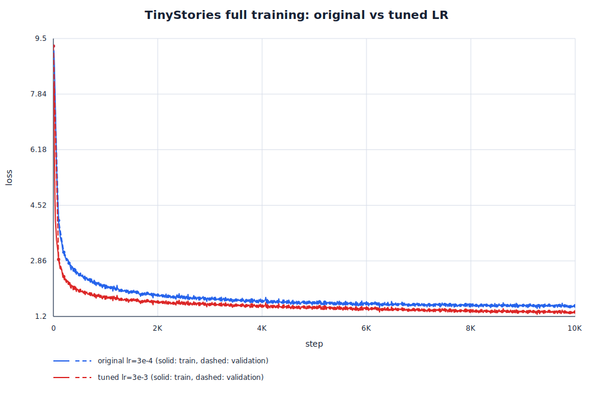
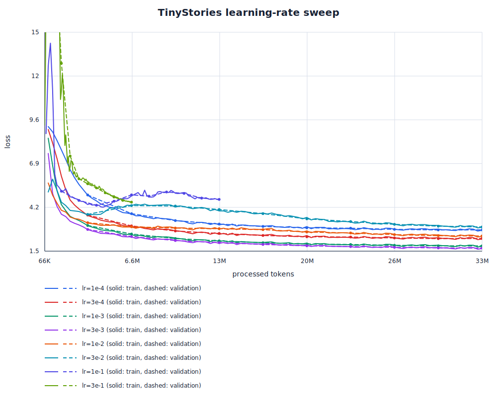
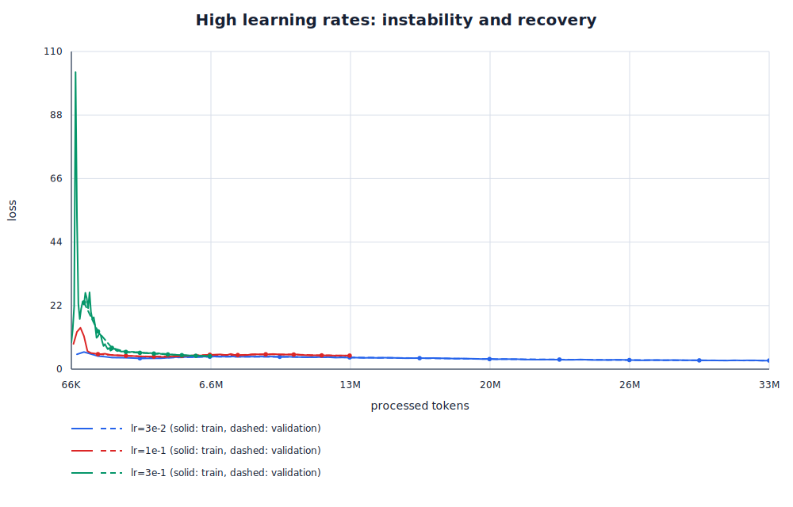
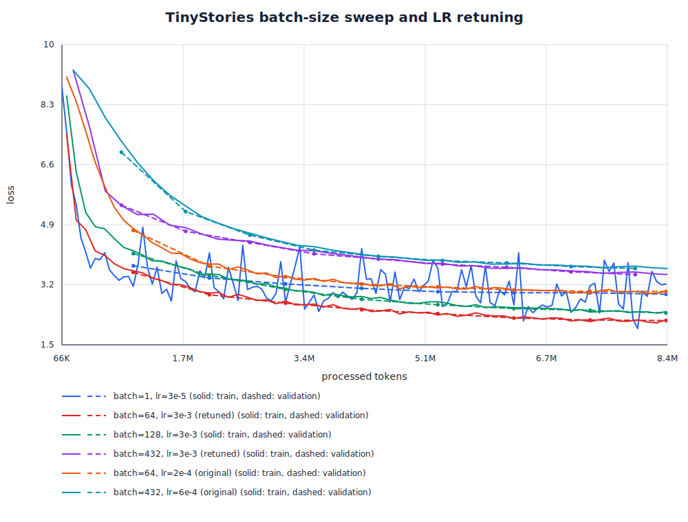
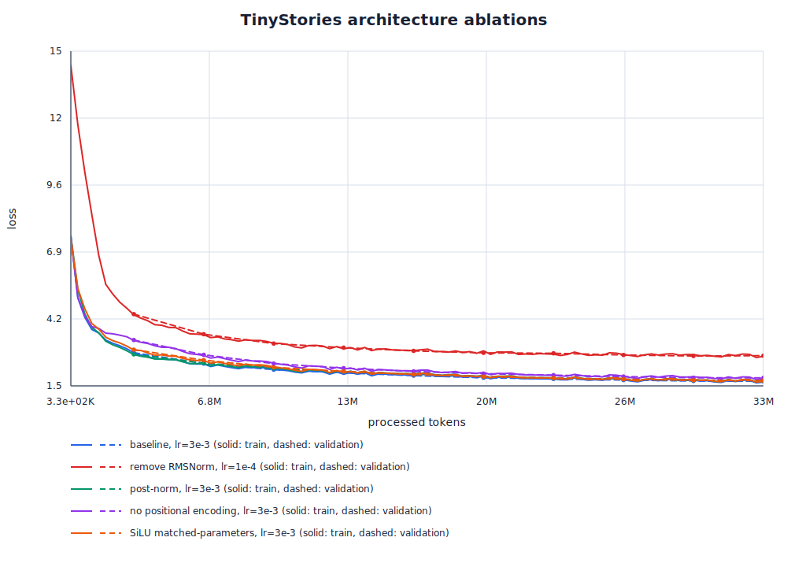
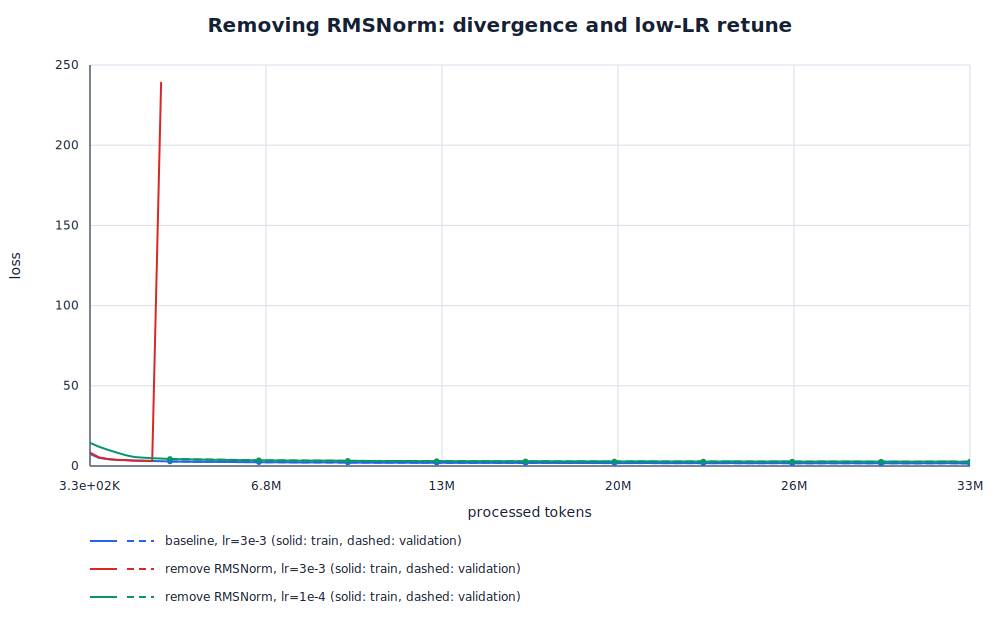
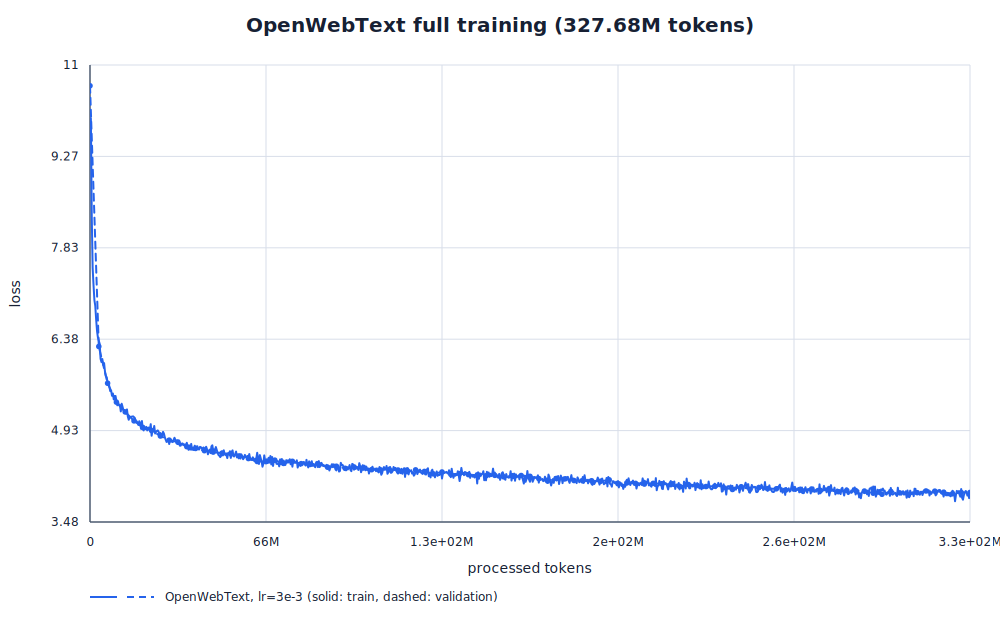
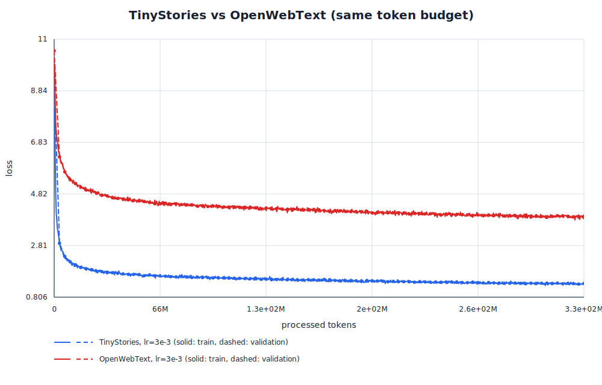

# A1 公开提交：王洋

> 本文件和同目录代码公开可见。这里只记录公开数据、可公开代码和脱敏后的实验结果；
> 密钥、访问凭据、内部资源标识和内部路径不进入本报告或 Git 历史。

## 基本信息

- 实验室题面版本：26.0.4（Stanford 原 PDF 版本：26.0.3）
- 上游 starter commit：`a158843b20107949f1a8d7df1b05cd33b9166712`
- 上游工作仓库：`../assignment1-basics`
- 完成范围：21 个官方 adapter 对应的 tokenizer、Transformer 与训练组件；两套完整语料的
  BPE 训练、benchmark 和数据编码；TinyStories/OWT 完整训练；学习率、batch size 与架构
  消融；文本生成；全部书面题、资源核算、脱敏日志和曲线。
- 验收结果：**47 passed, 1 xpassed**；Ruff lint/format 与 11 个 JSON 配置解析均通过。
- 配置文件：全部保存在 `submission/configs/`，实验日志与图表分别保存在 `logs/` 和 `assets/`。

本报告将数学推导、小型可复现实验、完整语料 CPU 实测和 GPU 训练结果分别标明；所有实验表格
均来自保存的结构化日志，没有用估算值冒充实际运行结果。

## 1. Unicode 与 UTF-8

### 1.1 `unicode1`：理解 Unicode

1. `chr(0)` 返回 Unicode 码点 `U+0000`，即 NUL（null character）。
2. 它的 `repr` 是可见的转义形式 `'\x00'`，而直接打印会写出一个不可见的 NUL，所以屏幕上看起来像空字符串。
3. NUL 可以正常嵌入 Python 字符串，不会像 C 字符串那样截断后续内容；打印带前后文本的
   字符串时，前后文本通常看起来直接相连，但底层输出中仍存在该字符，某些外部工具或 C
   接口可能特殊处理它。

### 1.2 `unicode2`：Unicode 编码

1. UTF-8 与 ASCII 兼容，英文和常见网页文本通常比 UTF-16/UTF-32 更紧凑，并且没有
   UTF-16/UTF-32 常见的字节序问题；它也是互联网文本的主流编码，因此更贴近本作业语料的实际字节分布。
2. `decode_utf8_bytes_to_str_wrong` 错在逐 byte 解码，而 UTF-8 的一个码点可能由多个 byte
   共同编码。例如 `"牛".encode("utf-8") == b'\xe7\x89\x9b'`，单独解码第一个 byte
   `b'\xe7'` 会抛出 `UnicodeDecodeError`；必须先拼接完整 byte sequence，再整体解码。
3. `b'\x80\x80'` 不是合法 UTF-8：两个 byte 都是 continuation byte，却没有合法的 leading byte，
   因而不能解码成任何 Unicode 字符。

这里需要明确区分三层对象：字符是抽象符号，Unicode code point 是整数编号，UTF-8 才是
把 code point 写成 1–4 个 byte 的具体编码。byte-level tokenizer 的基础词表覆盖
`0..255`，因此任意 UTF-8 输入都没有 OOV；BPE 的作用是把高频 byte sequence 合成较长 token，
缩短模型序列。

## 2. Byte-level BPE Tokenizer

### 2.1 训练算法

Tokenizer 训练采用题目规定的 byte-level BPE：

1. 以全部 256 个单 byte token 初始化词表，再加入用户给定的 special tokens。
2. 先把 special token 从普通文本中分离；它们是不可跨越的硬边界，本身不参与 pair count。
3. 对每段普通文本使用 GPT-2 风格正则预分词：

   ```text
   '(?:[sdmt]|ll|ve|re)| ?\p{L}+| ?\p{N}+| ?[^\s\p{L}\p{N}]+|\s+(?!\S)|\s+
   ```

4. 把每个 pre-token 编码成 UTF-8 bytes，只统计 pre-token 内部的相邻 token pair，不能跨
   pre-token 或文档边界。
5. 选择出现次数最多的 pair；频次并列时选字典序更大的 pair，以保证结果确定。
6. 从左到右合并该 pair 的所有非重叠出现，新增合并后的 token，并按创建顺序记录 merge rule。
7. 重复至达到 `vocab_size`，或已没有可合并 pair。

实现上先统计“唯一 pre-token -> 语料频次”，避免保存每次出现；merge 阶段维护 pair count、
pair 到受影响 pre-token 的倒排索引和带惰性失效条目的优先队列。每次 merge 只重算受影响的
pre-token，而不是重新扫描整个语料。预分词可以按 `<|endoftext|>` 边界分块并行，但 merge
存在顺序依赖，不能简单并行；完整语料 profiling 结果见 2.3 节。

### 2.2 编码、流式编码与解码

编码过程与训练保持同一套分段和预分词规则：

```text
输入字符串
-> 左端优先、重叠时优先匹配更长的 special token
-> GPT-2 正则预分词
-> UTF-8 bytes
-> 按训练时 merge rank 从早到晚应用 BPE
-> vocabulary IDs
```

编码时不能在当前输入上重新统计频次，也不能跨 pre-token 边界 merge。`encode_iterable`
逐段消费输入并惰性地产生 ID，避免把大型语料整体载入内存；分块策略必须保证 tokenization
不因任意 chunk boundary 而改变。

解码时先查询每个 ID 对应的 bytes，拼接所有 bytes，再用
`decode("utf-8", errors="replace")` 整体解码。不能逐 token 解码，因为一个 Unicode 字符的
多 byte 编码可能横跨多个 token；非法序列用官方 replacement character `U+FFFD` 替换。

序列化产物包括 vocabulary、按 rank 排序的 merges 和记录 special tokens、校验摘要及训练
统计的 metadata；数据集、tokenizer 大产物和模型权重只留在本地实验目录，不进入公开提交。

### 2.3 Tokenizer 训练实验

两次正式计时都只使用 CPU；RSS 使用 Linux 内核记录的 `VmHWM`，避免 Python 采样线程漏掉
瞬时分配峰值。

| 语料 | vocab / merges | 源文件 | 时间 | peak RSS | 最长 token | 资源限制 |
| --- | ---: | ---: | ---: | ---: | --- | --- |
| TinyStories | 10,000 / 9,743 | 2,227,753,162 bytes | 370.84 s（6.18 min） | 0.662 GB（0.617 GiB） | `" accomplishment"`，15 bytes，ID 7160 | 通过 30 min / 30 GB |
| OpenWebText | 32,000 / 31,743 | 11,920,511,059 bytes | 2,695.26 s（44.92 min） | 10.224 GB（9.521 GiB） | 64-byte mojibake 重复串与 64 个连字符 | 通过 12 h / 100 GB |

TinyStories 中同为 15 bytes 的普通 token 还包括 `" disappointment"` 和
`" responsibility"`，符合儿童故事中高频长词被整体合并的直觉。OWT 最长 token 主要是连续
分隔符、mojibake 和网页模板噪声，而最长自然语言词片段约为 17–19 bytes，例如
`" telecommunications"`；这反映了网页语料的异质性，不是 special token 跨边界 merge。

开发时发现，一次性 `read()` 完整 OWT 会因为 Python Unicode 字符串的内部宽度和临时副本产生
超过 100 GB 的瞬时 RSS，因此最终实现按 `<|endoftext|>` 硬边界流式读取，并用 `bytes` 而不是
`tuple[int, ...]` 保存唯一 pre-token。修改前后 vocab/merges 均逐字节一致。最终代码的独立
cProfile run 与正式 artifact SHA 相同；profiling 本身把时间放大到 664.55 s，其中
`_count_pretokens` 的 self time 为 486.84 s，占 73.25%，说明 GPT-2 正则预分词仍是主要瓶颈。
脱敏后的完整 metadata 与 profile 摘要见
[`tinystories.json`](logs/tokenizer/tinystories.json) 和 [`owt.json`](logs/tokenizer/owt.json)。

### 2.4 压缩率、吞吐与数据编码

压缩率统一定义为：

$$
\text{compression ratio}=\frac{\text{原文 UTF-8 byte 数}}{\text{编码后的 token 数}}
\quad(\text{bytes/token}).
$$

数值越大，表示平均每个 token 覆盖的原始 bytes 越多。这里确定性地取每个 validation corpus 的
前 10 篇完整文档，并让两套 tokenizer 使用完全相同的文本。

| 样本 | TinyStories 10K tokenizer | OWT 32K tokenizer |
| --- | ---: | ---: |
| TinyStories 10 docs（10,908 bytes） | 2,697 tokens；**4.04449 bytes/token** | 2,797 tokens；**3.89989 bytes/token** |
| OWT 10 docs（50,590 bytes） | 14,831 tokens；**3.41110 bytes/token** | 11,211 tokens；**4.51253 bytes/token** |

两套 tokenizer 都在各自域内压缩得更好：TinyStories tokenizer 在儿童故事上略胜，而 OWT
tokenizer 在网页文本上把 token 数减少约 24.4%。TinyStories tokenizer 的较小词表和受限训练
域使它在 OWT 的专名、数字、代码/标点模式及多语言片段上明显退化。

Tokenizer 吞吐定义为处理的 UTF-8 bytes 除以 wall-clock 秒数；将先 warm-up，再对相同输入
重复多次并报告中位数。若实测吞吐为 $r$ bytes/s，则处理 825 GB Pile 的理想串行时间为

$$
t=\frac{825\times10^9}{r}\ \text{seconds}
=\frac{825\times10^9}{3600r}\ \text{hours},
$$

未计磁盘、解压和调度开销。完整 validation 文件、1 MiB chunks、100K-character warm-up、
3 次 measured pass 的结果为：

| Tokenizer / 输入 | 三次耗时（s） | median throughput | 825 GB 理想串行时间 | peak RSS |
| --- | --- | ---: | ---: | ---: |
| TinyStories 10K / TinyStories valid | 5.602, 5.451, 5.422 | 4.128 MB/s | 55.51 h | 0.576 GB |
| OWT 32K / OWT valid | 156.244, 156.471, 155.793 | 1.856 MB/s | 123.47 h | 0.564 GB |

两行使用不同域和不同词表，不能只凭吞吐断言某个实现更高效；OWT 的 32K merge 表以及更复杂、
更长的 pre-token 都增加了编码工作。估算也不含 Pile 的下载、解压、并行调度和输出写盘。

两套词表都不超过 32,000，而 `uint16` 能表示 `0..65,535`，所以能无损保存所有非负 token
ID，并且相较 `int32` 将磁盘占用和内存带宽减半。训练前会验证最大 ID 小于词表大小，并用
与写入一致的 dtype 通过 `np.memmap`/`mmap_mode="r"` 读取。

| 数据产物 | Tokenizer | workers | token 数 | `.npy` 大小 | 时间 |
| --- | --- | ---: | ---: | ---: | ---: |
| TinyStories train | TinyStories 10K | 1 | 541,229,347 | 1,082,458,822 bytes | 913.15 s |
| TinyStories valid | TinyStories 10K | 1 | 5,465,883 | 10,931,894 bytes | 9.37 s |
| OWT train | OWT 32K | 16 | 2,727,241,853 | 5,454,483,834 bytes | 451.50 s |
| OWT valid | OWT 32K | 16 | 66,402,215 | 132,804,558 bytes | 13.79 s |

四个数组均为一维 `uint16`，文件大小等于 `2 * token_count + 128-byte NumPy header`。并行编码
只在注册的 `<|endoftext|>` 起点切分，16-worker 与单进程结果已做 byte-for-byte 一致性验证。
最终 tokenizer 与编码时 tokenizer 的 SHA 完全相同：TinyStories vocab/merges 分别以
`95a84e...bb9702` / `81ba9c...60aac` 结尾，OWT 分别以
`917973...7130a` / `181a47...b90d9` 结尾。

## 3. Transformer LM

### 3.1 架构与张量形状

模型是 decoder-only、causal、pre-norm Transformer：

```text
token IDs (B, T)
-> token embedding (B, T, d_model)
-> L × pre-norm Transformer block
-> final RMSNorm
-> bias-free LM head
-> logits (B, T, vocab_size)
```

模型返回未归一化 logits；训练损失或生成器在模型外部应用 log-softmax/softmax。第 $i$ 个
位置的 logits 预测下一个 token $x_{i+1}$。

每个 block 为

$$
z=x+\operatorname{MHA}(\operatorname{RMSNorm}(x)),
$$

$$
y=z+\operatorname{SwiGLU}(\operatorname{RMSNorm}(z)).
$$

关键模块如下：

- `Linear`：权重形状为 `(d_out, d_in)`，无 bias，计算 $xW^\top$；初始化方差为
  $2/(d_{in}+d_{out})$（即标准差 $\sqrt{2/(d_{in}+d_{out})}$），并截断到 $\pm3\sigma$。
- `Embedding`：参数形状为 `(vocab_size, d_model)`，直接按 token ID 索引；初始化为截断到
  $[-3,3]$ 的 $\mathcal N(0,1)$。
- `RMSNorm`：不减均值，先把输入上转为 float32 计算
  $x/\sqrt{\operatorname{mean}(x^2)+\epsilon}$，乘可学习 gain 后转回原 dtype。
- `SwiGLU`：
  $W_2(\operatorname{SiLU}(W_1x)\odot W_3x)$，其中
  $\operatorname{SiLU}(x)=x\sigma(x)$，$d_{ff}\approx(8/3)d_{model}$ 并取附近的 64 倍数。
- `RoPE`：按相邻维度对 query/key 成对旋转，角频率由 token position 和 $\Theta$ 决定；不旋转
  value，没有可学习参数，sin/cos 可注册为非持久 buffer 并跨 batch/layer 复用。
- `softmax`：沿指定维度先减最大值再指数化，避免大 logits 溢出。
- `scaled dot-product attention`：
  $\operatorname{softmax}(QK^\top/\sqrt{d_k})V$；mask 中 `True` 表示允许信息流，`False`
  位置在 softmax 前置为 $-\infty$。
- causal MHA：$d_k=d_v=d_{model}/h$，下三角 mask 包含主对角线；Q/K/V 的 head 维作为
  batch-like 维度并行计算。

### 3.2 `transformer_accounting`：参数量

以下核算严格采用本作业架构：输入 embedding 与 LM head **不共享**，所有 Linear 无 bias，
每层有四个 attention 投影、三个 SwiGLU 矩阵和两个 RMSNorm，最后还有一个 RMSNorm。
因此参数量为

$$
P=2Vd+L(4d^2+3dd_{ff}+2d)+d.
$$

GPT-2 XL 形状为 $V=50{,}257,L=48,d=1{,}600,d_{ff}=4{,}288$，得到：

| 参数来源 | 数量 |
| --- | ---: |
| 输入 embedding + LM head | 160,822,400 |
| 48 层 attention 投影 | 491,520,000 |
| 48 层 SwiGLU | 987,955,200 |
| 所有 RMSNorm | 155,200 |
| **合计** | **1,640,452,800** |

float32 每参数 4 bytes，只加载参数需要 `6,561,811,200` bytes，即约 **6.562 GB**
（**6.111 GiB**）。这个数字对应 assignment architecture，不应与采用不同 FFN、bias 或权重
共享策略的原版 GPT-2 参数量直接混用。

同一口径下，四种 GPT-2 形状的参数与纯 FP32 权重内存为：

| 形状 | $L/d/d_{ff}$ | 参数量 | FP32 内存（GB / GiB） |
| --- | --- | ---: | ---: |
| Small | 12/768/2,048 | 162,148,608 | 0.649 / 0.604 |
| Medium | 24/1,024/2,752 | 406,539,264 | 1.626 / 1.514 |
| Large | 36/1,280/3,392 | 833,591,040 | 3.334 / 3.105 |
| XL | 48/1,600/4,288 | 1,640,452,800 | 6.562 / 6.111 |

### 3.3 `transformer_accounting`：forward FLOPs

令 batch size 为 1、输入长度为 $T$。只计题目要求的矩阵乘法，并用
$(m,n)@(n,p)=2mnp$ FLOPs：

| 操作 | 每层 FLOPs |
| --- | ---: |
| Q/K/V 三个投影 | $6Td^2$ |
| attention score：$QK^\top$ | $2T^2d$ |
| attention probability 乘 $V$ | $2T^2d$ |
| attention output projection | $2Td^2$ |
| SwiGLU 的 $W_1,W_3,W_2$ | $6Tdd_{ff}$ |
| 最终 LM head（模型一次） | $2TdV$ |

所以

$$
F_{fwd}=L(8Td^2+4T^2d+6Tdd_{ff})+2TdV.
$$

对 GPT-2 XL、$T=1{,}024$：QKV 投影为 `754,974,720,000` FLOPs，attention output
投影为 `251,658,240,000`，两次 token-token attention 矩阵乘合计
`322,122,547,200`，SwiGLU 为 `2,023,332,249,600`，LM head 为
`164,682,137,600`；总计 **3,516,769,894,400 FLOPs（3.517 TFLOPs）**。其中 SwiGLU
占 57.53%，是该配置的最大项。

对 small/medium/large 也采用本作业的 $d_{ff}\approx(8/3)d$ 最近 64 倍数：2,048、2,752、
3,392。百分比以每行总 forward FLOPs 为分母。

| 模型 | $L/d/d_{ff}$ | 总量 | QKV | O proj | $QK^\top+PV$ | FFN | Head |
| --- | --- | ---: | ---: | ---: | ---: | ---: | ---: |
| Small | 12/768/2048 | .292T | 14.91% | 4.97% | 13.25% | 39.76% | 27.10% |
| Medium | 24/1024/2752 | .830T | 18.62% | 6.21% | 12.42% | 50.05% | 12.70% |
| Large | 36/1280/3392 | 1.769T | 20.49% | 6.83% | 10.93% | 54.30% | 7.45% |
| XL | 48/1600/4288 | 3.517T | 21.47% | 7.16% | 9.16% | 57.53% | 4.68% |

在固定 $T=1{,}024$ 下，模型变宽/变深后，近似按 $Ld^2T$ 增长的 SwiGLU 和投影占比上升；
只出现一次的 LM head 占比快速下降，而按 $LdT^2$ 增长的 attention token-token matmul 相对
占比也下降。

把 XL context 从 1,024 增到 16,384 后，线性于 $T$ 的投影、FFN 和 LM head 放大 16 倍，
二次于 $T$ 的 attention matmul 放大 256 倍。总 forward 计算从 3.517 TFLOPs 增到
**133.578 TFLOPs（37.98 倍）**；此时 attention token-token matmul 占 **61.73%**，SwiGLU
占 24.24%，attention projections 合计占 12.06%，LM head 占 1.97%。长上下文因此会让
$T^2$ attention 成为主要计算与内存瓶颈。

## 4. 训练组件

### 4.1 Cross-entropy 与 perplexity

对 logits $o$ 和正确类别 $y$，不用先构造容易溢出的普通 softmax，而是计算

$$
\ell=\log\sum_j\exp(o_j-m)-(o_y-m),\qquad m=\max_j o_j.
$$

最大值平移保证指数输入不大于 0，并在代数上消去 $m$。实现支持任意前置 batch-like 维度，
最终对所有位置取平均。Perplexity 为 $\exp(\operatorname{mean\ loss})$；但不同 tokenizer、
语料或切分产生的 per-token loss/PPL 不能直接作公平比较。

### 4.2 `learning_rate_tuning`：toy SGD

按题面给出的 `10 x 10` 参数、衰减 SGD 和 10 次迭代运行，固定 `torch.manual_seed(0)`。
初始 loss 均为 26.2714：

| 初始 learning rate | 第 10 次 forward 的 loss | 行为 |
| ---: | ---: | --- |
| 1 | 21.7399 | 缓慢下降（作为对照） |
| 10 | 3.53075 | 比 `lr=1` 快得多且稳定下降 |
| 100 | $2.456\times10^{-23}$ | 在该简单二次目标上极快收敛；首步 loss 不变，之后迅速接近 0 |
| 1,000 | $2.44\times10^{18}$ | 明显发散，loss 每步快速放大 |

这里 $L=\operatorname{mean}(w^2)$，梯度为 $2w/100$，所以每步只是按
$1-2\alpha/(100\sqrt{t+1})$ 缩放参数；这也解释了 `lr=100` 在特定步恰好把缩放因子推到 0。
该 toy 结论不能直接当作 Transformer 的最佳 learning rate。完整 10 次 forward trajectory 见
[`toy_sgd.json`](logs/theory/toy_sgd.json)。

### 4.3 AdamW

对每个参数维护一阶矩 $m$、二阶矩 $v$ 和 step $t$：

$$
m_t=\beta_1m_{t-1}+(1-\beta_1)g_t,
$$

$$
v_t=\beta_2v_{t-1}+(1-\beta_2)g_t^2,
$$

$$
\alpha_t=\alpha\frac{\sqrt{1-\beta_2^t}}{1-\beta_1^t},
$$

$$
\theta\leftarrow\theta-\alpha\lambda\theta,\qquad
\theta\leftarrow\theta-\alpha_t\frac{m_t}{\sqrt{v_t}+\epsilon}.
$$

这里直接采用题面 Algorithm 1 的“校正 learning rate + 未校正 moments”写法；由于
$\epsilon$ 位于 $\sqrt{v_t}$ 之后，它不应在不调整 $\epsilon$ 的情况下被改写成看似完全等价的
$\hat m_t/(\sqrt{\hat v_t}+\epsilon)$ 形式。

weight decay 与梯度/moment update 解耦，不能简单把 $\lambda\theta$ 加到梯度中冒充 AdamW。
checkpoint 必须同时保存 model state、optimizer state 和 iteration，才能恢复 moment 与 scheduler
进度。

### 4.4 `adamw_accounting`：内存

令 $B,T,V,L,d,h,d_{ff}$ 分别表示 batch、context、vocab、层数、hidden size、head 数和 FFN
宽度。参数量仍为

$$
P=2Vd+L(4d^2+3dd_{ff}+2d)+d.
$$

题目要求只对列出的算子输出做简化 activation accounting。每层计入两个 RMSNorm、Q/K/V、
两个 $BhT^2$ attention 矩阵、weighted value、attention output、FFN 的三个线性输出、SiLU
输出和门控乘积；最后计 final RMSNorm、LM logits 和 cross-entropy 的 vocabulary-sized
中间量。由此 activation 元素数为

$$
A=B\left[L(8Td+4Td_{ff}+2hT^2)+Td+2TV\right].
$$

取题目简化的 $d_{ff}=8d/3$：

$$
P=2Vd+L(12d^2+2d)+d,
$$

$$
A=B\left[L\left(\frac{56}{3}Td+2hT^2\right)+Td+2TV\right].
$$

全部 tensor 为 float32 时：

| 类别 | 内存 |
| --- | ---: |
| 参数 | $4P$ bytes |
| activations | $4A$ bytes |
| 梯度 | $4P$ bytes |
| AdamW state（$m,v$） | $8P$ bytes |
| **合计** | **$16P+4A$ bytes** |

step 标量和少量临时标量相对 $P,A$ 可忽略。这个结果是按题目列项得到的可复核简化上界；实际
峰值还受 autograd 保存策略、tensor 生命周期、fused kernel、activation checkpointing 和
allocator 影响。

对可实际实例化的 GPT-2 XL assignment 配置（$T=1{,}024,V=50{,}257,h=25,
d_{ff}=4{,}288$），有
$P=1{,}640{,}452{,}800$，每增加一个 batch element 的 activation 为
`16.37339136 GB`，参数、梯度和 optimizer state 的固定项为 `26.2472448 GB`：

$$
M(B)=16.37339136B+26.2472448\quad\text{GB}.
$$

因此 80 GB 中最大整数 batch size 为 **3**。若严格用 $d_{ff}=8d/3$ 的代数近似，则为
$M(B)=16.356614144B+26.1686016$ GB，最大 batch size 仍为 **3**；用 80 GiB 解释容量也
不改变该整数结论。

### 4.5 `adamw_accounting`：optimizer FLOPs 与训练时间

按每个参数元素计，decoupled decay 约 2 FLOPs，一阶矩更新 3 FLOPs，二阶矩更新 4 FLOPs，
含 `sqrt`、加 epsilon、除法、缩放和减法的参数更新约 5 FLOPs，因此一次 AdamW step 约为

$$
F_{AdamW}\approx14P
$$

外加按参数张量数增长的 bias-correction 标量运算；相对参数元素总数 $P$ 可以忽略。相较模型
forward/backward，这一项通常很小。

XL 的单序列 forward 矩阵乘法为 $F_{fwd}=3.5167698944\times10^{12}$ FLOPs。题目假设
backward 是 forward 的 2 倍，因此 400K steps、batch size 1,024 的模型训练计算量为

$$
400{,}000\left(3\times1{,}024\times F_{fwd}+14P\right)
\approx4.3214\times10^{21}\ \text{FLOPs}.
$$

H100 理论峰值 495 TFLOP/s、MFU 为 50% 时，有效吞吐为 247.5 TFLOP/s，理想训练时间为
约 **17,460,267 秒 = 4,850 小时 = 202.1 天**。这里的 batch 1,024 是题目指定的纯算力
假设，按前述简化 float32 内存核算无法在单张 80 GB GPU 上直接容纳；这个估计也忽略数据
加载、验证、通信、checkpoint 和非矩阵算子，因此不是 wall-clock 实测承诺。

### 4.6 Scheduler、梯度裁剪、数据和训练循环

warmup + cosine schedule 为

$$
\alpha_t=
\begin{cases}
\frac{t}{T_w}\alpha_{max}, & t<T_w,\\
\alpha_{min}+\frac12\left[1+\cos\left(\pi\frac{t-T_w}{T_c-T_w}\right)\right]
(\alpha_{max}-\alpha_{min}), & T_w\le t\le T_c,\\
\alpha_{min}, & t>T_c.
\end{cases}
$$

全局梯度裁剪先把所有有梯度参数视为一个向量，计算
$\|g\|_2=\sqrt{\sum_i\|g_i\|_2^2}$；若超过阈值 $M$，所有梯度统一乘
$M/(\|g\|_2+10^{-6})$，而不是逐层分别裁剪。

数据 loader 从一维 token stream 随机抽起点 $s$，返回
`x[s:s+T]` 和 `x[s+1:s+T+1]`。大数组用只读 memmap，当前 batch 才物化为 `torch.long`
并搬到目标 device。完整训练循环顺序为：按当前 step 设置 LR、采样 batch、清梯度、forward、
cross-entropy、backward、global clipping、AdamW step、日志/验证/checkpoint。验证使用
`no_grad`，日志至少记录配置、seed、processed tokens、gradient step、wall-clock、train loss、
validation loss、learning rate、gradient norm 和 run 状态。

## 5. 自回归生成

给定 prompt，先用同一 tokenizer 编码；每一步仅取模型最后位置 logits，除以 temperature
$\tau>0$ 后做稳定 softmax。top-p sampling 将概率从高到低排序，保留累计概率首次达到 $p$
的最小集合，屏蔽其余 token，重新归一化并采样；它与固定保留 $k$ 个候选的 top-k 不同。

采样 token 追加到上下文，遇到 `<|endoftext|>` 或达到 `max_new_tokens` 时停止。若当前序列
超过训练 context，只保留模型可接受的最近窗口。固定随机 seed 便于复现，但仍会同时报告
temperature 和 top-p，因为它们显著影响可重复性和质量：temperature 太低易重复和模式坍缩，
太高易产生语法/事实噪声；top-p 太小会过度保守，太大则重新引入长尾低质量 token。训练数据
质量、tokenizer 域匹配、模型容量、训练 token 数和 checkpoint 的 validation loss 也会影响输出。

## 6. 训练实验与结果

### 6.1 TinyStories baseline

| 参数 | 值 |
| --- | ---: |
| vocab size | 10,000 |
| context length | 256 |
| `d_model` | 512 |
| `d_ff` | 1,344 |
| layers / heads | 4 / 16 |
| RoPE $\Theta$ | 10,000 |
| 参数量 | 22,696,448 |
| precision | BF16 autocast，TF32 matmul |
| micro / accumulation / effective batch | 32 / 4 / 128 |
| AdamW | $\beta=(0.9,0.95)$，$\epsilon=10^{-8}$，weight decay 0.1 |
| scheduler | warmup 100；cosine 10,000；min LR = 0.1 × max LR |
| gradient clipping | global norm 1.0 |
| seed / evaluation | 1337；每 100 steps，20 × batch 32 |
| steps / processed tokens | 10,000 / 327.68M |
| validation loss 目标 | $\le 1.45$ |

原始 `3e-4` baseline 跑满预算但没有达标；短 LR sweep 选出的 `3e-3` 在完全相同的架构、seed、
batch 和 token budget 下重跑后显著改善：

| Full run | final train | best val（step） | final val / PPL | wall time | median throughput |
| --- | ---: | ---: | ---: | ---: | ---: |
| LR `3e-4` | 1.47086 | 1.49064（9,900） | 1.52294 / 4.586 | 2,577.20 s | 129.63K tok/s |
| LR `3e-3` | **1.29517** | **1.31487（9,900）** | **1.33957 / 3.817** | 2,593.93 s | 129.61K tok/s |

调优 run 在 step 5,400 首次记录到 1.43798，最终仍保持在目标以下；peak CUDA allocated / reserved
为 3.964 / 4.113 GB。结果说明原 baseline 的主要问题是优化速度而非模型容量或吞吐。完整脱敏
日志见 [`tinystories_full.json`](logs/lm/tinystories_full.json)。



### 6.2 Learning-rate sweep

稳定候选都使用 seed 1337、effective batch 128、1,000 steps / 32.768M tokens；高 LR 在已能
判定行为后缩短，以避免无意义计算。

| max LR | Steps / tokens | final train | best / final val | wall time | 结论 |
| ---: | ---: | ---: | ---: | ---: | --- |
| `1e-4` | 1,000 / 32.768M | 2.78909 | 2.80698 / 2.81046 | 257.41 s | 稳定但过慢 |
| `3e-4` | 1,000 / 32.768M | 2.25092 | 2.27310 / 2.28197 | 257.61 s | 稳定 |
| `1e-3` | 1,000 / 32.768M | 1.79843 | 1.82391 / 1.82391 | 256.93 s | 快速收敛 |
| `3e-3` | 1,000 / 32.768M | **1.65730** | **1.68572 / 1.68572** | 257.39 s | 最佳稳定 run |
| `1e-2` | 1,000 / 32.768M | 2.41700 | 2.43450 / 2.43450 | 256.10 s | 明显退化 |
| `3e-2` | 1,000 / 32.768M | 2.97308 | 2.99047 / 2.99047 | 256.89 s | 有限但未有效收敛 |
| `1e-1` | 400 / 13.107M | 4.67265 | 4.33140 / 4.69136 | 104.74 s | 高度不稳定 |
| `3e-1` | 200 / 6.554M | 4.51595 | 4.52302 / 4.52302 | 53.87 s | 明确发散后因 LR 衰减而回落 |

`3e-1` 在 step 4/6/8 的 train loss 为 13.94/21.78/102.84，step 20 validation 为 23.12，
都高于随机初始化附近的 9.21；这比“最终 loss 较差”更明确地构成发散证据。搜索先按对数尺度从
`1e-4` 扩到 `1e-1`，发现后者仍为有限值后继续到 `3e-1`。最佳 `3e-3` 比明确发散点低两个
数量级，也处在 `1e-2` 开始退化之前，因此用它启动完整 10K 调优 run。





全部 LR config、summary 和 loss events 见 [`lr_sweep.json`](logs/lm/lr_sweep.json)。

### 6.3 Batch-size sweep

各 run 固定约 8.39M processed tokens，而不是固定 step；吞吐取 train 日志中位数，显存为
CUDA peak allocated。64 和 432 还各补了一次 `3e-3` retune，下表报告较优结果。

| Batch | LR | Steps / tokens | 吞吐 | peak 显存 | final val |
| ---: | ---: | ---: | ---: | ---: | ---: |
| 1 | `3e-5` | 32,768 / 8,388,608 | 13.63K tok/s | 1.527 GB | 2.93191 |
| 64 | `3e-3` | 512 / 8,388,608 | **122.81K tok/s** | 7.421 GB | **2.18708** |
| 128 | `3e-3` | 256 / 8,388,608 | 116.21K tok/s | 14.518 GB | 2.39856 |
| 432 | `3e-3` | 76 / 8,404,992 | 116.23K tok/s | 48.225 GB | 3.48929 |

单样本 batch 的 kernel/launch 开销使吞吐只有 batch 64 的约 11%；batch 64 已基本饱和本模型的
矩阵吞吐，继续增大没有得到速度收益。固定 token budget 时，大 batch 的 optimizer update 数
更少：432 只有 76 次更新，即便重新调 LR，loss 仍明显较差。64 的原始 `2e-4` run val 为
3.01114，调到 `3e-3` 后降到 2.18708，也说明 batch 比较必须允许重新调 LR。独立 one-step
显存 probe 中 batch 432 成功，而 440、448、512 都在首次 loss forward 阶段触发
`torch.cuda.OutOfMemoryError`，因此当前实现和设备下的上限记为 432。



主比较与 retune 证据见 [`batch_sweep.json`](logs/lm/batch_sweep.json)。

### 6.4 架构消融

所有完整消融都与 `3e-3` pre-norm/RoPE/SwiGLU baseline 使用同一 seed、batch 和
32.768M-token budget；baseline final val 为 1.68572。

| 实验 | 控制 | 结果 |
| --- | --- | --- |
| Remove RMSNorm, LR `3e-3` | 删除 block 和 final RMSNorm | step 90 loss 238.96、gradient norm $1.73\times10^6$；step 92 出现 NaN |
| Remove RMSNorm, LR `1e-4` | 只降低 LR | 稳定完成；best/final val 2.70611 / 2.71784 |
| Post-Norm | $z=N(x+\mathrm{MHA}(x));\ y=N(z+\mathrm{FFN}(z))$ | final val 1.71842（比 baseline +0.03270） |
| NoPE | Q/K 不应用 RoPE | final val 1.82375（+0.13803），但吞吐提高约 3.5% |
| SiLU FFN | `d_ff=2016`，匹配 FFN 参数 | final val 1.71615（+0.03042） |

baseline SwiGLU 的 FFN 参数为
$3\times512\times1{,}344=2{,}064{,}384$；SiLU baseline 用 `d_ff=2016` 时为
$2\times512\times2{,}016=2{,}064{,}384$，因此 FFN 参数量精确相同，更好地隔离 gating 的影响。
结果表明 RMSNorm 首先影响的是训练稳定性；降低 LR 可以避免数值发散，但同预算下收敛远慢于
有 norm 的模型。Post-Norm 和无 gating 的 SiLU 都只小幅落后，NoPE 的差距更大，说明在这个
短序列、小模型预算中，RoPE 提供的位置归纳偏置仍然有可测收益。





六个对照 run 的 config、summary 与 loss events 见 [`ablations.json`](logs/lm/ablations.json)。

### 6.5 OpenWebText

OWT 保持 context、层数、宽度、heads、SwiGLU、RoPE、effective batch、训练 steps 和 LR 设置与
TinyStories tuned run 相同。32K 词表使 embedding 与 LM head 更大，所以总参数量由 22.70M 增到
45.22M；两者 token budget 相同，但每步 logits 计算量并不相同。

| Run | vocab / params | Steps / tokens | final train | best val（step） | final val / PPL | wall time | median / overall throughput |
| --- | ---: | ---: | ---: | ---: | ---: | ---: | ---: |
| TinyStories tuned | 10K / 22.696M | 10,000 / 327.68M | **1.29517** | **1.31487（9,900）** | **1.33957 / 3.817** | 2,593.93 s | 129.61K / 126.33K tok/s |
| OWT baseline | 32K / 45.224M | 10,000 / 327.68M | 3.89791 | 3.91366（9,300） | 3.95144 / 52.010 | 4,079.46 s | 93.47K / 80.32K tok/s |

OWT peak CUDA allocated / reserved 为 6.870 / 6.944 GB，高于 TinyStories 的 3.964 / 4.113 GB，
主要来自更大的 embedding、LM head 和 logits。OWT 在 step 6,200–6,440 遇到一次数据读取抖动，
但始终是单一连续进程、没有 resume，loss 和 token accounting 也保持单调；该停顿完整计入 wall
time 和 overall throughput，因此中位吞吐更接近稳定计算速度。

两个 tokenizer 和 validation 分布不同，不能把 nats/token 或 perplexity 当成完全同尺度指标。
用各自完整 validation 的原始 UTF-8 bytes/token 做近似归一化：

| Run | full-valid bytes/token | final nats/token | 近似 bits/source byte |
| --- | ---: | ---: | ---: |
| TinyStories tuned | 4.11692 | 1.33957 | **0.46943** |
| OWT baseline | 4.36731 | 3.95144 | **1.30532** |

即使按 source byte 归一化，OWT 仍约为 TinyStories 的 2.78 倍，说明网页语料的主题、文体、专名、
事实关系和噪声对这个 4-layer 小模型明显更难，而差异不能由 OWT tokenizer 较高的压缩率解释。
完整日志见 [`owt_full.json`](logs/lm/owt_full.json)。





### 6.6 生成样例

TinyStories 和 OWT 都设置 `max_new_tokens=256`；若更早生成 `<|endoftext|>`，按题意合法停止。
每个样例记录 checkpoint、prompt、seed、temperature、top-p 和实际 token 数。

TinyStories：step 10,000 tuned checkpoint，prompt=`Once upon a time`（4 tokens），seed=1337，
temperature=0.7，top-p=0.9；生成 170 new tokens 后遇到 EOT：

```text
Once upon a time, there was a little girl named Amy. She had a toy that she loved very much. It was a small, round ball. The ball was her favorite toy. She played with it every day.
One day, Amy's friend Tom came to play. Tom saw the ball and wanted to play with it too. Amy said, "No, Tom! This is my ball. I will give it back." Tom was sad and said, "But I want to play with it too." Amy thought for a moment and then said, "Okay, Tom. We can share the ball."
Amy and Tom played with the ball together. They had so much fun. Amy learned that sharing can be fun. From that day on, Amy and Tom always shared their toys and played together. They were happy and never fought again.
<|endoftext|>
```

样例有清楚的角色、物品、冲突、解决和分享主题，跨段因果关系完整，并能主动生成 EOT。主要
瑕疵是 `I will give it back` 与“球本来属于 Amy”的设定略冲突，而且 `ball/share` 模板化重复。
较低 temperature 与 top-p 让采样集中于高概率故事模板，提升了语法和闭环；TinyStories 域匹配、
327.68M 训练 tokens 和 1.34 左右的 validation loss 提供了基本叙事能力。另一方面，22.7M 参数、
256 context 和单一儿童故事分布也使输出更公式化，难以稳定处理细微指代。完整文本与 metadata 见
[`tinystories.json`](logs/generation/tinystories.json)。

OWT：step 10,000 checkpoint，prompt=`In a recent report,`（5 tokens），seed=4096，
temperature=0.8，top-p=0.95；生成到 256-new-token 上限，未遇到 EOT：

```text
In a recent report, there was no evidence of a possible connection between the events and these events, with a study in the field asking whether the real events had occurred. There was no evidence for this in the case, but there was a picture of a person in that field indicating that a person was not involved in the event of a possible involvement in the events.

Streams in the groups were taken from the backgrounds of the deceased, but a report was published in the Journal of Preventive Medicine. After the discovery of the events of the event, the scientists collected data and analyzed the DNA of individuals at the annual events on the Alteran Archubanks on the Alteran Peninsula. After the sample was taken to the National Museum, the scientists then came to the conclusion that the event was not a missed opportunity.

The discovery of DNA samples from the Alteran Archubanks identified in the excavation of the Alteran Archubanks, in response to the “The Alteran Archubanks” task conducted by the National Museum of Natural History from the Southern region of North America. It was used to determine how genetic signatures could be used to understand the gathering.

In response to the ongoing events, the FBI researchers of the Alteran Arch
```

样例能跨多个段落维持科普新闻的表面语域，也没有把引语或立场归到可识别个人；但 `events`、
`evidence` 和虚构短语 `Alteran Archubanks` 高度重复，科学因果和机构关系不可信，最后一句还因
达到 token 上限而截断。它只能作为模型生成样本，不能当成事实陈述。与 TinyStories 的闭环故事
相比，OWT 输出能模仿更多网页/新闻形式，却更难维持实体、事实关系和篇章推进，这与更高的
validation loss 和 1.305 bits/source byte 一致。

公开前共检查 3 个固定 seed 候选：一份因混合真实公众人物与虚构政治陈述而不选，另一份虽然
主动生成 EOT，但围绕真实地点、警察机构、日期和 name-like entity 拼接不连贯事件而不选。入选
文本未发现邮箱、URL、电话、账号标识或可识别个人；对 `Alteran Archubanks` 做精确语料搜索也
未命中，但这只是定向检查而非穷尽去重。完整 metadata、筛选理由与质量标注见
[`owt.json`](logs/generation/owt.json)。

## 7. 复现说明

### 7.1 环境与依赖

依赖完全由上游固定的 `pyproject.toml` 和 `uv.lock` 管理，个人提交不新增 requirements 或
lock file：

- 官方测试与 CPU tokenizer 实验：Python 3.13.7、PyTorch 2.11.0、NumPy 2.4.4、
  `regex` 2026.3.32。
- GPU 实验：Python 3.12.3、PyTorch 2.7.1 + CUDA 12.8，使用两张 48 GB RTX 4090，
  模型训练精度为 BF16，并启用 TF32 matmul。

锁文件中的 CUDA 13.0 wheel 与实验 GPU 环境的驱动不兼容，因此代码正确性始终在锁定环境中
验收，而 GPU run 使用驱动兼容的系统 PyTorch；两套环境运行同一份源码和公开配置。这里不记录
内部主机名、账号或路径。

```bash
cd ../assignment1-basics
uv sync --frozen
uv run pytest
```

也可按模块迭代：

```bash
uv run pytest -k 'train_bpe or tokenizer'
uv run pytest -k 'linear or embedding or rmsnorm or swiglu or rope'
uv run pytest -k 'attention or transformer'
uv run pytest -k 'cross_entropy or adamw or gradient_clipping or checkpoint or get_batch'
```

2026-07-12 的完整验收结果为 **47 passed, 1 xpassed**；`ruff check .` 和
`ruff format --check .` 均通过，全部 11 个 JSON config 也通过标准库 `json.tool` 解析。脱敏的
软件版本和验收摘要见 [`environment.json`](logs/environment.json)。

### 7.2 公开数据准备

```bash
mkdir -p data
cd data
wget https://huggingface.co/datasets/roneneldan/TinyStories/resolve/main/TinyStoriesV2-GPT4-train.txt
wget https://huggingface.co/datasets/roneneldan/TinyStories/resolve/main/TinyStoriesV2-GPT4-valid.txt
wget https://huggingface.co/datasets/stanford-cs336/owt-sample/resolve/main/owt_train.txt.gz
gunzip owt_train.txt.gz
wget https://huggingface.co/datasets/stanford-cs336/owt-sample/resolve/main/owt_valid.txt.gz
gunzip owt_valid.txt.gz
cd ..
```

### 7.3 Tokenizer 训练、benchmark 与编码

```bash
uv run python scripts/train_tokenizer.py \
  --input data/TinyStoriesV2-GPT4-train.txt \
  --output-dir artifacts/tokenizers/tinystories-10k \
  --vocab-size 10000 \
  --special-token '<|endoftext|>'

uv run python scripts/train_tokenizer.py \
  --input data/owt_train.txt \
  --output-dir artifacts/tokenizers/owt-32k \
  --vocab-size 32000 \
  --special-token '<|endoftext|>'

# 独立 profiling run；不用其 wall time 代替上面的正式计时
uv run python scripts/train_tokenizer.py \
  --input data/TinyStoriesV2-GPT4-train.txt \
  --output-dir artifacts/tokenizers/tinystories-10k-profiled \
  --vocab-size 10000 \
  --special-token '<|endoftext|>' \
  --profile artifacts/profiles/tinystories-10k-final.prof

uv run python scripts/sample_documents.py \
  --input data/TinyStoriesV2-GPT4-valid.txt \
  --output artifacts/samples/tinystories_10docs.txt --count 10

uv run python scripts/sample_documents.py \
  --input data/owt_valid.txt \
  --output artifacts/samples/owt_10docs.txt --count 10

uv run python scripts/benchmark_tokenizer.py \
  --tokenizer artifacts/tokenizers/tinystories-10k \
  --input artifacts/samples/tinystories_10docs.txt --repeat 3 \
  --output artifacts/benchmarks/tinystories_on_tinystories_10docs.json

uv run python scripts/benchmark_tokenizer.py \
  --tokenizer artifacts/tokenizers/owt-32k \
  --input artifacts/samples/tinystories_10docs.txt --repeat 3 \
  --output artifacts/benchmarks/owt_on_tinystories_10docs.json

uv run python scripts/benchmark_tokenizer.py \
  --tokenizer artifacts/tokenizers/tinystories-10k \
  --input artifacts/samples/owt_10docs.txt --repeat 3 \
  --output artifacts/benchmarks/tinystories_on_owt_10docs.json

uv run python scripts/benchmark_tokenizer.py \
  --tokenizer artifacts/tokenizers/owt-32k \
  --input artifacts/samples/owt_10docs.txt --repeat 3 \
  --output artifacts/benchmarks/owt_on_owt_10docs.json

uv run python scripts/encode_dataset.py \
  --input data/TinyStoriesV2-GPT4-train.txt \
  --tokenizer artifacts/tokenizers/tinystories-10k \
  --output data/tokenized/tinystories_train.npy --dtype uint16

uv run python scripts/encode_dataset.py \
  --input data/TinyStoriesV2-GPT4-valid.txt \
  --tokenizer artifacts/tokenizers/tinystories-10k \
  --output data/tokenized/tinystories_valid.npy --dtype uint16

uv run python scripts/encode_dataset.py \
  --input data/owt_train.txt --tokenizer artifacts/tokenizers/owt-32k \
  --output data/tokenized/owt_train.npy --dtype uint16 --workers 16

uv run python scripts/encode_dataset.py \
  --input data/owt_valid.txt --tokenizer artifacts/tokenizers/owt-32k \
  --output data/tokenized/owt_valid.npy --dtype uint16 --workers 16
```

完整 validation throughput 使用同一 benchmark 入口，将 `--input` 换成相应 valid 文件。原始
`.prof` 含本地路径且不公开；提交的 JSON 只保存按 basename 脱敏后的函数统计。

### 7.4 模型训练、恢复与生成

```bash
uv run python scripts/toy_sgd.py \
  --output artifacts/summaries/toy_sgd.json

uv run python scripts/train_lm.py \
  --config configs/tinystories_baseline.json \
  --output-dir runs/tinystories_best_lr3e-3 \
  --learning-rate 3e-3 --min-learning-rate 3e-4 \
  --device auto --overwrite

uv run python scripts/train_lm.py \
  --config configs/tinystories_baseline.json \
  --output-dir runs/tinystories_best_lr3e-3 \
  --learning-rate 3e-3 --min-learning-rate 3e-4 \
  --device auto --resume runs/tinystories_best_lr3e-3/latest.pt

uv run python scripts/train_lm.py \
  --config configs/owt_baseline.json \
  --output-dir runs/owt_baseline_lr3e-3 \
  --learning-rate 3e-3 --min-learning-rate 3e-4 \
  --device auto --overwrite

uv run python scripts/generate.py \
  --tokenizer artifacts/tokenizers/tinystories-10k \
  --config runs/tinystories_best_lr3e-3/config.resolved.json \
  --checkpoint runs/tinystories_best_lr3e-3/latest.pt \
  --prompt 'Once upon a time' \
  --max-new-tokens 256 --temperature 0.7 --top-p 0.9 \
  --device auto --seed 1337 \
  --output artifacts/generations/tinystories/best_lr3e-3_seed1337_t0.7_p0.9.txt \
  --metadata-output artifacts/generations/tinystories/best_lr3e-3_seed1337_t0.7_p0.9.json

uv run python scripts/generate.py \
  --tokenizer artifacts/tokenizers/owt-32k \
  --config runs/owt_baseline_lr3e-3/config.resolved.json \
  --checkpoint runs/owt_baseline_lr3e-3/latest.pt \
  --prompt 'In a recent report,' \
  --max-new-tokens 256 --temperature 0.8 --top-p 0.95 \
  --device auto --seed 4096 \
  --output artifacts/generations/owt/baseline_lr3e-3_seed4096_t0.8_p0.95.txt \
  --metadata-output artifacts/generations/owt/baseline_lr3e-3_seed4096_t0.8_p0.95.json

uv run python scripts/summarize_metrics.py \
  runs/tinystories_best_lr3e-3/metrics.jsonl \
  --output artifacts/summaries/tinystories_best.json

uv run python scripts/plot_metrics.py \
  runs/tinystories_best_lr3e-3/metrics.jsonl \
  --x-axis processed_tokens --output artifacts/plots/tinystories_best.svg
```

LR/batch sweep 复用同一入口并通过 CLI overrides 控制；四项消融及其 baseline、低 LR
remove-RMSNorm 对照都有独立的 exact JSON config。每次训练都会校验 token-array sidecar 的
shape、dtype、token 数、词表大小和 tokenizer SHA，checkpoint/resolved config 绑定同一份
provenance；生成默认拒绝 SHA 不匹配或未绑定的 tokenizer。完整 resolved config、曲线点和
summary 均保存在 `logs/lm/`，不依赖未公开命令历史。

### 7.5 同步公开提交

在工作仓库通过测试后回到 SummerQuest 仓库运行：

```bash
python3 scripts/sync_a1_submission.py --name '王洋'
```

同步后只检查和提交个人 A1 目录；公共 tests、fixtures、数据、tokenizer artifact、checkpoint、
虚拟环境和依赖锁不进入 PR。

## 8. 代码、脚本与日志

- 真实实现：`submission/cs336_basics/`
- 测试 adapter：`submission/tests/adapters.py`（只做参数转发，不放 substantive logic）
- 训练、数据编码与生成脚本：`submission/scripts/`
- 轻量公开配置：`submission/configs/`
- 实验日志：`logs/`
- 报告图表：`assets/`

公开日志和图表对应关系如下：

| 内容 | 结构化日志 | 图表 |
| --- | --- | --- |
| 环境与验收 | `logs/environment.json` | — |
| Toy SGD | `logs/theory/toy_sgd.json` | — |
| Tokenizer / benchmark / encoding | `logs/tokenizer/{tinystories,owt}.json` | — |
| LR sweep | `logs/lm/lr_sweep.json` | `assets/lr_sweep.svg`、`lr_divergence.svg` |
| Batch sweep | `logs/lm/batch_sweep.json` | `assets/batch_sweep.svg` |
| 四项消融 | `logs/lm/ablations.json` | `assets/ablations.svg`、`remove_rmsnorm_divergence.svg` |
| TinyStories full | `logs/lm/tinystories_full.json` | `assets/tinystories_full.svg` |
| OWT full | `logs/lm/owt_full.json` | `assets/owt_full.svg`、`tinystories_vs_owt.svg` |
| 生成 | `logs/generation/{tinystories,owt}.json` | — |

JSON 中保留公开 config、summary 和绘图所需的完整 loss events，但删除本地路径、GPU 序号和
checkpoint 路径；非有限值使用严格 JSON 的 `null` 加 marker 表示。所有 SVG 只引用内嵌矢量，
没有外部资源。原始数据、10-doc 原文、tokenizer、checkpoint、`.prof` 和终端日志均不提交。

## 飞书补充文档

- 链接：https://fudan-nlp.feishu.cn/wiki/KTU3wC1TaiFXjRkLF7vcAm3Lnid

该文档仅保存不能公开到 GitHub 但确有审核必要的最小差量材料；关闭互联网公开访问，不复制
本公开报告全文，也不保存任何凭据。
