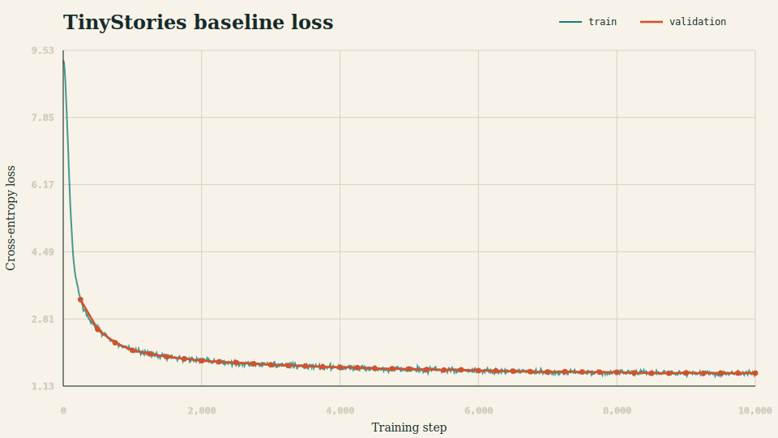
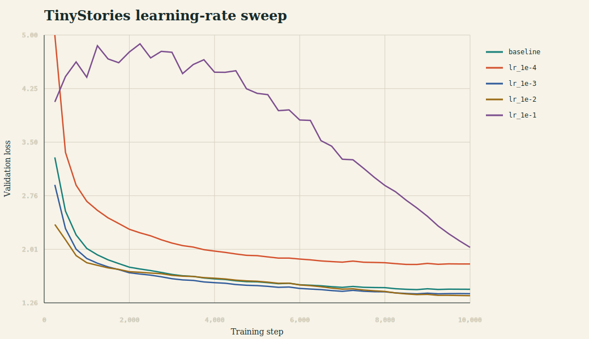
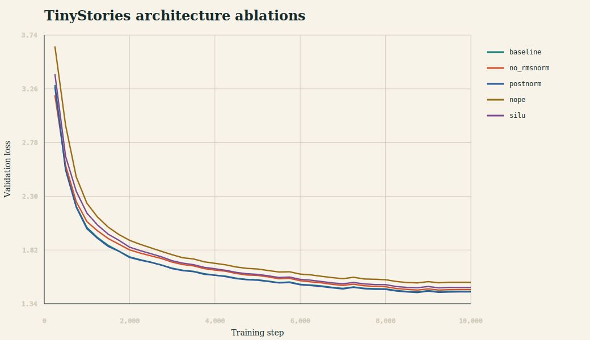
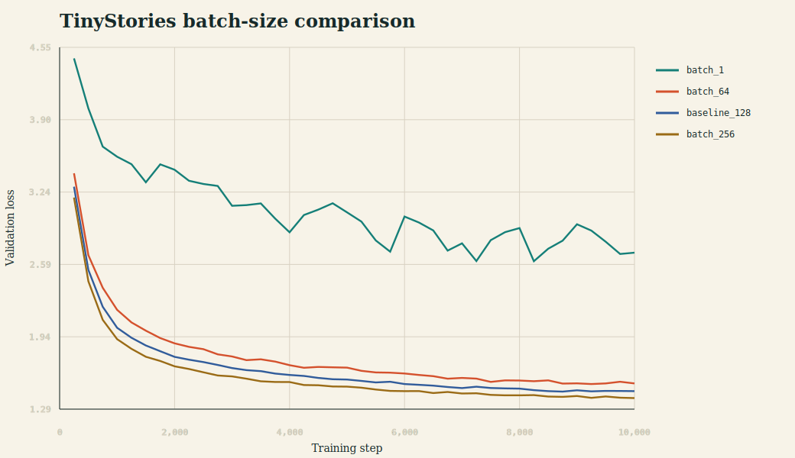

# A1 公开提交：王琪琦

> 作业题面版本：26.0.4；上游 starter commit：`a158843b20107949f1a8d7df1b05cd33b9166712`。
> 本报告、源代码、配置和日志均为公开且脱敏的提交内容，不包含数据、checkpoint、内部路径或凭据。

## 提交内容

本报告记录 A1 要求的书面题、代码实现、实验结果和日志。所有结果均以实际运行记录为准；完整 OWT tokenizer 已完成，但 OWT 编码、LM 训练和生成仍需单独运行后才能填写。

## 书面题

### Unicode 与 UTF-8

Unicode code point 是抽象整数，UTF-8 是将 code point 编码为 1 至 4 个 byte 的可变长编码。例如 `"牛"` 是一个字符、code point 为 `U+725B`，UTF-8 表示为三个 byte `E7 89 9B`。因此 Python 中 `len("牛") == 1`，但 `len("牛".encode("utf-8")) == 3`。

`chr(0)` 返回包含 `U+0000` 的长度为 1 的字符串。`repr(chr(0))` 显示为 `'\x00'`，直接打印时它是不可见的 NUL 字符；这说明字符串的调试表示不等于字符的可视输出。

不能逐 token 或逐 byte 单独执行 UTF-8 decode，因为一个 Unicode 字符的 byte 序列可能跨 token 边界。正确做法是先连接所有 token bytes，再整体以 UTF-8 解码，并对非法序列使用替换字符 `U+FFFD`。Byte-level BPE 从全部 256 个 byte 起步，因此任意 UTF-8 文本都可表示，不会产生 OOV。

### 参数、FLOPs 与 AdamW 内存

对本作业的无 bias、untied embedding/head、SwiGLU Transformer，忽略 RoPE buffer 后，参数量为：

$$
P=2Vd+L(4d^2+3dd_{ff}+2d)+d.
$$

长度为 $T$、batch size 为 1 的一次 forward，忽略逐元素操作，近似 FLOPs 为：

$$
F=L(8Td^2+4T^2d+6Tdd_{ff})+2TdV.
$$

下表使用 `V=50,257`、`T=1,024` 以及 GPT-2 small/medium/large/XL 的层数和宽度；SwiGLU 使用表中的 GPT-2 FFN 宽度，结果对应本作业架构而非原版 GPT-2 tied-head 参数量。

| 规模 | `L / d / d_ff` | 参数量 | BF16 权重 | AdamW 训练状态上界 | Forward FLOPs |
|---|---:|---:|---:|---:|---:|
| Small | 12 / 768 / 3072 | 190.46M | 0.381 GB | 3.047 GB | 349.63 GFLOPs |
| Medium | 24 / 1024 / 4096 | 505.63M | 1.011 GB | 8.090 GB | 1.033 TFLOPs |
| Large | 36 / 1280 / 5120 | 1.072B | 2.145 GB | 17.160 GB | 2.258 TFLOPs |
| XL | 48 / 1600 / 6400 | 2.127B | 4.254 GB | 34.033 GB | 4.513 TFLOPs |

“AdamW 训练状态上界”按每参数 16 bytes 核算：BF16 参数 2 bytes、BF16 梯度 2 bytes、FP32 master parameter 4 bytes、FP32 一阶矩 4 bytes、FP32 二阶矩 4 bytes；未包含 activation、临时张量和 allocator 开销。若全程 FP32 且不保留额外 master copy，则参数、梯度、两个矩状态同样合计约 16 bytes/parameter。

训练计算通常用 $6PN$ 估算，其中 $N$ 是 processed tokens；理想训练时间为 $6PN/C$，$C$ 为硬件的有效 FLOP/s。实际时间还受 attention 的 $T^2$ 项、validation、checkpoint、内存带宽和 kernel 利用率影响，因此本报告最终采用 JSONL 实测 wall-clock，而不把峰值 FLOP/s 推算当成实验时间。

## 实现说明

- Byte-level BPE 从 256 个单 byte token 开始，隔离 special token，采用 GPT-2 正则预分词，并增量维护 pair frequency 与受影响 pre-token 索引。
- Tokenizer 支持 merge-rank 编码、最长 special-token 匹配、整体 UTF-8 decode 和流式 `encode_iterable`。
- 模型从零实现 Linear、Embedding、RMSNorm、SiLU/SwiGLU、RoPE、stable softmax、causal MHA、Transformer block 和完整 LM。
- 训练组件从零实现 cross-entropy、AdamW、warmup/cosine schedule、global gradient clipping、memmap batch 与 checkpoint。
- 脚本支持 tokenizer 训练与持久化、多进程数据编码、validation、JSONL 日志、恢复训练、temperature 和 top-p 生成。
- 四项消融由配置控制：删除 RMSNorm、Post-Norm、NoPE，以及每层 FFN 参数均为 2,064,384 的 matched-parameter SiLU。

公开实现位于 `submission/cs336_basics/`，adapter 位于 `submission/tests/adapters.py`，运行入口位于 `submission/scripts/`，所有实验配置位于 `submission/configs/`。

## Tokenizer 实验

TinyStories 10K tokenizer 的正式结果如下；结构化记录见 [`logs/tokenizer_tinystories.json`](logs/tokenizer_tinystories.json)。

| 指标 | 结果 |
|---|---:|
| Vocabulary / merge rules | 10,000 / 9,743 |
| Special token ID | 256 |
| 训练时间 | 567.05 秒 |
| 峰值 RSS | 约 11.1 GB |
| 最长 token | ` accomplishment`（15 bytes） |
| Train tokens | 540,796,778 |
| Train compression | 4.119391 bytes/token |
| Train 编码 | 484.33 秒，1,116,584 tokens/s，8 workers |
| Valid tokens | 5,461,210 |
| Valid compression | 4.120442 bytes/token |
| Valid 编码 | 39.36 秒，138,755 tokens/s，1 worker |

Train/valid 编码均使用 `uint16`，抽样 round-trip 通过，所有 token ID 均小于 10,000。完整 OWT 训练文本上的 32K tokenizer 已完成：输入 11,920,511,059 bytes，词表 32,000、merge rules 31,743，训练耗时 26,450.18 秒（约 7 小时 21 分钟）。结构化记录见 [`logs/tokenizer_owt_full.json`](logs/tokenizer_owt_full.json)。此前使用 2 GiB fallback 数据完成的 tokenizer 仅作为补充记录，见 [`logs/tokenizer_owt_2g.json`](logs/tokenizer_owt_2g.json)；它不替代完整 OWT 结果。

## 训练实验

共同 baseline 为 `vocab_size=10000`、`context_length=256`、`d_model=512`、4 layers、16 heads、`d_ff=1344`、batch 128、10,000 steps，总计 327,680,000 processed tokens。最终表格只采用各 run 的 `summary.json`，当前状态如下：

| Run | 唯一主要变量 | 状态 | 最终 val loss | 总时间 |
|---|---|---|---:|---:|
| TinyStories baseline | max LR `5e-4` | 已完成 | **1.450302** | **2,951.86 秒** |
| LR low | max LR `1e-4` | 已完成 | 1.803962 | 2,939.47 秒 |
| LR high | max LR `1e-3` | 已完成 | 1.389011 | 2,953.29 秒 |
| LR very high | max LR `1e-2` | 已完成，未发散 | **1.361203** | 2,934.38 秒 |
| LR `1e-1` | max LR `1e-1` | 已完成，严重退化但未 NaN | 2.036064 | 2,933.40 秒 |
| LR `1` | max LR `1` | 已完成，训练中明显失稳 | 4.385690 | 2,865.16 秒 |
| No RMSNorm | `use_rmsnorm=false` | 已完成 | 1.466538 | 2,743.68 秒 |
| Post-Norm | `norm_position="post"` | 已完成 | 1.446202 | 2,951.46 秒 |
| NoPE | `use_rope=false` | 已完成 | 1.531844 | 2,792.10 秒 |
| SiLU FFN | `ffn_type="silu"`, `d_ff=2016` | 已完成 | 1.485396 | 2,929.35 秒 |
| Batch 1 | batch size 1 | 已完成 | 2.697358 | 192.40 秒 |
| Batch 64 | batch size 64 | 已完成 | 1.519705 | 1,427.20 秒 |
| Batch 256 | batch size 256 | 已完成 | 1.387823 | 5,890.13 秒 |
| Batch 512 | batch size 512 | OOM，step 0 | 不适用 | 不适用 |
| OWT baseline | dataset/tokenizer | 已完成 | **4.138843** | **3,805.26 秒** |

Baseline 共处理 327,680,000 tokens，平均吞吐约 111,008 tokens/s，最终 perplexity 为 `exp(1.450302) = 4.2644`。Validation loss 从 step 250 的 3.291832 降到 step 10,000 的 1.450302；最终结果仅比严格的 `1.45` 目标高 0.000302，因此应表述为非常接近但未严格达到阈值，而不能向下取整后宣称达标。完整日志与 summary 分别见 [`logs/train_tinystories.jsonl`](logs/train_tinystories.jsonl) 和 [`logs/summaries/tinystories_baseline.json`](logs/summaries/tinystories_baseline.json)。



### 学习率对比

在其他配置和 327.68M processed tokens 完全相同的条件下，`1e-4` 明显欠拟合，最终 val loss 比 baseline 高 0.353660；`1e-3` 比 baseline 低 0.061291；`1e-2` 比 baseline 低 0.089099，并未按预期发散，反而是本轮最佳。`1e-1` 最终 val loss 为 2.036064，训练过程明显退化但没有 NaN，因此严格说是高学习率失败/退化 run，而不是数值发散。完整日志位于 `logs/lr_sweep/`，summary 位于 `logs/summaries/`。

补充的 `max learning rate=1` run 出现了真实失稳：训练 loss 峰值达到约 479.75，validation loss 峰值达到约 139.34，随后因 cosine schedule 降低学习率而部分回落，最终 val loss 仍为 4.385690。该 run 没有 NaN，但中途的 loss 爆升和 validation 峰值足以说明训练已失稳；日志见 [`logs/lr_sweep/lr_1.jsonl`](logs/lr_sweep/lr_1.jsonl)，summary 见 [`logs/summaries/tinystories_lr_1.json`](logs/summaries/tinystories_lr_1.json)。



### 架构消融

NoPE 退化最大，val loss 比 baseline 高 0.081542，表明位置表示对该任务明显重要。参数量匹配的 SiLU 比 SwiGLU 高 0.035094；删除 RMSNorm 高 0.016236。Post-Norm 在本次单 seed、固定预算实验中比 baseline 低 0.004101，差异很小，不能据此泛化为 Post-Norm 普遍更优。完整日志位于 `logs/ablations/`。



### OWT 训练

使用完整 OWT 训练/验证编码、32K OWT tokenizer，以及与 TinyStories baseline 相同的模型架构、batch size、context length、training steps 和学习率配置。训练处理 327,680,000 tokens，最终 validation loss 为 **4.138843**，耗时 **3,805.26 秒**。OWT loss 不能直接与 TinyStories 数值比较，因为语料分布和 tokenizer 词表不同；本结果主要用于验证相同训练流程在 OWT 上的可运行性和收敛轨迹。训练日志见 [`logs/owt/train_owt_full.jsonl`](logs/owt/train_owt_full.jsonl)，summary 见 [`logs/summaries/owt_full_baseline.json`](logs/summaries/owt_full_baseline.json)。

### Batch size 与显存边界

在 47.50 GiB RTX 4090、context length 256 上，batch 1 已完成 10,000 steps，处理 2.56M tokens，最终 val loss 2.697358，耗时 192.40 秒；batch 64 已完成 10,000 steps，处理 163.84M tokens，最终 val loss 1.519705，耗时 1,427.20 秒；batch 256 已完成 10,000 steps，处理 655.36M tokens，最终 val loss 1.387823，耗时 5,890.13 秒。Batch 256 比 baseline 低 0.062480，但 token 预算是 baseline 的两倍，因此不能只归因于 batch size。单个完整 train step 的显存探测结果为：batch 128 峰值 15.76 GiB，batch 256 峰值 31.61 GiB，batch 512 在约 45.27 GiB 已分配时仍需额外 2 GiB，因 OOM 在 step 1 前失败。当前只能严谨地说 batch 256 可行、512 不可行；还需在 256–512 之间细探后才能声称精确最大值。脱敏记录见 [`logs/batch_size/memory_probe.json`](logs/batch_size/memory_probe.json) 和 [`logs/batch_size/batch_512_failure.json`](logs/batch_size/batch_512_failure.json)。

### 文本生成

所有样本使用 prompt `Once upon a time`、temperature 0.8、top-p 0.9 和 seed 42。Baseline 在生成 149 个新 tokens 后遇到 EOS，`1e-2` 模型在 158 个新 tokens 后遇到 EOS，均符合“最多生成 256，若先遇到 EOS 则停止”的要求。完整文本见 [`logs/generation/baseline.txt`](logs/generation/baseline.txt) 和 [`logs/generation/lr_1e-2.txt`](logs/generation/lr_1e-2.txt)。

Baseline 样本能够形成角色、事件和结尾，但存在“猴子本来会跳舞，后面又学会跳舞”的局部逻辑矛盾。`1e-2` 样本的比赛叙事更完整，语法流畅，但出现朋友先超过 Binky、Binky 又超过朋友以及 Tina 评价重复的问题。两者都表现出 TinyStories 风格和短程一致性，同时仍有重复与事实连贯性不足。

> Once upon a time, in a big, green forest, there lived a little bunny named Binky. Binky loved to hop and play with his friends. One day, Binky and his friends decided to have a race. [...] They all laughed and continued to hop and play in the big, green forest. And they lived happily ever after. `<|endoftext|>`

完整 OWT 模型使用 prompt `The government announced` 生成了 256 个新 tokens，未提前遇到 EOS；完整文本见 [`logs/generation/owt_full.txt`](logs/generation/owt_full.txt)。样本局部语法基本通顺，具有新闻文本的表面风格，但反复生成 `government` 和相近句式，语义推进弱、全局连贯性不足。这与 OWT 分布更复杂、模型规模和训练预算有限相符。



Batch-size JSONL 已归档到 `logs/batch_size/`；由于各 run 固定为 10,000 steps，batch 256 的 processed tokens 是 baseline 的两倍，曲线主要用于展示收敛轨迹，不作为等 token 预算的严格因果比较。

## 测试结果

```text
public non-memory regression: 46 passed, 2 deselected
test_encode_iterable_memory_usage: sandbox-specific psutil PID failure
test_encode_memory_usage: xfailed as expected by course
ruff: All checks passed!
ty: All checks passed!
git diff --check: passed
```

四项消融配置均完成 forward/backward，默认公共测试没有回归。

## 复现说明

依赖由上游 `uv.lock` 固定，数据使用课程指定的公开 TinyStories 和 OWT sample。原始文本、编码文件、checkpoint 和虚拟环境不提交。

```bash
# 测试
uv run pytest -q

# TinyStories tokenizer
uv run python scripts/train_tokenizer.py \
  --input data/TinyStoriesV2-GPT4-train.txt \
  --output-dir data/tokenizers/tinystories_10k \
  --vocab-size 10000

# 数据编码
uv run python scripts/encode_dataset.py \
  --input data/TinyStoriesV2-GPT4-train.txt \
  --tokenizer data/tokenizers/tinystories_10k \
  --output data/encoded/tinystories_train.bin \
  --dtype uint16 --workers 8

# Baseline 训练
uv run python scripts/train_lm.py \
  --config configs/tinystories_baseline.json \
  --train-data data/encoded/tinystories_train.bin \
  --valid-data data/encoded/tinystories_valid.bin \
  --output-dir runs/tinystories_baseline \
  --data-dtype uint16 --device cuda

# 生成；正式报告使用至少 256 个新 tokens
uv run python scripts/generate.py \
  --config configs/tinystories_baseline.json \
  --checkpoint runs/tinystories_baseline/checkpoint_latest.pt \
  --tokenizer data/tokenizers/tinystories_10k \
  --prompt "Once upon a time" --max-new-tokens 256 --device cuda
```

从工作仓库同步公开代码与配置的命令为：

```bash
python3 scripts/sync_a1_submission.py --name '王琪琦'
```

## 日志与补充材料

`logs/` 只保存小于 5 MiB 的脱敏 JSON/JSONL，不保存 checkpoint。已完成的 TinyStories baseline、学习率/batch-size 实验、四项消融和完整 OWT LM 训练均已归档；每条训练记录含 `step`、`wall_clock_sec`、`train_loss`、`lr`，validation 点另含 `val_loss`。

- 飞书组织内补充文档：[A1 作业补充记录](https://fudan-nlp.feishu.cn/wiki/Cq86wEZzKiIgL6kX2pwcJ2sGnoY)。
- GitHub PR：完成实验和报告后创建。
