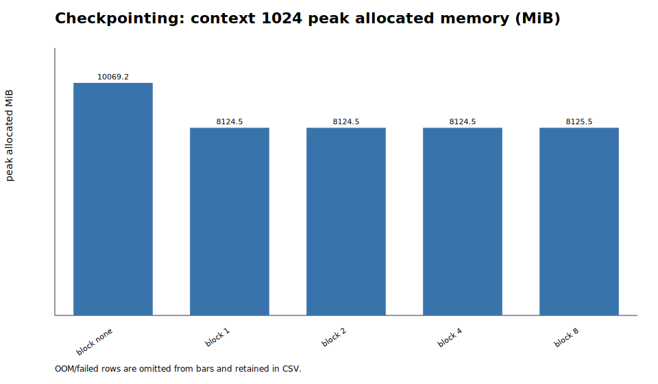
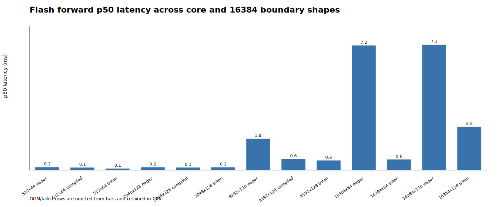

# A2-K：单卡显存优化与 GPU Kernels

## 基本信息与完成范围

- 题面版本：`26.1.4-k-rc.3`
- 上游 starter commit：[`ca8bc81a59b70516f7ebb2da4808daade877c736`](https://github.com/stanford-cs336/assignment2-systems/commit/ca8bc81a59b70516f7ebb2da4808daade877c736)
- 完成范围：activation checkpointing、显式 PyTorch attention、`torch.compile` 对照、纯 PyTorch tiled FlashAttention-2、Triton forward、重计算式 backward、官方 GPU tests、扩展正确性矩阵和正式性能矩阵。
- 未完成的必做项：无。自定义 Triton backward 是上游题面明确标注的 optional 内容，不属于本实验室 A2-K 必做范围。
- 公开附件只包含脱敏后的轻量结果、图和 Python 源码；原始日志、编译缓存、trace、snapshot 和环境留在工作区，不进入此目录。

## 环境、硬件与测量口径

| 项目 | 正式记录 |
| --- | --- |
| GPU | NVIDIA GeForce RTX 4090；平台报告 `49140 MiB` 总显存，约 `48 GiB`，不是标准 24 GiB 暴露值 |
| 开跑时可用显存 | `48104 MiB`（正式 metadata 中的首个进程采样，远高于 22 GiB 要求） |
| Driver / CUDA | `570.124.06` / `12.8` |
| PyTorch / Triton / Python | `2.8.0+cu128` / `3.4.0` / `3.12.11` |
| power limit / P-state | `450 W`，使用平台默认设置；P-state 随进程从 `P0/P2/P5/P8` 变化，未手动调频 |
| TF32 | matmul 和 cuDNN 均关闭；扩展正确性含 FP32 与 BF16 |
| allocator guard | `23552 MiB`，实际 fraction `0.4854174583443363` |
| attention 测量 | batch `1`、BF16、causal、CUDA event；warm-up `100 ms`、measurement `300 ms`、p20/p50/p80 |
| 运行方式 | 每个配置独立 Python 进程，单卡串行；输入、模型和随机数据在计时区间外创建，计时前后同步 |

平台把这张 4090 暴露成约 48 GiB，因此不能把无约束结果冒充标准 24 GiB 4090。所有正式进程都在第一次 CUDA allocation 前设置 23 GiB PyTorch allocator 上限；`results/memory_evidence.json` 汇总的最大峰值为 `19668.4 MiB allocated`、`20192.0 MiB reserved`，`within_24gib=true`。这使显存结论遵守实验室的 23 GiB 预算，但仍保留平台硬件差异这一限制。

## 1. Activation Checkpointing

### 理论

普通前向会让 N 个 block 的 backward residual 同时存活，峰值随 N 线性增长。标准 nested checkpoint 的实用策略是把 block 区间递归二分：每一层只保存子区间入口，进入 backward 时从最近的入口重算子区间，再释放临时 residual。二分递归的 live boundary 数为 `O(log N)`，总 forward-equivalent work 为 `O(N log N)`；这是本实现的理论策略。若允许完全手写、无共享边界的串行重算，理论上还可以把峰值逼近 `O(1)`，但代价会升到 `O(N²)`，不适合这里的标准 `torch.utils.checkpoint` 实验。

不超过 20 行的非嵌套实验骨架如下；`block_size` 控制一次 checkpoint 包含的连续 block 数：

```python
def run_blocks(blocks, x, block_size):
    if block_size <= 0:
        for block in blocks:
            x = block(x)
        return x
    for start in range(0, len(blocks), block_size):
        stop = min(start + block_size, len(blocks))
        def group(value, start=start, stop=stop):
            for i in range(start, stop):
                value = blocks[i](value)
            return value
        x = checkpoint(group, x, use_reentrant=False)
    return x
```

### 固定矩阵

medium 配置为 24 layers、batch 1、BF16 autocast、FP32 parameters、AdamW；每行 3 个 warm-up step、5 个 measurement step。延迟单位为 ms，显存单位为 MiB；完整原始轻量表在 [`results/checkpointing.csv`](results/checkpointing.csv)。

| context | block size | p50 step | peak allocated | peak reserved | status |
| ---: | ---: | ---: | ---: | ---: | --- |
| 1024 | none | 144.050 | 10069.2 | 10244 | complete |
| 1024 | 1 | 215.163 | 8124.5 | 8182 | complete |
| 1024 | 2 | 203.693 | 8124.5 | 8178 | complete |
| 1024 | 4 | 194.623 | 8124.5 | 8196 | complete |
| 1024 | 8 | 203.336 | 8125.5 | 8234 | complete |
| 2048 | none | 387.046 | 19668.4 | 20192 | complete |
| 2048 | 1 | 493.328 | 8153.7 | 9450 | complete |

在 context 1024，block 1/2/4 的 allocated 峰值打平，但 reserved 和重算时间不同；因此不能只按 checkpoint 数量选最优。runner 按 `(peak allocated, block size)` 的确定性 tie-break 选择 block 1 继续跑 context 2048。checkpoint 把 2048 的 allocated 峰值从 `19668.4` 降到 `8153.7`，代价是 p50 从 `387.0` 增到 `493.3` ms。



## 2. 显式 PyTorch Attention 与 `torch.compile`

### 显式基线

基线严格展开 `QK^T -> scale -> causal mask -> softmax -> PV`，没有调用 `scaled_dot_product_attention`、第三方 FlashAttention 或其他 fused attention。固定 batch 1、BF16、causal，覆盖 `S∈{512,2048,8192}`、`d∈{64,128}` 和 forward/backward/forward-backward 三个 phase。18/18 行完成；全部 p20/p50/p80、samples、峰值 allocated/reserved 在 [`results/attention_baseline.csv`](results/attention_baseline.csv)。

下表给出 p50（单位 ms）和峰值 reserved（单位 MiB）：

| S × d | forward | backward | forward-backward |
| --- | ---: | ---: | ---: |
| 512 × 64 | 0.163 / 22 | 0.262 / 24 | 0.485 / 24 |
| 512 × 128 | 0.162 / 24 | 0.258 / 24 | 0.498 / 24 |
| 2048 × 64 | 0.166 / 42 | 0.267 / 84 | 0.477 / 84 |
| 2048 × 128 | 0.159 / 44 | 0.292 / 86 | 0.500 / 86 |
| 8192 × 64 | 1.796 / 410 | 2.517 / 670 | 4.188 / 670 |
| 8192 × 128 | 1.816 / 406 | 2.560 / 662 | 4.273 / 790 |

### `torch.compile`

compiled attention 使用 `torch.compile(..., backend="inductor", dynamic=False)`；cold-start 单独计时，steady-state 仍按相同 100/300 ms 协议测量。代表性结果如下：

| kind / shape | phase | eager p50 | compiled p50 | compiled cold |
| --- | --- | ---: | ---: | ---: |
| attention 512×64 | forward | 0.1587 | 0.1475 | 1614.5 ms |
| attention 512×64 | forward-backward | 0.5260 | 0.4054 | 887.5 ms |
| attention 2048×128 | forward | 0.1659 | 0.1513 | 1671.4 ms |
| attention 8192×128 | forward | 1.8278 | 0.6380 | 1776.7 ms |
| attention 8192×128 | forward-backward | 4.3221 | 1.7500 | 900.5 ms |
| small model, context 512 | forward | 18.2744 | 4.8077 | 25.565 s |
| small model, context 512 | forward-backward | 50.5672 | 13.7740 | 23.945 s |
| small model, context 512 | train step | 65.4907 | 25.9364 | 16.100 s |

steady-state 的收益来自 graph fusion 和 shape specialization；首次调用必须把编译、缓存和 kernel 选择成本单独报告。完整 24 行在 [`results/compile_comparison.csv`](results/compile_comparison.csv)。

## 3. FlashAttention-2 Forward

### Pure PyTorch tiled reference

`FlashAttentionPytorch` 对 query/key 维度分 tile，逐 tile 维护 FP32 `running_max`、`running_sum` 和输出 accumulator。每次只生成 `Q_tile @ K_tile.T`，用 online softmax 更新

`m_new=max(m_old,rowmax(S_tile))`

`l_new=exp(m_old-m_new)l_old+sum(exp(S_tile-m_new))`

`O_new=exp(m_old-m_new)O_old+exp(S_tile-m_new)V_tile`。

最后写回 `O=O_acc/l` 和唯一的 `L=m+log(l)`。autograd context 保存 `Q,K,V,O,L`，其中只有一个形状为 `[batch, n_queries]` 的 LSE；没有保存完整 `S/P` 矩阵。causal mask 在 tile 的全局 query/key index 上比较。

### Triton forward

`FlashAttentionTriton` 使用学生自己编写的真实 `@triton.jit` kernel。grid 为 `(ceil(n_queries/Q_TILE), batch)`；每个 program instance 负责一个 query tile，在 kernel 内单循环遍历 key/value tiles。当前固定 launch 配置为：

| head dim | Q/K tile | warps | stages |
| ---: | ---: | ---: | ---: |
| 64 | 64 × 64 | 4 | 2 |
| 128 | 16 × 16 | 2 | 2 |

kernel 使用 stride-aware pointer arithmetic、FP32 online state/accumulator、`tl.dot`、tile 内 causal index mask 和 BF16 输出 cast；不写回 attention score/probability 矩阵。Triton forward 与 pure PyTorch path 都支持 causal/non-causal，均通过官方和扩展正确性检查。

## 4. 重计算式 Backward 与正确性

backward 先计算 `D_i = rowsum(O_i ∘ dO_i)`，再按题面公式重算

`S=QK^T/√d`，`P=exp(S-L)`

`dV=P^T dO`，`dP=dO V^T`

`dS=P∘(dP-D)`

`dQ=dS K/√d`，`dK=dS^T Q/√d`。

`FlashAttentionPytorch.backward` 和 `FlashAttentionTriton.backward` 共用这个 PyTorch tiled recomputation path；前者和后者的 forward 保存张量接口一致。这里没有把 optional Triton backward 冒充成已完成优化，所以长序列 Triton forward-backward 的慢速结果如实保留。

### 官方 GPU tests

命令为 `python -m pytest -q tests/test_attention.py -v`，在 CUDA 4090 上运行：6 collected，**6 passed / 0 failed / 0 skipped**。逐项输出见 [`results/unit_tests.txt`](results/unit_tests.txt)。

### 扩展正确性

扩展矩阵为 3 seeds × 3 head dimensions (`32/64/128`) × causal/non-causal × FP32/BF16 × 两个 implementation，共 72 cases，**72 passed / 0 failed**。输出、LSE、dQ、dK、dV 的最大误差（跨全部 cases；相对误差在接近零的元素上会被放大，因此同时看绝对误差和 allclose 判定）：

| implementation | tensor | max absolute | max relative |
| --- | --- | ---: | ---: |
| PyTorch tiled | O | 1.95e-3 | 1.27e-2 |
| PyTorch tiled | L | 0 | 0 |
| PyTorch tiled | dQ | 7.81e-3 | 6.03e4 |
| PyTorch tiled | dK | 1.56e-2 | 7.78e2 |
| PyTorch tiled | dV | 1.95e-3 | 2.21e-2 |
| Triton forward | O | 7.81e-3 | 9.97e1 |
| Triton forward | L | 9.54e-7 | 1.27e-6 |
| Triton forward | dQ | 7.81e-3 | 3.40e5 |
| Triton forward | dK | 1.56e-2 | 4.12e2 |
| Triton forward | dV | 3.91e-3 | 1.65e-2 |

相对误差极大值来自 reference 数值接近 0 的位置；实际 pass 使用 FP32 `rtol=atol=1e-2`、BF16 `rtol=atol=2e-2` 的 allclose 规则。

## 5. 正式性能矩阵

完整逐行数据在 [`results/flash_benchmark.csv`](results/flash_benchmark.csv)，包含 p20/p50/p80、samples、allocated/reserved、status、speedup 和 Triton launch metadata。核心矩阵为 `S=512/2048/8192`、`d=64/128`、eager/compiled/Triton、三个 phase；边界矩阵为 `S=16384`、两种 d、eager/Triton、三个 phase。66/66 行均 complete，OOM/failed 均为 0。

下表是核心矩阵的 p50（ms）；括号内为 Triton 相对同 shape eager 的 speedup：

| S × d | phase | eager | compiled | Triton |
| --- | --- | ---: | ---: | ---: |
| 512×64 | forward | 0.164 | 0.143 | 0.086 (1.898×) |
| 512×64 | backward | 0.259 | 0.213 | 1.626 (0.159×) |
| 512×64 | forward-backward | 0.472 | 0.434 | 1.698 (0.278×) |
| 2048×128 | forward | 0.162 | 0.146 | 0.158 (1.022×) |
| 2048×128 | backward | 0.255 | 0.217 | 19.975 (0.013×) |
| 2048×128 | forward-backward | 0.462 | 0.425 | 21.114 (0.022×) |
| 8192×64 | forward | 1.800 | 0.602 | 0.265 (6.786×) |
| 8192×64 | backward | 2.466 | 1.105 | 346.345 (0.007×) |
| 8192×64 | forward-backward | 4.186 | 1.638 | 312.627 (0.013×) |
| 8192×128 | forward | 1.814 | 0.636 | 0.553 (3.280×) |
| 8192×128 | backward | 2.508 | 1.149 | 333.113 (0.008×) |
| 8192×128 | forward-backward | 4.244 | 1.730 | 316.396 (0.013×) |

代表性 p20/p50/p80 与显存：

| shape / phase | eager p20/p50/p80 | Triton p20/p50/p80 | eager/Triton reserved |
| --- | --- | --- | --- |
| 8192×128 forward | 1.810/1.814/1.827 | 0.545/0.553/0.587 | 406/22 MiB |
| 8192×128 backward | 2.498/2.508/2.534 | 333.113/333.113/333.113 | 662/64 MiB |
| 8192×128 forward-backward | 4.245/4.244/4.271 | 316.396/316.396/316.396 | 790/64 MiB |
| 16384×64 forward | 7.206/7.214/7.256 | 0.609/0.612/0.617 | 1558/22 MiB |
| 16384×64 backward | 9.772/9.790/9.872 | 1262.298/1262.298/1262.298 | 2582/64 MiB |
| 16384×64 forward-backward | 16.912/16.946/16.978 | 1301.307/1301.307/1301.307 | 3094/64 MiB |

forward 在长序列上受益最大：Triton 不把 `S×S` attention matrix 写回 HBM，16384×64 forward 约 `11.786×` eager；d=128 边界约 `2.896×`。backward 仍是题面允许的普通 PyTorch recomputation，当前 tile loop 主要用于清晰、低显存和正确性，因此在长序列上远慢于 eager；这不是 Triton backward 优化结果。Triton forward 的 reserved 显存保持在几十 MiB，而 eager 随二次方 score/softmax 中间量增长。短序列时 kernel launch 与 Python/autograd 边界开销占比更高，2048×128 forward 只略快于 eager。



## 6. 结果、复现与限制

- 公开结果：[`results/checkpointing.csv`](results/checkpointing.csv)、[`results/attention_baseline.csv`](results/attention_baseline.csv)、[`results/compile_comparison.csv`](results/compile_comparison.csv)、[`results/flash_benchmark.csv`](results/flash_benchmark.csv)、[`results/correctness.json`](results/correctness.json)、[`results/unit_tests.txt`](results/unit_tests.txt)。
- 显存证据：[`results/memory_evidence.json`](results/memory_evidence.json)；`allocator_limit_mib=23552`、`hard_limit_mib=24576`、`pytorch_peak_allocated_mib=19668.4`、`pytorch_peak_reserved_mib=20192.0`、`within_24gib=true`。
- metadata：[`results/run_metadata.json`](results/run_metadata.json) 记录 starter/implementation commit、seed `20260722`、脱敏命令、硬件和测量配置。
- 同步代码：`python3 scripts/sync_a2k_submission.py --name '章之禹'`。
- 最小复现：在 A2-K 上游工作仓库根目录运行 `PYTHONPATH=.:cs336-basics python -m pytest -q tests/test_attention.py -v`；正式矩阵由 `python -m student_scripts.a2k.run_a2k --results local_results/formal` 串行编排。
- 未公开的大型文件只保留在个人工作区，不提交 trace、snapshot、pickle、compile cache、PTX/CUBIN、模型、数据或依赖环境。
- 已知限制：平台显存暴露值约 48 GiB；23 GiB allocator guard 保障预算可比性，但不能替代真实 24 GiB 物理卡。当前 backward 采用题面允许的 PyTorch recomputation，未实现 optional Triton backward。

## 飞书补充文档

[CS336 Assignment 2 Systems：FlashAttention 与单卡显存实验补充](https://fudan-nlp.feishu.cn/wiki/ZGBjwrZsniU2KKkYDwpc50Izn1A)

该文档为组织内可见，不开启互联网公开访问；不包含密钥、Token、Cookie、密码或私钥。

## 自检

- [x] 固定题面版本和 starter commit 已记录。
- [x] 正式实验单卡、串行、独立进程，并在第一次 CUDA allocation 前设置 23552 MiB allocator 上限。
- [x] checkpoint 1024 全矩阵和 2048 baseline/最低显存配置齐全。
- [x] 显式 PyTorch baseline 未调用 fused attention。
- [x] pure PyTorch tiled 与真实 `@triton.jit` forward 均通过正确性检查。
- [x] Triton forward 使用 online softmax、FP32 accumulator、causal mask，并保存唯一 LSE。
- [x] PyTorch/Triton 两个 autograd path 均返回 dQ/dK/dV。
- [x] 官方 GPU tests 如实记录为 6 passed / 0 failed / 0 skipped。
- [x] 核心与 16384 边界性能矩阵完整，speedup 只相对同 shape eager 计算。
- [x] 每个关键数字可追溯到 `results/` 或 metadata。
- [x] 至少两张 SVG 图被 README 引用；`results/` 与 `assets/` 合计约 52 KiB，小于 2 MiB。
- [x] 未提交内部主机名、IP、账号、路径、UUID、进程信息或凭据。
