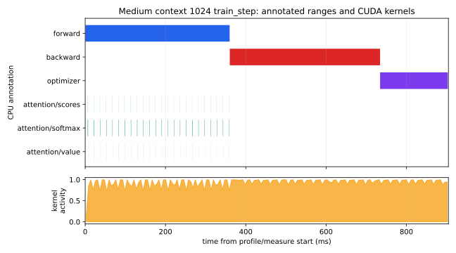
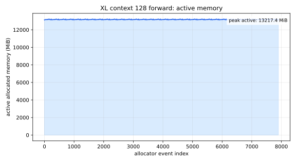
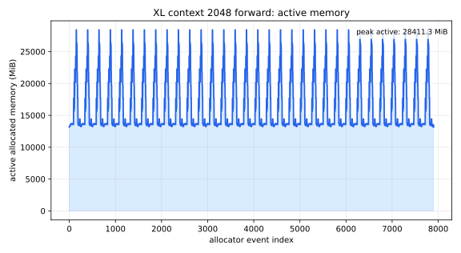

# A2-P：Profiling 与性能分析

## 基本信息

- 作业题面版本：`26.1.4-rc.3`
- 完成范围：End-to-End Benchmark、六个 `torch.profiler` `train_step` trace、混合精度累加与 BF16 对照、XL/large 显存矩阵、公开汇总与脱敏图表。
- 未完成项：题面要求的完整 `train_step` 显存运行在本机实际可见显存耗尽，于 warm-up 阶段 OOM；所有规定配置和 fallback 均保留在结果中，没有静默改标签。
- 上游 starter commit：`ca8bc81a59b70516f7ebb2da4808daade877c736`
- 工作仓库：同级的 `assignment2-systems`；只提交本目录的公开材料，不提交原始 trace、snapshot 或依赖环境。
- 飞书补充文档：[章之禹 A2-P Profiling 补充材料](https://acnc6zeentra.feishu.cn/docx/U7rBdU50poYYAOx3pI5crNymnJh)（组织内链接可读，已关闭对外分享）

## 环境与可复现性

| 项目 | 实际记录 |
| --- | --- |
| GPU | NVIDIA GeForce RTX 4090（平台报告总显存 49,140 MiB，约 48 GiB） |
| Driver / CUDA | `570.124.06` / CUDA `12.8` |
| PyTorch / Python | `2.8.0+cu128` / `3.12.11` |
| cuDNN | `91002` |
| profiler | `torch.profiler`，CPU 与 CUDA activity，`record_shapes=True`、`profile_memory=True` |
| TF32 | matmul `False`，cuDNN `True` |
| 测量进程 | benchmark、profile 与 memory 矩阵的每个配置独立进程；mixed precision 每个模型规模一个进程，依次运行 FP32 与 BF16；CUDA 单卡可见；输出路径只保留文件名到公开 metadata |

本机的 GPU 型号是 4090，但平台暴露显存约 48 GiB。以下 A2-P 数字均是这台实际设备上的
观测；显存 OOM 记录也应按该硬件和模型配置解释。结果生成环境为 PyTorch `2.8.0+cu128`；
当前工作环境已升级为 PyTorch `2.11.0+cu128`，因此重新运行时应以新的 metadata 为准，数值
可能有小幅变化。

## 1. End-to-End Benchmark

统一基线是 small、batch `4`、context `512`、FP32。输入、target、模型和 optimizer 都在
计时区间外创建；每一步前后调用 `torch.cuda.synchronize()`，计时器为
`time.perf_counter()`。`forward` 使用 `no_grad`，`forward_backward` 包含
forward/loss/backward，`train_step` 还包含 `zero_grad` 和 AdamW step。每个配置先执行
5 个 warm-up，再执行 10 个 measurement；`train_step` 额外运行 warm-up `0` 的对照。

完整 raw timing、均值、样本标准差和 CV 在
[`results/benchmark.csv`](results/benchmark.csv)；下面保留同一文件中的关键数值（单位 ms）。

| mode | warm-up | raw measurement timings | mean | std | CV |
| --- | ---: | --- | ---: | ---: | ---: |
| forward | 5 | 43.048, 39.765, 39.567, 42.912, 42.834, 43.058, 42.476, 40.559, 39.198, 39.091 | 41.251 | 1.753 | 0.0425 |
| forward_backward | 5 | 101.572, 101.372, 101.866, 101.759, 102.679, 103.273, 102.073, 101.075, 101.133, 101.183 | 101.799 | 0.716 | 0.0070 |
| train_step | 5 (`baseline_train_step.json`) | 107.582, 107.688, 108.960, 107.883, 107.897, 107.534, 108.225, 107.579, 107.550, 108.028 | 107.893 | 0.441 | 0.0041 |
| train_step | 0 | 441.563, 113.385, 107.668, 108.513, 109.048, 108.599, 109.877, 108.028, 108.109, 107.969 | 142.276 | 105.172 | 0.7392 |

没有 warm-up 时第一个 step 约 `441.563 ms`，均值和 CV 被 CUDA context、kernel
选择/缓存以及首次分配显著拉高。`baseline_train_step.json` 的 warm-up `5` 行 CV 为
`0.0041`；另一独立的 `train_step_warmup_5.json` 复跑行 CV 为 `0.0098`。两者都说明
预热后已经接近稳态，但不应混作同一次运行的统计量。

## 2. Compute Profiling

### 六个配置

六个 trace 统一使用 `torch.profiler`，每个配置在 profiler 外完成 5 个 warm-up，只在
`profile/measure` 内捕获一个 measurement step。阶段标记为
`forward`、`backward`、`optimizer`、`attention/scores`、`attention/softmax`、
`attention/value`，并导出 Chrome trace（原始 trace 留在工作仓库）。轻量 operator 与
阶段摘要在 [`results/profile/trace_summary.csv`](results/profile/trace_summary.csv)，
命令、硬件和文件名在 [`results/profile/run_metadata.json`](results/profile/run_metadata.json)。

| model | context | peak allocated (MiB) | peak reserved (MiB) | event count |
| --- | ---: | ---: | ---: | ---: |
| small | 256 | 3,220.8 | 3,320 | 241 |
| small | 512 | 5,736.1 | 6,026 | 241 |
| small | 1024 | 13,463.6 | 13,876 | 244 |
| medium | 256 | 9,079.5 | 9,096 | 240 |
| medium | 512 | 15,593.8 | 15,790 | 242 |
| medium | 1024 | 35,779.9 | 37,180 | 244 |

代表性配置为 medium/context `1024`。`profile/measure` 的 CUDA device time 为
`373.947 ms`。CPU `record_function` 区间分别为 forward `358.929 ms`、backward
`374.265 ms`、optimizer `168.535 ms`；在 raw Chrome trace 中，这三个 CPU 区间内与 CUDA
kernel 重叠的时间分别约为 `320.764 ms`、`362.091 ms`（1,973 kernels）和 `162.088 ms`。
因此，`backward` 的 `0.864 us` GPU user annotation 只是异步标记本身，**不是**反向传播耗时。
attention 子阶段的 GPU annotation 累计时间为 scores `21.691 ms`（24 calls）、softmax
`180.451 ms`（24 calls）、value `10.771 ms`（24 calls）。`trace_summary.csv` 的
`record_type` 列明确区分 CPU range、GPU annotation、operator 和 trace-derived kernel
overlap；这些阶段会嵌套，不能简单相加，完整测量边界仍以 `profile/measure` 为准。

代表性时间线图（下方橙色区域是 measurement 内 CUDA kernel activity 的脱敏分箱）：



从 operator 汇总看，代表性 trace 中主要 GPU 时间来自框架 op `aten::mm`（507 calls，
`218.896 ms`）、attention softmax（24 calls，约 `180.451 ms`）以及 autograd event
`MmBackward0`（169 calls，`132.385 ms`）。这些名称不是 CUDA kernel 名称；同一 trace
也记录了具体 kernel，例如 softmax/reduction 对应的 elementwise kernel。它们共同说明
Transformer 中线性层矩阵乘和显式 attention 的二次方 score/softmax 代价显著。
`torch.profiler` 能给出框架 op、CUDA activity、shape/memory 和 Chrome/Perfetto 视图。本作业按题面二选一采用
`torch.profiler`，未运行 Nsight Systems；因此只报告 profiler 实际提供的证据，不添加
CUDA API 到 kernel 的 Nsight 专属关联字段。

## 3. Mixed Precision

### 四段累加

固定四段代码的实际输出为：

```text
FP32 accumulator + FP32 input: 10.000133514404297
FP16 accumulator + FP16 input:  9.953125
FP32 accumulator + FP16 input: 10.00213623046875
FP32 accumulator + explicit FP32 cast of FP16 input: 10.00213623046875
```

FP16 输入先把 `0.01` 量化，因而即使 FP32 累加也保留输入量化误差；FP16 累加器还会在
1000 次 reduction 中继续产生舍入误差。最后两段几乎相同，说明主要差异来自 FP16 输入
量化，而不是把已经量化的输入再显式 cast 到 FP32。完整输出位于
[`results/mixed_precision.json`](results/mixed_precision.json)。

### ToyModel dtype

本实验按实验室版要求使用 CUDA BF16 autocast，参数保持 FP32：

| 组件 | dtype |
| --- | --- |
| parameters | `torch.float32` |
| `fc1` output | `torch.bfloat16` |
| LayerNorm output | `torch.float32` |
| logits | `torch.bfloat16` |
| loss | `torch.float32` |
| gradients | `torch.float32` |

LayerNorm 的均值/方差、平方和 reduction 对低精度舍入和动态范围更敏感，因此 autocast
将其保留为 FP32；BF16 虽然指数范围接近 FP32、比 FP16 更不容易溢出，但 reduction 的
精度问题仍然存在。语言模型 benchmark 的 loss 也显式转 FP32 后计算。

### FP32 与 BF16 benchmark

这里比较的是相同 batch/context、warm-up `5`、measurement `10` 的
`forward_backward`（参数 FP32；BF16 行启用 autocast）。

| model | FP32 mean / std (ms) | BF16 mean / std (ms) | FP32 peak alloc (MiB) | BF16 peak alloc (MiB) |
| --- | ---: | ---: | ---: | ---: |
| small | 101.175 / 0.261 | 65.347 / 1.247 | 4,737.9 | 3,547.7 |
| medium | 296.235 / 1.740 | 179.526 / 3.291 | 12,361.4 | 9,357.4 |
| large | 632.384 / 1.974 | 361.442 / 0.670 | 23,644.8 | 18,444.0 |
| xl | 1,404.813 / 1.368 | 753.137 / 1.566 | 45,229.1 | 40,240.6 |
| 10b | OOM | OOM | 47,598.2 | 47,598.2 |

BF16 autocast 在可完成的四个规模上约为 `0.52–0.65×` FP32 latency，并降低峰值
allocated memory；10b 在本机的 batch/context 配置下两种模式都在 warm-up/初始化后
OOM，不能把失败行解释成 BF16 无收益。固定随机单 batch 的 loss 在两种精度下非常接近：
small `+7.629e-5`、medium `-5.817e-5`、large `+1.144e-4`、XL `+1.659e-4`
（数值为 BF16 loss 减 FP32 loss）。4090 上 BF16 GEMM 通常可以使用 Tensor Core，因而
同时降低矩阵乘时间、activation 占用和带宽压力；本实验没有额外采集 kernel 指令级证据，
所以这里将其作为硬件机制解释，而不宣称已从 trace 逐个确认 Tensor Core kernel。

## 4. Memory Profiling

每个 memory 配置先 warm-up，再打开
`torch.cuda.memory._record_memory_history(max_entries=1_000_000)`，最后 dump 独立
snapshot。`allocated` 是当前活跃 tensor bytes 的峰值，`reserved` 是 caching
allocator 保留峰值；两者不混用。结构化结果在
[`results/memory/peaks.csv`](results/memory/peaks.csv)，完整脱敏 metadata 在
[`results/memory/run_metadata.json`](results/memory/run_metadata.json)。

### Forward 峰值与 OOM

| model | context | batch | mode | allocated (MiB) | reserved (MiB) | status |
| --- | ---: | ---: | --- | ---: | ---: | --- |
| XL | 128 | 4 | forward | 13,218.4 | 13,244 | complete |
| XL | 2048 | 4 | forward | 28,411.3 | 30,196 | complete |
| XL | 2048 | 1 | forward fallback | 16,970.4 | 17,414 | complete |
| XL | 1024 | 4 | forward fallback | 17,059.0 | 17,576 | complete |
| large | 2048 | 4 | forward fallback | 13,320.3 | 14,472 | complete |
| XL | 128 | 4 | train_step | 47,615.8 | 47,788 | failed: OOM in warm-up |
| XL | 2048 | 4 | train_step | 45,601.8 | 46,670 | failed: OOM in warm-up |
| XL | 2048 | 1 | train_step fallback | 47,077.1 | 47,672 | failed: OOM in warm-up |
| XL | 1024 | 4 | train_step fallback | 46,719.7 | 47,782 | failed: OOM in warm-up |
| large | 2048 | 4 | train_step fallback | 47,414.2 | 47,756 | failed: OOM in warm-up |

题面要求的顺序是 XL/context 2048、batch 1，再尝试 XL/context 1024、large/context
2048；这些行均保留。由于本机实际可见显存约 48 GiB，完整反向训练在 warm-up 阶段
耗尽显存，未把任何失败行改写成成功，也未用更小配置替代原配置。

### Active Memory Timeline 与理论 residual





两张图都从 snapshot 事件重建 active allocation 曲线，而非直接导出的 interactive
`memory_viz` 截图；因为 recording 在 warm-up 后开启，图的起点包含 warm-up 后仍存活的
模型/输入 baseline。context 128 的曲线几乎平稳在约 `13.1 GiB`，context 2048 在
attention score/softmax 的大临时张量出现时升到约 `28.4 GiB`。对应 snapshot 中最大的
单次 allocation 分别约为 `20 MiB`（context 128）和 `4,096 MiB`（context 2048），调用
类别归为 matmul 与 softmax/reduction。若助教要求严格意义上的 `memory_viz` 页面截图，
仍需从本地 snapshot 补交裁剪、脱敏截图。

XL 的 residual stream shape 为 `[batch, sequence, d_model] = [4, S, 2560]`。单个
FP32 residual 的理论大小是
`4 × S × 2560 × 4 / 2^20` MiB：context 128 为 `5 MiB`，context 2048 为
`80 MiB`。实际峰值远大于一个 residual，因为每个 block 还会保存多个线性层、norm、
attention 和 softmax 中间量。训练时，每个 TransformerBlock 的 backward 先读取前向保存
的 residual、LayerNorm 输入/统计量、Q/K/V、attention probabilities 与 MLP 激活；某个
block 的最后一个 consumer 完成后，其 saved tensor 才可以释放。同时，反向传播会先产生该层
参数 gradient 和输入 residual gradient，再向更早 block 传播。这使 saved activations 与
gradients 在 backward 的一段时间重叠，完整 train_step 比 forward-only 更容易越过显存上限。
本次规定 XL train_step 都在 warm-up OOM，因此上述 block 级生命周期是模型计算图分析，
不是把 forward-only timeline 误当成训练态实测证据。

## 5. 代码、文件和最小复现

提交的测量与汇总代码在 `submission/profiling/**/*.py`；同步命令为：

```bash
python3 scripts/sync_a2p_submission.py --name '章之禹'
```

在上游工作仓库中，最小基准复现命令为：

```bash
python -m profiling.benchmark \
  --model-size small --batch-size 4 --context-length 512 \
  --mode train_step --warmup 5 --steps 10 --dtype fp32 --device cuda \
  --output baseline_train_step.json
```

六个 profiler 命令由 `profiling.run_a2p` 以独立子进程串行编排；memory snapshot 和
完整 Chrome trace 仅保留在个人工作目录，公开目录只保留轻量 CSV/JSON 与图。公开
`results/` 与 `assets/` 合计约 `1.16 MiB`，未提交 `.pickle`、完整 `.trace`、模型、
数据、依赖锁、主机名、UUID、进程信息或凭据。

## 飞书补充文档

补充材料已使用本人的 A2-P 飞书 Doc 登记，并按共同规则仅保存组织内审核所需的最小差量。
当前链接范围为组织内可读，已关闭对外分享。公共题面实验指南不能代替个人补充文档。

## 自检

- [x] 三种 benchmark mode、CUDA 同步、warm-up、raw timing、mean/std/CV。
- [x] 两个模型规模 × 三个 context 的六个 `train_step` profiler 配置。
- [x] `torch.profiler` CPU/CUDA activity、阶段标记、Calls 与 CPU/CUDA 时间。
- [x] 四段累加、ToyModel dtype、FP32/BF16 对照与 OOM 记录。
- [x] XL/context 128 与 2048 forward snapshot、fallback 和结构化失败行。
- [x] 至少两张 memory timeline 和一张 compute profile 图，均使用相对路径引用。
- [x] 公开附件小于 2 MiB，所有公开结果已脱敏。
- [x] 已填写本人组织内公开的 A2-P 飞书补充文档链接。
- [x] 已关闭飞书补充文档的对外分享。
