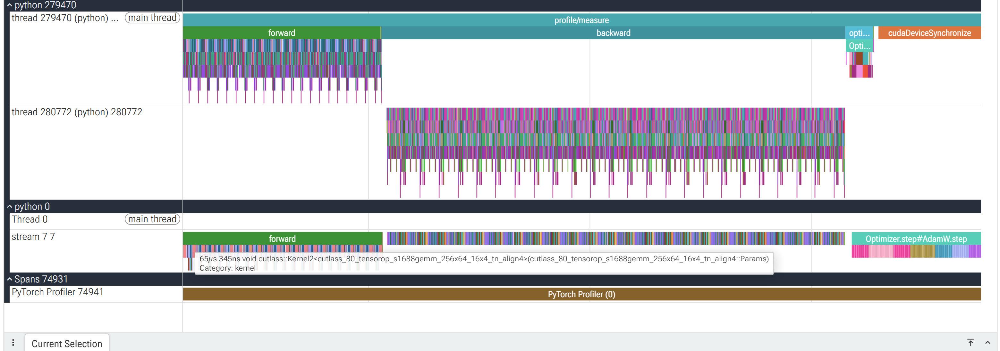
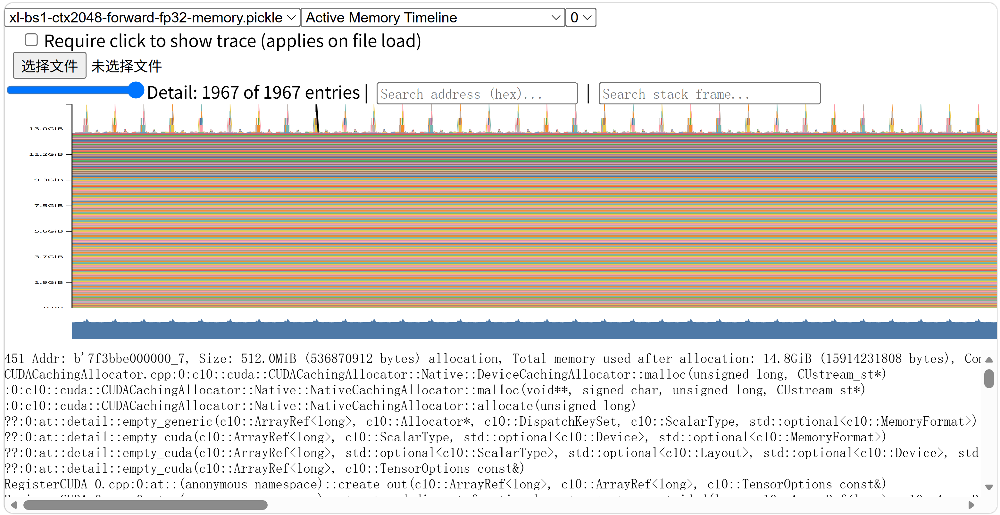
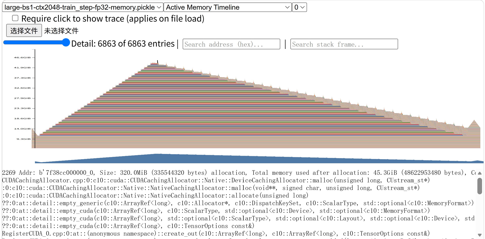

# A2-P 公开提交：许志鹏

> 本文件和同目录代码、汇总、图片公开可见。大型 profiler 原始文件仅保留在个人受控工作区，
> 不进入 GitHub。正式要求见
> [`assignments/A2-P/README.md`](../../../../assignments/A2-P/README.md)，评分说明见
> [`assignments/A2-P/EVALUATION.md`](../../../../assignments/A2-P/EVALUATION.md)。

## 基本信息

- 作业题面版本：`26.1.4-rc.3`
- 完成范围：End-to-End Benchmark、六配置 Compute Profiling、Mixed Precision 累加与
  BF16 autocast、Memory Profiling、OOM/fallback、三张关键时间线均已完成。
- 未完成项：无。
- 上游 starter commit：`ca8bc81a59b70516f7ebb2da4808daade877c736`
- 本地工作仓库：`../assignment2-systems`
- 最终同步的 profiling 实现 commit：`3cc72b62ea395946c7a3a884d5c6c162de397df8`

## 环境与工具

| 项目 | 公开、脱敏的信息 |
| --- | --- |
| GPU | `NVIDIA GeForce RTX 4090`；`nvidia-smi` 报告总显存 49140 MiB、开跑前可用 48518 MiB |
| Driver / CUDA | Driver `570.124.06`；PyTorch compiled CUDA `12.8` |
| Python / PyTorch | Python `3.12.3`；PyTorch `2.11.0+cu128`；CUDA BF16 supported |
| Compute profiler | `torch.profiler`（随 PyTorch `2.11.0+cu128`），Chrome trace 使用 Perfetto 阅读 |
| 其他限制 | GPU 名称虽然显示 4090，但设备实际约 48 GiB；A2-P 没有 A2-K 的 23 GiB allocator cap。原始 trace、operator JSON 和 snapshot 不公开提交 |

正式 CUDA 结果来自单 GPU 串行运行。公开 metadata 不含主机名、用户名、UUID、IP、内部资源
编号或绝对路径。

## 1. End-to-End Benchmark

### 复现命令与计时方法

统一基线为 small 模型、batch size 4、context length 512、FP32、seed 42。三种 mode 的边界为：

- `forward`：`torch.no_grad()` 下仅执行模型 forward；
- `forward_backward`：清理 gradient，然后执行 forward、cross entropy loss 和 backward；
- `train_step`：`zero_grad(set_to_none=True)`、forward、loss、backward 和 AdamW step。

正式命令：

```bash
PY=.venv-cu128/bin/python

for mode in forward forward_backward train_step; do
  $PY profiling/benchmark.py \
    --device cuda \
    --model-size small \
    --batch-size 4 \
    --context-length 512 \
    --mode "$mode" \
    --warmup 5 \
    --steps 10 \
    --dtype fp32 \
    --seed 42 \
    --run-name "small-bs4-ctx512-${mode}-fp32-w5" \
    --output results/benchmark.csv \
    --metadata-output results/benchmark_metadata.json
done

$PY profiling/benchmark.py \
  --device cuda \
  --model-size small \
  --batch-size 4 \
  --context-length 512 \
  --mode train_step \
  --warmup 0 \
  --steps 10 \
  --dtype fp32 \
  --seed 42 \
  --run-name small-bs4-ctx512-train_step-fp32-w0 \
  --output results/benchmark.csv \
  --metadata-output results/benchmark_metadata.json
```

模型、optimizer 和随机输入均在计时前创建。每个正式 run 先在计时区间外完成 warm-up；每个
measurement step 在开始前和结束后调用 `torch.cuda.synchronize()`，中间使用
`time.perf_counter()` 计时。因此记录的是完整 CUDA step 的 host-observed latency，不包含数据
生成或模型初始化。完整逐步数据见 [`results/benchmark.csv`](results/benchmark.csv)，环境与命令见
[`results/benchmark_metadata.json`](results/benchmark_metadata.json)。

### Raw timings 与统计

单位均为 ms；标准差为样本标准差。

| Mode | Warm-up | 10 次 raw timings (ms) | Mean | Sample std | CV |
| --- | ---: | --- | ---: | ---: | ---: |
| forward | 5 | 16.531, 16.486, 16.535, 16.511, 16.483, 16.513, 17.602, 15.627, 15.646, 15.656 | 16.359 | 0.598 | 0.036579 |
| forward_backward | 5 | 60.826, 60.822, 60.819, 60.810, 60.988, 60.813, 60.793, 60.822, 60.886, 60.907 | 60.849 | 0.060 | 0.000994 |
| train_step | 5 | 71.728, 71.723, 71.705, 71.749, 71.730, 71.717, 71.718, 71.757, 71.767, 71.802 | 71.740 | 0.029 | 0.000410 |
| train_step | 0 | 459.424, 77.114, 74.876, 71.609, 71.660, 71.675, 71.680, 71.719, 71.674, 71.673 | 111.310 | 122.329 | 1.098990 |

### 分析

预热后的 forward+backward 比 forward 多约 44.49 ms，完整 train step 又比
forward+backward 多约 10.89 ms，后者主要来自 AdamW update。预热 5 次时
`forward_backward` 和 `train_step` 的 CV 分别只有 0.000994 和 0.000410，说明稳定区间重复性很
好。forward 本身较短，固定扰动在相对比例上更明显，CV 为 0.0366。

warm-up 0 的第一步为 459.424 ms，之后迅速回落并稳定在约 71.6--77.1 ms。首次运行包含 CUDA
context、library/kernel 选择、allocator cache 和 AdamW state 初始化等一次性成本，使均值提高到
111.310 ms、CV 提高到 1.099。因此正式性能比较必须先 warm-up，不能用第一个 CUDA step 代表
steady state。

## 2. Compute Profiling

### 六个 `train_step` trace 与命令

六个配置均使用 batch size 1、完整 `train_step`、FP32、seed 42、5 个 warm-up step，并只捕获
1 个稳定 measurement step。模型为 small/medium，context 为 256/512/1024。

```bash
mkdir -p results/profile/raw

for model in small medium; do
  for context in 256 512 1024; do
    run="${model}-bs1-ctx${context}-train_step-fp32"
    $PY profiling/benchmark.py \
      --device cuda \
      --model-size "$model" \
      --batch-size 1 \
      --context-length "$context" \
      --mode train_step \
      --warmup 5 \
      --steps 1 \
      --dtype fp32 \
      --seed 42 \
      --profiler torch \
      --run-name "$run" \
      --trace-output "results/profile/raw/${run}.trace.json" \
      --operator-summary-output "results/profile/raw/${run}.ops.json" \
      --output results/profile/profile_timings.csv \
      --metadata-output results/profile/run_metadata.json
  done
done
```

记录的阶段范围包括 `profile/warmup`、`profile/measure`、`forward`、`loss`、`backward`、
`optimizer`、`attention/scores`、`attention/softmax` 和 `attention/value`。提交的轻量证据为
[`results/profile/trace_summary.csv`](results/profile/trace_summary.csv) 和
[`results/profile/run_metadata.json`](results/profile/run_metadata.json)。每个 run 汇总 58 行：8 个
phase、25 个 CPU op 和 25 个 CUDA kernel；六个 run 共 348 行，且没有重复
`(run_id, record_type, name)`。

| Model | Context | Profiled step (ms) | Attention substage calls |
| --- | ---: | ---: | ---: |
| small | 256 | 99.055 | 12 |
| small | 512 | 95.598 | 12 |
| small | 1024 | 94.057 | 12 |
| medium | 256 | 197.992 | 24 |
| medium | 512 | 199.183 | 24 |
| medium | 1024 | 196.274 | 24 |

attention 子阶段 calls 分别等于 small 的 12 层和 medium 的 24 层，说明每个
TransformerBlock 的 scores、softmax、value 均被捕获。每个 profile 只有一个样本，故 metadata
中的 sample std/CV 为 0；这些数值是 trace capture wall time，不是稳定 benchmark，不能与上一节
unprofiled latency 直接比较。context wall time 不单调也不能作为 scaling 结论，因为单步 profiler
开销、CPU launch、optimizer 和参数相关工作会掩盖部分 context 差异。

### 代表性配置：Medium/context-1024

阶段汇总如下。CPU/CUDA 列来自 `torch.profiler.key_averages()`；嵌套阶段和异步 CUDA 工作使这些
数字不可直接相加。

| Phase | Calls | CPU total (ms) | CUDA/device total (ms) |
| --- | ---: | ---: | ---: |
| profile/measure | 1 | 196.714 | 71.591 |
| forward | 1 | 51.706 | 51.751 |
| loss | 1 | 0.129 | 0.056 |
| backward | 1 | 104.875 | 0.001 |
| optimizer | 1 | 6.243 | 37.482 |
| attention/scores | 24 | 5.183 | 7.594 |
| attention/softmax | 24 | 3.161 | 11.067 |
| attention/value | 24 | 2.765 | 1.219 |

backward 的 CPU range 最长。其 CUDA/device total 接近 0 并不表示 GPU 没有执行 backward，而是
user annotation 与由 autograd 子事件异步发射的 CUDA kernels 不会全部归入父 range；因此需要
结合子 operator、kernel 汇总和 timeline 解释。

| 主要 op/kernel family | Calls | 累计 CUDA 时间 (ms) |
| --- | ---: | ---: |
| `aten::bmm` | 651 | 40.800 |
| `Optimizer.step#AdamW.step` | 1 | 37.585 |
| `BmmBackward0` | 217 | 27.145 |
| `DivBackward0` | 48 | 22.825 |
| `aten::div` | 193 | 20.330 |
| vectorized multiply elementwise kernel | 388 | 15.377 |
| divide elementwise kernel | 96 | 13.354 |
| CUTLASS Tensor Core GEMM kernel | 72 | 7.713 |
| AdamW multi-tensor multiply kernel | 42 | 7.588 |
| AdamW multi-tensor addcdiv kernel | 21 | 7.351 |

`aten::bmm` 和其 backward 是主要矩阵运算来源；context 增大后 attention 的二次方张量使 bmm、
division、softmax 相关 kernel 时间上升。AdamW multi-tensor kernels 与参数规模关系更大，在同一
模型的不同 context 下相对固定。



截图同时显示 `profile/measure`、forward、backward、AdamW optimizer、CUDA stream 和末尾
`cudaDeviceSynchronize`。CPU 主线程发起 forward，autograd 工作线程在 backward 区间执行密集
算子；CUDA stream 在三个阶段持续执行 CUTLASS GEMM、elementwise 和 optimizer kernels。选中的
CUTLASS kernel 单次约 65 us。

### 工具边界

本实验使用 `torch.profiler` 的 CPU/CUDA activities、`record_shapes=True`，在 5 个 warm-up 后只
捕获一个 measurement step，并导出 Chrome trace 由 Perfetto 阅读。它可以关联 PyTorch op、
autograd、CUDA kernel、stream 和自定义 `record_function` 阶段，但不提供 Nsight Systems 的完整
CUDA API、OS runtime 与系统级 correlation。报告只使用 PyTorch profiler 能直接证明的字段，不
伪造 nsys 专属证据。

## 3. Mixed Precision

完整机器可读结果见 [`results/mixed_precision.json`](results/mixed_precision.json)。

### 四种累加实验

理论精确和为 10.0，实测如下：

| 输入 / accumulator | 输出 dtype | 实际值 | 绝对误差 |
| --- | --- | ---: | ---: |
| FP16 input / FP16 accumulator | float16 | 9.953125 | 0.046875 |
| FP16 input / explicit FP32 accumulator | float32 | 10.00213623046875 | 0.00213623046875 |
| FP16 input / implicit FP32 accumulator | float32 | 10.00213623046875 | 0.00213623046875 |
| FP32 input / FP32 accumulator | float32 | 10.000133514404297 | 0.000133514404296875 |

FP32 accumulator 将 FP16-input 的累加误差降低约 21.94 倍，说明低精度 reduction 中反复舍入是
主要误差来源之一；explicit 和 implicit FP32 accumulation 一致。但 FP16 输入在进入 accumulator
前已经量化，因此即使使用 FP32 accumulator，误差仍为 0.002136。完全使用 FP32 输入后，误差再
降低 16 倍到 0.0001335。这区分了“输入量化误差”和“累加器精度误差”。

### ToyModel BF16 autocast dtype

ToyModel 在 CUDA BF16 autocast 下得到：

| 位置 | Dtype |
| --- | --- |
| 参数（autocast 内） | float32 |
| 第一层输出 | bfloat16 |
| LayerNorm 输出 | float32 |
| Logits | bfloat16 |
| Loss | float32 |
| Gradients | float32 |

参数仍以 FP32 保存；适合 Tensor Core 的线性层输出转为 BF16；LayerNorm/reduction 和 loss 保持
FP32，以减少低精度统计误差并保持数值稳定；gradient 最终累积到 FP32 参数。ToyModel logits 和
loss 均为有限值，loss 为 1.84765625。

### Small 模型 FP32 与 BF16 autocast

配置为 small、batch size 4、context 512、`forward_backward`、warm-up 5、measurement 10。

| Dtype | Mean (ms) | Sample std (ms) | CV | Allocated peak | Reserved peak | Final loss |
| --- | ---: | ---: | ---: | ---: | ---: | ---: |
| FP32 | 60.886 | 0.063 | 0.001036 | 4.060 GiB | 4.188 GiB | 9.285052 |
| BF16 autocast | 47.701 | 0.059 | 0.001240 | 3.163 GiB | 3.355 GiB | 9.284592 |

BF16 autocast 相对 FP32 加速 1.276 倍，latency 降低 21.65%；allocated peak 降低 22.09%，
reserved peak 降低 19.87%。loss 绝对差为 0.0004606，4096 个 sampled logits 的 relative L2 为
0.006060，二者 logits 均有限。BF16 的更低内存带宽需求和 Tensor Core 路径带来速度/显存收益，
而 BF16 较大的动态范围、FP32 reduction/LayerNorm 与 FP32 parameter/gradient 保持了稳定数值
趋势。

## 4. Memory Profiling

### 配置、峰值与 fallback

Memory history 在至少 5 个 warm-up step 完成后开启，只记录一个 measurement step。命令形式为：

```bash
$PY profiling/memory_snapshot.py \
  --device cuda \
  --model-size MODEL \
  --batch-size 1 \
  --context-length CONTEXT \
  --mode MODE \
  --warmup 5 \
  --dtype fp32 \
  --seed 42 \
  --run-name RUN \
  --snapshot "results/memory/raw/RUN.pickle" \
  --peaks-output results/memory/peaks.csv \
  --metadata-output results/memory/run_metadata.json
```

完整轻量结果见 [`results/memory/peaks.csv`](results/memory/peaks.csv) 和
[`results/memory/run_metadata.json`](results/memory/run_metadata.json)。

| Model | Context | Mode | Status / failed stage | Active peak (MiB) | Allocated peak (MiB) | Reserved peak (MiB) | Residual theoretical (MiB) | Largest alloc (MiB) |
| --- | ---: | --- | --- | ---: | ---: | ---: | ---: | ---: |
| XL | 128 | forward | success | 13154.05 | 13154.05 | 13168 | 1.25 | 5 |
| XL | 128 | train_step | OOM / optimizer | 47952.46 | 47952.46 | 48020 | 1.25 | unavailable |
| XL | 2048 | forward | success | 15305.68 | 15305.68 | 15858 | 20 | 512 |
| XL | 2048 | train_step | OOM / forward | 47369.50 | 47369.50 | 47636 | 20 | unavailable |
| XL | 1024 | train_step | OOM / optimizer | 47494.83 | 47494.83 | 48028 | 10 | unavailable |
| Large | 2048 | train_step | success fallback | 46498.06 | 46498.06 | 47188 | 10 | 320 |

`active` 是 allocator 中仍被 live tensors 使用的 blocks；`allocated` 是 PyTorch 当前 tensor
allocation；`reserved` 是 caching allocator 从 CUDA 保留的 segments，包含 allocated 和可复用但
当前未分配的空间。因此 reserved 通常不小于 allocated，不能把三种统计口径混为一谈。

XL/context-2048 train step 在 forward 阶段 OOM 后，按题面依次尝试 XL/context-1024，后者在
optimizer OOM；随后 Large/context-2048 成功。XL/context-128 train step 也在 optimizer OOM。
所有失败 run 均保留状态、failed stage、异常类型和峰值；没有把 fallback 伪装成 XL/2048。
OOM run 没有可用 snapshot，因此 largest allocation 标为 unavailable，而不是推测虚假值。

### XL/context-2048 forward timeline



forward-only 使用 `no_grad`，约 13 GiB 参数/allocator 基线保持稳定，各层 attention 临时张量使用后
释放，形成与 32 个 XL TransformerBlocks 对应的重复尖峰。选中的最大 allocation 为 512 MiB，
stack 落在 CUDA `bmm` output allocation。其解析大小为：

```text
attention scores = batch * heads * context * context * bytes
                 = 1 * 32 * 2048 * 2048 * 4
                 = 536870912 bytes = 512 MiB
```

这与实测完全一致，故可归因于 `attention/scores`。相比之下，一个 residual stream tensor 只有
`1 * 2048 * 2560 * 4 = 20 MiB`；单层 attention scores 是 residual 的 25.6 倍，说明长 context
下二次方 attention matrix 而非单个 residual 是最大单次 allocation。

XL/context-128 forward 的 5 MiB 最大 allocation 对应 logits：
`1 * 128 * 10000 * 4 = 4.883 MiB`，allocator 记录为 5 MiB；其 residual 仅 1.25 MiB。

### Large/context-2048 train-step timeline



warm-up 已初始化 AdamW states；测量步开始时 `zero_grad(set_to_none=True)` 清理上一轮 gradient，
约 9--10 GiB 基线主要由参数和 optimizer states 构成。forward 为 backward 逐层保存 activations，
active memory 上升到约 43--45 GiB。backward 逆序释放各 TransformerBlock 的 saved tensors，同时
产生 parameter gradients，形成明显的阶梯式下降；最右侧短暂隆起对应 AdamW 更新的临时张量，
结束后参数、optimizer states 和 gradients 仍常驻。

选中的最大 allocation 为 320 MiB，stack 同样落在 CUDA `bmm` output：

```text
1 * 20 heads * 2048 * 2048 * 4
= 335544320 bytes = 320 MiB
```

它与 Large attention scores 完全一致，是 10 MiB residual stream tensor 的 32 倍。timeline 中
saved residual/attention activations 的逐层释放与 gradients 的逐层产生共同决定 backward 峰值和
下降形状。

## 5. 限制与复现

- 代码同步命令：`python3 scripts/sync_a2p_submission.py --name '许志鹏'`
- 轻量结果目录：`results/`
- 未提交的大型原始文件：完整 Chrome trace、operator-summary 原始 JSON 和 PyTorch memory
  snapshot/pickle 仅保留在个人受控工作区，助教需要时再通过指定受控方式提供。
- 已知限制：每个 compute trace 只捕获一个稳定 step，不能提供统计方差；`torch.profiler`
  user annotation 对异步 CUDA work 的父阶段归因不完整；memory allocation stack 前部主要是 C++
  allocator frame，因此最大 allocation 的具体阶段同时通过 bmm stack、tensor shape 和 timeline
  交叉归因。OOM run 无 snapshot。
- 硬件限制：设备实际约 48 GiB；该实验如实记录 XL OOM 和 Large fallback，没有声称这些无约束
  结果可在 24 GiB 卡复现。A2-P 题面未要求设置 A2-K 的 23 GiB allocator 上限。

最小验证命令：

```bash
$PY profiling/summarize.py validate-benchmark \
  --csv results/benchmark.csv
$PY profiling/summarize.py validate-profile-matrix \
  --metadata results/profile/run_metadata.json
$PY profiling/summarize.py validate-mixed-precision \
  --json results/mixed_precision.json
$PY profiling/summarize.py validate-memory \
  --peaks results/memory/peaks.csv
```

实测验证输出分别为：benchmark `runs=4 formal_runs=4`；profile matrix
`models=['medium', 'small'] contexts=[256, 512, 1024] runs=6`；mixed precision
`benchmarks=1`；memory `runs=6`。

## 飞书补充文档

- 链接：[A2-P Profiling 补充材料（许志鹏）](https://fudan-nlp.feishu.cn/docx/Pj4kdiHUtoTNLOxzSDPcmJAun1d)

飞书文档只登记不能进入公开 GitHub、但审核确有必要的最小差量材料；不上传大型 trace、snapshot、
凭据或内部路径，也不开启互联网公开访问。

## 自检

- [x] 本 PR 只提交本人 A2-P 目录中的文件，不暂存无关教师材料。
- [x] `README.md` 是 Markdown 主报告，所有图片使用相对路径和有意义的 alt text。
- [x] 每个关键数字都能回到命令、`results/` 或 metadata。
- [x] 未写入本机绝对路径、`file://` 链接或不固定的外部源码链接。
- [x] 已用 `torch.profiler` 完成六个 `train_step` trace，并提交轻量汇总。
- [x] 已提交 1 张 Compute Profile 和 2 张 Memory Timeline，且全部被报告引用。
- [x] `results/` 与 `assets/` 公开附件合计不超过 2 MiB。
- [x] 未提交 `.nsys-rep`、snapshot、pickle、完整 trace、权重、数据、压缩包或依赖环境。
- [x] GitHub 内容不含内部主机名、IP、账号、绝对路径、UUID 或未公开项目。
- [x] GitHub 正文不含 Secret、Token、Cookie、密码或私钥。
- [x] 飞书补充文档链接已填写；链接分享为组织内获得链接可阅读，未开启互联网公开访问。
