# A1 公开提交：钱张枫

## 完成情况

- 作业版本：实验室版 A1 题面 26.0.4；上游固定 starter commit 为 <code>a158843b20107949f1a8d7df1b05cd33b9166712</code>。
- 完成范围：完成 Part 2–7 的 BPE/Tokenizer、Transformer、训练组件、checkpoint、训练循环、temperature/top-p 生成，以及 TinyStories、OpenWebText、学习率扫描、batch size 和四项架构消融实验。
- 未完成项：无

## 实现与复现

- 代码位置：<code>students/钱张枫/assignments/A1/submission/</code>；真实实现位于 [submission/cs336_basics/](submission/cs336_basics/)，公共测试转发接口为 [submission/tests/adapters.py](submission/tests/adapters.py)，训练/生成入口在 [submission/scripts/](submission/scripts/)，配置在 [submission/configs/](submission/configs/)。
- 环境与依赖：使用 <code>uv</code>。正式验证与训练在 Linux GPU 计算节点进行；PyTorch 2.11.0+cu130、PyTorch CUDA build 13.0，已确认 CUDA 可用。模型参数和 AdamW state 使用 FP32，forward 使用 BF16 autocast。
- 测试命令：<code>uv run pytest -q --junitxml=test_results.xml</code>。
- 测试结果：Linux GPU 节点结果为 <code>47 passed, 1 xfailed in 22.22s</code>，无失败项。<code>test_encode_iterable_memory_usage</code> 已通过；<code>test_encode_memory_usage</code> 是题设预期的 xfail。脱敏汇总见 [logs/tests/pytest_gpu_linux_summary.json](logs/tests/pytest_gpu_linux_summary.json)；<code>test_results.xml</code> 不进入提交。

## 结果摘要

- Tokenizer：TinyStories 10K BPE 得到 9,743 个 merge，最长 token 为 <code>" responsibility"</code>（15 bytes），训练耗时 109.036 s；OWT 32K BPE 得到 31,743 个 merge，最长 token 为连续 64 个连字符，训练耗时 2,008.166 s。汇总记录见 [logs/tokenizer/](logs/tokenizer/)。
- 压缩率与吞吐：TinyStories 10K 在 TinyStories 样本上为 4.112 bytes/token；OWT 32K 在 OWT 样本上为 4.691 bytes/token；TinyStories 10K 在同一 OWT 样本上为 3.189 bytes/token。完整指标见 [tokenizer_experiments_report.json](logs/tokenizer/tokenizer_experiments_report.json)。
- TinyStories 主实验：<code>d_model=512</code>、4 层、16 头、context length 256、batch size 128、10,000 steps，最终 validation loss 为 1.382019，达到 1.45 目标。逐点日志与汇总见 [logs/tinystories_best/](logs/tinystories_best/)；曲线见 [step](assets/tinystories_best_step.svg) 和 [wall-clock](assets/tinystories_best_time.svg)。

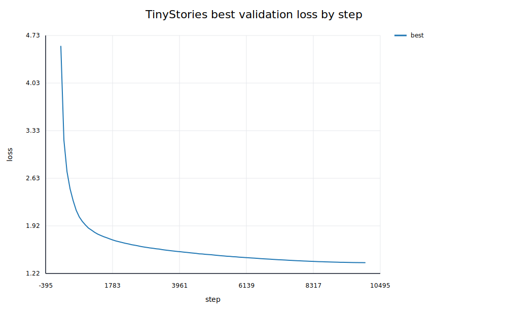

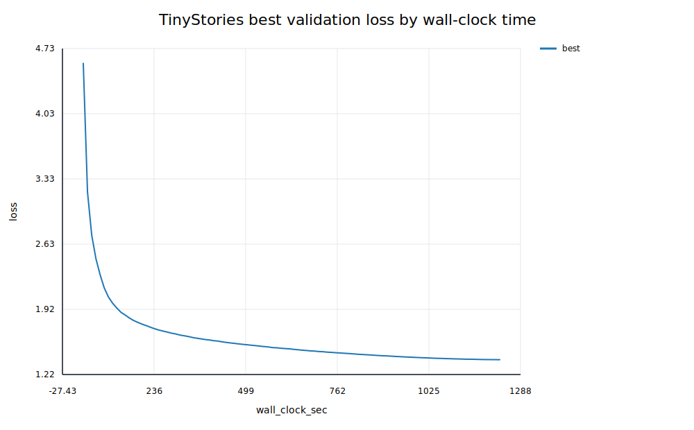

- 学习率扫描：稳定候选中 <code>1e-3</code> 的最终 validation loss 为 1.839482，优于 <code>3e-4</code> 的 2.301235 和 <code>1e-4</code> 的 2.830893；LR=30 在第 23 step 因 non-finite train loss 发散。记录见 [logs/lr_sweep/](logs/lr_sweep/)。

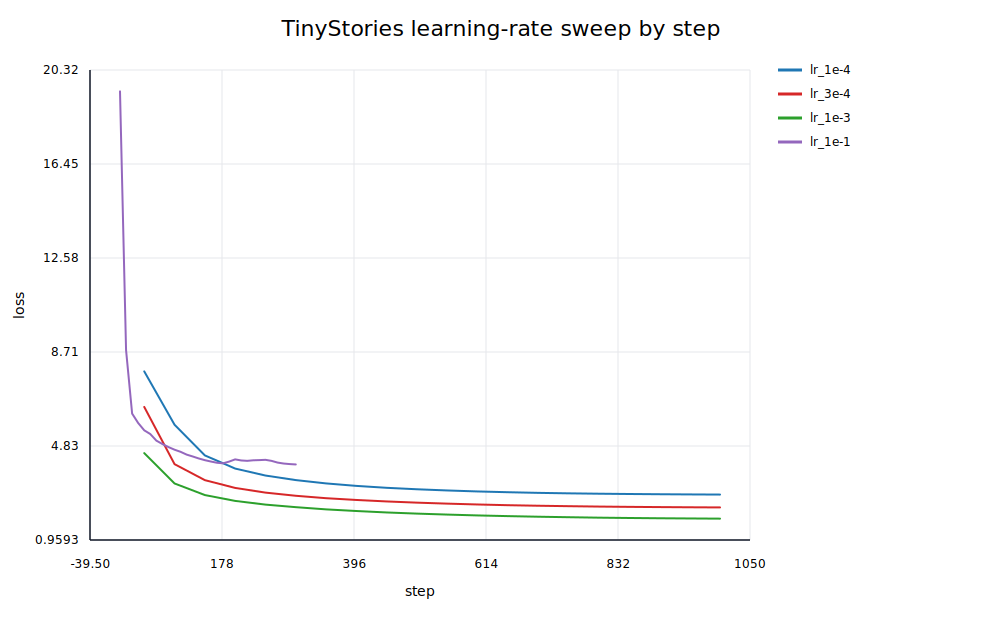

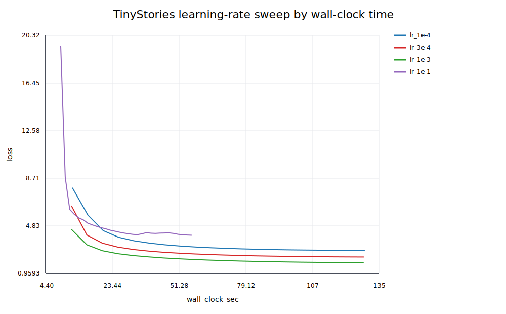

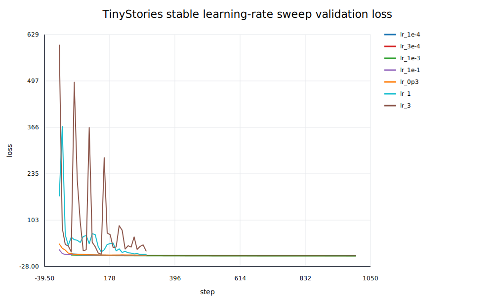

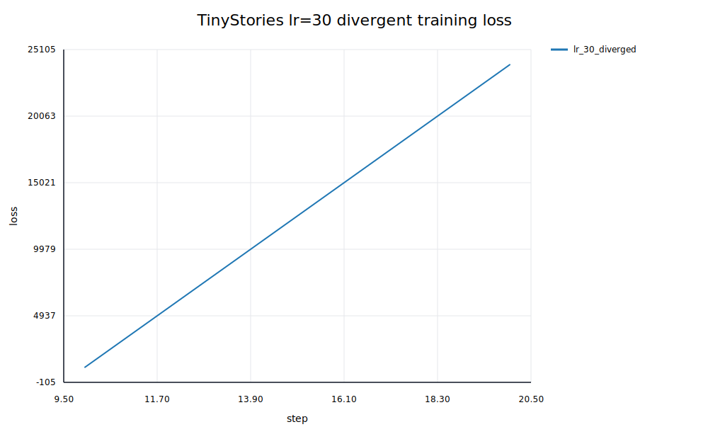

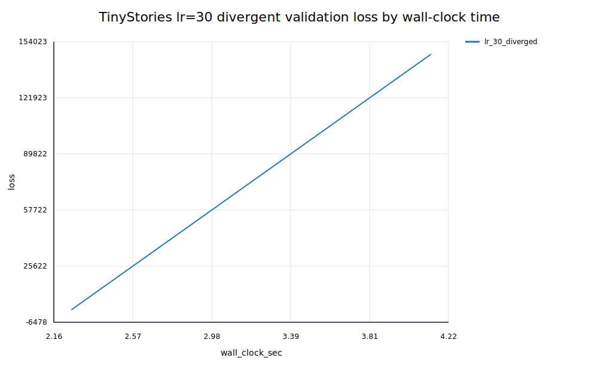

- Batch size：在固定 token budget 下，batch size 1、64、128 的最终 validation loss 分别为 2.594198、3.270224、3.765018；显存探测的最大 micro batch 是 682。记录见 [logs/batch_size/](logs/batch_size/)。

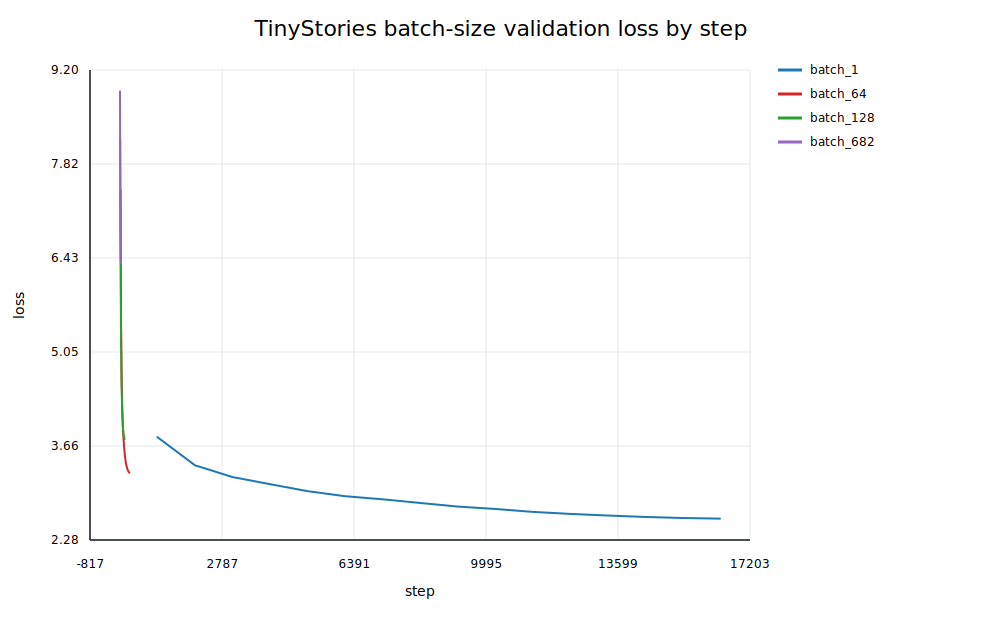

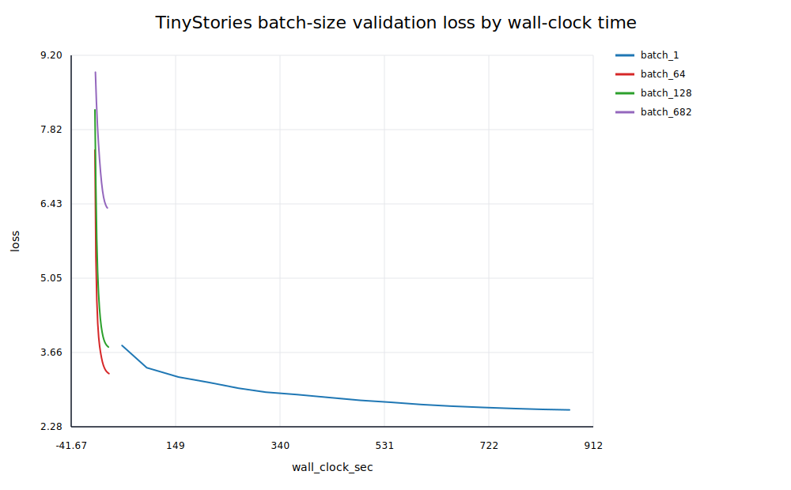

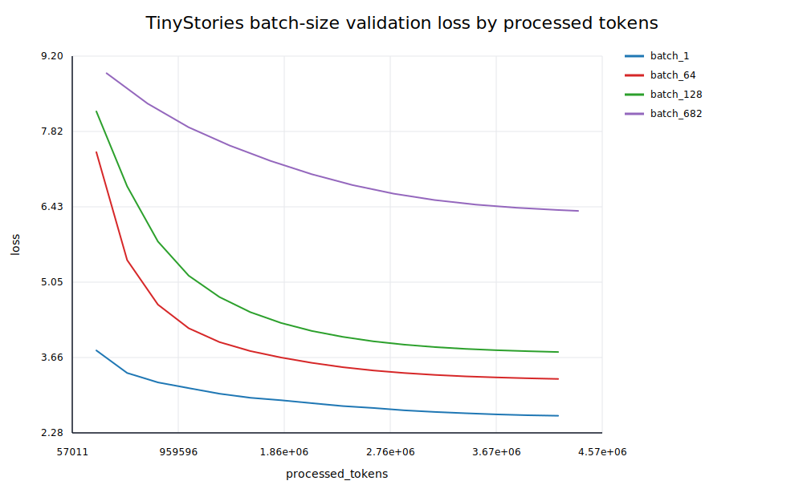

- 架构消融：相对 TinyStories 主实验，NoPE 的最终 validation loss 为 1.433919，等参数量 SiLU 为 1.396898，无 RMSNorm 为 1.394259，Post-Norm 为 1.371246。结果和曲线见 [logs/ablations/](logs/ablations/) 与 [assets/tinystories_ablations_val_step.svg](assets/tinystories_ablations_val_step.svg)。

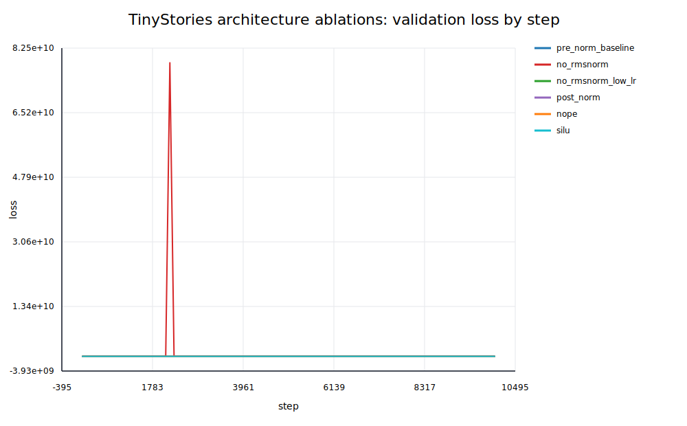

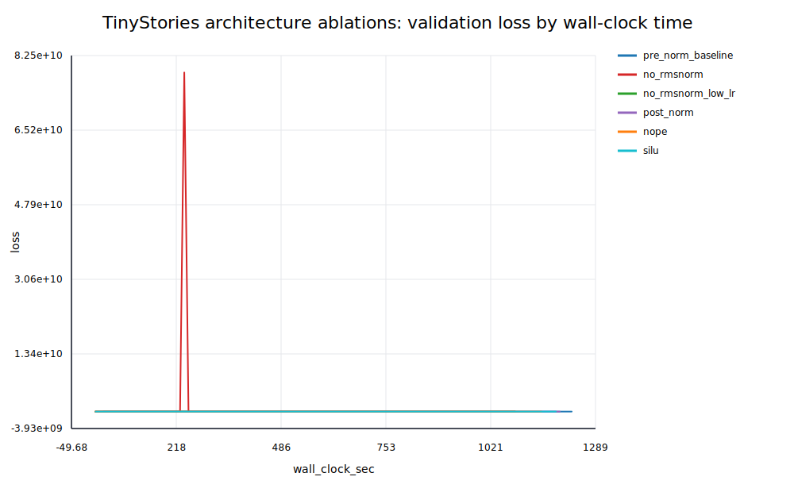

- OWT 主实验：相同训练步数下最终 validation loss 为 4.315474。由于 OWT 与 TinyStories 使用不同 tokenizer 和词表，raw per-token loss 不作直接横向优劣判断；详细记录见 [logs/owt_baseline/](logs/owt_baseline/)。

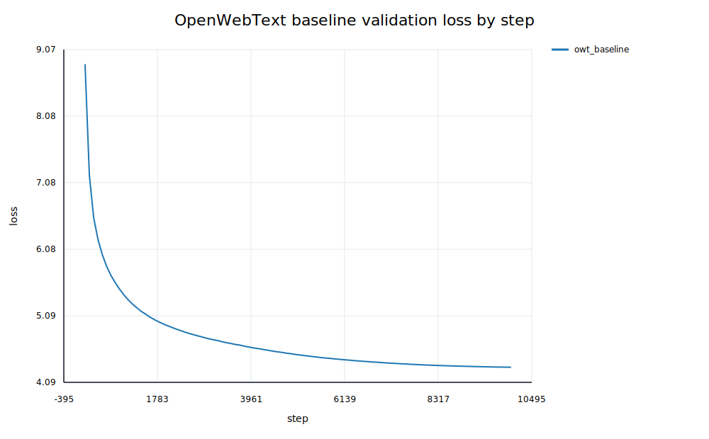

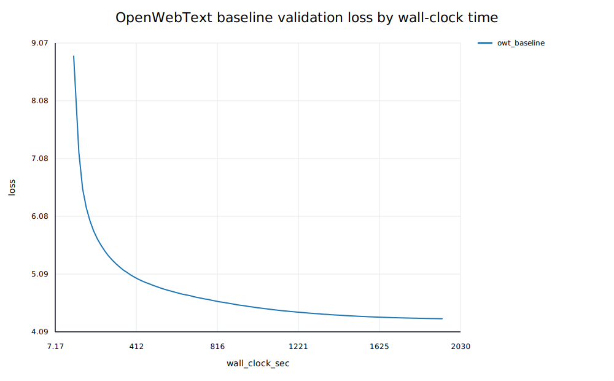

- 文本生成：TinyStories 使用 prompt <code>Once upon a time</code>、temperature 0.8、top-p 0.95、seed 42，生成 158 个 token 后遇到 EOT；OWT 使用 prompt <code>The</code> 和相同采样参数，生成 256 个 token 未遇到 EOT。原始公开样本及 metadata 在 [logs/generation/](logs/generation/)。
- 书面题：Unicode、Transformer 参数/FLOPs 和 AdamW 显存/时间推导整理在飞书补充文档；公开仓库仅保留可复核结论与实验日志。

## 飞书补充文档

- 链接：https://fudan-nlp.feishu.cn/docx/SzF0dp25to0mD1xNCzocWZRqnmb?from=from_copylink

## 问题与收获

- BPE 训练通过增量维护 pair count 和受影响 pre-token 的倒排索引，避免每次 merge 都全量扫描。
- checkpoint 除模型参数外还需要保存 optimizer state、sampler state、processed tokens、累计墙钟时间和配置签名，才能可靠恢复训练。
- batch size 比较必须同时报告 optimizer steps、processed tokens 和 wall-clock；不同 tokenizer/语料的 raw loss 不能脱离 bytes/token 与生成质量直接比较。
- 公开提交只保留 <code>config.json</code>、<code>metrics.jsonl</code>、<code>summary.json</code>、轻量汇总 JSON、SVG 曲线和生成 metadata；不复制 Slurm 输出、原始 <code>.log</code>、数据集、checkpoint 或内部资源信息。

## 自检

- [x] 本 PR 只包含我本人本次作业的文件。
- [x] 我已按正式题面执行测试并如实记录结果。
- [x] GitHub 内容可以公开，且不含内部主机名、IP、账号、路径、数据或未公开项目。
- [x] GitHub 和飞书正文都不含 Secret、Token、Cookie、密码或私钥。
- [x] 飞书补充文档待上传；上传后将设置为组织内公开且不启用互联网公开访问。
