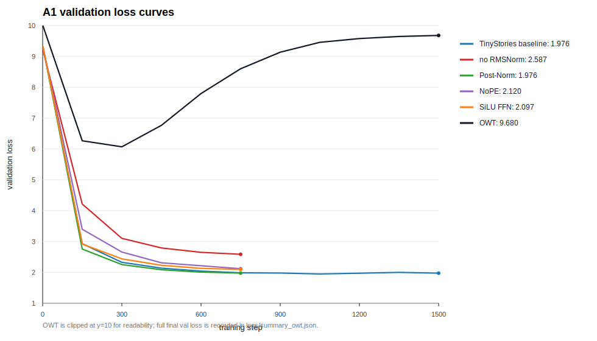

# A1 公开提交：陈匡巍

> 本文件和同目录代码公开可见。只提交允许公开且已经脱敏的内容；组织内材料放在下方登记的飞书补充文档中，密钥和访问凭据不进入任何提交材料。

## 基本信息

- 作业题面版本：26.0.4
- 上游 starter commit：`a158843b20107949f1a8d7df1b05cd33b9166712`
- 本地工作仓库：`../assignment1-basics`，与 `SummerQuest-2026` 同级
- 官方测试：`python3 -m pytest -q`，结果为 `47 passed, 1 xpassed`
- 实验设备：`PPU-ZW810`，单卡 96GB，经 PyTorch `cuda` backend 使用

本次提交覆盖 21 个 adapter 接口的 from-scratch 实现、BPE tokenizer、Transformer LM、AdamW、训练/验证/生成脚本，以及 TinyStories、学习率、batch size、四个架构消融和 OWT 的实验日志。TinyStories baseline 采用题面允许的低资源预算：`49.15M` processed tokens，最终 validation loss 为 `1.9760`。

评分标准与评测方式见 [A1 EVALUATION](../../../../assignments/A1/EVALUATION.md)；日志格式见 [A1 题面《实验日志格式》](../../../../assignments/A1/README.md#实验日志格式)。

## 书面题

### `unicode1`

Unicode code point 是字符的抽象编号，例如 `牛` 是 `U+725B`。UTF-8 是把 code point 写成 byte 序列的编码方式，例如 `牛`.encode("utf-8") 得到三个 byte：`E7 89 9B`。Python 中 `len("牛") == 1`，但 `len("牛".encode("utf-8")) == 3`，说明“字符数”和“byte 数”不是同一件事。

### `unicode2`

Byte-level BPE 从 256 个单 byte token 出发，因此任意 UTF-8 文本都可以被表示，不会出现传统词表意义上的 OOV。解码时不能逐 token 单独 UTF-8 decode，因为一个 Unicode 字符可能被拆在多个 byte token 中；正确做法是先拼接全部 token bytes，再整体用 UTF-8 decode，并对非法片段使用 replacement character 处理。

### AdamW 显存、FLOPs 与时间核算

AdamW 对每个参数维护参数本身、梯度、一阶矩 `m` 和二阶矩 `v`。若全部为 fp32，训练时至少约为：

```text
parameter 4 bytes + gradient 4 bytes + m 4 bytes + v 4 bytes = 16 bytes / parameter
```

实际峰值还包括激活、临时 buffer、框架状态和可能的 master weights。本次 TinyStories baseline 配置为 `d_model=512`、4 层、16 头、context length 256、batch size 128、1500 step，共处理：

```text
1500 * 128 * 256 = 49,152,000 tokens
```

训练耗时 `250.84s`，峰值显存约 `15.23GB`。AdamW 单次更新主要由 weight decay、两个动量更新、bias correction、sqrt/divide 和参数更新组成，粗略为十余次 elementwise FLOPs/parameter；相对 Transformer forward/backward 的矩阵乘法成本较小。

## 实现说明

真实实现放在 `submission/cs336_basics/adapters_impl.py`，`submission/tests/adapters.py` 只负责导入和转发。实现覆盖：

- BPE 训练、special token 处理、`encode` / `decode` / `encode_iterable`
- `Linear`、`Embedding`、`RMSNorm`、`SiLU`、`SwiGLU`
- RoPE、masked scaled dot-product attention、causal multi-head self-attention
- Pre-Norm Transformer block 和完整 decoder-only Transformer LM
- stable softmax、cross-entropy、global gradient clipping、cosine schedule、自写 AdamW、checkpoint save/load
- 可配置训练/消融/生成脚本：`submission/scripts/run_a1_experiments.py`

BPE 训练使用 pair count 与受影响 pre-token 的增量更新，避免每轮全量复制所有 token 序列；官方 `test_train_bpe_speed` 和正确性测试均通过。实验脚本中的训练 optimizer 也使用 `get_adamw_cls()` 返回的自写 AdamW，而不是 `torch.optim.AdamW`。

## 实验设置

数据使用公开文件的固定切片，并在各文件内部做 train/validation split：

- TinyStories：`TinyStoriesV2-GPT4-valid.txt` 全部可用文本，`22,493,387` 字符
- OWT：`owt_valid.txt` 前 `5,000,000` 字符

主要模型配置：

```text
TinyStories vocab size: 10,000
OWT vocab size: 32,000
context length: 256
d_model: 512
d_ff: 1,344
layers / heads: 4 / 16
RoPE theta: 10,000
baseline batch size: 128
baseline steps: 1,500
```

`logs/` 中不包含原始数据、tokenizer pickle、NumPy token ids、checkpoint、模型权重或内部路径。

## Tokenizer 实验

| 数据 | 训练切片 | bytes | tokens | compression ratio | longest token | throughput |
| --- | ---: | ---: | ---: | ---: | ---: | ---: |
| TinyStories 10K | 22,493,387 chars | 500,170 | 121,542 | 4.12 bytes/token | 15 bytes | 459,321 bytes/s |
| OWT 32K | 5,000,000 chars | 503,943 | 109,652 | 4.60 bytes/token | 142 bytes | 393,913 bytes/s |

OWT 的词表更大，因此在 500K 字符评估片段上压缩率高于 TinyStories；同时 OWT 的最长 token 明显更长，说明网页文本中存在较长重复片段、URL/标点组合或格式片段。TinyStories 语体更规整，但 10K 词表上最长 token 更短。

## TinyStories Baseline



| metric | value |
| --- | ---: |
| processed tokens | 49,152,000 |
| final train loss | 1.1525 |
| final validation loss | 1.9760 |
| best recorded validation loss | 1.9491 |
| train time | 250.84s |
| peak memory | 15.23GB |

该 run 使用约 49M tokens，超过题面低资源方案的约 40M tokens 参考线；最终 validation loss `1.9760` 低于低资源目标 `2.00`。训练曲线从 step 150 的 val loss `2.9308` 降到 step 1050 的 `1.9491`，后续在 `1.97-2.00` 附近波动，说明继续训练收益开始变小。

## Learning Rate Sweep

| max LR | processed tokens | final val loss | 结论 |
| ---: | ---: | ---: | --- |
| 0.0003 | 9,830,400 | 2.8774 | 偏保守，下降较慢 |
| 0.001 | 9,830,400 | 2.5664 | 短 run 最好，选作 baseline |
| 0.003 | 9,830,400 | 2.6323 | 接近但略差 |
| 0.01 | 9,830,400 | 3.2085 | 明显变差 |
| 0.03 | 9,830,400 | 3.7990 | 不稳定 |
| 0.1 | 9,830,400 | 3.9434 | 不稳定 |
| 1.0 | 9,830,400 | 6.5496 | 发散 |
| 10.0 | 9,830,400 | 69.0468 | 严重发散 |

`0.001` 在 300-step sweep 中最好，因此 baseline 使用 `max_lr=0.001`。`10.0` 的 train loss 在后期达到几十到上百，validation loss 为 `69.0468`，满足“至少一个发散 run”的要求。

## Batch Size Sweep

| batch size | processed tokens | final val loss | peak memory | 结论 |
| ---: | ---: | ---: | ---: | --- |
| 1 | 25,600 | 5.0803 | 0.48GB | 每步 token 太少，噪声大 |
| 64 | 1,638,400 | 3.8727 | 7.80GB | 可稳定训练 |
| 128 | 3,276,800 | 3.8269 | 15.24GB | baseline batch |
| 256 | 6,553,600 | 3.6383 | 30.11GB | 更稳定 |
| 512 | 13,107,200 | 3.5793 | 59.87GB | 本设备稳定上限 |
| 768 | 196,608 before failure | OOM | >89GB observed | 完整 loop 中 OOM |

在固定 100 step 下，较大 batch 因每步处理 token 更多，validation loss 更低。`768` 在单步探测中接近 90GB，完整训练/验证阶段触发 OOM，因此本设备上可复现的稳定上限按 `512` 记录。

## 架构消融

所有消融使用 TinyStories、同一 tokenizer 和同一模型主配置，训练 `750` step、`24.58M` processed tokens。SiLU FFN 使用 `d_ff=2016`，使实际参与计算的 FFN 矩阵规模与 SwiGLU 近似匹配。

| run | final val loss | 观察 |
| --- | ---: | --- |
| baseline 750-step checkpoint | 1.9874 | 对照点来自主训练 step 750 |
| no RMSNorm | 2.5874 | 明显退化，训练更慢 |
| Post-Norm | 1.9763 | 该预算下与 Pre-Norm 接近 |
| NoPE | 2.1196 | 退化，说明位置信息有帮助 |
| SiLU FFN | 2.0968 | 退化，SwiGLU 在本设置下更优 |

No RMSNorm 是影响最大的消融；NoPE 和 SiLU FFN 均比 baseline 差。Post-Norm 在这个低资源预算里没有显著变差，可能与模型较小、训练步数有限和验证噪声有关，不能据此推出 Post-Norm 在更长训练中优于 Pre-Norm。

## OWT 训练

OWT 使用 `32K` tokenizer，并使用与 TinyStories baseline 相同的模型架构、batch size 和 `1500` training iterations。

| metric | value |
| --- | ---: |
| processed tokens | 49,152,000 |
| final train loss | 0.1489 |
| final validation loss | 9.6800 |
| train time | 333.53s |
| peak memory | 26.31GB |

OWT 的 validation loss 在 step 300 降到 `6.0694` 后开始上升，最终达到 `9.6800`，而 train loss 持续下降到约 `0.15`。这说明在仅 5M 字符 OWT 切片上，32K tokenizer 使 token 序列较短，1500 steps 反复采样后很快过拟合训练 split。这个结果也说明 OWT 比 TinyStories 更需要更大的训练语料或更强正则/更短训练预算。

## 文本生成样本

### TinyStories

Prompt：

```text
Once upon a time
```

Sample：

```text
Once upon a time, there was a humble cat named Tom. Tom loved to play with his hoop. He would roll it around the garden and watch it roll on the ground. Tom's friends, a dog named Max, saw him playing with the hoop.
One day, Tom was playing with the hoop in the garden. He kicked it high into the air and it moved! Tom was sad and confused. He didn't know what to do.
Just then, a big gust of wind came through the window. It was a magic kick! Tom and Max ran after the ball and found it near a big tree. They were so happy! Tom learned that even when things go by, it's good to listen to them.
<|endoftext|>
```

简评：样本具有 TinyStories 风格的人物、物品、简单冲突和结尾，语法基本通顺；仍存在因果关系不稳的问题，例如 “magic kick” 和最后一句的含义不够自然。影响生成质量的主要因素包括训练 token 数、模型规模、采样温度/top-p，以及 TinyStories 数据本身偏短篇童话的分布。

### OWT

Prompt：

```text
The
```

Sample excerpt：

```text
The worst of the world "was only the best young Jews" and " weird liberalism" in their fifth place, with over 200human rights in the U.S. Asmara. upon the minority report, he follows:

“When could Democrats entered into an assassination, they had a man whose character is over in the general election and simply where Trump is officially the way of a political struggle to curb against it.

It is difficult for men here and Jewish families to have an abortion - theocrats who were facing the camera to wishingly:

First off contact with the Black Lives Matter Insurance Repe have begun to expose the NDP - the party has not announced "guilty's economy".
```

简评：OWT 样本呈现了网页语料常见的政治、新闻和评论式片段，词汇和局部短语比随机初始化模型更像自然文本，但跨句主题频繁跳转，语法和事实关系不稳定。这与 OWT 实验的训练/验证曲线一致：模型在 5M 字符切片上快速记住训练 split，却没有形成稳定泛化。完整 OWT 样本记录在 `logs/generation_sample_owt.json`。

## 复现说明

官方测试命令：

```bash
cd ../assignment1-basics
python3 -m pytest -q
```

实验命令：

```bash
cd ../assignment1-basics
python3 scripts/run_a1_experiments.py \
  --output runs/a1_formal \
  --device cuda \
  --tinystories data/TinyStoriesV2-GPT4-valid.txt \
  --owt data/owt_valid.txt \
  --tiny-max-chars 50000000 \
  --owt-max-chars 5000000 \
  --tiny-vocab-size 10000 \
  --owt-vocab-size 32000 \
  --context-length 256 \
  --d-model 512 \
  --d-ff 1344 \
  --num-layers 4 \
  --num-heads 16 \
  --batch-size 128 \
  --total-steps 1500 \
  --max-lr 0.001 \
  --min-lr 0.0001 \
  --warmup-steps 150 \
  --val-interval 150 \
  --val-batches 8 \
  --lr-values 0.0003,0.001,0.003,0.01,0.03,0.1,1.0,10.0 \
  --lr-sweep-steps 300 \
  --batch-sizes 1,64,128,256,512,768 \
  --batch-sweep-steps 100 \
  --ablation-steps 750 \
  --owt-steps 1500
```

同步命令：

```bash
cd ../SummerQuest-2026
python3 scripts/sync_a1_submission.py --name '陈匡巍'
```

## 实验日志

- 总览：`logs/summary.json`
- Tokenizer：`logs/tokenizer_stats.json`
- TinyStories 主训练：`logs/train_tinystories.jsonl`、`logs/summary_tinystories.json`
- LR sweep：`logs/lr_sweep/`
- Batch size：`logs/batch_size/`
- 四个消融：`logs/ablation_*.jsonl`、`logs/summary_ablation_*.json`
- OWT：`logs/train_owt.jsonl`、`logs/summary_owt.json`
- 文本生成：`logs/generation_sample.json`、`logs/generation_sample_owt.json`

JSONL 中逐点记录 `step`、`wall_clock_sec`、`train_loss`、`lr`，并在验证点记录 `val_loss`；summary 文件记录最终 validation loss、训练时间、processed tokens、峰值显存和关键配置。

## 飞书补充文档

- 链接：https://lako5livxd0.feishu.cn/wiki/Y2cIw8TNGioGcek6RImcJPNdnre?from=navigation

该文档设置为组织内公开，未开启互联网公开访问，只保存不能公开到 GitHub 但确有审核必要的最小差量材料。GitHub 和飞书正文均不保存 Secret、Token、Cookie、密码或私钥。
