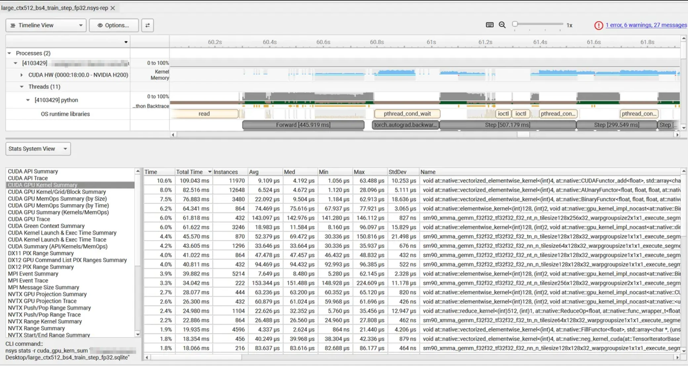
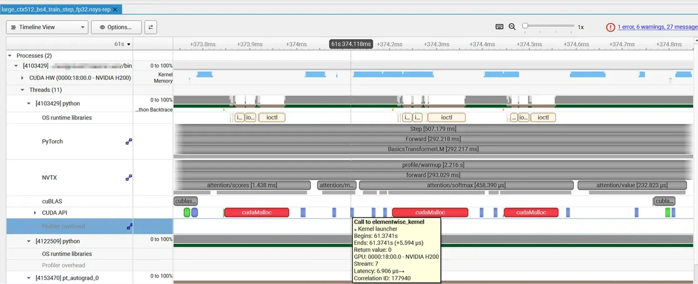
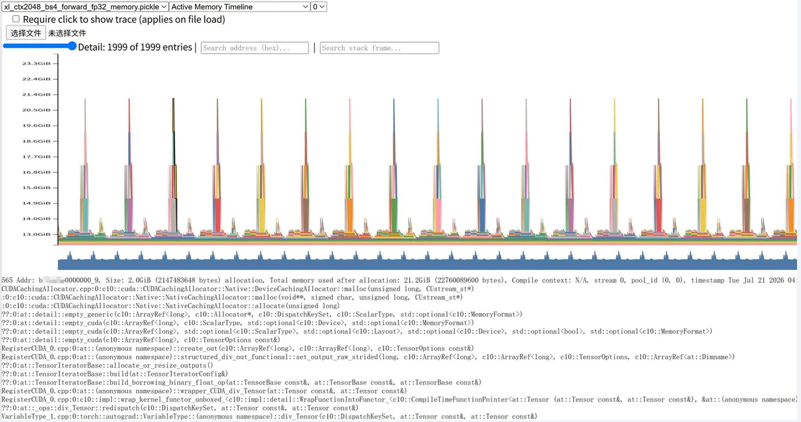
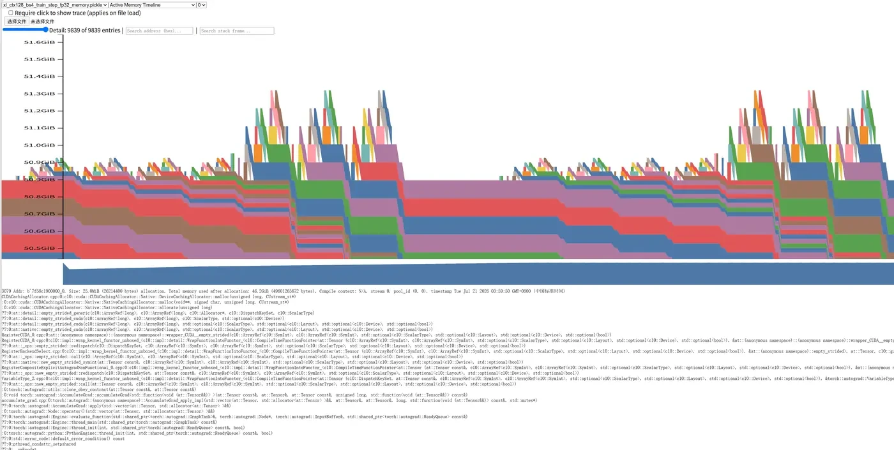
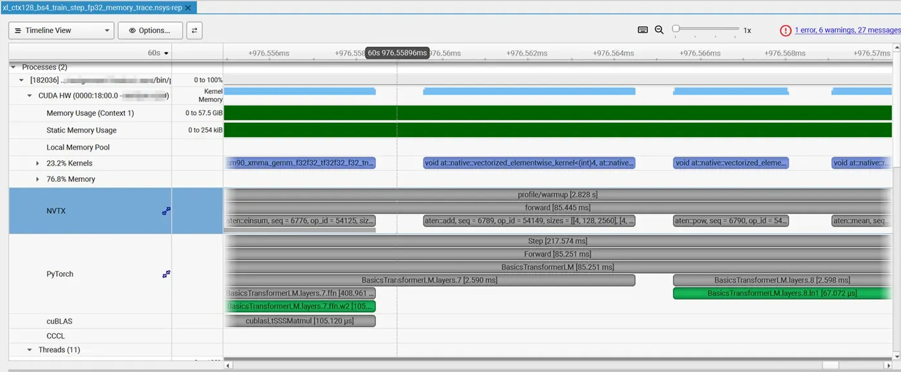

# A2-P 公开提交：陈博闻

> 本文件和同目录代码、汇总、图片公开可见。只提交允许公开且已经脱敏的内容；大型 profiler 原始文件留在个人工作目录，组织内差量材料放入下方登记的飞书补充文档。密钥和访问凭据不进入任何提交材料。

> 正式要求参考 `assignments/A2-P/README.md` 候选题面版本 `26.1.4-rc.3`。本报告只覆盖 A2-P Profiling 子作业，不包含 A2-K 的 checkpointing、Triton kernel 或并行训练内容。

## 基本信息

- 作业题面版本：`26.1.4-rc.3`
- 完成范围：End-to-End Benchmark、Compute Profiling、Mixed Precision、Memory Profiling
- 未完成项：XL/context 2048 完整 train_step 在 batch size 4 下 OOM，已记录失败并按题面 fallback 缩到 batch size 1 成功复跑
- 上游 starter commit：`ca8bc81a59b70516f7ebb2da4808daade877c736`
- 本地工作仓库：`../assignment2-systems`

## 环境与工具

| 项目 | 公开、脱敏的信息 |
| --- | --- |
| GPU | NVIDIA H200，约 139.8 GiB 显存 |
| Driver / CUDA | NVIDIA driver version 570.124.06；CUDA runtime 12.8 |
| PyTorch | 2.11.0+cu128 |
| Compute profiler | Nsight Systems CLI 2026.3.1；另采集一次 `torch.profiler`/Perfetto 交叉检查 |

## 1. End-to-End Benchmark

### 复现命令与计时方法

统一入口是 `submission/profiling/benchmark.py`。正式基准使用随机输入和随机目标，初始化、数据生成和 warm-up 不计入 measurement；每个被测 step 前后调用 CUDA 同步。三种 mode 的边界为：`forward` 只产生 logits，`forward_backward` 包含 loss 与 `backward()`，`train_step` 额外包含 AdamW step。

最小复现命令：

```bash
PYTHON_CMD=python bash profiling/run_benchmark_suite.sh
PYTHON_CMD=python bash profiling/run_warmup_sweep.sh
```

原始逐 step 数据见 [`results/benchmark.csv`](results/benchmark.csv)，运行命令、配置、环境版本与本地原始结果路径索引见 [`results/benchmark_metadata.json`](results/benchmark_metadata.json)。核心 FP32、batch size 4、context 512、warm-up 5、measurement 10 的统计如下；`raw timings` 列保留每个 measured step 的耗时，单位为秒。

| model | mode | raw timings s | mean s | std s | CV |
| --- | --- | --- | ---: | ---: | ---: |
| small | forward | 0.012580, 0.010765, 0.014614, 0.013745, 0.009983, 0.013309, 0.014658, 0.008891, 0.010800, 0.011237 | 0.012058 | 0.002007 | 0.1664 |
| small | forward_backward | 0.031733, 0.031722, 0.030862, 0.032024, 0.032125, 0.032392, 0.032632, 0.031791, 0.032103, 0.031562 | 0.031895 | 0.000488 | 0.0153 |
| small | train_step | 0.099691, 0.038774, 0.038845, 0.039180, 0.039093, 0.038718, 0.038282, 0.038279, 0.038910, 0.039088 | 0.044886 | 0.019259 | 0.4291 |

同一脚本还采集了 medium、large、xl 的三种 mode，用于观察规模变化；完整行和每步耗时都在 [`results/benchmark.csv`](results/benchmark.csv) 中。

### Warm-up 对照

small/context 512/train_step 在 warm-up 0 时 mean 为 0.120789s，std 为 0.203204s；warm-up 5 时 mean 为 0.047014s，std 为 0.018726s。无 warm-up 会把 CUDA context、allocator、kernel library 加载等一次性成本混入正式测量，因此平均值和方差都明显偏大。

## 2. Compute Profiling

### 六个 `train_step` trace 与命令

A2-P 要求的六个 trace 使用 `small` 与 `large` 两个模型规模，context length 为 256、512、1024，均为 batch size 4、FP32、完整 `train_step`，每个 trace 捕获一个 warm-up 后的 measurement step。kernel/API 轻量汇总见 [`results/profile/trace_summary.csv`](results/profile/trace_summary.csv)，NVTX 阶段汇总见 [`results/profile/stage_summary.csv`](results/profile/stage_summary.csv)，脱敏 metadata 见 [`results/profile/run_metadata.json`](results/profile/run_metadata.json)。

```bash
PYTHON_CMD=python NSYS_CMD=nsys bash profiling/run_nsys_suite.sh
```

阶段标记包含 `profile/warmup`、`profile/measure`、`forward`、`backward`、`optimizer`，并通过运行时替换 attention 函数加入 `attention/scores`、`attention/softmax` 和 `attention/value`。完整 `.nsys-rep`、SQLite 和 stats 日志保留在本地，不进入 GitHub。

### Kernel、Calls 与时间线



六个 train-step trace 的 CUDA GPU Kernel Summary 显示，完整训练步中除了 GEMM 外，elementwise add/mul、copy、mask、reduction 也占据显著累计 GPU 时间。以 `large/context512/train_step` 为代表，最高累计项是 elementwise add 类 kernel，调用次数达到万级；这与 optimizer update、反向传播中的逐元素梯度操作和 LayerNorm/activation 相关操作增多一致。

代表配置 `large/context512/batch4/fp32/train_step` 的 NVTX 阶段时长来自本地 Nsight SQLite 的 `NVTX_EVENTS` 表，只提交脱敏轻量汇总，不提交 SQLite 本体：

| stage range | ranges | total ms | avg ms | max ms |
| --- | ---: | ---: | ---: | ---: |
| forward | 1 | 97.092806 | 97.092806 | 97.092806 |
| backward | 1 | 171.462799 | 171.462799 | 171.462799 |
| optimizer | 1 | 108.447146 | 108.447146 | 108.447146 |
| attention/scores | 36 | 6.186970 | 0.171860 | 0.232512 |
| attention/softmax | 36 | 3.774991 | 0.104861 | 0.145025 |
| attention/value | 36 | 6.843513 | 0.190098 | 0.839461 |

这个配置里 backward 阶段最长，其次是 optimizer 和 forward。attention 三个子阶段是 forward 内部的局部范围，`scores` 和 `value` 对应两次矩阵乘法，`softmax` 对应 reduction/elementwise 组合；长 context 时 softmax 仍会受完整 attention matrix 的读写影响。



在 attention 子范围内，`attention/scores` 和 `attention/value` 主要对应矩阵乘法，`attention/softmax` 则由 max/sum/exp/div 等 reduction 与 elementwise kernel 组成。softmax 的 FLOPs 远少于 matmul，但在 naive 实现中会读写完整 attention matrix，长 context 下内存流量和多 kernel launch 使它并非可以忽略。

### 工具边界

本报告以 Nsight Systems 为主证据，使用 `nsys stats` 导出 CUDA GPU Kernel Summary 和 CUDA API Summary。`torch.profiler` 仅作为 PyTorch op、shape、memory 与 Perfetto 时间线的交叉检查；公开提交以 Nsight 轻量汇总和关键截图为主，不提交完整 Chrome trace。

## 3. Mixed Precision

### 四种累加实验

实际输出保存在 [`results/mixed_precision.json`](results/mixed_precision.json)，运行命令、ToyModel 配置、benchmark 配置、环境版本与本地原始结果路径索引见 [`results/mixed_precision_metadata.json`](results/mixed_precision_metadata.json)：

| case | output |
| --- | --- |
| FP16 accumulator, FP16 input | `tensor(9.9531, dtype=torch.float16)` |
| FP32 accumulator, casted FP16 input | `tensor(10.0021)` |
| FP32 accumulator, FP16 input | `tensor(10.0021)` |
| FP32 accumulator, FP32 input | `tensor(10.0001)` |

这说明误差有两类来源：FP16 输入的 `0.01` 本身已经被量化，即使用 FP32 累加也不能恢复；而 FP16 accumulator 还会在反复累加时引入额外舍入误差。FP32 accumulator 能显著降低累加过程的舍入漂移，但不能撤销输入量化已经造成的信息损失。

### FP32 与 BF16 autocast

ToyModel 的 BF16 autocast 结果显示：参数和梯度保持 FP32，第一层输出和 logits 为 BF16，LayerNorm 输出与 loss 为 FP32。这符合混合精度策略：matmul 交给低精度 Tensor Core，reduction/normalization 保留更稳定的 FP32 动态范围。

| tensor | BF16 autocast dtype |
| --- | --- |
| parameter | `torch.float32` |
| fc1 output | `torch.bfloat16` |
| LayerNorm output | `torch.float32` |
| logits | `torch.bfloat16` |
| loss | `torch.float32` |
| gradient | `torch.float32` |

| model | mode | FP32 mean s | BF16 mean s | BF16/FP32 | FP32 peak allocated GiB | BF16 peak allocated GiB | FP32 peak reserved GiB | BF16 peak reserved GiB |
| --- | --- | ---: | ---: | ---: | ---: | ---: | ---: | ---: |
| small | forward | 0.008805 | 0.010790 | 1.225 | 0.7349 | 0.9107 | 0.8848 | 0.9473 |
| small | forward_backward | 0.032175 | 0.028444 | 0.884 | 4.1075 | 3.2886 | 4.3047 | 3.5234 |
| xl | forward | 0.078753 | 0.064545 | 0.820 | 13.4661 | 19.4256 | 13.6309 | 19.9121 |
| xl | forward_backward | 0.290834 | 0.216336 | 0.744 | 40.2016 | 37.3358 | 41.5371 | 43.3047 |

BF16 对大模型更稳定地加速，尤其是 XL 的 forward/backward。小模型中 launch overhead 和非 matmul kernel 占比更高，因此 BF16 forward 不一定总是更快。

## 4. Memory Profiling

### 配置、峰值与 fallback

峰值表见 [`results/memory/peaks.csv`](results/memory/peaks.csv)，metadata 见 [`results/memory/run_metadata.json`](results/memory/run_metadata.json)。XL/context 2048 的 forward-only 成功，但 batch size 4 的完整 train_step 在 FP32 和 BF16 下都 OOM，失败发生在 naive attention 物化 `QK^T` attention scores 附近；该失败作为结果保留，没有改标签伪装成较小配置。按题面 fallback 规则，随后将 XL/context 2048/train_step 缩到 batch size 1，FP32 和 BF16 都成功完成。

`peak allocated` 与 `peak reserved` 来自 `torch.cuda.max_memory_allocated/reserved`；`active peak` 来自 PyTorch memory history snapshot 的 `device_traces` 重放。重放方法写入 [`results/memory/run_metadata.json`](results/memory/run_metadata.json)，公开版不上传 snapshot pickle，只提交轻量数值与代表性裁剪截图。

| context | mode | dtype | active peak MiB | peak allocated MiB | peak reserved MiB | status |
| ---: | --- | --- | ---: | ---: | ---: | --- |
| 128 | forward | fp32 | 13241.7 | 13241.7 | 13258.0 | OK |
| 128 | train_step | fp32 | 52696.4 | 52697.2 | 58734.0 | OK |
| 2048 | forward | fp32 | 21834.4 | 21834.4 | 24040.0 | OK |
| 2048 | train_step | fp32 | - | - | - | OOM |
| 2048 | train_step | fp32, batch size 1 fallback | 93390.8 | 93397.8 | 95284.0 | OK |
| 128 | forward | bf16 | 19627.8 | 19628.0 | 19864.0 | OK |
| 128 | train_step | bf16 | 52686.3 | 52687.0 | 59794.0 | OK |
| 2048 | forward | bf16 | 25983.9 | 25984.4 | 28136.0 | OK |
| 2048 | train_step | bf16 | - | - | - | OOM |
| 2048 | train_step | bf16, batch size 1 fallback | 84509.8 | 84529.2 | 86330.0 | OK |

### Timeline、allocation 与 residual/gradient

OOM 失败配置的脱敏异常摘要也保存在 [`results/memory/peaks.csv`](results/memory/peaks.csv)：FP32 失败于 `forward attention/scores`，异常类型为 `torch.OutOfMemoryError`，当时尝试分配 `2.00 GiB`，GPU 剩余 `1.61 GiB`，进程占用 `138.20 GiB`，PyTorch 已分配 `135.98 GiB`；BF16 失败于 `forward attention/softmax`，尝试分配 `2.00 GiB`，GPU 剩余 `452.00 MiB`，进程占用 `139.36 GiB`，PyTorch 已分配 `138.36 GiB`。这些数字来自本地 OOM log 的脱敏摘要，完整 traceback 不提交。



XL/context 2048 forward-only 的 active memory timeline 呈现逐层抬升和 attention 相关尖峰。截图中最大单次 allocation 为 `2.0 GiB`，该点总 active memory 约 `21.2 GiB`；stack trace 显示路径经过 `CUDACachingAllocator::malloc`、`empty_cuda`、`empty_strided_cuda` 和 `div_Tensor`。这与 naive attention 需要物化并缩放 `[batch, heads, seq, seq]` attention scores 的二次方矩阵一致。



XL/context 128 的完整 train-step timeline 可完整观察 forward、backward 和 optimizer 阶段。截图中一个代表性 allocation 为 `25.0 MiB`，发生后总 active memory 约 `46.2 GiB`，调用栈经过 `CUDACachingAllocator::allocate`、`empty_strided_cuda`、`native_layer_norm_backward_cuda` 和 autograd wrapper。训练步峰值远高于 forward-only，因为 backward 需要保存 residual/activation，并在反向传播时同时产生梯度张量和 optimizer 状态访问。



按照 XL 参考超参数，residual stream tensor 在 batch size 4、context 2048、`d_model=2560`、FP32 下大小为 `4 * 2048 * 2560 * 4 / 1024^2 = 80 MiB`。Nsight memory trace 中 TransformerBlock 附近的 saved residual 释放与 gradient 产生方向一致：backward 会释放 forward 保存的 activation，同时生成参数梯度和中间梯度；在长 context 下，attention score 的二次方内存会盖过单个 residual stream 的线性内存。

## 5. 限制与复现

- 代码同步命令：`python3 scripts/sync_a2p_submission.py --name '陈博闻'`
- 轻量结果目录：`results/`
- 未提交的本地大型原始文件：Nsight `.nsys-rep`、SQLite、PyTorch memory snapshot pickle、Chrome trace；这些只保留在个人工作目录，助教抽查时按受控方式提供
- 已知限制：XL/context 2048 train_step 在 batch size 4 下 OOM，已按题面 fallback 缩到 batch size 1 并记录成功结果；本报告结果只用于 A2-P profiling，不用于 A2-K 的独立 4090/23GiB kernel 矩阵
- 最小复现步骤：

```bash
PYTHON_CMD=python bash profiling/run_benchmark_suite.sh
PYTHON_CMD=python bash profiling/run_warmup_sweep.sh
PYTHON_CMD=python NSYS_CMD=nsys bash profiling/run_nsys_suite.sh
PYTHON_CMD=python bash profiling/run_mixed_precision_suite.sh
PYTHON_CMD=python bash profiling/run_memory_suite.sh
PYTHON_CMD=python NSYS_CMD=nsys bash profiling/run_nsys_memory_trace.sh
```

## 飞书补充文档

- 链接：https://fudan-nlp.feishu.cn/wiki/QD26w72kPiHlv2kPNtHcupa7n1b

该文档设置为组织内公开，不得开启互联网公开访问，只保存不能公开到 GitHub 但确有审核必要的最小差量材料；不要机械复制公开报告，也不要随意上传大型 trace、snapshot 或凭据。

## 自检

- [x] 固定 starter commit 正确，工作仓库位于 `../assignment2-systems`。
- [x] 三种 benchmark mode、同步、warm-up 和统计口径完整。
- [x] 已用 nsys 完成两个模型规模、三个 context 的六个 `train_step` trace。
- [x] Profile 只提交轻量汇总和关键截图，未上传完整 trace。
- [x] mixed precision 同时覆盖累加误差、dtype、时间和显存。
- [x] memory profiling 覆盖规定矩阵或如实记录 fallback。
- [x] `README.md` 是完整 Markdown 主报告，所有数字都可追溯。
- [x] 代码、汇总和图片位于固定目录，文件类型与大小通过校验。
- [x] 未提交 trace、snapshot、权重、数据、压缩包、内部信息或凭据。
- [x] 飞书补充文档为组织内公开，未开启互联网公开访问。
