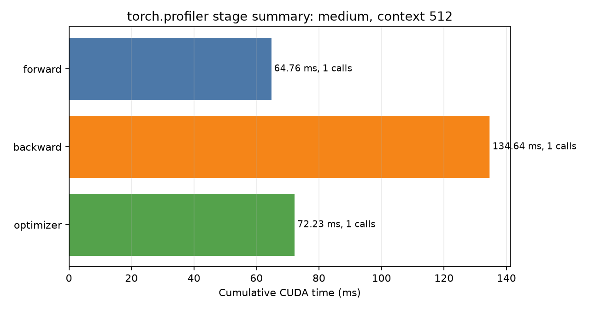
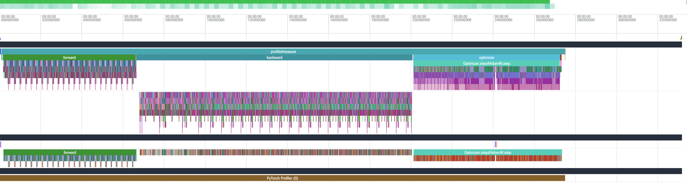
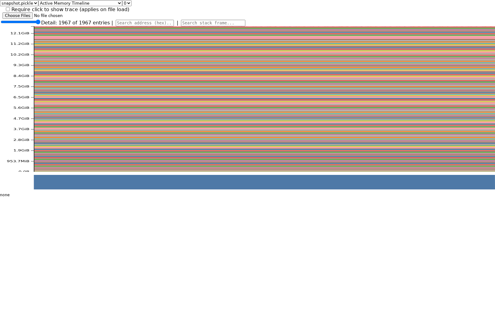
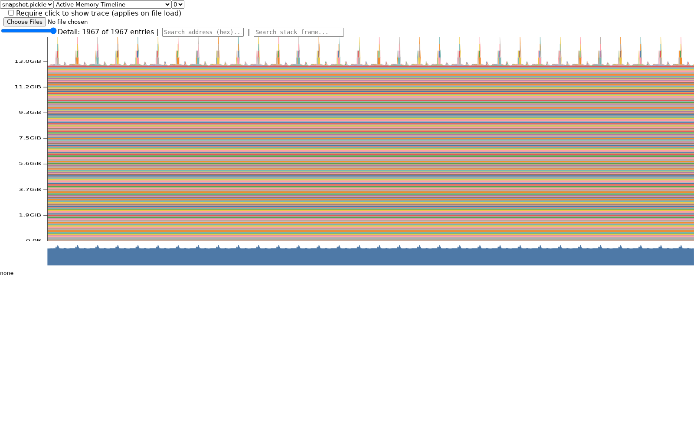
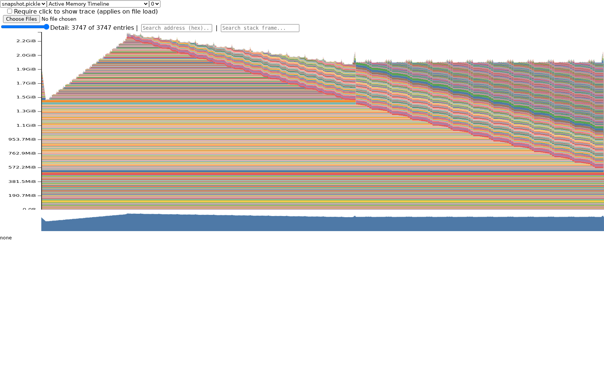

# A2-P 公开提交：雷梓一

> 本文件和同目录代码、汇总、图片公开可见。大型 Chrome trace、memory snapshot、Slurm 原始输出和运行环境均保留在个人工作区，不进入 GitHub；公开内容不包含主机名、IP、账号、内部路径、GPU UUID 或进程信息。

正式要求见 [`assignments/A2-P/README.md`](../../../../assignments/A2-P/README.md)，评分说明见 [`assignments/A2-P/EVALUATION.md`](../../../../assignments/A2-P/EVALUATION.md)。

## 基本信息

- 作业题面版本：`26.1.4-rc.3`
- 完成范围：End-to-End Benchmark、六组 Compute Profile、Mixed Precision Accumulation、ToyModel BF16 dtype、FP32/BF16 训练对照、XL forward memory timeline、规定 train-step OOM/fallback，以及补充的 TransformerBlock residual/gradient 诊断。
- 未完成项：受 24 GiB 单卡显存限制，XL/context 128、2048 及题面两级 fallback 的完整 FP32 `train_step` 均 OOM；已按题面保留失败配置、阶段、异常和峰值。未使用 Nsight Systems，统一使用题面同等接受的 `torch.profiler`。
- 上游 starter commit：`ca8bc81a59b70516f7ebb2da4808daade877c736`
- 上游固定快照：[stanford-cs336/assignment2-systems@ca8bc81](https://github.com/stanford-cs336/assignment2-systems/tree/ca8bc81a59b70516f7ebb2da4808daade877c736)

## 环境与工具

| 项目 | 公开、脱敏的信息 |
| --- | --- |
| GPU | NVIDIA GeForce RTX 4090，24 GiB |
| Driver / CUDA | Driver 560.28.03；PyTorch CUDA runtime 12.6 |
| Python / PyTorch | Python 3.13.14；PyTorch 2.11.0+cu126；cuDNN 9.1.0 |
| Compute profiler | `torch.profiler`，CPU/CUDA activities，Chrome trace 可由 Perfetto 阅读 |
| Memory profiler | PyTorch CUDA memory history、allocator snapshot、`memory_stats` |
| 其他限制 | starter 默认解析到 CUDA 13.0 wheel，但节点驱动只支持 CUDA 12.6；因此用不提交的独立 cu126 环境运行，保持 PyTorch 2.11.0 和 starter 源码不变。A800 请求长期无可用窗口，最终以 4090 结果提交。 |

## 1. End-to-End Benchmark

### 复现命令与计时方法

统一基线为 small、batch size 4、context 512、vocab 10,000、FP32、seed 1337。三种 mode 分别运行 5 个 warm-up 和 10 个 measurement step；`train_step` 另跑 warm-up 0。典型命令为：

```bash
python -m profiling.benchmark \
  --model-size small --batch-size 4 --context-length 512 \
  --mode train_step --warmup 5 --steps 10 --dtype fp32 \
  --device cuda --output results/benchmark_raw/small_ctx512_train_step_w5.json
```

模型初始化和随机数据生成在计时区间外。每个 warm-up/measurement step 结束后调用 `torch.cuda.synchronize()`；正式计时在 step 前后再次同步，并使用 `timeit.default_timer()`。`forward` 使用 `no_grad`；`forward_backward` 每步先清空梯度但不更新参数；`train_step` 覆盖 zero-grad、forward、loss、backward 和 AdamW step。全部 raw timing、命令、配置和统计量见 [`results/benchmark.csv`](results/benchmark.csv)。

### 结果

| Mode | Warm-up | Mean (ms) | Sample std (ms) | CV |
| --- | ---: | ---: | ---: | ---: |
| forward | 5 | 24.202 | 0.043 | 0.0018 |
| forward + backward | 5 | 80.765 | 0.190 | 0.0024 |
| train step | 5 | 90.599 | 0.159 | 0.0018 |
| train step | 0 | 125.394 | 107.000 | 0.8533 |

warm-up 5 的 `train_step` 十次 raw timing 为 90.563、90.443、90.595、90.608、90.463、90.894、90.413、90.745、90.490、90.771 ms；没有 warm-up 时首步为 429.898 ms，之后迅速下降到约 91 ms。这说明首步 CUDA context、kernel/library 初始化和 AdamW state 首次建立污染了总体均值；warm-up 后 CV 从 0.8533 降到 0.0018，稳定性显著提升。

由相同边界相减，backward 相关增量约为 56.562 ms，optimizer 增量约为 9.834 ms。这只是端到端差分，不等价于 kernel-exclusive time；后续 profile 用独立阶段事件进行归因。

## 2. Compute Profiling

### 六个 `train_step` trace 与证据口径

六个配置统一为 batch size 1、FP32、完整 `train_step`、5 次预热后捕获一个稳定 step：small 与 medium 分别配 context 256、512、1024。每次运行都导出本地 Chrome trace，并保留公开轻量汇总：[`trace_summary.csv`](results/profile/trace_summary.csv) 和 [`run_metadata.json`](results/profile/run_metadata.json)。命令形式如下：

```bash
python -m profiling.profile_runner \
  --model-size medium --batch-size 1 --context-length 512 \
  --mode train_step --warmup 5 --dtype fp32 --device cuda \
  --trace-output results/profile/medium_ctx512.json \
  --summary-output results/profile/medium_ctx512_summary.json \
  --output results/profile/unused.json
```

所有 trace 都标记了 `profile/warmup`、`profile/measure`、`forward`、`backward`、`optimizer`、`attention/scores`、`attention/softmax` 和 `attention/value`。真正的 5 个 warm-up step 在 profiler 收集开始前完成；trace 内的 `profile/warmup` 是紧邻 measurement 的零工作量边界标记，因此 op/kernel 汇总仍只覆盖一个稳定训练 step。阶段 GPU 时间使用同一被捕获 step 内的 CUDA Event；op/kernel Calls、累计 CPU/CUDA 时间来自 `torch.profiler.key_averages()`；时间线关系来自 Chrome trace。这样避免把 warm-up 工作混入汇总，也避免把自定义 range 本身的设备标记耗时误认为其所有子 kernel 的总时间。

| Model | Context | Forward CUDA (ms) | Backward CUDA (ms) | Optimizer CUDA (ms) |
| --- | ---: | ---: | ---: | ---: |
| small | 256 | 33.841 | 73.432 | 34.598 |
| small | 512 | 33.125 | 76.311 | 42.540 |
| small | 1024 | 34.595 | 72.170 | 48.220 |
| medium | 256 | 65.968 | 128.865 | 74.116 |
| medium | 512 | 64.763 | 134.640 | 72.232 |
| medium | 1024 | 65.181 | 126.749 | 75.549 |

短单步测量中模型规模的影响比 context 更明显；context 增长主要体现在 attention kernel，而当前朴素 AdamW 对大量参数逐张量更新，使 optimizer 仍占显著时间。图中 medium/context512 的阶段持续时间为 forward 64.8 ms、backward 134.6 ms、optimizer 72.2 ms。





该裁剪图直接在 Perfetto 中载入本地 `medium_ctx512.json` Chrome trace，并展开代表性的 CPU、CUDA stream 与 PyTorch Profiler 轨道；图中可直接看到 `profile/measure`、forward、backward 和 optimizer 的相对位置。公开版本裁掉了进程/线程编号、桌面、终端和内部路径。阶段的精确时长不从像素宽度估计，而使用同一 measurement step 的 CUDA Events 和机器可读汇总。

### Attention 与主要 kernel

每个 forward block 只调用一次三段 attention，因此 small 的 `scores/softmax/value` Calls 均为 12，medium 均为 24，恰好等于层数。small/context256 的累计 CUDA 时间分别为 1.533/1.203/0.295 ms，到 context1024 增至 2.589/2.733/1.094 ms；medium/context256 为 2.982/2.454/0.544 ms，到 context1024 增至 7.635/10.782/2.434 ms。softmax FLOPs 远少于两个矩阵乘，但 context1024 时耗时已与 scores 相当甚至更高，反映 reduction、指数运算和额外内存流量的低算术强度。

完整汇总中，medium/context1024 的 `aten::bmm` 为 651 Calls、累计 CUDA 71.766 ms，是最显著的聚合 op；`BmmBackward0` 相关累计 CUDA 约 44.723 ms。除矩阵乘外，`aten::mul`、除法/归一化、softmax 的 vectorized/reduction kernels，以及逐参数 AdamW elementwise kernels 都占有可见时间。训练步相较 forward-only 引入 backward matmul 和大量 optimizer elementwise 操作，所以矩阵乘不再独占端到端时间。

### 工具边界

`torch.profiler` 可同时捕获 CPU/CUDA activities、PyTorch op、kernel、stream 和自定义 range，Chrome trace 可在 Perfetto 中检查；但它不像 Nsight Systems 那样提供完整的系统级 CUDA API、OS runtime 与调用关联。因此报告不声称拥有 nsys 专属证据；阶段计时、op 聚合和时间线分别使用 CUDA Event、key averages 和 Chrome trace，三者口径在 metadata 中分开记录。

## 3. Mixed Precision

### 四种累加实验

按固定 PDF 原样运行四段累加，实际输出如下：

| 输入 / 累加器 | 结果 |
| --- | ---: |
| FP32 输入，FP32 accumulator | 10.0001335 |
| FP16 输入，FP16 accumulator | 9.9531250 |
| FP16 输入，隐式 FP32 accumulator | 10.0021362 |
| FP16 输入，显式转 FP32 accumulator | 10.0021362 |

FP16 accumulator 每次加法都要舍入，误差随迭代累积，因此偏差最大。后两种虽然使用 FP32 累加，仍先把 `0.01` 量化为 FP16，所以得到相同的约 0.00214 偏差；它们消除了低精度累加误差，但不能恢复输入量化丢失的信息。FP32 本身也不是十进制精确表示，因此第一种仍有很小误差。

### ToyModel dtype

ToyModel 使用 CUDA BF16 autocast，实际 dtype 为：参数 FP32、第一层输出 BF16、LayerNorm 输出 FP32、logits BF16、loss FP32、gradient FP32。Linear 可利用 Tensor Core 的 BF16 路径；LayerNorm 的均值、方差/归一化 reduction 需要更稳定的累加精度。BF16 与 FP32 具有相同指数位宽，动态范围优于 FP16，但尾数更短，因此 reduction 仍适合保留 FP32。

### FP32 与 BF16 autocast 对照

比较配置与基线一致：small、batch 4、context 512、5 次 warm-up、10 次 measurement、完整 train step。

| Dtype | Mean (ms) | Sample std (ms) | CV | Peak allocated (GiB) |
| --- | ---: | ---: | ---: | ---: |
| FP32 | 93.937 | 2.969 | 0.0316 | 5.043 |
| BF16 autocast | 86.519 | 5.048 | 0.0583 | 4.242 |

BF16 平均加速约 7.9%，峰值 allocated 降低约 15.9%；reserved 峰值两者均约 5.348 GiB，因为 caching allocator 会保留已经申请的 segment。这里速度收益仍有限，说明该 small 模型的 Python/launch、normalization、softmax 和 AdamW 开销显著；更大的矩阵通常更能摊薄这些开销。两组 loss 都呈下降趋势：FP32 从 7.6754 降到 3.3944，BF16 从 7.7217 降到 3.1109，十步均值分别为 5.5337 与 5.5214；这个短跑只说明 BF16 没有出现 NaN/Inf 或明显发散，不能据此推断最终模型精度相同。两组十次耗时都有可见波动，BF16 的 CV 更高，所以不能用单次数字宣称稳定加速。完整 raw timings、逐步 loss、dtype 与显存见 [`mixed_precision.json`](results/mixed_precision.json)。

## 4. Memory Profiling

### 配置、峰值与 fallback

memory history 在 warm-up 后开启；能够完成 measurement 的配置各自保存独立本地 snapshot，OOM 配置因为在 warm-up 内失败而无法生成 snapshot，但仍保留完整命令、失败阶段、异常类型和当时/峰值统计。公开只提交 [`peaks.csv`](results/memory/peaks.csv) 和脱敏后的 [`run_metadata.json`](results/memory/run_metadata.json)。active 是仍然存活的 tensor block，allocated 是 PyTorch 当前分配，reserved 是 caching allocator 向 CUDA 保留的 segment；表格展示三者峰值，CSV 同时保留 current 与 peak，二者不可混为同一口径。

| Model / context / mode | 状态 | Peak active (GiB) | Peak allocated (GiB) | Peak reserved (GiB) |
| --- | --- | ---: | ---: | ---: |
| XL / 128 / forward | 成功 | 12.846 | 12.846 | 12.859 |
| XL / 2048 / forward | 成功 | 14.947 | 14.947 | 15.486 |
| XL / 128 / train step | OOM | 22.927 | 22.927 | 23.072 |
| XL / 2048 / train step | OOM | 22.900 | 22.900 | 23.008 |
| XL / 1024 / train step（fallback 1） | OOM | 22.701 | 22.701 | 22.977 |
| Large / 2048 / train step（fallback 2） | OOM | 22.581 | 22.581 | 22.949 |
| Small / 512 / train step（补充诊断） | 成功 | 2.414 | 2.414 | 2.570 |

XL 两种 forward 均成功，但完整训练即使 context128 也 OOM，说明主要障碍首先是 FP32 权重、梯度和 AdamW 两个状态，而不只是长序列 activation。题面要求的两个 fallback 也真实执行并记录，没有静默改标签。XL/context2048 尝试额外申请 512 MiB 时失败；Large/context2048 尝试额外申请 320 MiB 时失败。





两图均直接由对应 allocator snapshot 通过 PyTorch `torch.cuda._memory_viz.trace_plot` 的 `Active Memory Timeline` 视图渲染，而不是由汇总数字重新画出的近似曲线。context128 主要表现为约 12.8 GiB 的稳定参数基线和较小的逐层临时峰；context2048 则出现重复的 attention 峰，最高接近 14.95 GiB，能从峰形辨认出长序列 forward 的逐层执行。规定的 XL train step 在 warm-up 内已经 OOM，因此没有伪造一个不存在的完整 XL train-step timeline。

### 最大 allocation 与理论核算

XL、batch1、context2048 的 residual stream tensor 大小为 `1 × 2048 × 2560 × 4 = 20,971,520` bytes，即 20 MiB。实际最大 recorded allocation 为 512 MiB，stack 指向 attention scores 的 `bmm/einsum`：32 heads 下 `1 × 32 × 2048 × 2048 × 4` bytes 正好是 512 MiB。context128 的同类 attention score 是 `1 × 32 × 128 × 128 × 4 = 2 MiB`，实际最大 recorded allocation 为 5 MiB，来自其他线性/临时张量；两者解释了 context2048 forward 峰值相对 context128 增加约 2.10 GiB，以及朴素 attention 的二次序列长度成本。

### Residual 与 gradient

由于 XL 训练无法完成，另以 small/batch1/context512 的完整 train step 观察机制，不将其冒充 XL。每个 TransformerBlock 通过 `saved_tensors_hooks` 记录 137,707,520 bytes（约 131.33 MiB）saved tensors，12 层合计约 1.539 GiB。backward 从最后一层向前执行；例如最后一层从 backward start 到 end，active memory 从约 2.371 GiB 降到 2.340 GiB，随后每层 residual 逐步释放，同时参数 gradient 被产生并保留，因而总量不是一次性归零。



这个观察与 autograd 生命周期一致：forward 期间 saved residual 随层数增长，backward 消费并释放当前层 residual，同时生成的参数 gradient 会继续存活到 zero-grad/optimizer 边界。补充配置的最大单次 allocation 为 30,720,000 bytes，stack 指向 backward 的 BMM，说明训练峰值同时受到 attention 中间量、saved tensors、gradient 和 optimizer state 影响。

## 5. 限制与复现

- 代码同步命令：`python3 scripts/sync_a2p_submission.py --name '雷梓一'`
- 轻量结果目录：`results/`
- 未提交的本地大型原始文件：六个 Chrome trace、五个成功 memory snapshot、Slurm stdout/stderr；均只保留在个人工作区，抽查时按指定受控方式提供。
- 已知限制：24 GiB 无法完成规定 XL/Large FP32 train step；A800 请求在可用时间内没有调度窗口；`torch.profiler` 不提供 nsys 完整系统级 CUDA API 关联。
- 最小复现：创建兼容节点驱动的 PyTorch 2.11.0+cu126 环境后，从仓库根目录执行 `python -m profiling.run_suite --phase benchmark --device cuda`、`--phase mixed`、`--phase profile`；memory 使用 `python -m profiling.memory_snapshot` 并按表格配置运行。
- 结果路径：benchmark 每行的 `result_file`、profile metadata 的 `trace_file`/`summary_file`、memory metadata 的 `snapshot_file`/`summary_file` 均是脱敏后的本地文件名；完整命令中的 `--output` 参数给出相对结果路径。
- 静态检查：`ruff check profiling` 与 `ty check profiling` 均通过；CPU tiny、GPU tiny、trace、BF16 和 snapshot smoke 均先于正式矩阵通过。

## 飞书补充文档

- 链接：[雷梓一 A2-P Profiling 补充材料](https://fudan-nlp.feishu.cn/docx/FKz0dgeRXoLzgax19RWcCA4pnQd)

该文档设置为组织内可见，仅保存公开报告之外的最小集群调度、原始文件保留与基础设施差量；未开启互联网公开访问，也未上传大型 trace、snapshot 或凭据。

## 自检

- [x] 本 PR 只包含本人本次 A2-P 的文件。
- [x] `README.md` 是 Markdown 主报告，所有图片使用相对路径和有意义的 alt text。
- [x] 每个关键数字都能回到命令、`results/` 或 metadata。
- [x] 仓库外资料使用固定 commit 的 GitHub HTTPS URL，未写入本机路径或 `file://` 链接。
- [x] 已用 `torch.profiler` 完成六个 `train_step` trace，并提交轻量汇总。
- [x] 已提交 Compute Profile 图和至少两张 Memory Timeline，并在报告中引用。
- [x] `results/` 与 `assets/` 公开附件合计低于 2 MiB。
- [x] 未提交 `.nsys-rep`、snapshot、完整 trace、权重、数据、压缩包或依赖环境。
- [x] GitHub 内容不含内部主机名、IP、账号、路径、UUID、进程或未公开项目。
- [x] GitHub 和飞书正文都不含 Secret、Token、Cookie、密码或私钥。
- [x] 飞书补充文档未开启互联网公开访问。
